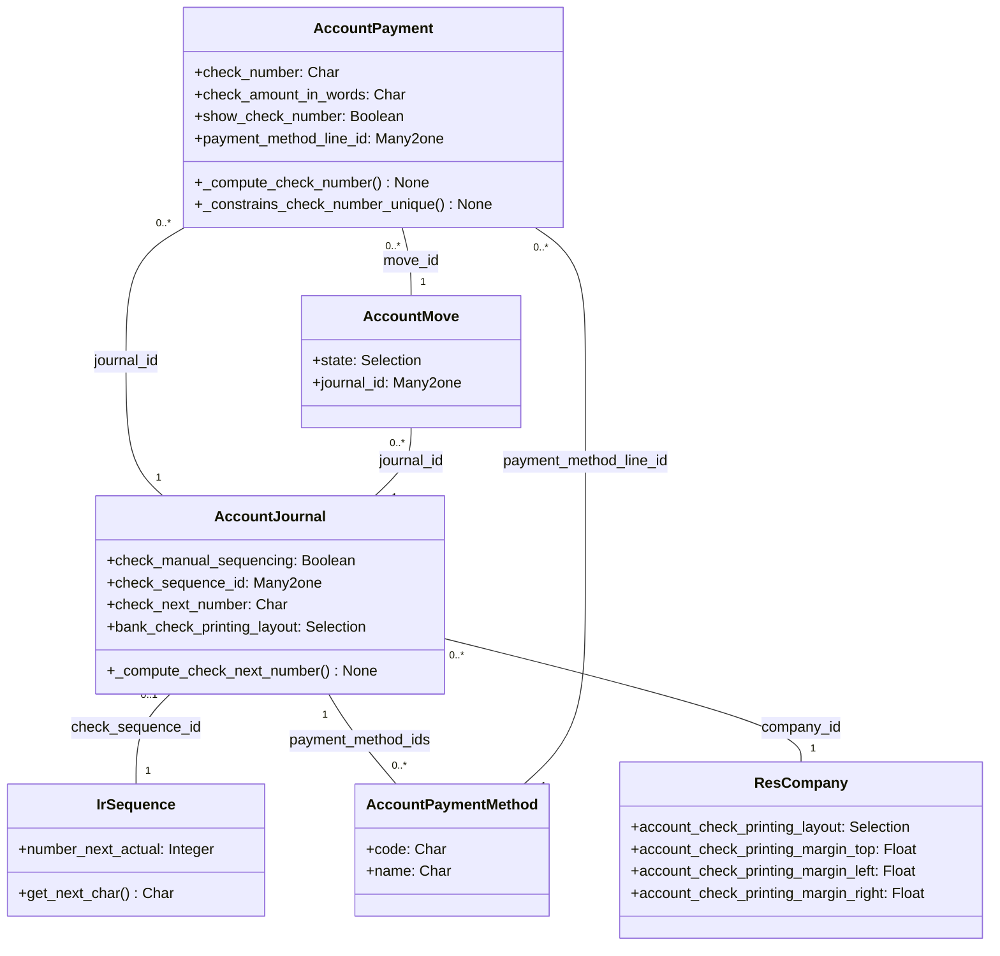

# C4 Code Level: Check Printing Base

<!--
  Auto-generated by the c4-code agent. One file per source directory.
  Refreshed on /banyan-c4 reruns whenever the directory's content hash changes.
  Do NOT hand-edit; edits will be overwritten on next refresh.
-->

## Generated By

- **Agent**: c4-code (Haiku)
- **Run ID**: banyan-c4-20260701-init
- **Generated**: 2026-07-01T00:00:00Z
- **Source Directory**: addons/account_check_printing
- **Content Hash**: d8f3a4b5c2e7f1a6d9c4e8b3f6a9c2e5

## Overview

- **Name**: Check Printing Base
- **Description**: Foundation for printing business checks (US MICR format); supports manual/automatic check numbering, check layout templates, margin configuration, multi-page stub printing
- **Location**: addons/account_check_printing — 12 files, 889 lines
- **Language**: Python (Odoo 18.0 ORM models) + XML reports
- **Purpose**: Extend account.payment with check number assignment, sequencing, validation; provide check printing layout selection and layout-specific margin tuning; base for country-specific check templates (l10n_us_check_printing, etc.)

## Code Elements

### Classes / Models

- **`AccountPayment` (inherited)** — Payment extensions for check printing
  - **Location**: `models/account_payment.py:12`
  - **Methods**: `_compute_check_amount_in_words()`, `_compute_check_number()`, `_inverse_check_number()`, `_compute_show_check_number()`, `_constrains_check_number()`, `_constrains_check_number_unique()`, `_auto_init()`
  - **Fields**:
    - `check_amount_in_words` (Char, computed) — "One Thousand Two Hundred Dollars" for check printing
    - `check_number` (Char, stored computed) — numeric or alphanumeric check ID from journal sequence
    - `check_manual_sequencing` (Boolean, related) — inherited from journal
    - `show_check_number` (Boolean, computed) — display check # only if payment_method_line_id.code == 'check_printing'
    - `payment_method_line_id` (Many2one, indexed) — account.payment.method.line for routing
  - **Constraints**:
    - check_number must contain only digits (regex validation)
    - check_number must be unique per journal per state (posted payments only)
  - **Dependencies**: account.journal (check_sequence_id, check_manual_sequencing), account.payment.method.line

- **`AccountJournal` (inherited)** — Journal extensions for check configuration
  - **Location**: `models/account_journal.py:10`
  - **Methods**: `_default_outbound_payment_methods()`, `_get_check_printing_layouts()`, `_compute_check_next_number()`, `_inverse_check_next_number()`, `_validate_check_sequence()`
  - **Fields**:
    - `check_manual_sequencing` (Boolean) — if True, user manually enters check numbers; if False, auto-sequence from ir.sequence
    - `check_sequence_id` (Many2one ir.sequence, readonly) — auto-assigned sequence for check numbering
    - `check_next_number` (Char, computed) — preview of next check number from sequence
    - `bank_check_printing_layout` (Selection, dynamic) — layout selection from company config (e.g., 'top', 'middle', 'bottom', 'disabled')
  - **Dependencies**: ir.sequence, account.payment.method, res.company

- **`ResCompany` (inherited)** — Company-level check printing configuration
  - **Location**: `models/res_company.py:6`
  - **Fields**:
    - `account_check_printing_layout` (Selection) — layout template for this company ('disabled', 'top', 'middle', 'bottom', or custom)
    - `account_check_printing_date_label` (Boolean, default=True) — print date label per CPA standard
    - `account_check_printing_multi_stub` (Boolean) — allow check stub to span multiple pages
    - `account_check_printing_margin_top` (Float, default=0.25) — top margin in inches
    - `account_check_printing_margin_left` (Float, default=0.25) — left margin in inches
    - `account_check_printing_margin_right` (Float, default=0.25) — right margin in inches
  - **Purpose**: Centralize check printing settings across all journals in company
  - **Dependencies**: res.company base model

- **`AccountPaymentMethod` (inherited)** — Payment method extensions
  - **Location**: `models/account_payment_method.py`
  - **Purpose**: Add 'check_printing' code to distinguish check payments from ACH/wire transfers
  - **Dependencies**: account.payment.method

- **`ResConfigSettings` (inherited)** — Admin settings for check printing
  - **Location**: `models/res_config_settings.py`
  - **Purpose**: UI for company check printing settings (layout, margins, multi-stub)
  - **Dependencies**: res.company, res.config.settings

### Functions / Methods

- `AccountPayment._compute_check_amount_in_words() → None`
  - **Description**: Convert payment amount to English words for check printing (e.g., 1234.56 → "One Thousand Two Hundred Thirty Four Dollars And Fifty Six Cents")
  - **Location**: `models/account_payment.py:~150` (inferred from method name)
  - **Visibility**: internal (compute callback)
  - **Dependencies**: num2words or similar conversion library

- `AccountPayment._compute_check_number() → None`
  - **Description**: Assign check number from journal sequence or from manual entry
  - **Location**: `models/account_payment.py:~160`
  - **Visibility**: internal (compute callback)
  - **Logic**: If manual_sequencing, user provides; else next from sequence

- `AccountPayment._inverse_check_number() → None`
  - **Description**: Store user-provided check number (inverse of compute)
  - **Location**: `models/account_payment.py:~170`
  - **Visibility**: internal (inverse callback)

- `AccountPayment._constrains_check_number() → None`
  - **Description**: Validate check_number contains only digits
  - **Location**: `models/account_payment.py:42`
  - **Visibility**: internal (constraint callback)
  - **Raises**: ValidationError if non-digit characters present

- `AccountPayment._constrains_check_number_unique() → None`
  - **Description**: Validate check_number is unique per journal among posted payments
  - **Location**: `models/account_payment.py:58`
  - **Visibility**: internal (constraint callback)
  - **SQL**: Direct check via JOIN to account_move.journal_id and check state
  - **Raises**: ValidationError if duplicate found in posted state

- `AccountPayment._auto_init() → None`
  - **Description**: Create check_number column on first module install (avoids MemoryError on large DBs)
  - **Location**: `models/account_payment.py:47`
  - **Visibility**: internal (ORM hook)
  - **Purpose**: Handle schema migration for stored computed field

- `AccountJournal._default_outbound_payment_methods() → Recordset`
  - **Description**: Add check_printing to default payment methods if available
  - **Location**: `models/account_journal.py:13`
  - **Visibility**: internal (default callback)
  - **Returns**: Recordset of account.payment.method records

- `AccountJournal._get_check_printing_layouts() → List[Tuple]`
  - **Description**: Filter company check layouts to only enabled ones (exclude 'disabled')
  - **Location**: `models/account_journal.py:43`
  - **Visibility**: internal
  - **Returns**: [(value, label), ...] for selection_add

- `AccountJournal._compute_check_next_number() → None`
  - **Description**: Display preview of next check number from sequence
  - **Location**: `models/account_journal.py:48`
  - **Visibility**: internal (compute callback)

- `AccountJournal._inverse_check_next_number() → None`
  - **Description**: Update sequence number_next_actual when admin manually sets next check number
  - **Location**: `models/account_journal.py:57`
  - **Visibility**: internal (inverse callback)
  - **Validation**: Ensure input is numeric; raise ValidationError if not

### Constants / Configuration

- `INV_LINES_PER_STUB` = 9 — Max invoice lines per check stub page (file-level constant in account_payment.py:9)
- Check layout selections: 'disabled', 'top', 'middle', 'bottom' (and custom country-specific layouts)
- Margin defaults: 0.25 inches (top, left, right)

### Wizard

- **`PrintPrenumberedChecks`** — Batch check printing wizard
  - **Location**: `wizard/print_prenumbered_checks.py`
  - **Purpose**: Select payment records and print pre-numbered checks in batch
  - **Fields**: payment_ids (Many2many), check_layout (Selection), start_number (Integer)

## Dependencies

### Internal

- **account.payment** — Base payment model (inherited)
- **account.journal** — Check sequence and layout configuration per journal
- **account.payment.method** — Payment method routing (e.g., 'check_printing')
- **account.payment.method.line** — Link payment method to journal
- **account.move** — State validation (only posted payments get check numbers)
- **ir.sequence** — Check number sequence generator
- **res.company** — Company-level check settings
- **res.config.settings** — Admin UI settings
- **ir.model** — Security and ACL for check printing

### External

- **num2words** (or similar) — Amount-to-words conversion (likely in separate module or util)
- **odoo.tools.misc** (formatLang, format_date) — Currency/date formatting
- **odoo.tools.sql** (column_exists, create_column) — Schema migration helpers
- **odoo.exceptions** (UserError, ValidationError, RedirectWarning) — Error handling

## Relationships

## Notes for Higher-Level Synthesis

- **Boundary code**: account_check_printing is purely infrastructure—no business logic; translates payment domain to check printing domain
- **Base module**: Provides schema and configuration; actual check layouts (templates, MICR encoding) in country-specific child modules (l10n_us_check_printing, l10n_ca_check_printing, etc.)
- **Integration point**: Extends account.payment post-confirmation; check number assigned at payment state transition
- **Security**: Check printing restricted by account_check_printing.* ACL groups (defined in security/ir.model.access.csv)
- **Post-init hook**: `create_check_sequence_on_bank_journals` auto-creates ir.sequence for each existing bank journal on module install
- **Wizard pattern**: Batch printing via PrintPrenumberedChecks wizard to handle multiple payments efficiently
