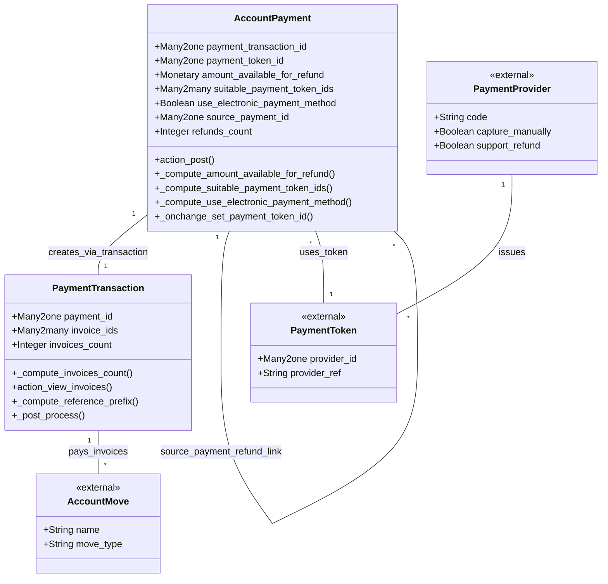

# C4 Code Level: Addons Account Payment

<!--
  Auto-generated by the c4-code agent. One file per source directory.
  Refreshed on /banyan-c4 reruns whenever the directory's content hash changes.
  Do NOT hand-edit; edits will be overwritten on next refresh.
-->

## Generated By

- **Agent**: c4-code (Haiku)
- **Run ID**: banyan-c4-20260701-init
- **Generated**: 2026-07-01T00:00:00Z
- **Content Hash**: a2d8c1f3e5b9c7a4f2d6e1b8c3a9f5d2

## Overview

- **Name**: Payment - Account Integration
- **Description**: Odoo 18.0 bridge between payment transactions and accounting journal entries; reconciles payment.transaction with account.payment and auto-posts entries
- **Location**: addons/account_payment — 25 files (root level only), ~3,000 lines
- **Language**: Python
- **Purpose**: Bridge payment module to accounting. Enables customers to pay invoices on portal, auto-posts journal entries when transactions settle, tracks refunds, and provides payment methods (electronic gateways, manual checks, bank transfers)

## Code Elements

### Functions / Methods

- `post_init_hook(env) → None`
  - **Description**: On addon installation, create account.payment.method records for each installed payment provider
  - **Location**: `__init__.py:8`
  - **Visibility**: public (hook)
  - **Dependencies**: payment.provider, account.payment.method models

- `uninstall_hook(env) → None`
  - **Description**: On addon uninstall, delete inbound payment methods associated with payment providers
  - **Location**: `__init__.py:16`
  - **Visibility**: public (hook)
  - **Dependencies**: payment.provider, account.payment.method models

### Classes / Modules

- **`AccountPayment`** (inherits account.payment) — Journal entry posting and refund tracking
  - **Location**: `models/account_payment.py:7`
  - **Visibility**: public (Odoo model inheritance)
  - **Methods**:
    - `_compute_amount_available_for_refund()` — Calculates refundable balance (original amount minus confirmed refunds)
    - `_compute_suitable_payment_token_ids()` — Filters tokens by company, provider, partner, and capture mode
    - `_compute_use_electronic_payment_method()` — Detects if payment method is electronic (provider-based)
    - `_compute_refunds_count()` — Groups refund payments by source
    - `_onchange_set_payment_token_id()` — Auto-selects most recent token when partner/method changes
    - `action_post()` — Main posting logic: creates payment transactions for tokenized payments, posts journal entries, processes transactions, handles post-processing
  - **Key Fields**:
    - `payment_transaction_id` (Many2one to payment.transaction, readonly, auto_join) — Links to settlement transaction
    - `payment_token_id` (Many2one to payment.token) — Saved card reference for card payments
    - `amount_available_for_refund` (Monetary, computed) — Balance available for refund (amount - refunded_amount)
    - `suitable_payment_token_ids` (Many2many, computed) — Filtered tokens for current company/provider/partner
    - `use_electronic_payment_method` (Boolean, computed) — True if payment method is electronic (provider code)
    - `source_payment_id` (Many2one to self, related/stored/indexed) — Source payment for refund traceability
    - `refunds_count` (Integer, computed) — Refund counter for UI display
  - **Inherits from**: account.payment
  - **Dependencies**: payment.transaction, payment.token, payment.provider, account.payment.method (internal); none (external)

- **`PaymentTransaction`** (inherits payment.transaction) — Invoice linkage and reference computation
  - **Location**: `models/payment_transaction.py:6`
  - **Visibility**: public (Odoo model inheritance)
  - **Methods**:
    - `_compute_invoices_count()` — Raw SQL aggregation on junction table for count accuracy
    - `action_view_invoices()` — Smart action returning single-record form or list view with domain
    - `_compute_reference_prefix(provider_code, separator, **values)` — Extracts invoice names from X2M commands in transaction values
    - `_post_process()` — Account-specific post-processing (auto-journal entry posting)
  - **Key Fields**:
    - `payment_id` (Many2one to account.payment, readonly) — Backref to accounting record
    - `invoice_ids` (Many2many to account.move, relation junction, readonly) — Invoices paid by transaction
    - `invoices_count` (Integer, computed) — Invoice counter
  - **Inherits from**: payment.transaction
  - **Dependencies**: account.payment, account.move (internal); psycopg2 (external, for raw SQL)

### Constants / Configuration

- None at root level (configuration is declarative in model fields)

## Dependencies

### Internal

- `models.account_payment` — Extends account.payment with payment transaction linkage and refund tracking
- `models.payment_transaction` — Extends payment.transaction with invoice linkage
- `models.payment_provider` — Provides provider code selection and capture/refund capability checks
- `models.payment_token` — Saved payment methods linked to account.payment for tokenized payments
- `models.payment_method` — Classifies payment methods (electronic, manual, etc.)
- `models.account_move` — Invoice/bill records linked to transactions
- `models.account_journal` — Journal configuration for payment posting
- `models.account_payment_method` — Payment method registry (created by post_init_hook)
- `models.account_payment_method_line` — Journal-scoped payment method config
- `models.res_company` — Multi-company domain and company currency
- `models.res_partner` — Customer contact info
- `controllers.payment` — HTTP handlers for payment form submission and confirmation
- `controllers.portal` — Portal UI for customer invoice payment
- `wizards.account_payment_register` — Bulk payment UI for invoices
- `wizards.payment_link_wizard` — Invoice payment link generation (extends payment module)
- `wizards.payment_refund_wizard` — Refund UI for paid invoices
- `wizards.res_config_settings` — Configuration for payment portal behavior

### External

- `odoo.exceptions::ValidationError` — Validation guard in computed fields
- `dateutil` — Date operations in inherited transaction logic
- `psycopg2` — Raw SQL in `_compute_invoices_count()` for performance

## Relationships

## Notes for Higher-Level Synthesis

- **Journal entry automation** — `AccountPayment.action_post()` is the hub: detects tokenized payments, auto-creates payment transactions, waits for provider response, then posts accounting entries. Bridges payment domain (external gateway integration) to accounting domain (journal entry).
- **Belongs with account component** — This module is primarily accounting-focused (AccountPayment, AccountMove linkage, journal posting). While it imports payment models, the business logic is rooted in Odoo's accounting reconciliation and multi-step payment workflows.
- **Refund traceability** — `source_payment_id` and `refunds_count` enable audit trails for refunds and reversals. Refund payments link back to original payments, forming a parent-child structure mirrored in payment.transaction.
- **Portal boundary** — Controllers and wizards (portal.py, account_payment_register.py) handle customer-facing payment form submission and invoice payment flows. They are HTTP boundary code.
- **Multi-company and currency** — Inherits company scoping from account.payment; payment methods are journal-scoped to handle different payment methods per bank account per company.
