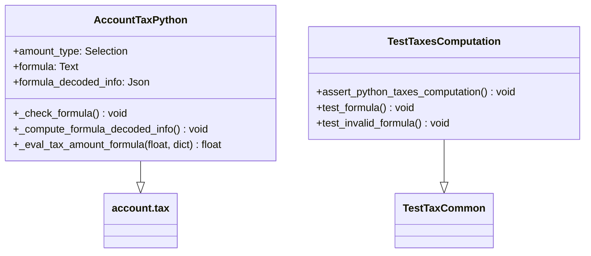

# C4 Code Level: addons/account_tax_python

<!--
  Auto-generated by the c4-code agent. One file per source directory.
  Refreshed on /banyan-c4 reruns whenever the directory's content hash changes.
  Do NOT hand-edit; edits will be overwritten on next refresh.
-->

## Generated By

- **Agent**: c4-code (Haiku)
- **Run ID**: banyan-c4-20260701-init
- **Generated**: 2026-07-01T00:00:00Z
- **Source Directory**: addons/account_tax_python
- **Content Hash**: 2a8f3c9e7b1d5f4a6c2e9h0j8k3l5m7n

## Overview

- **Name**: Define Taxes as Python Code
- **Description**: Extends account.tax to allow tax amounts and applicability to be defined as safe-eval Python expressions instead of fixed percentages or fixed amounts
- **Location**: addons/account_tax_python — 6 files, ~185 lines
- **Language**: Python
- **Purpose**: Provides flexible, parameterized tax calculation for complex tax rules that cannot be expressed as simple percentages (e.g., quantity-based minimum tax, tiered formulas, product-specific rates)

## Code Elements

### Functions / Methods

- `_eval_tax_amount_formula(raw_base: float, evaluation_context: dict) → float`
  - **Description**: Safely evaluates the Python formula field using safe_eval with controlled context (price_unit, quantity, product, uom, base, min, max)
  - **Location**: `models/account_tax.py:147`
  - **Visibility**: public (model method, called via _eval_tax_amount_fixed_amount)
  - **Dependencies**: odoo.tools.safe_eval, self.formula_decoded_info, evaluation_context from account

- `_check_formula() → None`
  - **Description**: Validates formula syntax by tokenizing against allowed tokens, product fields, and UOM fields; raises ValidationError on malformed expressions
  - **Location**: `models/account_tax.py:92`
  - **Visibility**: public
  - **Dependencies**: re module, FORMULA_ALLOWED_TOKENS, formula_decoded_info

- `_compute_formula_decoded_info() → None`
  - **Description**: Computes formula_decoded_info JSON field by parsing formula with regex to extract product/uom field references and transpile dot notation to bracket notation for safe_eval
  - **Location**: `models/account_tax.py:58`
  - **Visibility**: public (computed field)
  - **Dependencies**: re module, env['product.product'], env['uom.uom']

- `_eval_taxes_computation_prepare_product_fields() → set`
  - **Description**: Extends account module to include product fields referenced in code-type tax formulas (extracted from formula_decoded_info)
  - **Location**: `models/account_tax.py:43`
  - **Visibility**: public (inheritance hook)
  - **Dependencies**: super()._eval_taxes_computation_prepare_product_fields()

- `_eval_taxes_computation_prepare_product_uom_fields() → set`
  - **Description**: Extends account module to include UOM fields referenced in code-type tax formulas
  - **Location**: `models/account_tax.py:50`
  - **Visibility**: public (inheritance hook)
  - **Dependencies**: super()._eval_taxes_computation_prepare_product_uom_fields()

- `_eval_tax_amount_fixed_amount(batch, raw_base, evaluation_context) → float`
  - **Description**: Extends account module to route code-type taxes to _eval_tax_amount_formula instead of standard fixed-amount handling
  - **Location**: `models/account_tax.py:180`
  - **Visibility**: public (inheritance hook)
  - **Dependencies**: self._eval_tax_amount_formula, super()._eval_tax_amount_fixed_amount

### Classes / Modules

- **`AccountTaxPython`** — Model inheriting account.tax, adds Python formula-based tax calculation
  - **Location**: `models/account_tax.py:19`
  - **Methods**: `_check_amount_type_code_formula()`, `_eval_taxes_computation_prepare_product_fields()`, `_eval_taxes_computation_prepare_product_uom_fields()`, `_compute_formula_decoded_info()`, `_check_formula()`, `_eval_tax_amount_formula()`, `_eval_tax_amount_fixed_amount()`
  - **Implements / Extends**: account.tax (AbstractModel)
  - **Dependencies**: odoo.api, odoo.fields, odoo.models, odoo.exceptions.ValidationError, odoo.tools.safe_eval, re module

- **`TestTaxesComputation`** — Test case class for Python tax formula evaluation
  - **Location**: `tests/test_taxes_computation.py:7`
  - **Methods**: `_jsonify_tax()`, `assert_python_taxes_computation()`, `test_formula()`, `test_invalid_formula()`
  - **Implements / Extends**: odoo.addons.account.tests.test_tax.TestTaxCommon
  - **Dependencies**: odoo.tests.tagged, odoo.exceptions.ValidationError, env['product.product'], env['uom.uom']

### Constants / Configuration

- `FORMULA_ALLOWED_TOKENS` — Whitelist of valid tokens in tax formulas: arithmetic operators, comparison operators, base/quantity/price_unit/product field names, min/max builtins, None, and/or (`models/account_tax.py:10`)
- `amount_type` Selection field — adds 'code' choice for Custom Formula tax type (`models/account_tax.py:22`)
- `formula` Text field — stores Python expression for tax calculation, default "price_unit * 0.10" (`models/account_tax.py:26`)
- `formula_decoded_info` JSON field — computed, caches parsed formula with js_formula, py_formula, product_fields, product_uom_fields (`models/account_tax.py:35`)

## Dependencies

### Internal

- `account` module (Odoo core) — provides account.tax base model, tax evaluation context, and core tax computation pipeline

### External

- `odoo` (core framework) — api, fields, models, exceptions, tools.safe_eval
- `re` (Python stdlib) — regex parsing of formula to extract product/uom field references

## Relationships

## Notes for Higher-Level Synthesis

- **Domain boundary**: Belongs in the Accounting / Tax domain component. Directly extends account.tax and is used only by tax evaluation in invoice/bill workflows.
- **Integration point**: The formula field is evaluated server-side during move validation. Product and UOM fields are dynamically fetched based on formula references, establishing coupling to product module.
- **Security-critical**: Formula validation and safe_eval configuration are blocking validations. Any change to FORMULA_ALLOWED_TOKENS must be reviewed for injection risks.
