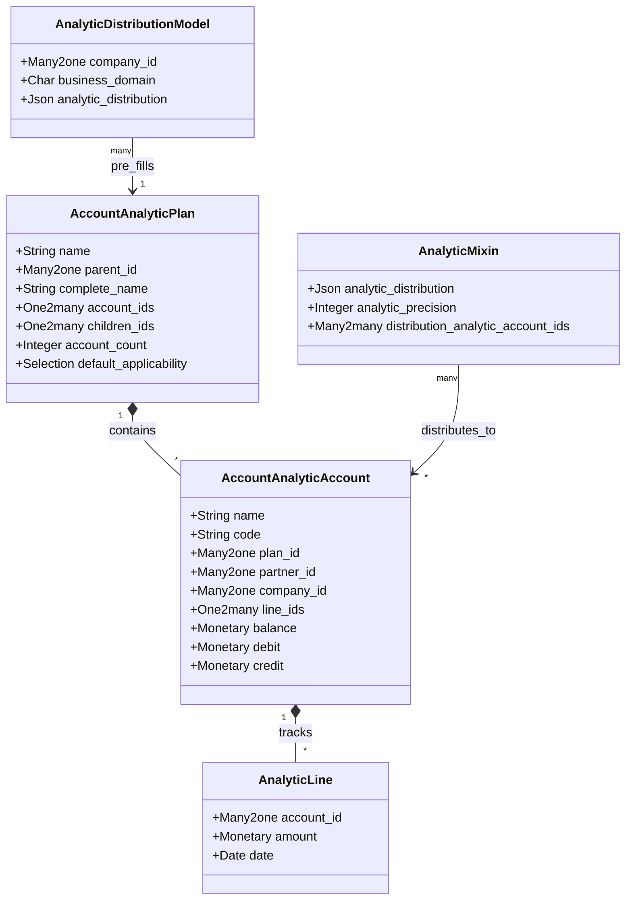

# C4 Code Level: Analytic Accounting (analytic addon)

<!--
  Auto-generated by the c4-code agent. One file per source directory.
  Refreshed on /banyan-c4 reruns whenever the directory's content hash changes.
  Do NOT hand-edit; edits will be overwritten on next refresh.
-->

## Generated By

- **Agent**: c4-code (Haiku)
- **Run ID**: banyan-c4-20260701-init
- **Generated**: 2026-07-01T00:00:00Z
- **Source Directory**: addons/analytic
- **Content Hash**: c4-code-addons-analytic-init-20260701

## Overview

- **Name**: Analytic Accounting
- **Description**: Multi-dimensional cost/revenue tracking across projects, departments, and business units
- **Location**: addons/analytic — 17 Python files
- **Language**: Python (Odoo ORM models, mixins)
- **Purpose**: Cross-cutting module for distributing costs and revenues across analytic dimensions (projects, departments, employees, cost centers). Used by accounting, timesheets, expenses, and manufacturing to allocate amounts to multiple analytic axes.

## Code Elements

### Classes / Models

- **`AccountAnalyticAccount`** — Named analytic axis value (e.g., "Project Alpha", "Engineering Dept")
  - **Location**: `models/analytic_account.py:11`
  - **Methods**: 
    - `_check_company_consistency()` — Validate company consistency on analytic lines
    - `_compute_display_name()` — Format display as `[code] name - customer`
    - `copy_data()` — Add "(copy)" suffix when duplicating
    - `web_read()` — Set analytic_plan_id context for single-record reads
    - `_read_group_select()` — Flag balance/debit/credit as aggregatable
    - `_read_group_postprocess_aggregate()` — Sum balance/debit/credit from child records
    - `_compute_debit_credit_balance()` — Compute totals from analytic lines
  - **Key Fields**: 
    - `name` — Account name (required, indexed by trigram)
    - `code` — Reference code
    - `plan_id` — Which analytic plan (e.g., project, department)
    - `root_plan_id` — Cached root plan (for tree queries)
    - `partner_id` — Link to customer
    - `company_id` — Company ownership
    - `line_ids` — Analytic line entries
    - `balance`, `debit`, `credit` — Computed monetary totals
  - **Dependencies**: `account.analytic.plan`, `account.analytic.line`, `res.company`, `res.partner`

- **`AccountAnalyticPlan`** — Definition of an analytic dimension (e.g., "Projects", "Departments")
  - **Location**: `models/analytic_plan.py:14`
  - **Methods**: 
    - `_column_name() → str` — Compute database column name for this plan
    - `_compute_root_id()` — Get root plan in hierarchy
    - `_compute_complete_name()` — Hierarchical plan name
    - `_compute_children_count()` — Count child plans
    - `_compute_analytic_account_count()` — Count direct accounts
    - `_compute_all_analytic_account_count()` — Count all accounts recursively
    - `_get_all_plans() → (project_plans, other_plans)` — Fetch primary and secondary plans
    - `get_relevant_plans(business_domain, company_id) → list` — Get applicable plans for a domain
  - **Key Fields**: 
    - `name` — Plan name (translatable, required)
    - `parent_id` — Hierarchical parent
    - `complete_name` — Recursive full path
    - `children_ids` — Child plans
    - `account_ids` — Accounts in this plan
    - `default_applicability` — optional|mandatory|unavailable per company
    - `applicability_ids` — Per-company applicability rules
    - `color` — Display color
    - `sequence` — Sort order
  - **Dependencies**: `account.analytic.account`, `account.analytic.applicability`
  - **Notes**: Hierarchical via parent_path; primary plan is project-like; secondary plans are optional axes

- **`AnalyticMixin`** — Abstract model providing analytic distribution fields to transactional models
  - **Location**: `models/analytic_mixin.py:11`
  - **Methods**: 
    - `init()` — Create GIN index on JSON analytic_distribution for efficient account queries
    - `_compute_analytic_distribution()` — Override in subclasses to compute distribution
    - `_query_analytic_accounts(table=False) → SQL` — Query account IDs from JSON distribution
    - `_get_analytic_account_ids_from_distributions(distributions) → set` — Extract account IDs from distribution dict
    - `_compute_distribution_analytic_account_ids()` — Convert distribution JSON to recordset
    - `_search_distribution_analytic_account_ids(operator, value)` — Search by distribution
    - `_condition_to_sql(alias, fname, operator, value, query)` — Build SQL for analytic_distribution queries
    - `_get_plan_fnames() → list` — List plan column names
    - `_get_analytic_accounts() → recordset` — Fetch account records from plan columns
    - `_get_distribution_key() → str` — Compute comma-separated account ID string
    - `_get_analytic_distribution() → dict` — Return distribution as {key: 100} (100% to accounts)
    - `_get_mandatory_plans() → list` — Fetch mandatory plans for company/domain
    - `_check_account_id()` — Validate at least one plan account is set
  - **Key Fields**: 
    - `analytic_distribution` — JSON field: {account_id_csv: percentage}
    - `analytic_precision` — Rounding precision for percentages
    - `distribution_analytic_account_ids` — Computed recordset of accounts
  - **Dependencies**: `account.analytic.account`, `account.analytic.plan`
  - **Used By**: account.move.line, hr.timesheet.line, hr.expense, purchase.order.line, sale.order.line

- **`AnalyticLine`** — Individual cost/revenue entry linked to an analytic account
  - **Location**: `models/analytic_line.py`
  - **Key Fields**: 
    - `account_id` — Analytic account (may be auto-computed from plan columns)
    - `amount` — Monetary amount (can be negative for credits)
    - `date` — Transaction date
  - **Dependencies**: `account.analytic.account`, `analytic.mixin`

- **`AnalyticDistributionModel`** — Default distribution rules per business domain and company
  - **Location**: `models/analytic_distribution_model.py`
  - **Purpose**: Pre-populate analytic distributions for new documents (e.g., sales orders auto-fill departments)
  - **Key Fields**: `company_id`, `business_domain`, `analytic_distribution`
  - **Dependencies**: `account.analytic.account`

### Functions / Methods (Top-Level)

- `_get_all_plans() → (project_plans, other_plans)`
  - **Description**: Fetch primary (project) and secondary analytic plans
  - **Location**: `models/analytic_plan.py`
  - **Visibility**: internal
  - **Returns**: Two lists of AccountAnalyticPlan recordsets

- `get_relevant_plans(business_domain, company_id) → list`
  - **Description**: Get applicable analytic plans for a business domain (e.g., "account.move", "sale.order")
  - **Location**: `models/analytic_plan.py`
  - **Visibility**: internal
  - **Returns**: List of dicts with plan metadata and applicability flags

## Dependencies

### Internal

- `base` — Base Odoo models, mail, utilities
- `uom` — Units of measure for quantities in analytic lines
- `mail` — Mail threading for analytic accounts

### External

- None declared at addon level; internal framework only

## Relationships

## Notes for Higher-Level Synthesis

- **Cross-Cutting Dimension**: Analytic accounting is not a standalone business module—it provides a mixin (`analytic.mixin`) that other transactional modules inherit. Accounting moves, timesheets, expenses, and sales orders all use analytic distributions.
- **Multi-Plan Support**: A single document can distribute amounts across multiple analytic axes (e.g., project + department + cost center). The `analytic_plan_id` context flag switches which plan is being edited.
- **JSON Distribution Storage**: Modern approach stores distribution as JSON `{account_ids_csv: percentage}` instead of individual line records, with GIN indexing for efficient queries.
- **Auto-Account from Plan**: The `auto_account_id` magic field uses context (`analytic_plan_id`) to compute which plan's account is relevant.
- **Mandatory/Optional Plans**: Plans can be marked mandatory (must have value) or optional per company/business domain.
- **Applicability Rules**: `analytic_distribution_model` and `analytic_applicability` define which plans apply to which document types (sale order, purchase order, move, timesheet, etc.).
- **Belongs with**: Accounting, HR Timesheet, Expenses, Purchase, Sale (all transactional modules inherit analytic.mixin).
- **Boundary Pattern**: Analytic is infrastructure, not domain logic. It provides plumbing for other modules to plug in cost/revenue allocation.
