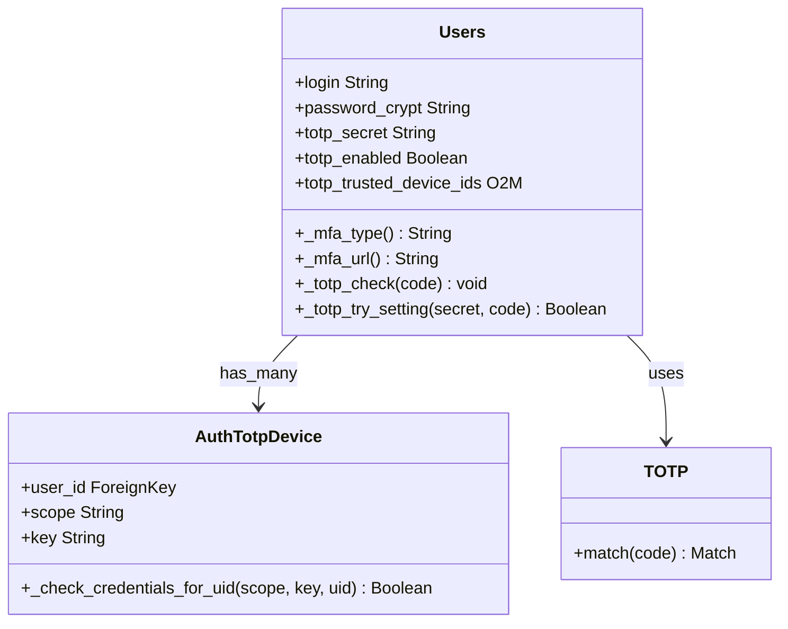

# C4 Code Level: Odoo TOTP (Two-Factor Authentication) Module

<!--
  Auto-generated by the c4-code agent. One file per source directory.
  Refreshed on /banyan-c4 reruns whenever the directory's content hash changes.
  Do NOT hand-edit; edits will be overwritten on next refresh.
-->

## Generated By

- **Agent**: c4-code (Haiku)
- **Run ID**: banyan-c4-20260701-init
- **Generated**: 2026-07-01T00:00:00Z
- **Source Directory**: addons/auth_totp
- **Content Hash**: tbd

## Overview

- **Name**: Two-Factor Authentication (TOTP) Module
- **Description**: Time-based One-Time Password (TOTP) authentication, QR code enrollment, trusted device management, and recovery codes
- **Location**: addons/auth_totp — 12 Python files
- **Language**: Python (Odoo ORM)
- **Purpose**: Extend user authentication with optional TOTP-based MFA and device trust management

## Code Elements

### Models (Core)

- **`Users`** (res.users extension) — User TOTP configuration and MFA state
  - **Location**: `models/res_users.py:21`
  - **Methods**:
    - `init()` — Migrate/add `totp_secret` column to res_users table
    - `_mfa_type()` — Return 'totp' if TOTP enabled, else delegate to parent
    - `_should_alert_new_device()` — Check if new device alert should be sent (enabled only if MFA active)
    - `_mfa_url()` — Return '/web/login/totp' MFA URL
    - `_compute_totp_enabled()` — Compute TOTP enabled status from secret presence
    - `_rpc_api_keys_only()` — Return True if TOTP enabled (block password RPC, require API key)
    - `_get_session_token_fields()` — Add 'totp_secret' to session token fields
    - `_totp_check(code)` — Verify 6-digit TOTP code; raise AccessDenied on mismatch
    - `_totp_try_setting(secret, code)` — Attempt to enable TOTP with secret + verification code
  - **Key Fields**:
    - `totp_secret` (Char, NO_ACCESS, encrypted) — Base32-encoded TOTP secret
    - `totp_enabled` (Boolean, computed) — Whether 2FA is active
    - `totp_trusted_device_ids` (One2many) — Linked trusted device records
  - **Visibility**: Internal/Private (totp_secret marked NO_ACCESS)
  - **Dependencies**: `auth_totp.device`, `auth_totp.totp`, `base.res_users`

- **`AuthTotpDevice`** (`auth_totp.device`) — Trusted device record with scoped credentials
  - **Location**: `models/auth_totp.py:8`
  - **Inherits**: `res.users.apikeys` (secured key management)
  - **Methods**:
    - `_check_credentials_for_uid(scope, key, uid)` → Boolean — Verify device key matches scope for user ID
  - **Purpose**: Store browser/device fingerprints with encrypted keys to enable "remember this device" flow
  - **Key Fields**:
    - `user_id` (ForeignKey) — Owner user
    - `scope` (String) — Device scope (e.g., 'browser')
    - `key` (Char, encrypted) — Device fingerprint/credential
  - **Dependencies**: `res.users.apikeys` (API key management)

- **`TOTP`** (utility class, not a model) — Cryptographic TOTP implementation
  - **Location**: `models/totp.py`
  - **Methods**:
    - `__init__(key)` — Initialize with Base32-decoded secret
    - `match(code)` — Verify 6-digit code; return None if invalid
  - **Purpose**: HMAC-SHA1 based time-sync OTP per RFC 6238
  - **Dependencies**: `pyotp` (likely), `hmac`, `hashlib`

### Controllers

- **`Home`** (HTTP controller) — TOTP login flow and enrollment
  - **Location**: `controllers/home.py`
  - **Methods**:
    - `web_login()` (override) — Redirect to /web/login/totp if _mfa_type() == 'totp'
    - `login_totp()` (route /web/login/totp) — Render TOTP verification form
    - `web_login_totp()` (POST) — Verify TOTP code, create session
    - `web_totp_enable_wizard()` — Render QR code for enrollment
    - `web_totp_enable()` (POST) — Save TOTP secret after verification
    - `web_totp_disable()` (POST) — Disable TOTP for user
  - **Purpose**: HTTP entry points for login, enrollment, device pairing
  - **Dependencies**: `res.users`, `auth_totp.totp`, `http.request`

### Wizard

- **`AuthTotpWizard`** (`auth_totp.wizard`) — Transient dialog for enabling/disabling TOTP
  - **Location**: `wizard/auth_totp_wizard.py`
  - **Purpose**: Multi-step user flow to enroll TOTP (QR code → verify → confirm)
  - **Key Fields**: `qr_code`, `secret`, `code`, `recovery_codes`
  - **Dependencies**: `res.users`, `auth_totp.totp`

### Test Utilities

- **`test_totp.py`** — Unit tests for TOTP algorithm and verification
  - **Location**: `tests/test_totp.py`
  - **Purpose**: Test RFC 6238 compliance and edge cases (time drift, invalid codes)

## Dependencies

### Internal (to other Odoo modules)

- **`web`** — Web login page, session management, HTTP routing
- **`base`** — `res.users` model, API key infrastructure

### External (Third-Party Libraries)

- **`base64`** — Base32 encoding/decoding of TOTP secret
- **`pyotp`** (likely) — TOTP generation (not explicitly listed but standard for Python TOTP)
- **`hmac`** — HMAC-SHA1 for TOTP calculation (standard library)
- **`hashlib`** — SHA1 hash function (standard library)
- **`functools`** — `functools.partial` for regex compilation
- **`re`** — Regex for secret whitespace normalization
- **`os`** — OS utilities (logging)
- **`logging`** — Structured logging for security events

## Relationships

## Notes for Higher-Level Synthesis

- **Security Boundary**: TOTP secret marked NO_ACCESS — only readable via sudo(); sensible data protection for cryptographic material
- **Multi-Factor Pattern**: Extends `_mfa_type()` and `_mfa_url()` hooks in base res.users — allows future MFA methods (SMS, FIDO2) to coexist via same interface
- **Device Trust**: `AuthTotpDevice` (inherits `res.users.apikeys`) provides "remember this device" UX — separates enrollment (TOTP secret) from post-auth trust (device key)
- **RPC API Key Enforced**: `_rpc_api_keys_only()` returns True when TOTP enabled — blocks password-based RPC scripts, enforces API key auth for automated integrations
- **Stateless Verification**: TOTP codes are time-synchronized (no server-side state); verification is deterministic — simplifies scaling
- **Recovery Codes**: Tests and wizard reference recovery codes — likely stored in auth_totp.wizard or as encrypted attachment; not modeled explicitly in core User class
- **HTTP Boundary**: Controllers handle QR rendering, enrollment flow, login redirect — pure HTTP/UX concern separate from cryptographic model
- **Pure Utility**: Does not belong to a business domain component; orthogonal to all other modules; candidate for "Cross-Cutting Concerns" component with other auth/security addons
