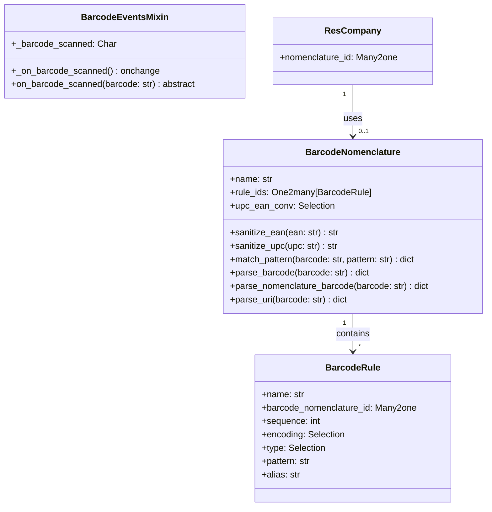

# C4 Code Level: Barcodes

<!--
  Auto-generated by the c4-code agent. One file per source directory.
  Refreshed on /banyan-c4 reruns whenever the directory's content hash changes.
  Do NOT hand-edit; edits will be overwritten on next refresh.
-->

## Generated By

- **Agent**: c4-code (Haiku)
- **Run ID**: banyan-c4-20260701-init
- **Generated**: 2026-07-01T08:15:00Z
- **Source Directory**: addons/barcodes
- **Content Hash**: 49f8c2a1e3d5b7f9

## Overview

- **Name**: Barcode Scanner & Parsing Module
- **Description**: Scan and parse barcodes using GS1 nomenclature, encoding standards (EAN-13, EAN-8, UPC-A), and URI-based RFID formats (SGTIN, SSCC)
- **Location**: addons/barcodes — 5 model files, 1 test file, ~500 lines
- **Language**: Python (Odoo ORM models)
- **Purpose**: Foundation layer for barcode scanning, parsing, and inventory tracking across Stock, POS, and domain-specific modules. Provides browser widget and encoding/nomenclature rules.

## Code Elements

### Classes / Models

- **`BarcodeNomenclature`** — Manages barcode encoding rules and parsing templates
  - **Location**: `models/barcode_nomenclature.py:16`
  - **Methods**:
    - `sanitize_ean(ean: str) → str` — Pads and validates EAN-13 with check digit
    - `sanitize_upc(upc: str) → str` — Pads and validates UPC-A with check digit
    - `match_pattern(barcode: str, pattern: str) → dict` — Regex-based pattern matching with numeric value extraction
    - `parse_barcode(barcode: str) → dict` — Entry point; routes to nomenclature or URI parser
    - `parse_nomenclature_barcode(barcode: str) → dict` — Interprets barcode against nomenclature rules, applies UPC/EAN conversion
    - `parse_uri(barcode: str) → dict` — Converts RFID URN formats (LGTIN, SGTIN, SSCC) to GS1 barcodes
    - `_convert_uri_gtin_data_into_tracking_number(...)` — GTIN URI → product barcode + lot/serial
    - `_convert_uri_sscc_data_into_package(...)` — SSCC URI → package code
    - `_unlink_except_default()` — Prevents deletion of default nomenclature
  - **Inherits**: `models.Model`
  - **Key Fields**: `name`, `rule_ids` (One2many to barcode.rule), `upc_ean_conv` (conversion mode)
  - **Dependencies**: `barcode.rule`, `odoo.tools.barcode` (check_barcode_encoding, get_barcode_check_digit)

- **`BarcodeRule`** — Individual parsing rule within a nomenclature
  - **Location**: `models/barcode_rule.py:7`
  - **Methods**:
    - `_check_pattern()` — Validates barcode pattern regex syntax and brace structure
  - **Inherits**: `models.Model`
  - **Key Fields**: `name`, `barcode_nomenclature_id` (Many2one), `sequence`, `encoding` (ean13/ean8/upca/any), `type` (alias/product), `pattern`, `alias`
  - **Dependencies**: `barcode.nomenclature`

- **`BarcodeEventsMixin`** — Abstract mixin for form views with barcode scanning widget
  - **Location**: `models/barcode_events_mixin.py:5`
  - **Methods**:
    - `_on_barcode_scanned()` — Onchange trigger; clears field and invokes `on_barcode_scanned()`
    - `on_barcode_scanned(barcode: str)` — Abstract method; must be implemented by subclass
  - **Inherits**: `models.AbstractModel`
  - **Key Fields**: `_barcode_scanned` (transient Char field, `store=False`)
  - **Notes**: Models using this mixin must implement `on_barcode_scanned(barcode)` method

- **`IrHttp` (barcodes)** — HTTP session info enhancement
  - **Location**: `models/ir_http.py:7`
  - **Methods**:
    - `session_info() → dict` — Adds `max_time_between_keys_in_ms` config parameter for barcode scanner speed
  - **Inherits**: `ir.http` (abstract)
  - **Dependencies**: `ir.config_parameter`

- **`ResCompany` (barcodes)** — Company-level barcode config
  - **Location**: `models/res_company.py:6`
  - **Methods**:
    - `_get_default_nomenclature()` → `barcode.nomenclature` or False
  - **Inherits**: `res.company`
  - **Key Fields**: `nomenclature_id` (Many2one to barcode.nomenclature, defaults to 'barcodes.default_barcode_nomenclature')

### Functions

- `_assign_default_nomeclature_id(env)` — Post-install hook
  - **Description**: Assigns default barcode nomenclature to all companies that lack one
  - **Location**: `__init__.py:6`
  - **Visibility**: module-private (called at `post_init_hook`)
  - **Dependencies**: `res.company`, `barcode.nomenclature`

### Constants

- `UPC_EAN_CONVERSIONS` — Barcode encoding conversion options
  - **Purpose**: Tuples of ('code', 'label') for UPC-A ↔ EAN-13 conversion modes
  - **Location**: `models/barcode_nomenclature.py:8`

## Dependencies

### Internal

- **Odoo base models**: `res.company`, `ir.config_parameter` — Company-scoped config, browser session timing
- **Odoo web module**: Via `__manifest__.py` dependency; provides backend assets framework

### External

- **`odoo.tools.barcode`** — Standard library; `check_barcode_encoding()`, `get_barcode_check_digit()`
- **`re` (regex)** — Pattern matching for barcode formats and URI parsing
- **`odoo.exceptions`** — `UserError`, `ValidationError` for constraint enforcement

## Browser Assets

- **Barcode scanning widget** (`static/src/**/*`) — Registered in web.assets_backend
- **Unit tests** (`static/tests/*.test.js`) — Registered in web.assets_unit_tests
- **Test helpers** (`static/tests/helpers.js`) — Registered in web.tests_assets

## Relationships

## Notes for Higher-Level Synthesis

- **Belongs with inventory/warehouse components** — Core foundation for stock_barcode, POS, and inventory tracking. Shared nomenclature and rule models.
- **Barcode parsing boundary** — Model layer (`parse_barcode()`) is the service boundary; controllers and widgets consume these methods.
- **Configuration-driven behavior** — UPC/EAN conversion and rule matching are entirely rule-based; no hardcoded logic. Easy to extend with new encoding types or RFID formats.
- **Pure utility patterns** — The mixin and nomenclature models are reusable across any domain; not tied to a single business entity.
