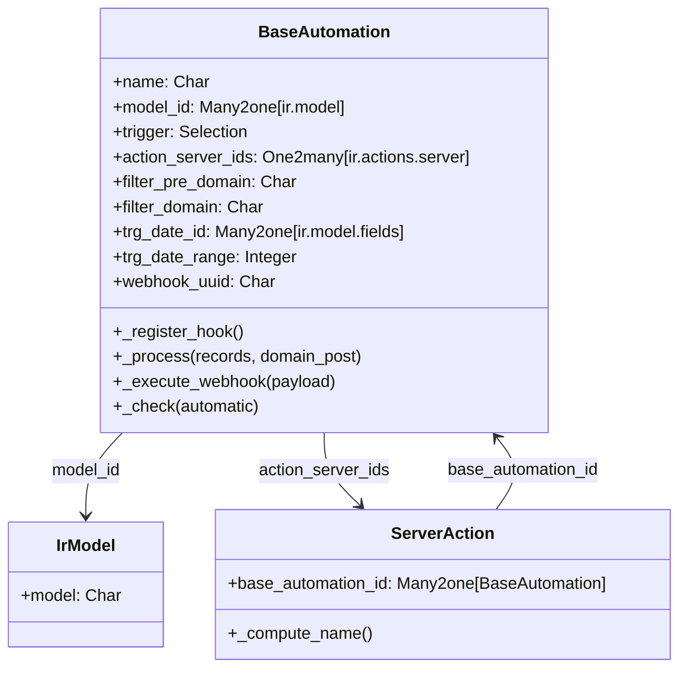

# C4 Code Level: addons/base_automation

<!--
  Auto-generated by the c4-code agent. One file per source directory.
  Refreshed on /banyan-c4 reruns whenever the directory's content hash changes.
  Do NOT hand-edit; edits will be overwritten on next refresh.
-->

## Generated By

- **Agent**: c4-code (Haiku)
- **Run ID**: banyan-c4-20260701-init
- **Generated**: 2026-07-01T00:00:00Z
- **Source Directory**: addons/base_automation
- **Content Hash**: 52c2a3f8e7d9b1c4a6f2e5d8

## Overview

- **Name**: Automation Rules for Odoo 18.0
- **Description**: Trigger-based rule engine that executes server actions (code, emails, field updates, webhooks) on record create/write/delete/time-based cron events
- **Location**: addons/base_automation — 10 files, ~1,400 lines
- **Language**: Python (Odoo ORM models, HTTP controllers)
- **Purpose**: Workflow automation backbone; enables non-technical users to define automation rules declaratively and execute them via patched model methods

## Code Elements

### Classes / Modules

- **`BaseAutomation`** — Central automation rule model; manages trigger configuration, domain filtering, pre/post conditions, time-based scheduling
  - **Location**: `models/base_automation.py:88`
  - **Key Methods**: 
    - `_register_hook()` — Monkey-patches create/write/unlink/compute_field_value/message_post on target models
    - `_unregister_hook()` — Removes patches
    - `_process(records, domain_post)` — Filter and execute actions on records
    - `_execute_webhook(payload)` — Handle webhook POST; extract record via `record_getter` and process
    - `_check(automatic, use_new_cursor)` — Cron entry point; find & execute time-based rules
    - `_filter_pre(records, feedback)` — Evaluate precondition domain (state before write)
    - `_filter_post(records, feedback)` — Evaluate postcondition domain (state after write)
    - `_get_actions(records, triggers)` — Retrieve applicable automations for a set of triggers
    - `_get_eval_context(payload)` — Build context for safe_eval (user, model, datetime, payload)
    - `_get_cron_interval(automations)` — Compute smallest delay; cap to 1–240 minutes
    - `_check_trigger_fields(record)` — Return True if watched fields changed
    - `_get_trigger_specific_field()` — Resolve field reference for trigger (stage, tag, priority, state, archive, time, etc.)
    - `_get_filter_domain_fields()` — Extract field names from domain using regex (avoids safe_eval in compute)
  - **Inherits/Extends**: `models.Model` (Odoo base ORM)
  - **Dependencies**: 
    - Internal: `ir.actions.server`, `ir.model`, `ir.model.fields`, `ir.logging`, `base.automation` (self-ref for registry)
    - External: `dateutil.relativedelta`, `odoo.tools.safe_eval`, `odoo.http.request`

- **`ServerAction`** — Extends `ir.actions.server` to bind automation rules to actions
  - **Location**: `models/ir_actions_server.py:9`
  - **Methods**:
    - `_compute_name()` — Auto-generate action label (e.g., "Update field_name", "Send Webhook Notification")
    - `_compute_available_model_ids()` — Restrict model choices to automation rule's model
    - `_get_eval_context(action)` — Pass `json` library and webhook `payload` to code execution
  - **Inherits/Extends**: `ir.actions.server`
  - **Dependencies**: Internal: `base.automation`

### Functions / Methods

- `get_webhook_request_payload() → dict | None`
  - **Description**: Extract JSON or form-encoded payload from current HTTP request; handle ValueError fallback
  - **Location**: `models/base_automation.py:78`
  - **Visibility**: Public (imported in ir_actions_server, controllers)
  - **Dependencies**: `odoo.http.request`

- `BaseAutomationController.call_webhook_http(rule_uuid, **kwargs) → JSON response`
  - **Description**: HTTP route handler; find automation by webhook UUID, extract payload, execute via `_execute_webhook()`
  - **Location**: `controllers/main.py:7`
  - **Visibility**: Public HTTP endpoint
  - **Dependencies**: `odoo.http.request`, `get_webhook_request_payload`

### Constants / Configuration

- `DOMAIN_FIELDS_RE` — Regex pattern to extract field names from domain strings without eval (`models/base_automation.py:17`)
- `DATE_RANGE_FUNCTION` — Dict mapping delay type to relativedelta callable (minutes/hour/day/month/False) (`models/base_automation.py:27`)
- `DATE_RANGE_FACTOR` — Dict mapping delay type to minutes multiplier (1/60/1440/43200/0) (`models/base_automation.py:35`)
- `CREATE_TRIGGERS` — List of triggers that fire on record creation (`models/base_automation.py:43`)
- `WRITE_TRIGGERS` — List of triggers that fire on record write/field recompute (`models/base_automation.py:54`)
- `MAIL_TRIGGERS` — Tuple of message-event triggers (on_message_received, on_message_sent) (`models/base_automation.py:67`)
- `TIME_TRIGGERS` — List of time-based triggers (on_time, on_time_created, on_time_updated) (`models/base_automation.py:71`)
- `CRITICAL_FIELDS` — Fields that invalidate registry cache when written (`models/base_automation.py:217`)
- `RANGE_FIELDS` — Fields that require cron reschedule (`models/base_automation.py:218`)

## Dependencies

### Internal

- **`ir.actions.server`** — Extended by `ServerAction` to bind and customize actions; called by `_process()`
- **`ir.model`, `ir.model.fields`** — Domain, field type, and trigger field resolution
- **`ir.logging`** — Optional webhook call logging
- **`res.users`, `res.company`** — User/company context in eval
- **`base.automation` (self)** — Registry hooks patch all models; automations reference each other
- **Mail module** — `mail.thread.message_post` hook for mail triggers
- **Resource module** — Calendar support for business-day delay calculations

### External

- **`python-dateutil@2.x`** — Relative date arithmetic (minutes, hours, days, months)
- **`odoo.tools.safe_eval`** — Safe expression evaluation for domain, filter, action context
- **`uuid`** — Generate webhook UUIDs
- **`requests@2.x`** — Webhook HTTP client calls (implicit in odoo.http)

## Relationships

## Notes for Higher-Level Synthesis

- **Belongs with base workflow infrastructure** — Shares registry/hook patterns with other Odoo core modules (auth, constraints, hooks)
- **Boundary code: rule-to-action translation** — Converts declarative trigger/domain/action config into ORM method patches; acts as glue between UI and server actions
- **Registry side-effect heavy** — Patching models at runtime means automations are tightly coupled to model lifecycle; regeneration/caching required when rules change
