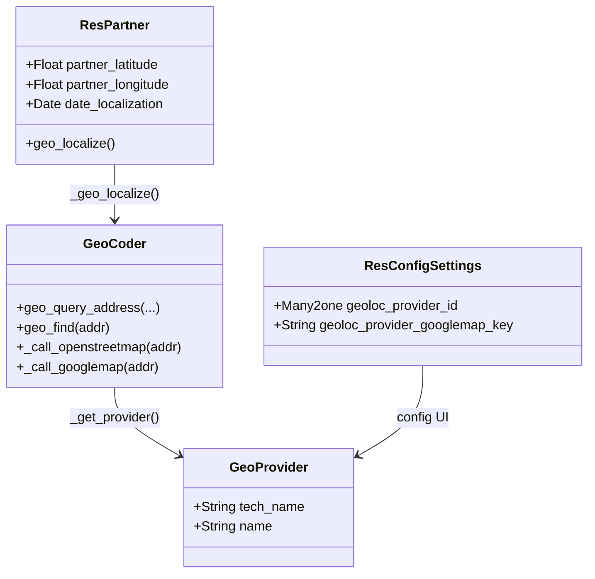

# C4 Code Level: Base Geolocalize

<!--
  Auto-generated by the c4-code agent. One file per source directory.
  Refreshed on /banyan-c4 reruns whenever the directory's content hash changes.
  Do NOT hand-edit; edits will be overwritten on next refresh.
-->

## Generated By

- **Agent**: c4-code (Haiku)
- **Run ID**: banyan-c4-20260701-init
- **Generated**: 2026-07-01T00:00:00Z
- **Source Directory**: addons/base_geolocalize
- **Content Hash**: a3f6c2e9b1d4e7a8f2c5b6d9e1a3f4c2

## Overview

- **Name**: Base Geolocalization
- **Description**: Geocodes partner addresses to latitude/longitude coordinates via pluggable provider system (OpenStreetMap Nominatim, Google Maps)
- **Location**: `addons/base_geolocalize` — 2 model files, 1 config file, tests
- **Language**: Python (Odoo ORM)
- **Purpose**: Provides geolocation infrastructure for fleet, field service, and location-aware modules. Stores partner_latitude/longitude and date_localization on res.partner

## Code Elements

### Classes / Modules

- **`GeoProvider`** (`models.Model`) — Model to store geolocation provider configuration
  - **Location**: `models/base_geocoder.py:17`
  - **Fields**: 
    - `tech_name` (Char) — Technical identifier (e.g., 'openstreetmap', 'googlemap')
    - `name` (Char) — Display name for UI
  - **Purpose**: Lookup table for available geocoding backends; allows admin to select which provider to use

- **`GeoCoder`** (`models.AbstractModel`) — Abstract base for geocoding operations; implements provider-agnostic API
  - **Location**: `models/base_geocoder.py:25`
  - **Methods**:
    - `_get_provider()` — Retrieve selected provider from config or fall back to first available
    - `geo_query_address(street, zip, city, state, country)` → str — Format address params into query string (provider-specific via dispatch)
    - `geo_find(addr, **kw)` → (lat, lng) tuple or None — Lookup address and return coordinates (dispatches to provider impl)
    - `_call_openstreetmap(addr, **kw)` → (lat, lng) — Query Nominatim API (default free provider)
    - `_call_googlemap(addr, **kw)` → (lat, lng) — Query Google Maps Geocoding API (requires API key)
    - `_geo_query_address_default(...)` → str — Default address formatter (comma-separated fields)
    - `_geo_query_address_googlemap(...)` → str — Google Maps-specific formatter (country qualifier reordering)
    - `_raise_query_error(error)` — Wrap exception as UserError with friendly message
  - **Implements / Extends**: AbstractModel (mixin-like base)
  - **Dependencies**: `requests` (HTTP), `ir.config_parameter` (provider selection, API key storage)

- **`ResPartner`** (`models.Model`, inherits `res.partner`) — Extends partner with geolocation fields and methods
  - **Location**: `models/res_partner.py:7`
  - **Methods**:
    - `write(vals)` — Override to reset partner_latitude/longitude if address fields change without explicit geo-coord update
    - `_geo_localize(street, zip, city, state, country)` → (lat, lng) or None — Internal lookup with fallback (full address → city/country only)
    - `geo_localize()` → Boolean — Public action method; geolocalizes selected partners, sends notification if any fail
  - **Implements / Extends**: `res.partner`
  - **Dependencies**: `base.geocoder` (abstract model), `tools.config` (test/import detection)

- **`ResConfigSettings`** (`models.TransientModel`, inherits `res.config.settings`) — Admin settings for geolocation provider
  - **Location**: `models/res_config_settings.py:7`
  - **Fields**:
    - `geoloc_provider_id` (Many2one → base.geo_provider) — Selected provider (config param: `base_geolocalize.geo_provider`)
    - `geoloc_provider_techname` (Char, related + readonly) — Tech name of selected provider (read-only display)
    - `geoloc_provider_googlemap_key` (Char) — Google Maps API Key (config param: `base_geolocalize.google_map_api_key`)
  - **Implements / Extends**: `res.config.settings`
  - **Dependencies**: `base.geocoder`, `base.geo_provider`

### Functions / Methods (standalone)

- `get_google_map_api_key(env)` → str or None
  - **Location**: `models/base_geocoder.py:13`
  - **Description**: Utility to fetch Google Maps API key from config parameters
  - **Visibility**: public (module-level)
  - **Dependencies**: `ir.config_parameter`

## Dependencies

### Internal

- `base` module — Foundational models (`res.partner`, `ir.config_parameter`, config framework)

### External

- `requests` — HTTP library for Nominatim and Google Maps API calls
- `werkzeug.urls` — URL parsing and joining (for API endpoint construction)

## Relationships

## Notes for Higher-Level Synthesis

- **Infrastructure utility**: Pure utility module providing location services as a reusable abstraction
- **Provider pattern**: GeoCoder demonstrates strategy pattern with pluggable providers (Nominatim default, Google Maps optional)
- **Config-driven**: Provider selection and API keys managed via Odoo Settings UI (res.config.settings)
- No direct domain logic — used by fleet, field service, and location-aware features
- Belongs in Infrastructure/Utilities component; not part of domain business logic
- API key management should be noted at Container level (sensitive config, external service integration)
