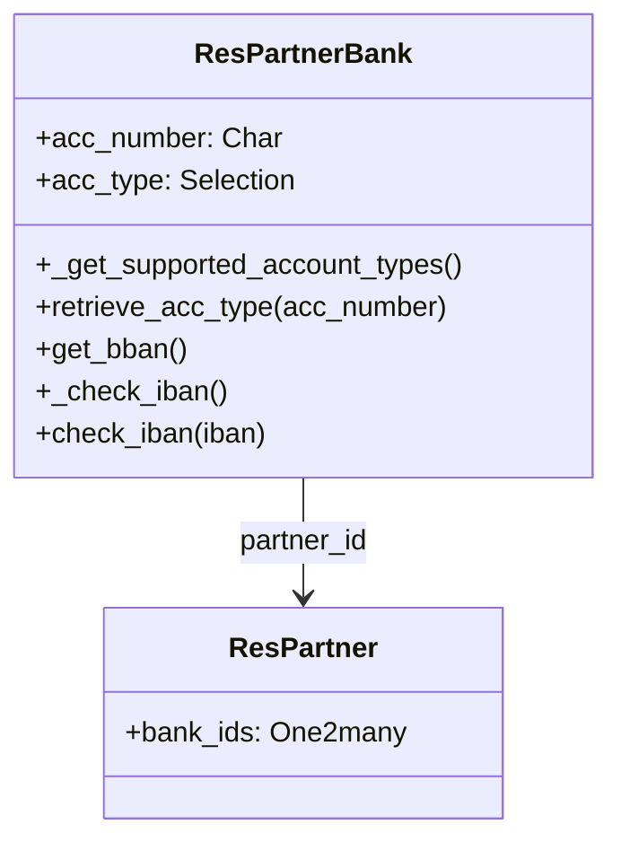

# C4 Code Level: addons/base_iban

<!--
  Auto-generated by the c4-code agent. One file per source directory.
  Refreshed on /banyan-c4 reruns whenever the directory's content hash changes.
  Do NOT hand-edit; edits will be overwritten on next refresh.
-->

## Generated By

- **Agent**: c4-code (Haiku)
- **Run ID**: banyan-c4-20260701-init
- **Generated**: 2026-07-01T00:00:00Z
- **Source Directory**: addons/base_iban
- **Content Hash**: 8f5c2e1a6d3b7f9c4e2a8d5b

## Overview

- **Name**: IBAN Bank Account Support for Odoo 18.0
- **Description**: IBAN validation and bank account management; check digit (mod-97) validation, BBAN extraction, pretty-print formatting for 80+ countries
- **Location**: addons/base_iban — 4 files, ~250 lines
- **Language**: Python (Odoo ORM models, utility functions)
- **Purpose**: Payment foundation; enables SEPA credit/debit transfer modules by providing validated IBAN accounts; stores and displays account numbers in standardized format

## Code Elements

### Classes / Modules

- **`ResPartnerBank`** (extended) — IBAN-specific account type and validation
  - **Location**: `models/res_partner_bank.py:51`
  - **Methods**:
    - `_get_supported_account_types() → list` — Register 'iban' as account type option
    - `retrieve_acc_type(acc_number) → str` — Auto-detect account type; return 'iban' if valid, else fallback
    - `get_bban() → str` — Extract BBAN (basic bank account number) from IBAN
    - `create(vals_list) → list` — Normalize and format IBAN on create
    - `write(vals)` — Normalize and format IBAN on update
    - `_check_iban()` — Constraint; validate IBAN on record save
    - `check_iban(iban='') → bool` — Utility method; test if string is valid IBAN (no exception)
  - **Inherits/Extends**: `res.partner.bank`
  - **Dependencies**: Internal: `res.partner`

### Functions / Methods

- `normalize_iban(iban) → str`
  - **Description**: Remove all non-alphanumeric characters from IBAN
  - **Location**: `models/res_partner_bank.py:12`
  - **Visibility**: Public (module-level utility)
  - **Dependencies**: `re`

- `validate_iban(iban) → None` (raises ValidationError on failure)
  - **Description**: Full IBAN validation: country code check, length/format, mod-97 check digit algorithm
  - **Location**: `models/res_partner_bank.py:31`
  - **Visibility**: Public (module-level utility)
  - **Validation Steps**:
    1. Normalize (strip whitespace/punctuation)
    2. Check country code is in IBAN map
    3. Verify length and alphanumeric-only
    4. Rearrange to check-digit position: move first 4 chars to end, convert to base-36 digits
    5. Check: `digits % 97 == 1`
  - **Dependencies**: `_map_iban_template`, LazyTranslate for i18n errors

- `pretty_iban(iban) → str`
  - **Description**: Format IBAN in groups of 4 characters separated by spaces (if valid)
  - **Location**: `models/res_partner_bank.py:15`
  - **Visibility**: Public (module-level utility)
  - **Dependencies**: `validate_iban`

- `get_bban_from_iban(iban) → str`
  - **Description**: Extract characters 5+ (after 4-char country+check prefix)
  - **Location**: `models/res_partner_bank.py:24`
  - **Visibility**: Public (module-level utility)
  - **Dependencies**: `normalize_iban`

### Constants / Configuration

- `_map_iban_template` — Dict mapping ISO 3166-1 country codes (2-char) to IBAN format templates for 80+ countries
  - **Location**: `models/res_partner_bank.py:108`
  - **Example entries**: 
    - `'de': 'DEkk BBBB BBBB CCCC CCCC CC'` (Germany: bank code, account number)
    - `'nl': 'NLkk BBBB CCCC CCCC CC'` (Netherlands)
    - `'fr': 'FRkk BBBB BGGG GGCC CCCC CCCC CKK'` (France)
  - **Note**: Used only for length/format validation; actual mod-97 check is algorithm-based, not format-dependent

## Dependencies

### Internal

- **`res.partner.bank`** — Extended model; account storage and type detection
- **`res.partner`** — Parent partner references

### External

- **`re` (Python standard library)** — Regex for normalization and format validation
- **No external packages** — Validation algorithm is pure Python (mod-97/base-36 conversion)

## Relationships

## Notes for Higher-Level Synthesis

- **Pure utility module** — No business logic coupling; used only by payment/banking components
- **Self-contained validation** — No external dependencies (pure Python mod-97 implementation); safe for offline use
- **Belongs with payment infrastructure** — Foundation for SEPA payment modules; critical for bank account data quality
