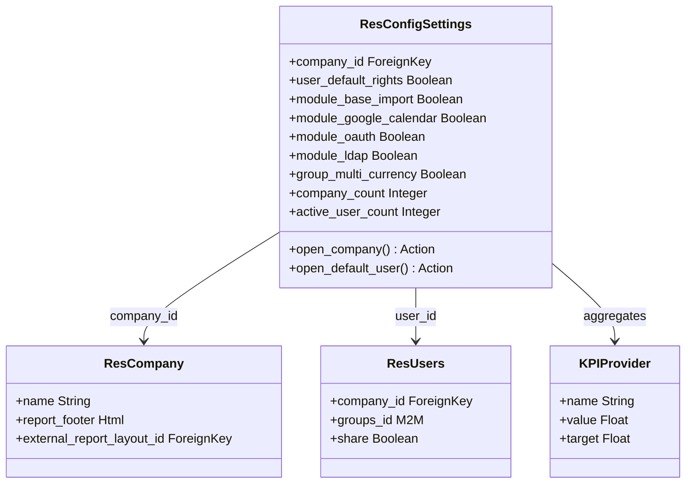

# C4 Code Level: Odoo Base Setup Module

<!--
  Auto-generated by the c4-code agent. One file per source directory.
  Refreshed on /banyan-c4 reruns whenever the directory's content hash changes.
  Do NOT hand-edit; edits will be overwritten on next refresh.
-->

## Generated By

- **Agent**: c4-code (Haiku)
- **Run ID**: banyan-c4-20260701-init
- **Generated**: 2026-07-01T00:00:00Z
- **Source Directory**: addons/base_setup
- **Content Hash**: tbd

## Overview

- **Name**: Base Setup Module
- **Description**: Initial system configuration wizard, company and user preferences, KPI provider setup, and onboarding sequences
- **Location**: addons/base_setup — 13 Python files
- **Language**: Python (Odoo ORM)
- **Purpose**: Configure Odoo instance at installation: company info, default user rights, multi-currency, language, external integrations (OAuth, LDAP), report footer, and KPI dashboard

## Code Elements

### Models (Core Configuration)

- **`ResConfigSettings`** (res.config.settings extension) — Company-level configuration transient model
  - **Location**: `models/res_config_settings.py:8`
  - **Methods**:
    - `open_company()` → Action — Open current company for editing
    - `open_default_user()` → Action — Open default user template
    - `_prepare_report_view_action(template)` → Action — Helper to open template view
    - `edit_external_header()` → Action — Edit custom report header/footer layout
    - `_compute_company_count()` — Count active companies
    - `_compute_active_user_count()` — Count active non-portal users
    - `_compute_language_count()` — Count installed languages
    - `_compute_company_informations()` — Format company address info
    - `_compute_is_root_company()` — Check if company has no parent
  - **Key Fields**:
    - Company & User Defaults
      - `company_id` (Many2one, required) — Context company
      - `user_default_rights` (Boolean) — Store user default access rights via config parameter
    - Feature Toggles (module_* pattern)
      - `module_base_import` — CSV/XLS/XLSX/ODS file import
      - `module_google_calendar`, `module_microsoft_calendar` — Calendar sync
      - `module_mail_plugin` — Email plugin integration
      - `module_auth_oauth` — OAuth external auth
      - `module_auth_ldap` — LDAP authentication
      - `module_account_inter_company_rules` — Inter-company transactions
      - `module_voip` — VoIP integration
      - `module_web_unsplash` — Unsplash image library
      - `module_sms` — SMS communication
      - `module_partner_autocomplete` — Partner auto-completion
      - `module_base_geolocalize` — Geolocation
      - `module_google_recaptcha` — Google reCAPTCHA
      - `module_website_cf_turnstile` — Cloudflare Turnstile CAPTCHA
      - `module_product_images` — Barcode-based product image fetching
    - Permission Groups
      - `group_multi_currency` (Boolean, implied_group) — Enable multi-currency mode
    - Reporting & Layout
      - `report_footer` (Html, related to company) — Custom footer on all reports
      - `external_report_layout_id` (Many2one) — Company report template
    - Statistics (computed, read-only)
      - `company_count` — # of companies
      - `active_user_count` — # of active users
      - `language_count` — # of installed languages
      - `company_informations` (Text) — Formatted company address
      - `company_country_code` (Char, related) — Company country code
    - Debug & Profiling
      - `profiling_enabled_until` (Datetime, config_parameter) — Profiling end time
      - `show_effect` (Boolean, config_parameter) — UI animation effects toggle
  - **Visibility**: Internal (Transient model, no persistent storage)
  - **Dependencies**: `res.company`, `res.users`, `res.lang`, `ir.ui.view`

- **`KPIProvider`** (`base_setup.kpi_provider`) — KPI dashboard provider registry
  - **Location**: `models/kpi_provider.py`
  - **Purpose**: Extensible registry for KPI widgets/cards displayed on dashboard
  - **Key Fields**: `name`, `icon`, `value`, `target`, `query` (likely)
  - **Dependencies**: `base.Model`

- **`ResUsers`** (base_setup extension) — User onboarding and setup state
  - **Location**: `models/res_users.py`
  - **Purpose**: Track user setup completion, onboarding status
  - **Key Fields**: Likely `onboarding_*` computed/stored flags
  - **Dependencies**: `res.users`

- **`ResPartner`** (base_setup extension) — Partner contact defaults
  - **Location**: `models/res_partner.py`
  - **Purpose**: Default contact/company configuration
  - **Dependencies**: `res.partner`

- **`IrHttp`** (base_setup extension) — HTTP routing and web defaults
  - **Location**: `models/ir_http.py`
  - **Purpose**: Setup default web routes, locale, and public content access
  - **Dependencies**: `ir.http`

### Controllers

- **`SetupController`** (HTTP controller) — Web entry points for setup wizard
  - **Location**: `controllers/main.py`
  - **Purpose**: Render setup wizard UI, handle form submissions, configure system
  - **Key Routes**: `/web/setup/`, `/web/setup/company/`, `/web/setup/modules/`
  - **Dependencies**: `res.config.settings`, `ir.module.module`

### Test Utilities

- **`test_res_config.py`** — Configuration transient model tests
  - **Purpose**: Test config parameter save/load, multi-currency toggle
- **`test_default_group.py`** — User default group and permission tests
  - **Purpose**: Verify user creation with default groups
- **`test_res_config_doc_links.py`** — Documentation link resolution tests
  - **Purpose**: Test help/doc URL generation in config forms

## Dependencies

### Internal (to other Odoo modules)

- **`base`** — Core framework, `res.company`, `res.users`, `res.lang`, `ir.module.module`
- **`web`** — Web client, HTTP routing, config parameter backend

### External (Third-Party Libraries)

- **Standard Library only** — No external dependencies observed in manifest or code
  - `logging` — Logging utilities

## Relationships

## Notes for Higher-Level Synthesis

- **Setup Wizard**: Pure onboarding/configuration concern — no business domain logic; could be extracted to "System Administration" component
- **Feature Toggles**: Module activation via `module_*` fields is a configuration pattern, not business logic — represents plugin discovery and module dependencies
- **Transient Model**: No persistent storage; acts as form bridge between UI and config parameters — simplifies form design and multi-step workflows
- **Company & User Defaults**: Manages system-wide defaults and company-scoped settings — foundational for multi-tenant SaaS
- **Multi-Tenancy**: Company isolation is implicit via `company_id` context; each company can have separate modules, currencies, languages
- **KPI Dashboard**: `KPIProvider` is extensible — allows other modules to register custom dashboard widgets (event stats, survey stats, etc.)
- **Not Domain-Specific**: Does not implement any business logic for events, surveys, or other features; purely operational/infrastructure
- **Candidate for "Infrastructure" Component**: Group with `web`, `auth_totp`, and other cross-cutting concerns
