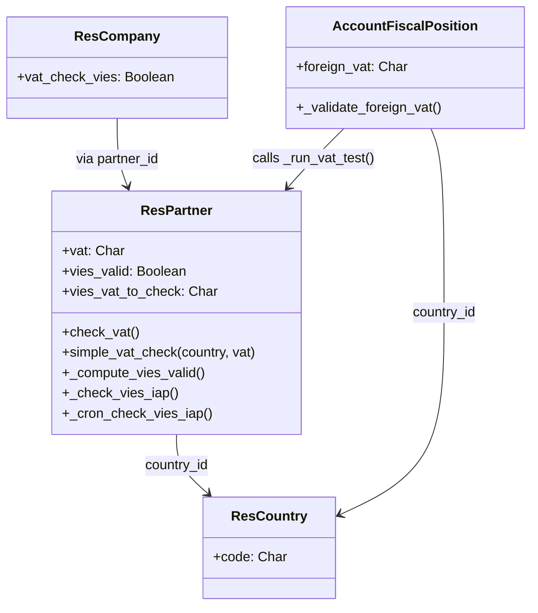

# C4 Code Level: addons/base_vat

<!--
  Auto-generated by the c4-code agent. One file per source directory.
  Refreshed on /banyan-c4 reruns whenever the directory's content hash changes.
  Do NOT hand-edit; edits will be overwritten on next refresh.
-->

## Generated By

- **Agent**: c4-code (Haiku)
- **Run ID**: banyan-c4-20260701-init
- **Generated**: 2026-07-01T00:00:00Z
- **Source Directory**: addons/base_vat
- **Content Hash**: 7a3f9e2c1d6b8a5f4e7c2b9d

## Overview

- **Name**: VAT Number Validation for Odoo 18.0
- **Description**: Multi-country VAT/TIN validation via offline format checks and online VIES EU database integration; enforces fiscal position rules for foreign VAT
- **Location**: addons/base_vat — 11 files, ~600 lines
- **Language**: Python (Odoo ORM models, HTTP webhook controller)
- **Purpose**: Tax compliance foundation; validates VAT numbers at partner creation/write and fiscal position assignment; integrates VIES for EU intra-community checks via IAP service

## Code Elements

### Classes / Modules

- **`ResPartner`** (extended) — VAT validation and VIES integration
  - **Location**: `models/res_partner.py:96`
  - **Key Methods**:
    - `simple_vat_check(country_code, vat_number) → bool` — Offline validation using stdnum or country-specific check function
    - `check_vat()` — Constraint; validates VAT on create/write (unless `no_vat_validation` context set)
    - `_split_vat(vat) → (country_code, vat_number)` — Handle 1- or 2-letter country prefixes (e.g., T for Japan)
    - `fix_eu_vat_number(country_id, vat) → str` — Prepend EU country code if missing (except RO)
    - `_compute_vies_vat_to_check()` — Filter and format VAT for VIES check (EU countries only)
    - `_compute_perform_vies_validation()` — Determine if VIES check applies to this partner
    - `_compute_vies_valid()` — Trigger VIES check via IAP or poll update cron
    - `_check_vies_iap() → status_str` — POST to IAP VIES endpoint; return pending/valid/fault
    - `_cron_check_vies_iap()` — Cron job; poll IAP for VIES status updates
    - `_update_vies_status(status)` — Write status, log message
    - `_run_vat_test(vat_number, default_country, is_company) → country_code | None` — Multi-pass validation (VAT prefix, fallback to default country)
    - `_build_vat_error_message(country_code, vat, record_label) → str` — Format i18n error with expected format
    - `_get_iap_vies_credentials() → (identifier, token)` — Load or create db-level VIES client credentials
    - `_get_iap_vies_endpoint() → URL str` — Get IAP VIES endpoint (prod/test)
    - `check_vat_al(vat) → bool` — Country-specific validator for Albania (example; others in source)
  - **Inherits/Extends**: `res.partner`
  - **Dependencies**:
    - Internal: `res.country`, `res.country.group`, `ir.config_parameter`, `base.module_base_vat`
    - External: `stdnum` library, `requests`, VIES IAP service

- **`ResCompany`** (extended) — VIES validation enable/disable flag
  - **Location**: `models/res_company.py:7`
  - **Fields**: `vat_check_vies` → Boolean (config flag for company)
  - **Inherits/Extends**: `res.company`

- **`AccountFiscalPosition`** (extended) — Foreign VAT validation in fiscal positions
  - **Location**: `models/account_fiscal_position.py:7`
  - **Methods**:
    - `adjust_vals_country_id(vals)` — Infer country from foreign VAT prefix
    - `_validate_foreign_vat()` — Constraint; validate foreign VAT matches country/country_group
    - `raise_vat_error_message(country)` — Format and raise VAT error
    - `_get_vat_valid(delivery, company)` — Override; apply VIES validity check if EU + foreign VAT
  - **Inherits/Extends**: `account.fiscal.position`
  - **Dependencies**: Internal: `res.partner`, `res.country`, `res.country.group`

- **`ResConfigSettings`** (extended) — Company-level VIES config access
  - **Location**: `models/res_config_settings.py:6`
  - **Fields**: `vat_check_vies` → related to company field
  - **Inherits/Extends**: `res.config.settings`

### Functions / Methods

- `BaseVatWebhookController.webhook_update_vies(db_uuid, company_vat, signature) → JSON`
  - **Description**: HTTP webhook endpoint; IAP calls to push VIES status updates; verify signature
  - **Location**: `controllers/webhook.py` (not fully read, but imported pattern)
  - **Visibility**: Public HTTP endpoint (signed)
  - **Dependencies**: `odoo.tools.hash_sign`, IAP service

### Constants / Configuration

- `_eu_country_vat` — Dict mapping non-standard EU country codes (e.g., GR → EL) (`models/res_partner.py:20`)
- `_eu_country_vat_inverse` — Reverse map for country code normalization (`models/res_partner.py:24`)
- `_ref_vat` — Example VAT formats per country, 50+ entries (for error messages) (`models/res_partner.py:26`)
- `_region_specific_vat_codes` — Set of non-country region codes (xi, t) for UK/Japan (`models/res_partner.py:90`)
- `_DEFAULT_ENDPOINT` (implicit) — IAP VIES service URL (prod: vies.api.odoo.com, test: vies.test.odoo.com)

## Dependencies

### Internal

- **`res.partner`** — Core partner model; VAT field and validation constraint
- **`res.country`, `res.country.group`** — Country/group references for fiscal position logic
- **`account.fiscal.position`** — Foreign VAT mapping in fiscal positions
- **`ir.config_parameter`** — Store VIES credentials and endpoint config
- **`base.module_base_vat`** — Ref to self for demo mode detection
- **`iap.account`** — Account credential holder for IAP service calls

### External

- **`stdnum@1.x`** — Multi-country VAT/TIN validation library (python-stdnum)
  - Used for: Modulo-97, Luhn checks, country-specific validators
- **`requests@2.x`** — HTTP POST to IAP VIES endpoint
- **VIES EU Database** — Online VAT validity database (via IAP JSON-RPC wrapper)
- **Odoo IAP** — In-App Purchase service for metered VIES checks

## Relationships

## Notes for Higher-Level Synthesis

- **Belongs with accounting/finance components** — Shared ownership with account module; fiscal position dependency
- **Boundary code: external API integration** — Wraps VIES/IAP service calls; transforms response into partner field updates
- **Multi-country pattern** — Demonstrates stdnum-based validation pattern; reusable for other TINs (IBAN, NIF, etc.)
