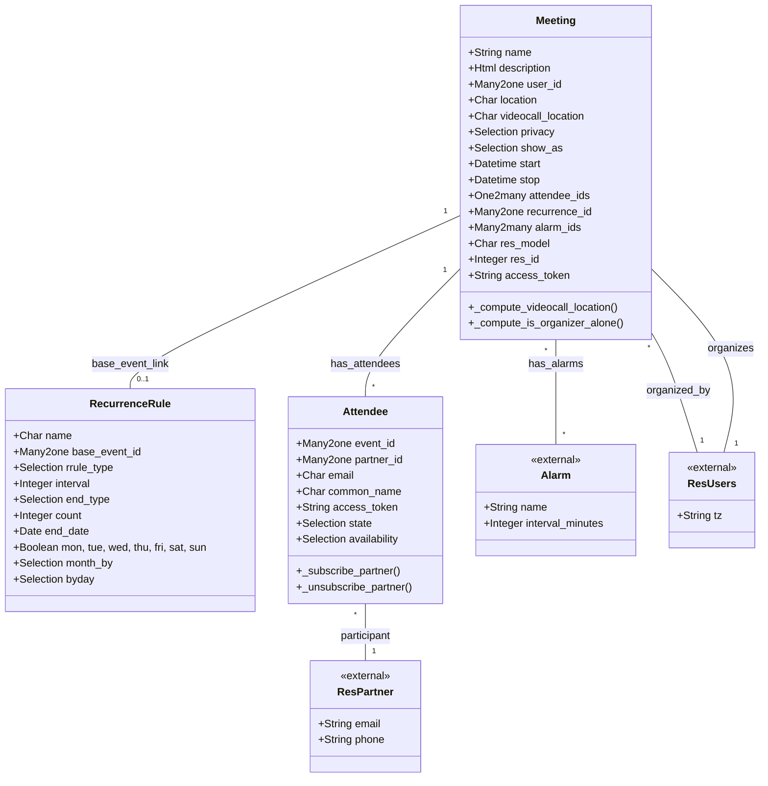

# C4 Code Level: Addons Calendar

<!--
  Auto-generated by the c4-code agent. One file per source directory.
  Refreshed on /banyan-c4 reruns whenever the directory's content hash changes.
  Do NOT hand-edit; edits will be overwritten on next refresh.
-->

## Generated By

- **Agent**: c4-code (Haiku)
- **Run ID**: banyan-c4-20260701-init
- **Generated**: 2026-07-01T00:00:00Z
- **Content Hash**: f4e7b2d9c1a6e8f3b5c2d7a9e4f1b6c8

## Overview

- **Name**: Calendar
- **Description**: Odoo 18.0 Calendar system supporting events, recurrence rules (RRULE), attendees, reminders, and external calendar sync (Google Calendar, Outlook)
- **Location**: addons/calendar — 33 files (root level only), ~6,000 lines
- **Language**: Python
- **Purpose**: Full-featured calendar for scheduling meetings, recurring events, and collaborative attendance management. Integrates with mail activities, CRM tasks, and HR leave. Provides iCal (vObject) export for sync with external calendars

## Code Elements

### Functions / Methods

- `get_weekday_occurence(date) → int`
  - **Description**: Compute weekday occurrence in month (1-5, or -1 for last occurrence). Used for "third Tuesday" type RRULE generation
  - **Location**: `models/calendar_event.py:51`
  - **Visibility**: public (utility)
  - **Dependencies**: math, datetime.date

- `freq_to_select(rrule_freq) → str`
  - **Description**: Convert dateutil.rrule frequency constant to Odoo selection string (e.g., rrule.DAILY → 'daily')
  - **Location**: `models/calendar_recurrence.py:82`
  - **Visibility**: public (utility)
  - **Dependencies**: RRULE_FREQ_TO_SELECT dict, dateutil.rrule

- `freq_to_rrule(freq) → int`
  - **Description**: Convert Odoo frequency selection string to dateutil.rrule constant (e.g., 'weekly' → rrule.WEEKLY)
  - **Location**: `models/calendar_recurrence.py:86`
  - **Visibility**: public (utility)
  - **Dependencies**: SELECT_FREQ_TO_RRULE dict

- `weekday_to_field(weekday_index) → str`
  - **Description**: Map dateutil.rrule weekday index to Odoo model field name (e.g., 0 → 'mon')
  - **Location**: `models/calendar_recurrence.py:90`
  - **Visibility**: public (utility)
  - **Dependencies**: RRULE_WEEKDAY_TO_FIELD dict

### Classes / Modules

- **`Meeting`** (calendar.event) — Event record and lifecycle
  - **Location**: `models/calendar_event.py:67`
  - **Visibility**: public (Odoo model)
  - **Methods**:
    - `get_state_selections()` — Return attendee state options (needsAction, tentative, declined, accepted)
    - `default_get(fields)` — Smart defaults: inherit context res_model/res_model_id, set organizer from current user
    - `_default_partners()` — Auto-add active_model partner (CRM lead, project task, etc.) to attendees
    - `_default_start()` — Now + round to 30min
    - `_default_stop()` — Start + duration_hours
    - `_compute_videocall_location()` — Generate Discuss channel URL or custom URL
    - `_compute_videocall_source()` — Detect source (discuss vs custom)
    - `_compute_is_highlighted()` — Highlight own events
    - `_compute_is_organizer_alone()` — True if organizer only non-declined attendee
  - **Key Fields**:
    - `name` (Char, required) — Meeting subject
    - `description` (Html) — Event details
    - `user_id` (Many2one to res.users, default=current) — Organizer
    - `partner_id` (Many2one to res.partner, related to user) — Organizer's partner
    - `location` (Char, tracking=True) — Physical location
    - `videocall_location` (Char, computed/stored) — Generated Discuss or custom URL
    - `videocall_source` (Selection, computed) — discuss | custom
    - `videocall_channel_id` (Many2one to discuss.channel) — Discuss channel link
    - `privacy` (Selection) — public | private | confidential
    - `show_as` (Selection) — free | busy (availability visibility)
    - `is_highlighted` (Boolean, computed)
    - `is_organizer_alone` (Boolean, computed)
    - `access_token` (Char, stored/indexed) — Invitation token for iCal/portal links
    - `start` (Datetime) — Event start time
    - `stop` (Datetime) — Event end time
    - `duration` (Float, computed) — Hours between start/stop
    - `date` (Date) — Denormalized start date for date filtering
    - `attendee_ids` (One2many to calendar.attendee) — Meeting participants
    - `recurrence_id` (Many2one to calendar.recurrence) — RRULE parent (if recurring)
    - `recurrence_update` (Selection) — this_only | all_events (when editing recurring event)
    - `alarm_ids` (Many2many to calendar.alarm) — Reminders (email, popup)
    - `res_model` (Char) — Linked model (crm.lead, project.task, hr.leave, etc.)
    - `res_model_id` (Many2one to ir.model) — Linked model definition
    - `res_id` (Integer) — Linked record ID
    - Mail/activity tracking fields (inherited from mail.thread)
  - **Inherits from**: mail.thread
  - **Dependencies**: res.users, res.partner, discuss.channel, calendar.recurrence, calendar.attendee, calendar.alarm, calendar.filter, ir.model, res.country.state, mail.activity (internal); pytz, vobject (optional, external)

- **`RecurrenceRule`** (calendar.recurrence) — RRULE generation and expansion
  - **Location**: `models/calendar_recurrence.py:94`
  - **Visibility**: public (Odoo model)
  - **Methods**: Likely include `_compute_name()` and expansion/weekday utilities
  - **Key Fields**:
    - `name` (Char, computed/stored) — Display name
    - `base_event_id` (Many2one to calendar.event, ondelete=set null) — Original event
    - `rrule_type` (Selection) — daily | weekly | monthly | yearly (RRULE FREQ)
    - `interval` (Integer) — Recurrence interval (every N weeks, etc.)
    - `end_type` (Selection) — count | end_date | forever (RRULE END strategy)
    - `count` (Integer) — Number of occurrences
    - `end_date` (Date) — Recurrence end date (if end_type=end_date)
    - `mon, tue, wed, thu, fri, sat, sun` (Boolean) — Weekly day selection
    - `month_by` (Selection) — date | day (date of month vs "last Friday")
    - `byday` (Selection) — 1 | 2 | 3 | 4 | -1 (occurrence in month for BYDAY rule)
    - Timezone handling
  - **Constraints**: MAX_RECURRENT_EVENT=720 limit on expansion
  - **Dependencies**: calendar.event, calendar.attendee (internal); dateutil.rrule, pytz (external)

- **`Attendee`** (calendar.attendee) — Meeting participant state and RSVP
  - **Location**: `models/calendar_attendee.py:17`
  - **Visibility**: public (Odoo model)
  - **Methods**:
    - `_compute_common_name()` — Display partner name or email
    - `_compute_mail_tz()` — Get attendee timezone for mail template
    - `create()` — Auto-accept if attendee == current user; extract email from common_name
    - `write()` — Access control delegation to event
    - `unlink()` — Unsubscribe partner from event before deletion
    - `copy()` — Raises UserError (attendees not duplicable)
    - `_subscribe_partner()` — Add attendee partners as event followers (mail.followers)
    - `_unsubscribe_partner()` — Remove from event followers on deletion
  - **Key Fields**:
    - `event_id` (Many2one to calendar.event, required, ondelete=cascade) — Parent event
    - `recurrence_id` (Many2one to calendar.recurrence, related) — If event is recurring
    - `partner_id` (Many2one to res.partner, required, readonly, ondelete=cascade) — Attendee
    - `email` (Char, related) — Attendee email
    - `phone` (Char, related) — Attendee phone
    - `common_name` (Char, computed/stored) — Partner name or email fallback
    - `access_token` (Char, default=uuid.uuid4().hex) — Invitation link token
    - `mail_tz` (Selection, computed) — Timezone for email rendering
    - `state` (Selection) — needsAction | tentative | declined | accepted
    - `availability` (Selection, readonly) — free | busy (computed from partner calendar)
  - **State Transitions**: needsAction → tentative/declined/accepted
  - **Dependencies**: calendar.event, calendar.recurrence, res.partner, mail.followers (internal); uuid, logging (external)

- **`RecurrenceRule`** (constant mappings) — RRULE → Odoo selection conversion tables
  - **Location**: `models/calendar_recurrence.py:20-80`
  - **Type**: Module-level dicts
  - **Contents**:
    - `SELECT_FREQ_TO_RRULE` — Map Odoo freq string to dateutil.rrule constant
    - `RRULE_FREQ_TO_SELECT` — Reverse map
    - `RRULE_WEEKDAY_TO_FIELD` — Map rrule weekday index to 'mon'/'tue'/etc.
    - `RRULE_WEEKDAYS` — Map 'MON'/'TUE'/etc. (ISO) to 'MO'/'TU'/etc. (RFC 5545)
    - `RRULE_TYPE_SELECTION` — daily/weekly/monthly/yearly choices
    - `END_TYPE_SELECTION` — count/end_date/forever choices
    - `MONTH_BY_SELECTION` — date/day choices
    - `WEEKDAY_SELECTION` — Monday-Sunday choices
    - `BYDAY_SELECTION` — 1st-5th and -1 (last) choices

### Constants / Configuration

- `MAX_RECURRENT_EVENT = 720` — Maximum recurrence expansion limit (line `models/calendar_recurrence.py:18`)
  - **Purpose**: Prevent memory exhaustion from infinite/very-long RRULE expansions

- `RRULE_TYPE_SELECTION_UI` — UI-friendly frequency labels (line `models/calendar_event.py:43-49`)
  - **Purpose**: Display-only; used in web UI for recurrence setup wizard

- `SORT_ALIASES` — Mapping for calendar sorting (line `models/calendar_event.py:38-41`)
  - **Purpose**: Normalize sort field names (start → sort_start, start_date → sort_start)

- `Attendee.STATE_SELECTION` — RSVP state enum (line `models/calendar_attendee.py:27-32`)
  - **Values**: needsAction, tentative (Maybe), declined (No), accepted (Yes)
  - **Purpose**: Standardized attendance state machine

## Dependencies

### Internal

- `models.calendar_event` — Primary event record; hosts all recurrence, attendee, and reminder data
- `models.calendar_recurrence` — RRULE expansion and serialization; linked to calendar.event via base_event_id
- `models.calendar_attendee` — Meeting participant state; One2many from calendar.event
- `models.calendar_alarm` — Event reminders (email, popup); Many2many from calendar.event
- `models.calendar_filter` — User-defined event filters/views
- `models.calendar_event_type` — Event categorization
- `models.calendar_alarm_manager` — Reminder scheduler and delivery
- `models.mail_activity` — Activity tracking (calendar can create activities for tasks)
- `models.mail_activity_mixin` — Allows res.partner, res.users to have activities linked to calendar
- `models.res_users` — Event organizer, user calendar preferences/timezone
- `models.res_users_settings` — User calendar display settings (color scheme, etc.)
- `models.res_partner` — Attendee contact info
- `models.ir_http` — HTTP request handling (video call integration, iCal downloads)
- `models.ir_model` — Metadata for res_model linking (crm.lead, project.task, hr.leave, etc.)
- `models.res_country.state` — State field in location/timezone handling
- `controllers.main` — HTTP handlers for calendar UI, event creation, iCal feeds
- `wizard.calendar_popover_delete_wizard` — Delete confirmation for recurring events
- `wizard.calendar_provider_config` — External calendar sync setup (Google, Outlook)
- `wizard.mail_activity_schedule` — Activity scheduling from calendar

### External

- `pytz` — Timezone handling (conversion, DST rules)
- `dateutil::rrule` — RRULE parsing and expansion (RFC 5545 recurrence)
- `dateutil::relativedelta` — Relative date arithmetic for recurrence
- `vobject` (optional) — iCal (`.ics`) export/import (vCalendar object model)
- `werkzeug::url_parse` — URL parsing for videocall_location
- `uuid` — Unique token generation for invitation links
- `base64` — Encoding for iCal file transfer
- `logging` — Debug/info logging for sync operations
- `collections::defaultdict` — Efficient grouping in attendee subscription

## Relationships

## Notes for Higher-Level Synthesis

- **Polymorphic linking** — Calendar events polymorphically link to CRM leads, project tasks, HR leaves, and other models via `res_model` + `res_id`. This makes calendar a cross-functional coordination surface.
- **RRULE expansion as expansion, not storage** — Recurrence rules are stored as RRULE data; individual occurrences are computed on demand using dateutil.rrule. This allows calendar to handle multi-year recurring events efficiently without materializing millions of records.
- **Attendee state machine + mail integration** — Attendees follow a 4-state RSVP flow. Email notifications trigger state transitions; attendee creation auto-subscribes partners as event followers for mail threading.
- **Boundary code** — Controllers (main.py) handle HTTP webhook reception for external calendar sync (Google/Outlook), iCal feed generation (vObject), and video call URL generation. These are external integration boundaries.
- **Pure productivity / not domain-bearing** — Calendar is a platform-level tool used across modules (CRM, HR, Projects). It's not part of any single business component; it orchestrates visibility and scheduling for other domains.
