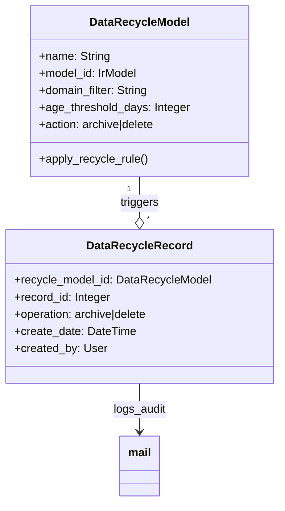

# C4 Code Level: Data Recycle (Data Cleaning & Lifecycle)

<!--
  Auto-generated by the c4-code agent. One file per source directory.
  Refreshed on /banyan-c4 reruns whenever the directory's content hash changes.
  Do NOT hand-edit; edits will be overwritten on next refresh.
-->

## Generated By

- **Agent**: c4-code (Haiku)
- **Run ID**: banyan-c4-20260701-init
- **Generated**: 2026-07-01T00:00:00Z
- **Source Directory**: addons/data_recycle
- **Content Hash**: d41d8cd98f00b204e9800998ecf8427e

## Overview

- **Name**: Data Recycle
- **Description**: Manages scheduled deletion and archiving of old records based on configurable rules, supporting data lifecycle compliance and storage optimization
- **Location**: addons/data_recycle — 2 root files
- **Language**: Python (Odoo 18.0)
- **Purpose**: Provides data lifecycle management by defining recycle rules per model (matched by domain filters and age thresholds), scheduling automated archival or deletion via cron jobs, and tracking recycle operations for audit trails

## Code Elements

### Modules

- **`__init__.py`** — Package initialization; imports models subpackage
  - **Location**: `__init__.py:1-4`
  - **Purpose**: Makes the package importable and loads data recycle model definitions
  
- **`__manifest__.py`** — Addon metadata, cron job scheduling, and backend UI assets
  - **Location**: `__manifest__.py:1-28`
  - **Purpose**: Declares addon name (Data Recycle), version 1.3, category (Productivity/Data Cleaning), dependency on mail addon, data files (cron definitions, UI views for recycle models and rules), and backend assets for record management interface

## Dependencies

### Internal

- `models` (subpackage) — data_recycle_model (rule definitions), data_recycle_record (operation tracking)
- `mail` (addon) — Mail/notification backend for audit logging

### External

- Odoo 18.0 framework
- Backend JavaScript/XML assets (data_recycle/static/src/views/*.js, *.xml)

## Relationships

Data Recycle is a utility module that operates independently of business domains. It provides a configurable rule engine for archiving/deleting records based on age and domain filters, with all operations logged for compliance.

## Notes for Higher-Level Synthesis

- **Pure utility — no business logic dependency**: Data Recycle is orthogonal to any specific domain; can be applied to any model
- **Compliance-driven**: Supports GDPR and other data retention policies (inferred from compliance language in description)
- **Batch operation**: Uses Odoo cron jobs (ir_cron) to execute recycle rules on a schedule
- **Audit trail**: Records all operations for compliance validation (integrates with mail module for notifications)
- **Isolated from business components**: Should be grouped separately as a cross-cutting utility
