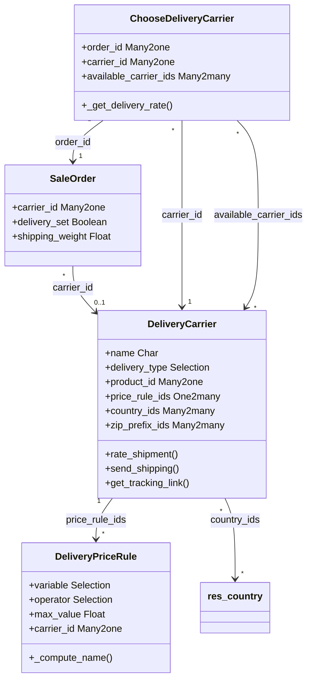

# C4 Code Level: Delivery and Shipping Management

<!--
  Auto-generated by the c4-code agent. One file per source directory.
  Refreshed on /banyan-c4 reruns whenever the directory's content hash changes.
  Do NOT hand-edit; edits will be overwritten on next refresh.
-->

## Generated By

- **Agent**: c4-code (Haiku)
- **Run ID**: banyan-c4-20260701-init
- **Generated**: 2026-07-01T00:00:00Z
- **Source Directory**: addons/delivery
- **Content Hash**: 20260701-initial

## Overview

- **Name**: Delivery Methods and Shipping Carrier Management
- **Description**: Manages shipping carriers, pricing rules, and shipping cost computation; integrates with external carriers (FedEx, UPS, DHL) for rate lookups and shipment creation
- **Location**: addons/delivery — 5 models, 1 wizard, 2 controllers, 2 reports
- **Language**: Python (Odoo 18.0 ORM)
- **Purpose**: Provides carrier selection, dynamic shipping cost calculation, tracking number management, return label generation, and carrier API integration (extensible framework)

## Code Elements

### Classes / Models

- **`DeliveryCarrier`** — Shipping method and carrier configuration
  - **Location**: `models/delivery_carrier.py:<12>`
  - **Key Methods**:
    - `_compute_weight_uom_name()` — Retrieves weight UOM from IR config
    - `_compute_volume_uom_name()` — Retrieves volume UOM from IR config
    - `_compute_can_generate_return()` — Checks if provider supports return label generation
    - `_compute_supports_shipping_insurance()` — Checks if provider supports shipping insurance
    - `_check_tags()` — Validates must_have_tag_ids and excluded_tag_ids don't overlap
    - `rate_shipment(order)` — (extensible hook) Computes shipping cost; subclasses implement carrier-specific methods
      - Pattern: `{delivery_type}_rate_shipment(order)` (e.g., `fedex_rate_shipment`)
    - `send_shipping(pickings)` — (extensible hook) Creates shipment with carrier API
      - Pattern: `{delivery_type}_send_shipping(pickings)`
    - `get_tracking_link(picking, picking_type=None)` — (extensible hook) Formats tracking URL
      - Pattern: `{delivery_type}_get_tracking_link(picking)`
    - `cancel_shipment(picking)` — (extensible hook) Cancels shipment with carrier
      - Pattern: `{delivery_type}_cancel_shipment(picking)`
  - **Key Fields**:
    - `name` — Char (required, translatable)
    - `active` — Boolean (default True)
    - `sequence` — Integer (display order)
    - `delivery_type` — Selection (extensible; default 'fixed' or 'base_on_rule')
      - Base options: [('base_on_rule', 'Based on Rules'), ('fixed', 'Fixed Price')]
      - Subclasses extend (e.g., fedex, ups, dhl, easypost)
    - `integration_level` — Selection: 'rate' (get quote only) or 'rate_and_ship' (create shipment)
    - `prod_environment` — Boolean (production credentials flag)
    - `debug_logging` — Boolean (enable carrier request logging)
    - `product_id` — Many2one to product.product (required; delivery service SKU)
    - `company_id` — Many2one to res.company (related, stored)
    - `tracking_url` — Char (with <shipmenttrackingnumber> placeholder)
    - `currency_id` — Many2one to res.currency (related to product_id)
    - `invoice_policy` — Selection: 'estimated' (customer invoiced estimated cost)
    - `country_ids` — Many2many to res.country (availability)
    - `state_ids` — Many2many to res.country.state (state-level availability)
    - `zip_prefix_ids` — Many2many to delivery.zip.prefix (regex-based zip matching)
    - `max_weight` — Float (exceeding disables carrier)
    - `max_volume` — Float (exceeding disables carrier)
    - `must_have_tag_ids` — Many2many to product.tag (product must have one tag)
    - `excluded_tag_ids` — Many2many to product.tag (product must NOT have tag)
    - `carrier_description` — Text (translatable; customer-facing description)
    - `margin` — Float (percentage markup on shipping price)
    - `fixed_margin` — Float (fixed amount markup)
    - `free_over` — Boolean (free shipping above order amount)
    - `amount` — Float (free shipping threshold)
    - `return_label_on_delivery` — Boolean (auto-generate return label at delivery)
    - `get_return_label_from_portal` — Boolean (customer can download return label from portal)
    - `shipping_insurance` — Integer (% insurance cost)
    - `price_rule_ids` — One2many to delivery.price.rule
  - **Constraints**:
    - `margin_not_under_100_percent` — margin >= -1 (CHECK)
    - `shipping_insurance_is_percentage` — 0 <= shipping_insurance <= 100 (CHECK)
  - **Dependencies**: product, res.partner, res.country, delivery.price.rule, delivery.zip.prefix

- **`DeliveryPriceRule`** — Pricing rule for carriers based on weight, volume, price, quantity
  - **Location**: `models/delivery_price_rule.py:<16>`
  - **Key Methods**:
    - `_compute_name()` — Generates human-readable rule name from variable, operator, max_value, list_base_price, list_price, variable_factor
  - **Key Fields**:
    - `name` — Char (computed; e.g., "if weight <= 10 then fixed price 5.00")
    - `sequence` — Integer (required, default=10; rule order)
    - `carrier_id` — Many2one to delivery.carrier (required, ondelete='cascade')
    - `currency_id` — Many2one to res.currency (related to carrier_id)
    - `variable` — Selection: weight, volume, wv (weight*volume), price, quantity (required, default='quantity')
    - `operator` — Selection: ==, <=, <, >=, > (required, default='<=')
    - `max_value` — Float (required; upper bound for variable)
    - `list_base_price` — Float (fixed base price, default=0.0)
    - `list_price` — Float (variable multiplier price, default=0.0)
    - `variable_factor` — Selection: same as variable (multiplier dimension)
  - **Dependencies**: delivery.carrier, res.currency

- **`DeliveryZipPrefix`** — Zip code prefixes for regional carrier availability
  - **Location**: `models/delivery_zip_prefix.py:<1>`
  - **Key Methods**: Pattern matching logic (regex support)
  - **Key Fields**:
    - Zip prefix (string); regex patterns support (e.g., '100$' matches '100' only)
  - **Dependencies**: delivery.carrier

- **`SaleOrder`** (inherited) — Adds delivery carrier selection and cost
  - **Location**: `models/sale_order.py:<1>`
  - **Key Methods**:
    - `_compute_shipping_weight()` — Sums product weight * qty from order lines
    - `_compute_shipping_volume()` — Sums product volume * qty from order lines
    - Carrier selection and rate computation
  - **Key Fields**:
    - `carrier_id` — Many2one to delivery.carrier
    - `delivery_set` — Boolean (carrier selected and rate confirmed)
    - `shipping_weight` — Float (computed; total order weight)
    - `delivery_rating_exists` — Boolean (carrier rate available)
  - **Dependencies**: delivery, sale

- **`SaleOrderLine`** (inherited) — Extends with delivery-relevant fields
  - **Location**: `models/sale_order_line.py:<1>`
  - **Key Methods**: Shipping weight/volume computation per line
  - **Dependencies**: delivery, sale

- **`ResPartner`** (inherited) — Adds carrier preferences
  - **Location**: `models/res_partner.py:<1>`
  - **Key Fields**:
    - `property_delivery_carrier_id` — Many2one to delivery.carrier (partner's preferred carrier)
  - **Dependencies**: delivery, res.partner

- **`ProductCategory`** (inherited) — Adds shipping category
  - **Location**: `models/product_category.py:<1>`
  - **Key Fields**:
    - `delivery_category_id` — Many2one (category for shipping classification)
  - **Dependencies**: product, delivery

- **`ChooseDeliveryCarrier`** — Wizard for carrier selection and rate approval
  - **Location**: `wizard/choose_delivery_carrier.py:<7>`
  - **Key Methods**:
    - `_get_default_weight_uom()` — Retrieves weight UOM label
    - `_onchange_carrier_id()` — Triggers rate computation when carrier changes
    - `_onchange_order_id()` — Updates rate if carrier already set
    - `_compute_invoicing_message()` — Generates carrier-specific invoicing info
    - `_compute_available_carrier()` — Filters carriers by country, state, tags, weight, volume
    - `_get_delivery_rate()` — Calls carrier.rate_shipment(); handles success/error
    - `update_price()` — Updates display_price from carrier rate (action button)
    - `button_confirm()` — (presumably) Sets SO.carrier_id and delivery_set=True
  - **Key Fields**:
    - `order_id` — Many2one to sale.order (required, ondelete="cascade")
    - `partner_id` — Many2one to res.partner (related)
    - `carrier_id` — Many2one to delivery.carrier (required)
    - `delivery_type` — Selection (related to carrier_id)
    - `delivery_price` — Float (actual cost to customer)
    - `display_price` — Float (carrier_price with margin applied)
    - `currency_id` — Many2one to res.currency (related)
    - `company_id` — Many2one to res.company (related)
    - `available_carrier_ids` — Many2many to delivery.carrier (computed; filtered by country/weight/tags)
    - `invoicing_message` — Text (computed)
    - `delivery_message` — Text (readonly; carrier-specific warning)
    - `total_weight` — Float (SO shipping weight)
    - `weight_uom_name` — Char (readonly; weight unit label)
  - **Dependencies**: delivery.carrier, sale.order, res.partner, res.company

### Functions / Methods (Module-level)

- `rate_shipment(order)` — DeliveryCarrier method; computes shipping cost
  - **Description**: Extensible hook; base impl uses delivery.price.rule; subclasses call external APIs (fedex_rate_shipment, etc.)
  - **Location**: `models/delivery_carrier.py` (line varies by implementation)
  - **Visibility**: public
  - **Return Type**: dict with keys: 'success' (bool), 'price' (float), 'carrier_price' (float), 'warning_message' (str, optional), 'error_message' (str, optional)
  - **Dependencies**: delivery.price.rule, external carrier APIs (optional)

- `_get_delivery_rate()` — ChooseDeliveryCarrier method; wrapper around carrier.rate_shipment
  - **Description**: Calls carrier rate_shipment(); extracts and stores price info
  - **Location**: `wizard/choose_delivery_carrier.py:<67>`
  - **Visibility**: public
  - **Return Type**: dict with 'no_rate', 'error_message' keys
  - **Dependencies**: delivery.carrier.rate_shipment

- `_compute_available_carrier()` — ChooseDeliveryCarrier method; filters carriers by location/weight/tags
  - **Description**: Applies country, state, zip_prefix, weight, volume, tag filters
  - **Location**: `wizard/choose_delivery_carrier.py:<62>`
  - **Visibility**: public
  - **Dependencies**: delivery.carrier (filtering logic)

### Constants / Configuration

- `delivery_type` selection — Base: `[('base_on_rule', 'Based on Rules'), ('fixed', 'Fixed Price')]`
  - **Purpose**: Identifies carrier pricing strategy; subclasses extend with 'fedex', 'ups', 'dhl', etc. (`addons/delivery/models/delivery_carrier.py:<41>`)

- `integration_level` selection — `[('rate', 'Get Rate'), ('rate_and_ship', 'Get Rate and Create Shipment')]`
  - **Purpose**: Controls whether DO validation also triggers shipment creation (`addons/delivery/models/delivery_carrier.py:<47>`)

- `VARIABLE_SELECTION` — `[('weight', ...), ('volume', ...), ('wv', ...), ('price', ...), ('quantity', ...)]`
  - **Purpose**: Possible variables for price rule conditions (`addons/delivery/models/delivery_price_rule.py:<7>`)

- `delivery.zip.prefix` — Zip code prefix patterns (regex)
  - **Purpose**: Regional carrier availability (e.g., '100$' matches exactly '100') (`addons/delivery/models/delivery_zip_prefix.py`)

## Dependencies

### Internal

- **sale** — sale.order, sale.order.line models; order state, partner, currency
- **stock** — stock.picking (shipment tracking, integration point)
- **product** — product.product, product.template, product.category; weight, volume, UOM
- **res.partner** — Shipping address, customer preferences, property fields
- **res.country** — Country/state filtering for carrier availability
- **account** — Currency handling

### External

- **Odoo Framework** (18.0) — ORM models, fields, api decorators, @api.depends, @api.constrains
- **Python stdlib** — psycopg2, re (regex for zip matching), logging
- **Odoo utilities** — safe_eval (custom script evaluation for advanced rules), exceptions
- **Third-party carrier APIs** (optional, subclass-dependent) — FedEx API, UPS API, DHL API, EasyPost API

## Relationships

## Notes for Higher-Level Synthesis

- **Belongs with shipping/fulfillment components** — Core entity: DeliveryCarrier and ChooseDeliveryCarrier wizard; integrate with sale_stock (picking creation) and stock (shipment fulfillment)
- **Extensible framework for carrier providers** — Pattern: subclass DeliveryCarrier, extend delivery_type, implement {provider}_rate_shipment / _send_shipping / _get_tracking_link; keep integration layer separate
- **Price rule engine is rule-based, not scriptable** — VARIABLE_SELECTION + operator + max_value model is simple but limited; no custom scripting (unlike purchase price rules); coordinate if adding custom rules
- **Location-based filtering is critical** — country_ids, state_ids, zip_prefix_ids control availability; validate regex patterns in zip_prefix_ids to prevent performance issues
- **Portal integration** — SaleOrderLine/SaleOrder carrier selection feeds ChooseDeliveryCarrier wizard; tracking links rendered via tracking_url template + get_tracking_link override
- **Weight/volume computation** — Delegates to product UOM conversion; ensure product.weight, product.volume, and product.uom_id are always set for accurate rates
- **Margin application** — margin (%) and fixed_margin combine on final price; free_over threshold applies to SO total (excl. shipping); verify margin logic in rate calculation

