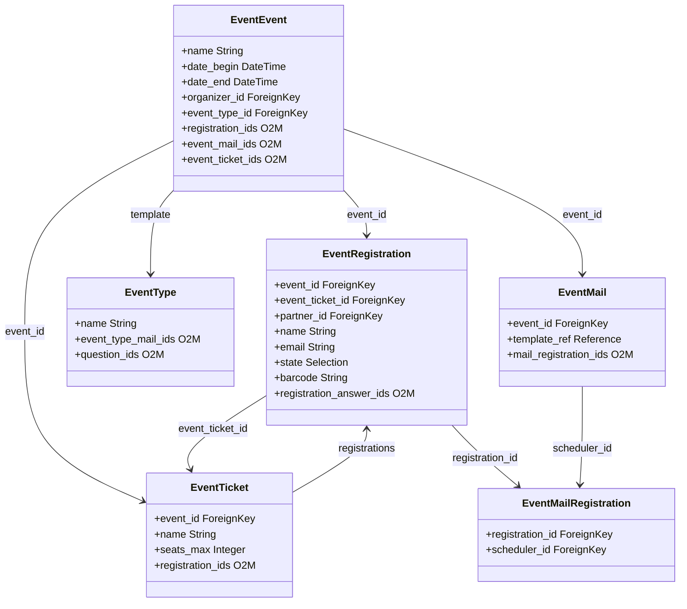

# C4 Code Level: Odoo Event Module

<!--
  Auto-generated by the c4-code agent. One file per source directory.
  Refreshed on /banyan-c4 reruns whenever the directory's content hash changes.
  Do NOT hand-edit; edits will be overwritten on next refresh.
-->

## Generated By

- **Agent**: c4-code (Haiku)
- **Run ID**: banyan-c4-20260701-init
- **Generated**: 2026-07-01T00:00:00Z
- **Source Directory**: addons/event
- **Content Hash**: tbd

## Overview

- **Name**: Event Organization Module
- **Description**: Event planning, registration tracking, attendances, ticket management, and automated email communication
- **Location**: addons/event — 27 Python files
- **Language**: Python (Odoo ORM)
- **Purpose**: Manage events with registration workflow, ticket types, attendance tracking, automated mail scheduling, and event-specific survey questions

## Code Elements

### Models (Core)

- **`EventEvent`** (`event.event`) — Master event entity with dates, venue, organizer, ticket types, and registration management
  - **Location**: `models/event_event.py:94`
  - **Methods**: `default_get()`, `get_kiosk_url()`, `_get_default_stage_id()`, `_default_description()`, `_default_event_mail_ids()`, `_lang_get()`, `_default_question_ids()`
  - **Key Fields**: `name`, `date_begin`, `date_end`, `company_id`, `organizer_id`, `event_type_id`, `user_id`
  - **Dependencies**: `event.type`, `event.registration`, `event.mail`, `event.stage`, `event.ticket`, `res.company`, `res.users`, `mail.thread`, `mail.activity.mixin`

- **`EventRegistration`** (`event.registration`) — Individual attendee registration for an event
  - **Location**: `models/event_registration.py:13`
  - **Methods**: `_get_random_barcode()`, `default_get()`, `_compute_name()`, `_compute_email()`, `_compute_phone()`, `_compute_company_name()`, `_compute_date_closed()`, `_check_seats_availability()`
  - **Key Fields**: `event_id`, `event_ticket_id`, `name`, `email`, `phone`, `company_name`, `state`, `barcode`, `registration_answer_ids`
  - **Visibility**: Public (trackable via `mail.thread`)
  - **Dependencies**: `event.event`, `event.ticket`, `res.partner`, `utm.campaign/source/medium`, `mail.thread`

- **`EventTicket`** (`event.event.ticket`) — Ticket type for an event with seat limits and sales dates
  - **Location**: `models/event_ticket.py:46`
  - **Methods**: `default_get()`, `_compute_is_expired()`, `_compute_is_launched()`, `_compute_is_sold_out()`, `_compute_seats()`
  - **Key Fields**: `event_id`, `name`, `description`, `seats_max`, `seats_available`, `start_sale_datetime`, `end_sale_datetime`
  - **Dependencies**: `event.event`, `event.registration`

- **`EventType`** (`event.type`) — Event template/category with default mail schedules and questions
  - **Location**: `models/event_event.py:30`
  - **Methods**: `_default_event_mail_type_ids()`, `_default_question_ids()`, `_compute_seats_max()`
  - **Key Fields**: `name`, `note`, `event_type_mail_ids`, `question_ids`, `tag_ids`
  - **Dependencies**: `event.type.mail`, `event.question`, `event.tag`

- **`EventStage`** (`event.stage`) — Stage/status for events (workflow state)
  - **Location**: `models/event_stage.py`
  - **Purpose**: Track event lifecycle (draft, confirmed, running, done)
  - **Dependencies**: `base.Model`

- **`EventTag`** (`event.tag`) — Categorization tags for events
  - **Location**: `models/event_tag.py`
  - **Purpose**: Classify events by topic or category
  - **Dependencies**: `base.Model`

### Mail & Communication Models

- **`EventTypeMail`** (`event.type.mail`) — Mail template schedule definition for event types
  - **Location**: `models/event_mail.py:26`
  - **Methods**: `_compute_notification_type()`, `_prepare_event_mail_values()`
  - **Key Fields**: `event_type_id`, `interval_nbr`, `interval_unit`, `interval_type`, `template_ref`
  - **Purpose**: Define default mail triggers (after registration, before/after event)

- **`EventMailScheduler`** (`event.mail`) — Automated mailing schedule for a specific event
  - **Location**: `models/event_mail.py:63`
  - **Methods**: `_compute_scheduled_date()`, `_compute_mail_state()`, `_compute_notification_type()`
  - **Key Fields**: `event_id`, `scheduled_date`, `mail_done`, `mail_state`, `template_ref`
  - **Purpose**: Schedule and track automated emails for event (confirmations, reminders)
  - **Dependencies**: `event.event`, `event.mail.registration`, `mail.template`

- **`EventMailRegistration`** (`event.mail.registration`) — Link between mail schedule and registration
  - **Location**: `models/event_mail_registration.py`
  - **Purpose**: Track individual email delivery status per registration
  - **Dependencies**: `event.mail`, `event.registration`

### Question & Answer Models

- **`EventQuestion`** (`event.question`) — Survey-like question attached to event registration
  - **Location**: `models/event_question.py`
  - **Key Fields**: `event_id`, `title`, `question_type`, `is_mandatory_answer`
  - **Purpose**: Custom fields for event registrations (e.g., dietary preferences, skill level)
  - **Dependencies**: `event.event`, `event.question.answer`

- **`EventQuestionAnswer`** (`event.question.answer`) — Predefined answer options for choice questions
  - **Location**: `models/event_question_answer.py`
  - **Purpose**: Define choices for event registration questions
  - **Dependencies**: `event.question`

- **`EventRegistrationAnswer`** (`event.registration.answer`) — Attendee's answer to an event question
  - **Location**: `models/event_registration_answer.py`
  - **Purpose**: Store respondent answers collected during registration
  - **Dependencies**: `event.registration`, `event.question`

### Controllers

- **`EventController`** — HTTP routes for event-facing operations
  - **Location**: `controllers/main.py:12`
  - **Methods**: 
    - `event_ics_file(event)` — `@route(['/event/<model("event.event"):event>/ics'], type='http', auth="public")` — Generate iCalendar file for event
    - `event_my_tickets(event_id, registration_ids, tickets_hash, badge_mode, responsive_html)` — `@route(['/event/<int:event_id>/my_tickets'], type='http', auth='public')` — PDF/HTML ticket generation with hash validation
    - `init_barcode_interface(event_id)` — `@http.route(['/event/init_barcode_interface'], type='json', auth="user")` — Initialize barcode scanner UI
  - **Dependencies**: `event.event`, `event.registration`, `ir.actions.report`

### Configuration & Settings

- **`ResConfigSettings`** (event extension) — Company-level event settings
  - **Location**: `models/res_config_settings.py`
  - **Purpose**: Configure event module behavior per company
  - **Dependencies**: `res.config.settings`

- **`ResPartner`** (event extension) — Partner/contact event-related fields
  - **Location**: `models/res_partner.py`
  - **Purpose**: Track events managed by contacts
  - **Dependencies**: `res.partner`

### Mail Template (Extended)

- **`MailTemplate`** (event extension) — Odoo mail templates for event communications
  - **Location**: `models/mail_template.py`
  - **Purpose**: Render event-specific data in email templates (event details, registration info)

### Utilities

- **`esc_label_tools`** — ESC/POS printer utilities for badge/label printing
  - **Location**: `tools/esc_label_tools.py`
  - **Functions**: `print_event_attendees()`, `setup_printer()`, `layout_96x82()`, `layout_96x134()`
  - **Purpose**: Low-level barcode/label printing to ESC/POS-compatible thermal printers

### Test Utilities

- **`common.py`** — Test base classes and fixtures
  - **Location**: `tests/common.py`
  - **Purpose**: Shared test setup for event tests

### Test Suites

- **`test_event_flow.py`** — End-to-end event lifecycle tests
- **`test_event_internals.py`** — Unit tests for event model business logic
- **`test_event_mail_schedule.py`** — Mail scheduling logic tests

## Dependencies

### Internal (to other Odoo modules)

- **`base`** — Core Odoo framework, models, and utilities
- **`base_setup`** — Initial setup wizard and company configuration
- **`barcodes`** — Barcode generation and scanning
- **`mail`** — Email and thread mixins (`mail.thread`, `mail.activity.mixin`, `mail.template`)
- **`phone_validation`** — Phone number normalization and validation
- **`portal`** — Portal access and sharing
- **`utm`** — UTM campaign tracking (source, medium, campaign)

### External (Third-Party Libraries)

- **`vobject`** — iCalendar file generation for event `.ics` files (optional, graceful degradation if missing)
- **`pytz`** — Timezone handling for event dates
- **`werkzeug`** — HTTP routing and utilities (via Odoo framework)
- **`dateutil`** — Relative date calculations for event scheduling

## Relationships

## Notes for Higher-Level Synthesis

- **Core Domain Entity**: `EventEvent` is the center; all registration, ticket, and communication flows hang off it — should be its own logical component
- **Registration Workflow**: `EventRegistration` + `EventTicket` + `EventMailScheduler` form a coherent workflow — consider grouping in a "Registration & Communication" component
- **Survey-Like Pattern**: Event questions (event.question/event.question.answer) mirror survey.question structure — potential code reuse opportunity or shared pattern with survey addon
- **Boundary Code**: Controllers (`controllers/main.py`) are HTTP entry points — separate public-facing concern from domain models
- **Optional Features**: `esc_label_tools` for printer integration is isolated — could be feature-flagged or extracted to separate addon for lighter installs
- **Template-Based**: `EventType` acts as template/factory for events — reduces duplication but adds inheritance complexity
