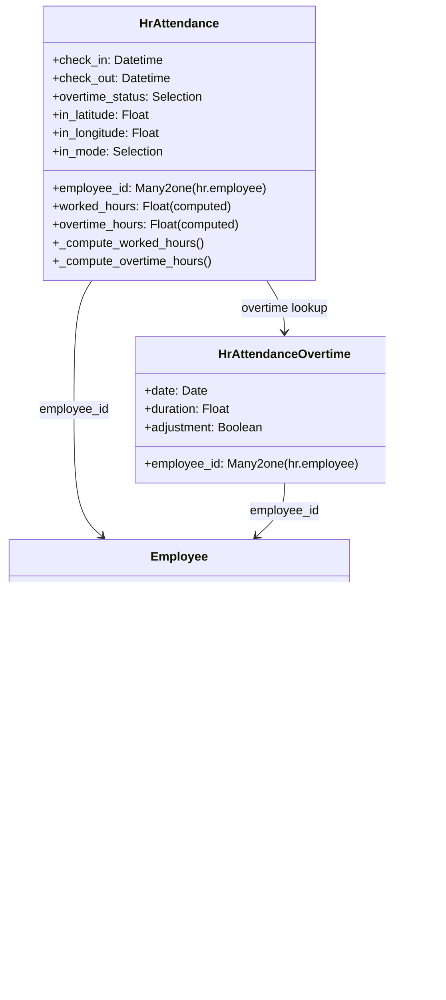

# C4 Code Level: hr_attendance (Attendance Tracking)

<!--
  Auto-generated by the c4-code agent. One file per source directory.
  Refreshed on /banyan-c4 reruns whenever the directory's content hash changes.
  Do NOT hand-edit; edits will be overwritten on next refresh.
-->

## Generated By

- **Agent**: c4-code (Haiku)
- **Run ID**: banyan-c4-20260701-init
- **Generated**: 2026-07-01T00:00:00Z
- **Source Directory**: `addons/hr_attendance` (root level)
- **Content Hash**: hr_attendance-root-20260701

## Overview

- **Name**: Attendance Tracking Module
- **Description**: Tracks employee check-in/check-out, computes worked hours, overtime, and provides kiosk mode for attendance punch-in
- **Location**: `addons/hr_attendance/` — 2 root-level Python files
- **Language**: Python (Odoo module)
- **Purpose**: Records attendance events, computes work hours, tracks overtime, and provides geolocation + browser metrics

## Code Elements

### Initialization & Hooks

- `post_init_hook(env: Environment) → None`
  - **Description**: Post-installation hook; checks and enables HR presence control on company settings
  - **Location**: `__init__.py:7`
  - **Visibility**: public
  - **Dependencies**: `res.company._check_hr_presence_control()`

- `uninstall_hook(env: Environment) → None`
  - **Description**: Pre-uninstall hook; disables HR presence control when module is removed
  - **Location**: `__init__.py:11`
  - **Visibility**: public
  - **Dependencies**: `res.company._check_hr_presence_control()`

### Main Classes / Models

- **`HrAttendance` (hr.attendance)** — Attendance record (check-in/check-out event)
  - **Location**: `models/hr_attendance.py:26`
  - **Key Methods**: `_default_employee()`, `_compute_worked_hours()`, `_compute_overtime_hours()`, `_compute_overtime_status()`, `_compute_validated_overtime_hours()`, `_compute_color()`, `_compute_expected_hours()`, `_read_group_employee_id()`
  - **Fields**: `employee_id` (Many2one, required), `department_id` (related), `manager_id` (related), `check_in` (Datetime, required), `check_out` (Datetime, nullable), `worked_hours` (Float, computed), `color` (Integer, computed for UI), `overtime_hours` (Float, computed), `overtime_status` (Selection: to_approve/approved/refused), `validated_overtime_hours` (Float, computed), `expected_hours` (Float, computed), `in_latitude`, `in_longitude`, `in_country_name`, `in_city`, `in_ip_address`, `in_browser`, `in_mode` (kiosk/systray/manual/technical), `out_latitude`, `out_longitude`, `out_country_name`, `out_city`, `out_ip_address`, `out_browser`, `out_mode` (includes auto_check_out)
  - **Inheritance**: `mail.thread`
  - **Dependencies**: `hr.employee`, `hr.department`, `hr.attendance.overtime`, `resource_calendar` (for expected hours), geolocation services
  - **Ordering**: `check_in desc`
  - **Domain Access**: RBAC via hr group permissions; employees see own records

- **`HrAttendanceOvertime` (hr.attendance.overtime)** — Overtime records (duration tracking)
  - **Location**: `models/hr_attendance_overtime.py`
  - **Purpose**: Track and approve overtime hours per employee
  - **Fields**: `employee_id`, `date`, `duration`, `adjustment` (Boolean flag)
  - **Dependencies**: `hr.attendance`, `hr.employee`

### Helper Functions

- `get_google_maps_url(latitude: float, longitude: float) → str`
  - **Description**: Generate Google Maps URL from geolocation coordinates
  - **Location**: `models/hr_attendance.py:22`
  - **Visibility**: internal
  - **Dependencies**: none

### Extended Models

- **`HrEmployee`** (extends) — adds leave, calendar, and attendance relationships
- **`HrEmployeeBase`** (extends) — base employee filtering
- **`HrEmployeePublic`** (extends) — public employee fields
- **`ResCompany`** (extends) — attendance presence control configuration
- **`ResUsers`** (extends) — user-employee linkage for default attendance
- **`ResourceCalendarLeaves`** (extends) — integrates leave calendar for expected hours calculation
- **`ResConfigSettings`** (extends) — configuration UI for attendance settings

## Dependencies

### Internal

- **`hr` (base HR module)** — Employee, department, manager relationships
- **`barcodes` (Barcode module)** — Barcode scanner support for kiosk mode
- **Models extended**: `hr.employee`, `hr.department`, `res.users`, `res.company`, `resource.calendar`, `resource.calendar.leaves`

### External

- `python:pytz` — Timezone handling for attendance timestamps
- `python:dateutil.relativedelta` — Date arithmetic
- `python:calendar.monthrange` — Calendar utilities
- `python:datetime, timedelta` — Timestamp manipulation
- `python:collections.defaultdict` — Grouping utilities
- `python:operator.itemgetter` — Data extraction
- `python:random.randint` — Random value generation
- `odoo.http.request` — HTTP request context (for geolocation/browser data)
- `odoo.exceptions` — `AccessError`, validation exceptions
- `odoo.tools` — `convert()`, `format_duration()`, `format_time()`, `format_datetime()`, `float_compare()`
- `odoo.osv.expression` — Query expression builders (`AND`, `OR`)
- `odoo.addons.resource.models.utils` — `Intervals`, `sum_intervals()` for hour computation

## Relationships

## Notes for Higher-Level Synthesis

- **Boundary code**: Handles geolocation capture, browser info (kiosk mode integration point)
- **Belongs with `hr_holidays`**: Both track employee time; leave deductions must align with attendance
- **Computation-heavy**: `_compute_overtime_hours()` uses SQL window functions for efficiency; calls custom SQL JOIN with employee timezones
- **Shared models**: Extends `hr.employee`, `res.users`, `res.company` (shared with all HR modules)
- **Domain logic**: Overtime calculation, expected hours derivation from calendar are core logic; not a boundary
