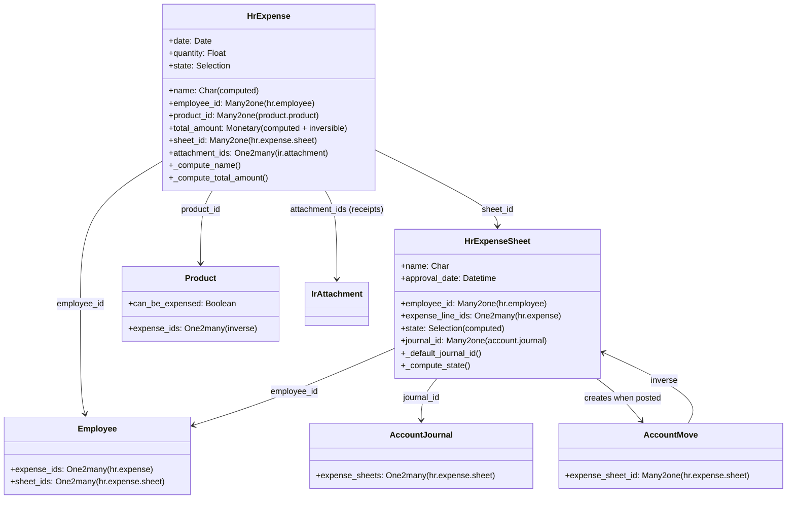

# C4 Code Level: hr_expense (Expense Reports)

<!--
  Auto-generated by the c4-code agent. One file per source directory.
  Refreshed on /banyan-c4 reruns whenever the directory's content hash changes.
  Do NOT hand-edit; edits will be overwritten on next refresh.
-->

## Generated By

- **Agent**: c4-code (Haiku)
- **Run ID**: banyan-c4-20260701-init
- **Generated**: 2026-07-01T00:00:00Z
- **Source Directory**: `addons/hr_expense` (root level)
- **Content Hash**: hr_expense-root-20260701

## Overview

- **Name**: Expense Reports Module
- **Description**: Manages employee expense submissions, approval workflows, OCR receipt scanning, and posting to accounting journals
- **Location**: `addons/hr_expense/` — 2 root-level Python files
- **Language**: Python (Odoo module)
- **Purpose**: Handles complete expense lifecycle from submission through accounting entry creation

## Code Elements

### Initialization

- **Module Imports** — Controllers, models, and wizards
  - **Location**: `__init__.py:3–6`
  - **Visibility**: module-level
  - **Imported packages**: `controllers`, `models`, `wizard`

### Main Classes / Models

- **`HrExpense` (hr.expense)** — Expense line item
  - **Location**: `models/hr_expense.py:12`
  - **Key Methods**: `_default_employee_id()` (validates current user has employee record), `_compute_name()`, `_compute_employee_id()`, `_compute_product_description()`, `_compute_uom_id()`, `_compute_from_product()`, `_compute_state()`, `_compute_tax_amount_currency()`, `_compute_tax_amount()`, `_compute_total_amount_currency()`, `_compute_total_amount()`, `_inverse_total_amount()`, `_compute_price_unit()`, `_compute_nb_attachment()`, `_compute_duplicate_expense_ids()`, `_compute_same_receipt_expense_ids()`
  - **Fields**: `name` (Char, computed), `date` (Date), `employee_id` (Many2one, required), `company_id` (Many2one, required, readonly), `product_id` (Many2one, restricted to expensable products), `product_description` (Html, computed), `quantity` (Float, required), `description` (Text), `attachment_ids` (One2many, receipt images), `state` (Selection: draft/reported/submitted/approved/done/refused), `sheet_id` (Many2one, hr.expense.sheet), `approved_by` (related to sheet), `approved_on` (related to sheet), `total_amount_currency` (Monetary, computed), `untaxed_amount_currency` (Monetary, computed), `tax_amount_currency` (Monetary, computed), `total_amount` (Monetary, computed + inversible), `tax_amount` (Monetary, computed), `price_unit` (Float, computed), `currency_id` (Many2one), `company_currency_id`, `duplicate_expense_ids` (Many2many, computed warning), `same_receipt_expense_ids` (Many2many, computed warning)
  - **Inheritance**: `mail.thread.main.attachment`, `mail.activity.mixin`, `analytic.mixin` (allows cost allocation)
  - **Dependencies**: `hr.employee`, `product.product`, `hr.expense.sheet`, `uom.uom`, `ir.attachment`, `res.currency`, `account` (via currency)
  - **Ordering**: `date desc, id desc`
  - **Domain Access**: RBAC by group (employee, approver, manager); auto-checks company

- **`HrExpenseSheet` (hr.expense.sheet)** — Expense report (aggregated expenses)
  - **Location**: `models/hr_expense_sheet.py:9`
  - **Key Methods**: `_default_employee_id()`, `_default_journal_id()` (finds purchase journal, validates company match), `_compute_nb_expense()`, `_compute_state()` (derived from line states), `_compute_amount_*()` (sum of expenses)
  - **Fields**: `name` (Char, required, tracked), `expense_line_ids` (One2many, hr.expense), `nb_expense` (Integer, computed), `state` (Selection: draft/submit/approve/post/done/cancel, computed, tracked), `approval_state` (Selection: submit/approve/cancel), `approval_date` (Datetime, readonly), `company_id` (Many2one, required, readonly), `employee_id` (Many2one, required, readonly), `journal_id` (Many2one, purchase journal, required for posting), `accounting_date` (Date), `currency_id`, `amount_*` (various computed monetary fields)
  - **Inheritance**: `mail.thread.main.attachment`, `mail.activity.mixin`
  - **Dependencies**: `hr.expense`, `account.journal`, `hr.employee`, `account.move` (posting), `account.payment` (reimbursement), `res.company`
  - **Ordering**: `accounting_date desc, id desc`
  - **Domain Access**: RBAC with restrictions (officers approve only non-own, managers approve all)

### Extended Models

- **`HrEmployee`** (extends) — adds expense-related fields and inverse relationships
- **`HrDepartment`** (extends) — department expense approval configuration
- **`AccountMove`** (extends) — integrates expense posting journal entries
- **`AccountMoveLine`** (extends) — line items from expense sheets
- **`AccountPayment`** (extends) — employee reimbursement payments
- **`AccountTax`** (extends) — tax computation for expenses
- **`ProductProduct`** (extends) — expense category filtering (only expensable products)
- **`ProductTemplate`** (extends) — product template expense flags
- **`ResCompany`** (extends) — expense journal and approver configuration
- **`ResConfigSettings`** (extends) — global expense settings UI
- **`IrAttachment`** (extends) — receipt image/document attachment
- **`IrActionsReport`** (extends) — expense report export/printing
- **`Analytic`** (extends via mixin) — cost allocation to cost centers

### Wizard Models

- **`HrExpenseApproveDeuplicate`** — Wizard for handling duplicate expenses
  - **Location**: `wizard/hr_expense_approve_duplicate.py`
  - **Purpose**: Approve duplicate expense submissions with warning

- **`HrExpenseRefuseReason`** — Wizard for expense rejection with reason
  - **Location**: `wizard/hr_expense_refuse_reason.py`
  - **Purpose**: Collect refusal reason when rejecting expense

- **`HrExpenseSplit` / `HrExpenseSplitWizard`** — Expense splitting wizard
  - **Location**: `wizard/hr_expense_split.py`, `hr_expense_split_wizard.py`
  - **Purpose**: Split one expense across multiple cost centers or accounts

- **`AccountPaymentRegister`** (extends) — Wizard for registering payments
  - **Location**: `wizard/account_payment_register.py`
  - **Purpose**: Integrate expense reimbursement into payment workflow

## Dependencies

### Internal

- **`account` (Accounting module)** — Journal, tax, move, payment models
- **`hr` (base HR module)** — Employee, department relationships
- **`web_tour` (Web module)** — Tour/tutorial assets
- **Models extended**: `hr.employee`, `hr.department`, `account.move`, `account.move.line`, `account.payment`, `account.tax`, `product.product`, `product.template`, `res.company`, `res.config.settings`, `ir.attachment`, `ir.actions.report`, analytic mixin

### External

- `python:re` — Regex for text parsing
- `python:markupsafe.Markup` — HTML safe markup handling
- `python:werkzeug` — HTTP toolkit
- `odoo.exceptions` — `UserError`, `ValidationError`
- `odoo.tools` — `email_split()`, `float_repr()`, `float_round()`, `is_html_empty()`
- `odoo.api, fields, Command, models` — Odoo ORM/API

## Relationships

## Notes for Higher-Level Synthesis

- **Boundary code**: Handles HR-to-Accounting translation (expense submission → journal entry creation); receipt attachment integration
- **Workflow state machine**: draft → reported → submitted → approved → post → done (with refusal path); state transitions enforce RBAC
- **Shared models**: Extends `hr.employee`, `res.company` (shared with all HR modules); heavy integration with `account` module (purchases, tax, journals)
- **Analytic mixin**: Allows expense allocation to projects, cost centers (project_id field via mixin)
- **Complex logic**: Duplicate detection, tax computation, currency conversion, journal posting are domain-core
- **Wizard-driven workflows**: Approval, refusal, splitting, payment registration via separate wizard models
