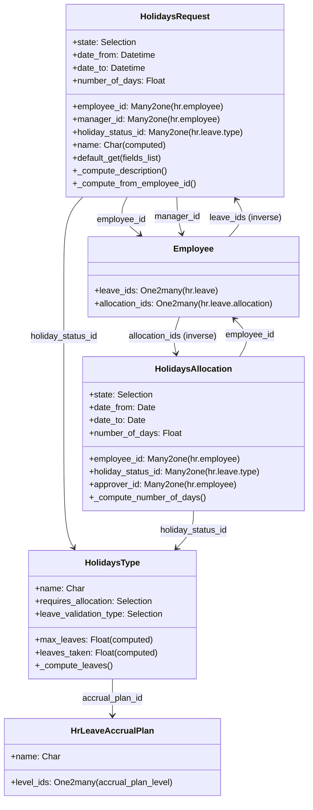

# C4 Code Level: hr_holidays (Time Off / Leave Management)

<!--
  Auto-generated by the c4-code agent. One file per source directory.
  Refreshed on /banyan-c4 reruns whenever the directory's content hash changes.
  Do NOT hand-edit; edits will be overwritten on next refresh.
-->

## Generated By

- **Agent**: c4-code (Haiku)
- **Run ID**: banyan-c4-20260701-init
- **Generated**: 2026-07-01T00:00:00Z
- **Source Directory**: `addons/hr_holidays` (root level)
- **Content Hash**: hr_holidays-root-20260701

## Overview

- **Name**: Time Off Management Module
- **Description**: Manages time off requests, allocations, leave types, accrual plans, and leave calendar integration for employee absence tracking
- **Location**: `addons/hr_holidays/` — 2 root-level Python files
- **Language**: Python (Odoo module)
- **Purpose**: Provides complete leave request and allocation workflow with manager approval, accrual plan support, and calendar integration

## Code Elements

### Initialization & Hooks

- `_hr_holiday_post_init(env: Environment) → None`
  - **Description**: Post-installation hook that auto-installs French localization module for French companies
  - **Location**: `__init__.py:11`
  - **Visibility**: public
  - **Dependencies**: `ir.module.module`, `res.company`

### Main Classes / Models

- **`HolidaysRequest` (hr.leave)** — Time off request model with multi-level approval workflow
  - **Location**: `models/hr_leave.py:34`
  - **Key Methods**: `default_get()`, `_default_get_request_dates()`, `_compute_description()`, `_compute_from_employee_id()`, `_compute_worked_hours()`, state transitions (confirm → validate1 → validate)
  - **Fields**: `state`, `employee_id`, `manager_id`, `holiday_status_id` (leave type), `user_id`, `date_from`, `date_to`, `number_of_days`, `name` (computed), `color` (related), `validation_type` (related)
  - **Inheritance**: `mail.thread.main.attachment`, `mail.activity.mixin`
  - **Dependencies**: `hr.leave.type`, `hr.employee`, `res.users`, `hr.department`, calendar events, resource calendar utilities
  - **Domain Access**: RBAC by employee role (regular employee, officer, manager) with multi-company rules

- **`HolidaysAllocation` (hr.leave.allocation)** — Leave allocation request (time-off allowance)
  - **Location**: `models/hr_leave_allocation.py:18`
  - **Key Methods**: `_default_holiday_status_id()`, `_domain_holiday_status_id()`, `_domain_employee_id()`, `_compute_description()`, `_compute_number_of_days()`
  - **Fields**: `state` (confirm/refuse/validate1/validate), `date_from`, `date_to`, `holiday_status_id`, `employee_id`, `manager_id`, `number_of_days`, `approver_id`, `second_approver_id`, `type_request_unit` (hour/day), `name` (computed)
  - **Inheritance**: `mail.thread`, `mail.activity.mixin`
  - **Dependencies**: `hr.leave.type`, `hr.employee`, resource calendar
  - **Domain Access**: Officers see only team members; employees see their own

- **`HolidaysType` (hr.leave.type)** — Time off type configuration (sickness, paid days, training, etc.)
  - **Location**: `models/hr_leave_type.py:21`
  - **Key Methods**: `_compute_leaves()`, `_search_max_leaves()`, `_compute_valid()`, `_search_valid()`, `_model_sorting_key()`
  - **Fields**: `name`, `sequence`, `create_calendar_meeting`, `color`, `icon_id`, `active`, `max_leaves` (computed), `leaves_taken` (computed), `virtual_remaining_leaves` (computed), `leave_validation_type` (no_validation/hr/manager/both), `requires_allocation` (yes/no), `employee_requests` (yes/no), `allocation_validation_type`, `time_type` (worked/leave), `request_unit` (day/half_day/hour), `unpaid`, `include_public_holidays_in_duration`
  - **Inheritance**: standalone model
  - **Dependencies**: `ir.attachment`, `mail.message.subtype`, `res.company`, `res.country`

- **`HrLeaveAccrualPlan` & `HrLeaveAccrualPlanLevel`** — Accrual policy configuration
  - **Location**: `models/hr_leave_accrual_plan*.py`
  - **Purpose**: Define how leave accrues over time (e.g., days per month, monthly carryover)
  - **Fields**: plan name, level rules (date ranges, accrual rates)
  - **Dependencies**: calendar level computation

### Key Functions (Exported)

- `get_employee_from_context(values: dict, context: dict, user_employee_id: int) → int`
  - **Description**: Extract employee ID from request values or context
  - **Location**: `models/hr_leave.py:28`
  - **Visibility**: internal
  - **Dependencies**: none

## Dependencies

### Internal

- **`hr` (base HR module)** — Employee, department, manager relationships
- **`calendar` (CRM module)** — Calendar event creation for approved leaves
- **`resource` (Resource module)** — Resource calendar, working hours, timezone utilities
- **Models extended**: `res.users`, `hr.employee`, `hr.department`, `mail.activity.type`, `calendar.event`, `res.partner`

### External

- `python:pytz` — Timezone handling for leave date computation
- `python:dateutil.relativedelta` — Relative date arithmetic
- `python:logging` — Standard logging
- `odoo.exceptions` — `AccessError`, `UserError`, `ValidationError`
- `odoo.tools.float_utils` — Float rounding and comparison
- `odoo.tools.misc` — Context cleaning, date formatting
- `odoo.addons.resource.models.utils` — `float_to_time()`, `HOURS_PER_DAY`, `Intervals`

## Relationships

## Notes for Higher-Level Synthesis

- **Boundary code**: Models inherit `mail.thread`, `mail.activity.mixin` for approval workflow and notifications
- **Belongs with `hr_attendance`**: Both track employee time-related events; leave deductions should align with attendance records
- **Belongs with `hr_contract`**: Leave accrual depends on employment contract terms
- **Shared models**: Extends `hr.employee`, `res.users`, `hr.department` (shared with all HR modules)
- **Pure domain logic**: Leave type configuration, approval workflow, accrual computation are domain-core; not a boundary
