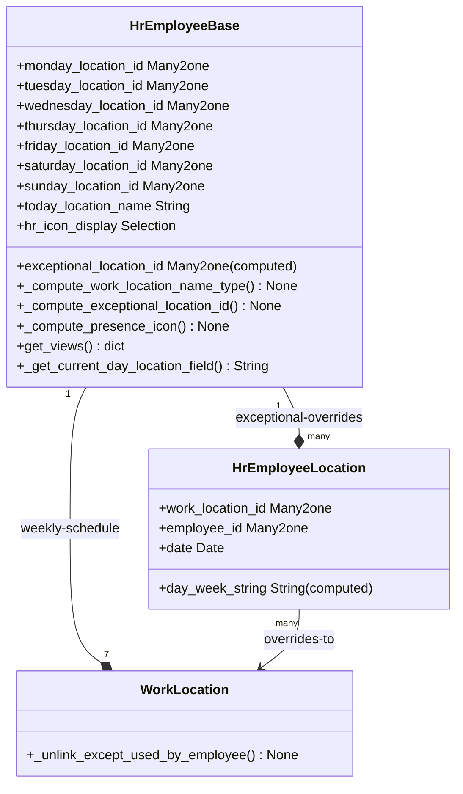

# C4 Code Level: HR Remote Work (Homeworking)

<!--
  Auto-generated by the c4-code agent. One file per source directory.
  Refreshed on /banyan-c4 reruns whenever the directory's content hash changes.
  Do NOT hand-edit; edits will be overwritten on next refresh.
-->

## Generated By

- **Agent**: c4-code (Haiku)
- **Run ID**: banyan-c4-20260701-init
- **Generated**: 2026-07-01T00:00:00Z
- **Source Directory**: addons/hr_homeworking
- **Content Hash**: 6a2f8e3b1c9d4e5f7a8b1c2d3e4f5g6h

## Overview

- **Name**: HR Remote Work (Homeworking)
- **Description**: Manage work location assignments for employees with per-day scheduling and exceptional location overrides
- **Location**: addons/hr_homeworking — 10 Python files, ~400 lines
- **Language**: Python (Odoo ORM models)
- **Purpose**: Enables per-employee weekly work location planning (office/home/other) with daily granularity and exceptional date-based overrides for flexible scheduling

## Code Elements

### Functions / Methods

- `_get_current_day_location_field() → str`
  - **Description**: Return the weekday field name for current day (e.g., 'monday_location_id')
  - **Location**: `models/hr_employee.py:28`
  - **Visibility**: internal
  - **Dependencies**: DAYS constant, fields.Date.today()

- `get_views(views, options=None) → dict`
  - **Description**: Dynamically replace 'today_location_name' placeholder with current day's location field in search/list views
  - **Location**: `models/hr_employee.py:34`
  - **Visibility**: internal
  - **Dependencies**: Odoo view architecture, string manipulation

- `_compute_work_location_name_type() → None`
  - **Description**: Set employee's current work location name/type from today's scheduled or exceptional location
  - **Location**: `models/hr_employee.py:45`
  - **Visibility**: internal
  - **Dependencies**: Odoo ORM (api.depends), DAYS constant

- `_compute_exceptional_location_id() → None`
  - **Description**: Load today's exceptional location override for each employee from hr.employee.location
  - **Location**: `models/hr_employee.py:53`
  - **Visibility**: internal
  - **Dependencies**: hr.employee.location model, fields.Date.today()

- `_compute_presence_icon() → None`
  - **Description**: Set hr_icon_display to reflect current work location type (home/office/other)
  - **Location**: `models/hr_employee.py:64`
  - **Visibility**: internal
  - **Dependencies**: Odoo ORM, location_type selection

- `_compute_day_week_string() → None`
  - **Description**: Format exceptional location's date as readable day-of-week (e.g., "Monday")
  - **Location**: `models/hr_homeworking.py:25`
  - **Visibility**: internal
  - **Dependencies**: Odoo tools.format_date

- `_unlink_except_used_by_employee() → None`
  - **Description**: Prevent deletion of work locations that are assigned to any employee (cascade safety check)
  - **Location**: `models/hr_work_location.py:11`
  - **Visibility**: internal
  - **Dependencies**: Odoo ORM (api.ondelete), DAYS constant, UserError

### Classes / Modules

- **`HrEmployeeBase`** (inherited abstract model)
  - **Location**: `models/hr_employee.py:8`
  - **Methods**: `_get_current_day_location_field()`, `get_views()`, `_compute_work_location_name_type()`, `_compute_exceptional_location_id()`, `_compute_presence_icon()`
  - **Inherits**: hr.employee.base (abstract)
  - **Added Fields**:
    - `monday_location_id` through `sunday_location_id` (7 × Many2one to hr.work.location)
    - `exceptional_location_id` (computed Many2one, today's override location)
    - `today_location_name` (placeholder for dynamic view swapping)
    - `hr_icon_display` (selection with added 'presence_home', 'presence_office', 'presence_other')
  - **Dependencies**: hr.work.location, hr.employee.location, DAYS constant

- **`HrEmployeeLocation`** — Per-employee daily exceptional location override
  - **Location**: `models/hr_homeworking.py:8`
  - **Methods**: `_compute_day_week_string()`
  - **Inherits**: models.Model
  - **Fields**: work_location_id, employee_id, date, day_week_string (computed), work_location_name (related), work_location_type (related), employee_name (related)
  - **Constraints**: unique (employee_id, date) — only one exceptional location per employee per day
  - **Dependencies**: hr.employee, hr.work.location

- **`WorkLocation`** (inherited)
  - **Location**: `models/hr_work_location.py:9`
  - **Methods**: `_unlink_except_used_by_employee()`
  - **Inherits**: hr.work.location
  - **Hooks**: ondelete cascade safety check
  - **Dependencies**: hr.employee (reads weekly location fields), hr.employee.location

### Constants / Configuration

- `DAYS` — List of weekday field names
  - **Value**: `['monday_location_id', 'tuesday_location_id', ..., 'sunday_location_id']`
  - **Location**: `models/hr_homeworking.py:5`
  - **Purpose**: Maps weekday index (0-6) to hr.employee location fields for dynamic view replacement and location computation

## Dependencies

### Internal

- **hr** — Core employee model extended with location fields
- **hr.work.location** — Work location entity (office, home, other); extended with ondelete hook
- **hr.employee.base** — Abstract model providing presence icon, work_location_name/type fields; extended with weekly schedules

### External

- **Python standard library**:
  - `datetime.weekday()` — Day-of-week index for DAYS lookup
  - `Odoo tools.format_date()` — Locale-aware date formatting

## Relationships

## Notes for Higher-Level Synthesis

- **Primary Component**: Employee Work Location Scheduling — core domain logic for flex/remote work management
- **Cohesion**: Tightly integrated with hr.employee base model; extends presence tracking (relies on computed work_location_name/type from parent class)
- **Boundary**: View layer boundary — heavy use of dynamic view manipulation (get_views) to replace placeholder fields; presence_icon is UI-facing
- **Integration Point**: Works with hr_presence addon through inherited presence_icon field; also integrates with hr_homeworking_calendar if present
- **Patterns**: Event hook (ondelete) for referential integrity; computed fields for daily resolution; weekly + exceptional pattern allows schedules with overrides
- **Scaling Note**: Per-day overrides (hr.employee.location) enable shift swaps and emergency location changes without rebuilding weekly schedule
