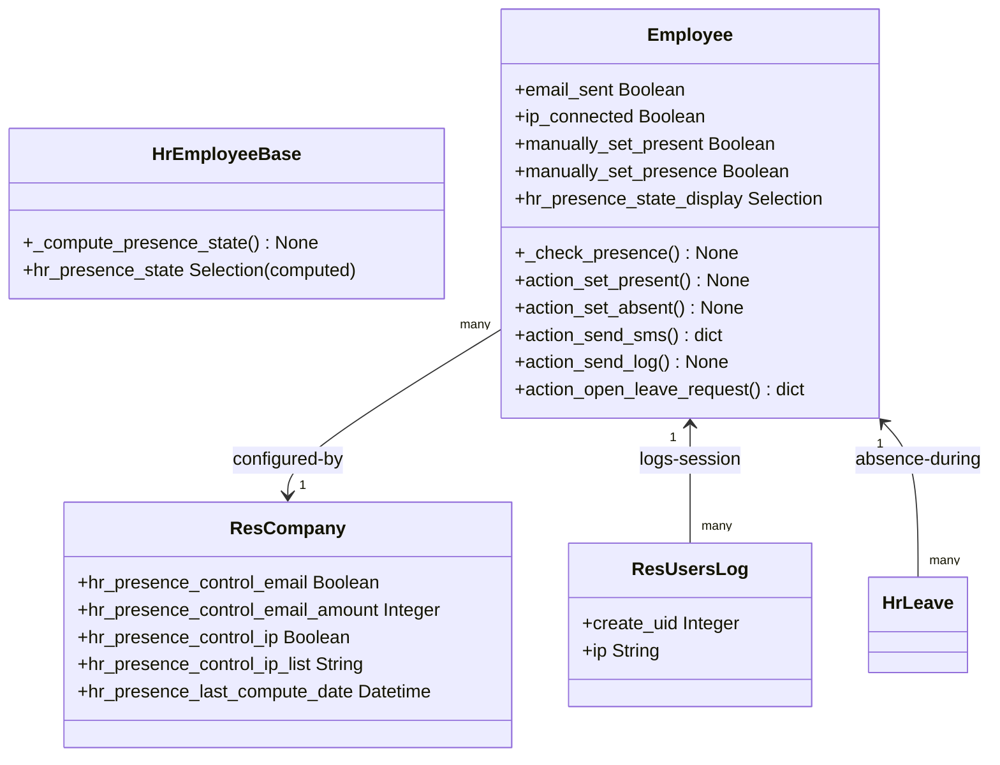

# C4 Code Level: HR Employee Presence Control

<!--
  Auto-generated by the c4-code agent. One file per source directory.
  Refreshed on /banyan-c4 reruns whenever the directory's content hash changes.
  Do NOT hand-edit; edits will be overwritten on next refresh.
-->

## Generated By

- **Agent**: c4-code (Haiku)
- **Run ID**: banyan-c4-20260701-init
- **Generated**: 2026-07-01T00:00:00Z
- **Source Directory**: addons/hr_presence
- **Content Hash**: 8c3f7e2a1b9d4a5f6e7c8d9e0f1a2b3c

## Overview

- **Name**: HR Employee Presence Control
- **Description**: Detect and track employee presence based on system activity (IP address, email sent, logged-in sessions) with manual override and absence notification capabilities
- **Location**: addons/hr_presence — 9 Python files, ~600 lines
- **Language**: Python (Odoo ORM models, scheduled actions via ir.cron)
- **Purpose**: Provides automated presence/absence detection integrating IP geolocation, email activity, and user session logs; enables SMS/message notifications for unjustified absences

## Code Elements

### Functions / Methods

- `_check_presence() → None`
  - **Description**: Scheduled cron job that checks IP/email activity and sets employee presence state for the current day
  - **Location**: `models/hr_employee.py:30`
  - **Visibility**: internal (model method, called by ir.cron)
  - **Dependencies**: res.company (config), res.users.log (IP), mail.message (email), datetime/Datetime

- `_compute_presence_state() → None`
  - **Description**: Compute current hr_presence_state based on working hours, manual flags, and activity checks
  - **Location**: `models/hr_employee_base.py:9`
  - **Visibility**: internal
  - **Dependencies**: Odoo ORM (api.depends), user.im_status, company configuration

- `get_presence_server_action_data() → List[dict]`
  - **Description**: Retrieve all presence management server action definitions (present/absent/log/SMS/time-off)
  - **Location**: `models/hr_employee.py:79`
  - **Visibility**: public
  - **Dependencies**: ir.actions.server, xmlid references

- `_action_set_manual_presence(state: bool) → None`
  - **Description**: Internal method to set manual presence state with permission check
  - **Location**: `models/hr_employee.py:92`
  - **Visibility**: internal
  - **Dependencies**: Odoo ORM, user permission checks (hr.group_hr_manager)

- `action_set_present() → None`
  - **Description**: User action to manually mark employee as present
  - **Location**: `models/hr_employee.py:101`
  - **Visibility**: public (exposed to UI)
  - **Dependencies**: _action_set_manual_presence(True)

- `action_set_absent() → None`
  - **Description**: User action to manually mark employee as absent
  - **Location**: `models/hr_employee.py:104`
  - **Visibility**: public (exposed to UI)
  - **Dependencies**: _action_set_manual_presence(False)

- `action_open_leave_request() → dict`
  - **Description**: Open leave request creation dialog (single employee) or mass wizard (multiple)
  - **Location**: `models/hr_employee.py:112`
  - **Visibility**: public (UI action)
  - **Dependencies**: hr.leave, hr.leave.generate.multi.wizard models

- `action_send_sms() → dict`
  - **Description**: Open SMS composition dialog for absence notification (permission check required)
  - **Location**: `models/hr_employee.py:138`
  - **Visibility**: public (UI action)
  - **Dependencies**: sms.composer, hr_presence.sms_template_presence

- `action_send_log() → None`
  - **Description**: Post a timestamped note on employee record documenting their current presence state
  - **Location**: `models/hr_employee.py:162`
  - **Visibility**: public (UI action)
  - **Dependencies**: employee.message_post()

- `write(vals) → bool` (Employee presence fields)
  - **Description**: Auto-set manually_set_present flag when hr_presence_state_display is changed to 'present'
  - **Location**: `models/hr_employee.py:107`
  - **Visibility**: internal
  - **Dependencies**: Odoo ORM

### Classes / Modules

- **`HrEmployeeBase`** (inherited abstract model)
  - **Location**: `models/hr_employee_base.py:5`
  - **Methods**: `_compute_presence_state()`
  - **Inherits**: hr.employee.base
  - **Dependencies**: Company IP/email config, hr_holidays (leave integration), user session tracking
  - **Purpose**: Provides computed presence state based on activity and working hours

- **`Employee`** (inherited)
  - **Location**: `models/hr_employee.py:13`
  - **Methods**: `_check_presence()`, `get_presence_server_action_data()`, `_action_set_manual_presence()`, `action_set_present()`, `action_set_absent()`, `action_open_leave_request()`, `action_send_sms()`, `action_send_log()`, `write()`
  - **Inherits**: hr.employee.base
  - **Added Fields**:
    - `email_sent` (Boolean, default=False) — today's email activity detected
    - `ip_connected` (Boolean, default=False) — today's IP activity detected
    - `manually_set_present` (Boolean, default=False) — manual override flag
    - `manually_set_presence` (Boolean, default=False) — manual override active
    - `hr_presence_state_display` (Selection stored) — visible state in kanban (out_of_working_hour / present / absent)
  - **Dependencies**: res.company, res.users.log, mail.message, hr.leave, sms.composer, ir.actions.server

- **`ResUsersLog`** (inherited)
  - **Location**: `models/res_users_log.py:6`
  - **Methods**: (none — simple model extension)
  - **Inherits**: res.users.log
  - **Added Fields**: create_uid (Integer indexed), ip (Char)
  - **Purpose**: Tracks login IP addresses for employee presence detection

### Constants / Configuration

- **Company Settings** (res.company fields, not enumerated in code but referenced):
  - `hr_presence_control_email` — Enable email-based presence detection
  - `hr_presence_control_email_amount` — Email threshold for daily presence
  - `hr_presence_control_ip` — Enable IP-based presence detection
  - `hr_presence_control_ip_list` — Comma-separated allowed IP addresses (office IPs)
  - `hr_presence_last_compute_date` — Timestamp of last presence check

## Dependencies

### Internal

- **hr** — Core employee model extended with presence fields
- **hr_holidays** — Leave detection to mark employees absent during leave periods
- **mail** — Mail message tracking for email activity detection
- **sms** — SMS composition and templates for absence notifications
- **ir.actions.server** — Server actions for presence management workflows
- **res.users.log** — User session logging with IP tracking

### External

- **Python standard library**:
  - `logging` — Diagnostic logging
  - `ast.literal_eval` — Config parsing (IP lists)
  - `datetime.Datetime` — Timestamp operations for daily reset and hour boundaries

## Relationships

## Notes for Higher-Level Synthesis

- **Primary Component**: Presence & Absence Detection — integrates activity signals (IP, email, session) to infer employee presence state
- **Boundary Code**: Heavy UI exposure (action_set_present, action_send_sms, action_open_leave_request); presence state is displayed in HR dashboards/kanban
- **Integration Points**: Depends on hr_holidays for leave-based absence; consumes mail.message and res.users.log for activity detection; provides SMS/messaging integration
- **Scheduled Job**: _check_presence() runs as ir.cron to perform daily presence computation; resets activity flags daily
- **Permission Model**: All actions except _check_presence require 'hr.group_hr_manager' permission (sensitive: manual presence override, SMS sending)
- **Data Quality**: Email threshold and IP list are configurable per company; presence state updates daily (not real-time)
- **Audit Trail**: message_post() creates timestamped chatter entries for presence changes (non-repudiation)
