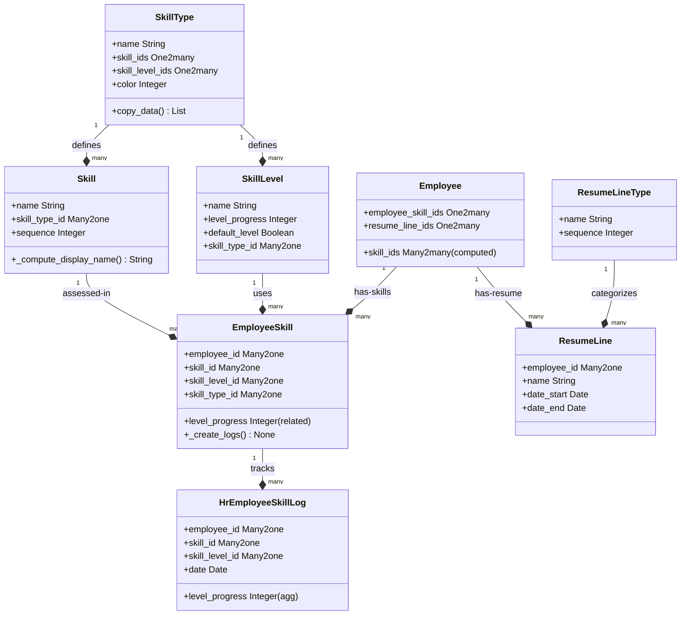

# C4 Code Level: HR Skills Management

<!--
  Auto-generated by the c4-code agent. One file per source directory.
  Refreshed on /banyan-c4 reruns whenever the directory's content hash changes.
  Do NOT hand-edit; edits will be overwritten on next refresh.
-->

## Generated By

- **Agent**: c4-code (Haiku)
- **Run ID**: banyan-c4-20260701-init
- **Generated**: 2026-07-01T00:00:00Z
- **Source Directory**: addons/hr_skills
- **Content Hash**: 487f2c5d9e1a8b4e2f6a3c1d5e7b9f0a

## Overview

- **Name**: HR Skills Management
- **Description**: Manage skills, knowledge, and resume information for employees with competency tracking, skill hierarchies, and resume line management
- **Location**: addons/hr_skills — 25 Python files, ~2500 lines
- **Language**: Python (Odoo ORM models, reports, wizards)
- **Purpose**: Provides employee skill matrix capabilities, competency tracking for recruitment matching, resume/CV management, and historical skill progression logging

## Code Elements

### Functions / Methods

- `_compute_display_name() → str`
  - **Description**: Contextual display of skill names with type suffix in skill dropdown
  - **Location**: `models/hr_skill.py:19`
  - **Visibility**: internal
  - **Dependencies**: Odoo ORM (api.depends, api.depends_context)

- `_compute_skill_id() → None`
  - **Description**: Auto-select first skill when skill type changes
  - **Location**: `models/hr_employee_skill.py:41`
  - **Visibility**: internal
  - **Dependencies**: Odoo ORM (api.depends)

- `_compute_skill_level_id() → None`
  - **Description**: Auto-select default skill level or first level when skill changes
  - **Location**: `models/hr_employee_skill.py:49`
  - **Visibility**: internal
  - **Dependencies**: Odoo ORM

- `_check_skill_type() → None`
  - **Description**: Validate skill belongs to selected skill type (constraint)
  - **Location**: `models/hr_employee_skill.py:28`
  - **Visibility**: internal
  - **Dependencies**: Odoo ORM (api.constrains, ValidationError)

- `_check_skill_level() → None`
  - **Description**: Validate skill level belongs to selected skill type (constraint)
  - **Location**: `models/hr_employee_skill.py:34`
  - **Visibility**: internal
  - **Dependencies**: Odoo ORM

- `_create_logs() → None`
  - **Description**: Create historical skill progression log entries when skills are created/updated
  - **Location**: `models/hr_employee_skill.py:62`
  - **Visibility**: internal
  - **Dependencies**: hr.employee.skill.log model, collections.defaultdict

- `create(vals_list) → List[Record]`
  - **Description**: Override create to auto-generate skill logs after employee skills are created
  - **Location**: `models/hr_employee_skill.py:99`
  - **Visibility**: internal
  - **Dependencies**: Odoo ORM (api.model_create_multi)

- `write(vals) → bool`
  - **Description**: Override write to update skill logs when skills change
  - **Location**: `models/hr_employee_skill.py:104`
  - **Visibility**: internal
  - **Dependencies**: Odoo ORM

- `_compute_skill_ids() → None`
  - **Description**: Denormalize skills from employee_skill_ids into Many2many field
  - **Location**: `models/hr_employee.py:16`
  - **Visibility**: internal
  - **Dependencies**: Odoo ORM (api.depends)

- `_compute_day_week_string() → None`
  - **Description**: Format exceptional location date as day-of-week string
  - **Location**: (not in this addon — referenced in hr_homeworking)
  - **Visibility**: internal
  - **Dependencies**: Odoo tools.format_date

- `create(vals_list) → List[Record]` (SkillLevel)
  - **Description**: Enforce single default level per skill type on create
  - **Location**: `models/hr_skill_level.py:30`
  - **Visibility**: internal
  - **Dependencies**: Odoo ORM (api.model_create_multi)

- `write(vals) → bool` (SkillLevel)
  - **Description**: Enforce single default level per skill type on update
  - **Location**: `models/hr_skill_level.py:37`
  - **Visibility**: internal
  - **Dependencies**: Odoo ORM

- `copy_data(default=None) → List[dict]` (SkillType)
  - **Description**: Custom copy logic for skill types (adds " (copy)" suffix, resets color)
  - **Location**: `models/hr_skill_type.py:21`
  - **Visibility**: internal
  - **Dependencies**: Odoo ORM

- `_load_scenario() → None`
  - **Description**: Load demo scenario data for employees on initial setup
  - **Location**: `models/hr_employee.py:44`
  - **Visibility**: internal
  - **Dependencies**: Odoo convert module, XML scenario files

### Classes / Modules

- **`Skill`** — Core skill entity in a skill type hierarchy
  - **Location**: `models/hr_skill.py:7`
  - **Methods**: `_compute_display_name()`
  - **Inherits**: models.Model → odoo.models.Model
  - **Fields**: name (Char), sequence (Integer), skill_type_id (Many2one), color (related)
  - **Dependencies**: hr.skill.type model

- **`SkillLevel`** — Proficiency level within a skill type (0-100% progress)
  - **Location**: `models/hr_skill_level.py:7`
  - **Methods**: `create()`, `write()`, `_compute_display_name()`
  - **Inherits**: models.Model
  - **Fields**: name, level_progress (0-100), default_level (boolean), skill_type_id
  - **Constraints**: level_progress BETWEEN 0 AND 100; unique default per skill_type
  - **Dependencies**: hr.skill.type model

- **`SkillType`** — Skill category (e.g. "Languages", "Technical Skills")
  - **Location**: `models/hr_skill_type.py:7`
  - **Methods**: `_get_default_color()`, `copy_data()`
  - **Inherits**: models.Model
  - **Fields**: active, name, skill_ids (One2many), skill_level_ids (One2many), color
  - **Dependencies**: hr.skill, hr.skill.level models (reverse relations)

- **`EmployeeSkill`** — Skill assessment for a specific employee
  - **Location**: `models/hr_employee_skill.py:9`
  - **Methods**: `_compute_skill_id()`, `_compute_skill_level_id()`, `_check_skill_type()`, `_check_skill_level()`, `_compute_display_name()`, `create()`, `write()`, `_create_logs()`
  - **Inherits**: models.Model
  - **Fields**: employee_id, skill_id, skill_level_id, skill_type_id, level_progress (related), color (related)
  - **Constraints**: unique (employee_id, skill_id); domain/range validation on skill and level
  - **Dependencies**: hr.employee, hr.skill, hr.skill.level, hr.skill.type, hr.employee.skill.log

- **`HrEmployeeSkillLog`** — Historical record of employee skill level on a date
  - **Location**: `models/hr_employee_skill_log.py:7`
  - **Methods**: (none — data-only model)
  - **Inherits**: models.Model
  - **Fields**: employee_id, skill_id, skill_level_id, skill_type_id, level_progress (related, aggregator=avg), date, department_id
  - **Constraints**: unique (employee_id, department_id, skill_id, date)
  - **Dependencies**: hr.employee, hr.skill, hr.skill.level, hr.skill.type

- **`ResumeLine`** — Career/education timeline entry on employee profile
  - **Location**: `models/hr_resume_line.py:7`
  - **Methods**: (none — simple model)
  - **Inherits**: models.Model
  - **Fields**: employee_id, name, date_start, date_end, description (HTML), line_type_id, display_type
  - **Constraints**: date_start <= date_end
  - **Dependencies**: hr.employee, hr.resume.line.type

- **`ResumeLineType`** — Category for resume entries (e.g. "Experience", "Education")
  - **Location**: `models/hr_resume_line_type.py:7`
  - **Methods**: (none)
  - **Inherits**: models.Model
  - **Fields**: name, sequence
  - **Dependencies**: (none)

- **`Employee`** (inherited)
  - **Location**: `models/hr_employee.py:7`
  - **Methods**: `_compute_skill_ids()`, `create()`, `write()`, `_load_scenario()`
  - **Inherits**: hr.employee
  - **Added Fields**: resume_line_ids (One2many), employee_skill_ids (One2many), skill_ids (Many2many computed)
  - **Dependencies**: hr.resume.line, hr.employee.skill models; hr_skills scenario XML

### Constants / Configuration

- `DAYS` — Weekday field mapping for work location scheduling (line 5 in hr_homeworking)
  - **Purpose**: Maps day names to hr_employee location fields
  - **Used in**: hr_homeworking module (not hr_skills, but related HR scheduling)

## Dependencies

### Internal

- **hr** — Core employee, user, and base HR models; inherited by this addon
- **hr.work.location** — Work location model (defined in base HR, extended by hr_homeworking)
- **hr.department** — Department tracking for skill logs
- **hr.employee.base** — Abstract base for employee fields

### External

- **Python standard library**:
  - `collections.defaultdict` — Efficient grouping in _create_logs()
  - `random.randint` — Color assignment for skill types

## Relationships

## Notes for Higher-Level Synthesis

- **Primary Component**: Employee Skills & Competency Management — core domain entity tracking employee skill assessments, levels, and historical progression
- **Boundary Code**: Resume line editing is UI-only; skill assessment is domain-facing (competency tracking for recruitment, performance management)
- **Integration**: Strongly cohesive with hr.employee; may be grouped with recruitment if recruitment module uses skill matching. Shares employee context with hr_homeworking and hr_presence.
- **Data Patterns**: Audit trail via EmployeeSkillLog (historical snapshot on each change); default-level constraint ensures consistent proficiency baseline per skill type
- **External Touch**: Reports & wizards handle CV generation and skill import/export (not core to code level — handled by reports/ and wizard/ subdirs)
