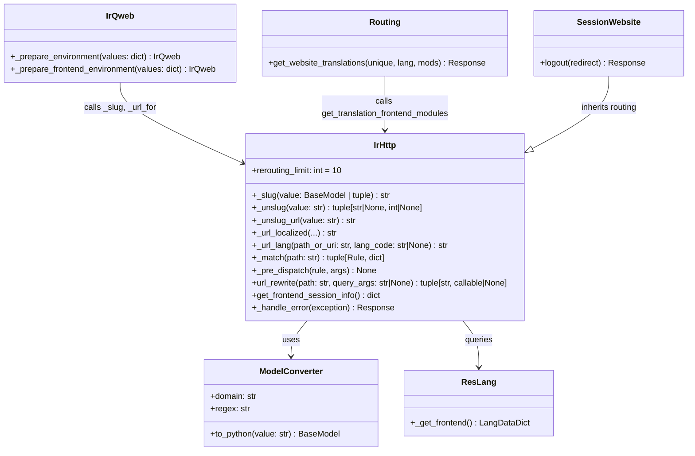

# C4 Code Level: HTTP Routing

<!--
  Auto-generated by the c4-code agent. One file per source directory.
  Refreshed on /banyan-c4 reruns whenever the directory's content hash changes.
  Do NOT hand-edit; edits will be overwritten on next refresh.
-->

## Generated By

- **Agent**: c4-code (Haiku)
- **Run ID**: banyan-c4-20260701-init
- **Generated**: 2026-07-01T08:15:00Z
- **Source Directory**: addons/http_routing
- **Content Hash**: c1e3b9f4d2a6e8k2

## Overview

- **Name**: Multi-Language HTTP Routing & URL Management
- **Description**: Advanced HTTP routing layer supporting multi-language URL prefixing, SEO-friendly slug-based routing, and intelligent language detection & redirection
- **Location**: addons/http_routing — 4 model files, 1 controller file, 1 test file, ~900 lines
- **Language**: Python (Odoo ORM models, controllers)
- **Purpose**: Foundational routing extension for website and portal modules. Handles multi-lang URL rewriting, slug-based record matching, breadcrumb generation, and transparent language resolution via cookies, context, and bot detection.

## Code Elements

### Classes / Models

- **`ModelConverter`** (http_routing) — Custom Werkzeug URL converter for record lookups
  - **Location**: `models/ir_http.py:30`
  - **Methods**:
    - `__init__(url_map, model=False, domain='[]')` — Initialize with model name and optional domain filter
    - `to_python(value: str) → models.BaseModel` — Convert URL slug/ID to record; supports negative IDs via abs() fallback
  - **Inherits**: `ir_http.ModelConverter` (Werkzeug base)
  - **Key Attributes**: `domain` (ORM domain clause), `regex` (slug pattern `_UNSLUG_ROUTE_PATTERN`)
  - **Dependencies**: Base ModelConverter, ORM record lookup

- **`IrHttp`** (http_routing) — Core HTTP request routing and language handling
  - **Location**: `models/ir_http.py:45`
  - **Key Methods**:
    - **Slug tools**:
      - `_slug(value: BaseModel | tuple[int, str]) → str` — Generate SEO-friendly slug (e.g., "my-blog-1")
      - `_unslug(value: str) → tuple[str|None, int|None]` — Extract slug and ID from URL segment
      - `_unslug_url(value: str) → str` — Rewrite URL path by extracting IDs from slug segments
      - `_get_converters() → dict[str, type]` — Register custom converters (includes ModelConverter)
    - **Language tools**:
      - `_url_localized(url: str, lang_code: str, canonical_domain=None, prefetch_langs=False, force_default_lang=False) → str` — Adapt URL for target language
      - `_url_lang(path_or_uri: str, lang_code: str|None) → str` — Add/remove lang prefix, respecting defaults
      - `_url_for(url_from: str, lang_code: str|None) → str` — Apply URL rewriting for language
      - `_is_multilang_url(local_url: str, lang_url_codes: list[str]|None) → bool` — Check if URL supports translation
      - `_get_default_lang() → LangData` — Resolve default language from partner or first active lang
      - `get_nearest_lang(lang_code: str) → str` — Find closest language match (e.g., fr_BE → fr)
    - **Routing & dispatch**:
      - `_match(path: str) → tuple[Rule, dict]` — Main router; implements 9-step multi-lang logic (see docstring)
      - `_pre_dispatch(rule, args)` — URL slug sanitization, frontend context setup, SEO slug redirects
      - `_frontend_pre_dispatch()` — Set lang in request context, manage frontend_lang cookie
      - `url_rewrite(path: str, query_args: str|None) → tuple[str, callable|None]` — URL rewriting cache with method fallback
    - **Session & translation**:
      - `get_frontend_session_info() → dict` — Include translation URLs and hashes
      - `get_translation_frontend_modules() → list[str]` — List modules needing translations
      - `_get_translation_frontend_modules_domain() → list[tuple]` — Domain for extra translation modules
      - `_get_translation_frontend_modules_name() → list[str]` — Module names for translations
    - **Error handling**:
      - `_get_exception_code_values(exception) → tuple[int, dict]` — Map exception to HTTP code + context dict
      - `_get_values_500_error(env, values, exception) → dict` — Enrich 500 error context
      - `_get_error_html(env, code: int, values: dict) → tuple[int, str]` — Render error template
      - `_handle_error(exception) → Response` — Frontend-aware error handler with fallback pages
      - `_serve_fallback()` — Render nice 404/403 pages
  - **Inherits**: `ir.http` (abstract)
  - **Key Attributes**: `rerouting_limit = 10` (max redirect depth)
  - **Dependencies**: `ir.http`, `res.lang`, `ir.module.module`, Werkzeug routing, regex patterns
  - **Routing State**: Adds `request.is_frontend`, `request.is_frontend_multilang`, `request.lang` to request object

- **`IrQweb`** (http_routing) — Template environment extension for slug/URL helpers
  - **Location**: `models/ir_qweb.py:33`
  - **Methods**:
    - `_prepare_environment(values: dict) → IrQweb` — Add slug utilities to template context
    - `_prepare_frontend_environment(values: dict) → IrQweb` — Add URL localization helpers for frontend
  - **Inherits**: `ir.qweb`
  - **Template Context Additions**: `slug`, `unslug_url`, `url_for`, `url_localized`
  - **Dependencies**: `ir.http` methods

- **`ResLang`** (http_routing) — Language model extension
  - **Location**: `models/res_lang.py:7`
  - **Methods**:
    - `_get_frontend() → LangDataDict` — Return available frontend languages (active only)
  - **Inherits**: `res.lang`
  - **Dependencies**: Base `_get_active_by()` method

### Controllers

- **`Routing`** (controllers/main.py) — HTTP route handlers for website translations
  - **Location**: `controllers/main.py:10`
  - **Routes**:
    - `GET /website/translations/<unique>` — Retrieve website translation bundles
      - Method: `get_website_translations(unique, lang=None, mods=None)`
      - Returns: WebClient translations response
      - Auth: public, website-only
  - **Inherits**: `web.Home` controller

- **`SessionWebsite`** (controllers/main.py) — Session management for frontend
  - **Location**: `controllers/main.py:21`
  - **Routes**:
    - `GET /web/session/logout` — Logout with website redirect
      - Method: `logout(redirect='/odoo')`
      - Auth: inherits from base Session
      - Flags: website=True, multilang=False (no lang prefix), sitemap=False
  - **Inherits**: `web.Session` controller

### Constants & Patterns

- `_UNSLUG_RE` — Regex pattern for slug extraction: `(?:(\w{1,2}|\w[A-Za-z0-9-_]+?\w)-)?(-?\d+)`
- `_UNSLUG_ROUTE_PATTERN` — Werkzeug route pattern (same logic, no groups)
- `BAD_REQUEST` — Warning message for missing `request.is_frontend` attribute

## Multi-Language Routing Logic (_match step-by-step)

The `_match()` method implements a 9-case decision tree:

1. **Non-website endpoint** — Use as-is; set `request.is_frontend = False`
2. **No lang in URL, default lang requested** — Continue (no redirect)
3. **Missing lang in URL, user-agent is bot** — Continue; set `request.lang = default_lang`
4. **No lang in URL, non-redirectable request (POST)** — Continue as-is
5. **Missing lang, non-default lang preferred** — Redirect to `/{lang_code}{path}`
6. **Default lang in URL** — Redirect to remove lang prefix
7. **Lang alias in URL** — Redirect to canonical lang code (e.g., fr_FR → fr)
8. **Homepage with trailing slash** — Redirect to remove slash
9. **Valid lang in URL** — Rewrite URL to strip lang prefix, continue with lang context

## Dependencies

### Internal

- **`res.lang`** — Language records, frontend lang list, URL codes
- **`ir.http` (base)** — Session info, routing, error handling (superclass)
- **`ir.qweb` (base)** — Template rendering infrastructure
- **`ir.config_parameter`** — Configuration (via base)
- **`ir.module.module`** — Active module list for translations
- **`ir.default`** — User language default lookup
- **`ir.ui.view`** — Template rendering for errors

### External

- **`werkzeug.routing`** — URL routing, Rule matching, ModelConverter base
- **`werkzeug.urls`** — URL quoting, joining, unquoting
- **`werkzeug.exceptions`** — HTTPException, NotFound, MethodNotAllowed
- **`urllib.parse`** — URL parsing (urlparse)
- **`re` (regex)** — Pattern matching for slugs and lang detection
- **`logging`** — Debug/warning logging for routing decisions
- **`traceback`** — Exception stack traces in error pages

## Relationships

## Notes for Higher-Level Synthesis

- **Boundary component** — Pure HTTP/URL routing logic; handles translation between URL space and model space. No business rules. Controllers and website pages consume the `request.lang`, `_slug()`, `_url_localized()` APIs.
- **Multi-language foundation** — Core infrastructure for multi-language websites. Shared by website, portal, and any customer-facing module. Language resolution (URL prefix, cookie, context, default) is deterministic and testable.
- **SEO-driven slug generation** — `_slug()` produces human-readable URLs (e.g., "my-article-42") for better search rankings. Automatic 301 redirects when slugs don't match actual record names.
- **Transparent language context** — Request context is automatically updated with selected language; downstream models and templates use `request.lang` without knowing how it was resolved.
- **Error handling extension** — Overrides base HTTP error handler to serve pretty frontend 404/403 pages instead of default HTML. Supports fallback rendering if error template fails.
- **Caching-aware URL rewriting** — `url_rewrite()` uses `ormcache` for performance; must invalidate when routing config changes.
