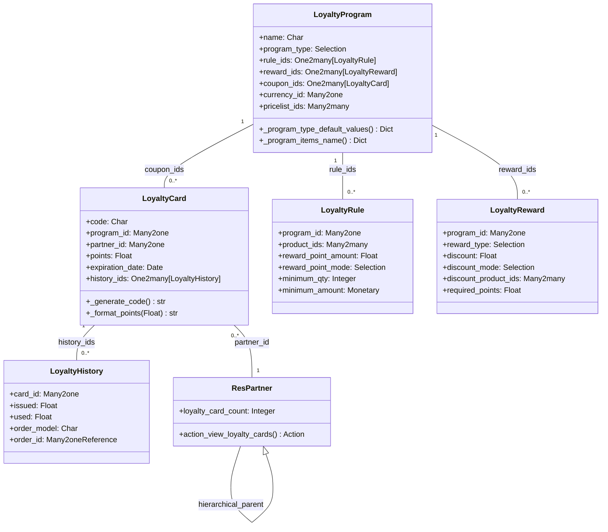

# C4 Code Level: Loyalty Base

<!--
  Auto-generated by the c4-code agent. One file per source directory.
  Refreshed on /banyan-c4 reruns whenever the directory's content hash changes.
  Do NOT hand-edit; edits will be overwritten on next refresh.
-->

## Generated By

- **Agent**: c4-code (Haiku)
- **Run ID**: banyan-c4-20260701-init
- **Generated**: 2026-07-01T00:00:00Z
- **Source Directory**: addons/loyalty
- **Content Hash**: b34a8c9f2e5d1a7c4f9e2b5d8a1c4f7e

## Overview

- **Name**: Loyalty & Coupons Base Module
- **Description**: Foundation for multi-channel loyalty programs (coupons, gift cards, eWallets, loyalty cards, promotional discounts, buy-x-get-y offers)
- **Location**: addons/loyalty — 21 files, 1965 lines
- **Language**: Python (Odoo 18.0 ORM models)
- **Purpose**: Provides core loyalty program engine with rule evaluation, reward calculation, card/coupon management, and cross-channel reuse by sale_loyalty and pos_loyalty modules

## Code Elements

### Classes / Models

- **`LoyaltyProgram`** — Master loyalty program configuration
  - **Location**: `models/loyalty_program.py:10`
  - **Methods**: `default_get()`, `_program_items_name()`, `_program_type_default_values()`, `_compute_coupon_count()`, `_compute_is_nominative()`, `_compute_is_payment_program()`, `_constrains_reward_ids()`, `_check_date_from_date_to()`, `_check_pricelist_currency()`
  - **Fields**: `name`, `active`, `company_id`, `currency_id`, `pricelist_ids`, `rule_ids`, `reward_ids`, `communication_plan_ids`, `program_type` (coupons/gift_card/loyalty/promotion/ewallet/promo_code/buy_x_get_y/next_order_coupons), `date_from`, `date_to`, `limit_usage`, `max_usage`, `applies_on` (current/future/both), `trigger` (auto/with_code), `portal_visible`, `coupon_ids`, `coupon_count`
  - **Constraints**: Check max_usage > 0 if limit_usage enabled; date_from <= date_to; at least one reward per program
  - **Dependencies**: Internal: loyalty.rule, loyalty.reward, loyalty.mail, loyalty.card, product.pricelist; External: Odoo base ORM

- **`LoyaltyCard`** — Customer wallet/coupon/voucher holder
  - **Location**: `models/loyalty_card.py:11`
  - **Methods**: `_generate_code()`, `_compute_display_name()`, `_compute_points_display()`, `_format_points()`, `_compute_use_count()`, `_contrains_code()`
  - **Fields**: `program_id` (Many2one loyalty.program), `partner_id`, `code` (unique), `points`, `expiration_date`, `use_count` (computed), `active`, `history_ids` (One2many to loyalty.history)
  - **Inheritance**: mail.thread (allows tracking)
  - **Dependencies**: loyalty.program, loyalty.history, res.partner

- **`LoyaltyReward`** — Reward definition (discount/free product)
  - **Location**: `models/loyalty_reward.py:11`
  - **Methods**: `default_get()`, `_get_discount_mode_select()`, `_compute_display_name()`, `_compute_description()`, `_compute_user_has_debug()`
  - **Fields**: `program_id`, `reward_type` (product/discount), `description`, `discount` (float), `discount_mode` (percent/per_order/per_point), `discount_applicability` (order/cheapest/specific), `discount_product_ids`, `required_points`, `active`
  - **Product Reward**: `reward_product_id`, `reward_product_qty`
  - **Dependencies**: loyalty.program, product.product, product.category

- **`LoyaltyRule`** — Trigger condition for earning points
  - **Location**: `models/loyalty_rule.py:10`
  - **Methods**: `default_get()`, `_get_reward_point_mode_selection()`, `_compute_mode()`, `_compute_code()`
  - **Fields**: `program_id`, `product_ids`, `product_category_id`, `product_domain`, `reward_point_amount`, `reward_point_mode` (order/money/unit), `reward_point_split`, `minimum_qty`, `minimum_amount`, `minimum_amount_tax_mode` (incl/excl), `mode` (auto/with_code), `code`
  - **Constraints**: reward_point_amount must be > 0
  - **Dependencies**: loyalty.program, product.product, product.category

- **`LoyaltyHistory`** — Transaction log for loyalty card points
  - **Location**: `models/loyalty_history.py:6`
  - **Methods**: `_get_order_portal_url()`, `_get_order_description()`
  - **Fields**: `card_id` (Many2one loyalty.card), `description`, `issued` (float), `used` (float), `order_model` (Char), `order_id` (Many2oneReference)
  - **Dependencies**: loyalty.card (cascade delete)

- **`CustomerPortalLoyalty`** — Portal controller for loyalty card access
  - **Location**: `controllers/portal.py:10`
  - **Methods**: `_prepare_home_portal_values()`, `_get_loyalty_searchbar_sortings()`, `portal_my_loyalty_card_history()`, `portal_my_loyalty_cards()`
  - **Routes**:
    - `GET /my/loyalty_card/<int:card_id>/history` — Loyalty card history with pagination
    - `GET /my/loyalty_card/<int:card_id>/history/page/<int:page>` — Paginated history view
  - **Dependencies**: portal.controllers.portal.CustomerPortal, loyalty.card, loyalty.history

- **`ResPartner` (inherited)** — Partner extensions for loyalty
  - **Location**: `models/res_partner.py:5`
  - **Methods**: `_compute_count_active_cards()`, `action_view_loyalty_cards()`
  - **Fields**: `loyalty_card_count` (computed, shows active cards with points)
  - **Dependencies**: loyalty.card

### Functions / API Methods

- `LoyaltyProgram._program_items_name()`
  - **Description**: Return localized names for program types (Coupons, Promos, Gift Cards, etc.)
  - **Location**: `models/loyalty_program.py:216`
  - **Visibility**: public (model method)
  - **Returns**: Dict[str, str] — program_type → localized label

- `LoyaltyProgram._program_type_default_values()`
  - **Description**: Return default field values when creating a new program of given type
  - **Location**: `models/loyalty_program.py:229`
  - **Visibility**: public (model method)
  - **Returns**: Dict with default rule_ids, reward_ids, communication_plan_ids, trigger, applies_on per type

- `LoyaltyCard._generate_code()`
  - **Description**: Generate unique barcode-compatible coupon code (044 + partial UUID)
  - **Location**: `models/loyalty_card.py:18`
  - **Visibility**: public (model method)
  - **Returns**: str — 18-char barcode-friendly code

- `LoyaltyCard._format_points(points: float) → str`
  - **Description**: Format points display using program's point_name or currency symbol
  - **Location**: `models/loyalty_card.py:71`
  - **Visibility**: internal
  - **Dependencies**: currency formatting from odoo.tools

- `ResPartner._compute_count_active_cards()`
  - **Description**: Count active (non-expired, points > 0) loyalty cards per partner and hierarchical parents
  - **Location**: `models/res_partner.py:14`
  - **Visibility**: internal (compute callback)

- `CustomerPortalLoyalty.portal_my_loyalty_card_history(card_id, page=1, sortby='date')`
  - **Description**: Render customer's loyalty card transaction history with sorting and pagination
  - **Location**: `controllers/portal.py:48`
  - **Visibility**: public (HTTP route)
  - **Parameters**: card_id (int), page (int, default 1), sortby (str: date/used/description/issued)
  - **Returns**: HTTP response rendering loyalty history template

### Constants / Configuration

- `INV_LINES_PER_STUB` — Deprecated field in account_check_printing, not used in loyalty
- Program type selections: `coupons`, `gift_card`, `loyalty`, `promotion`, `ewallet`, `promo_code`, `buy_x_get_y`, `next_order_coupons`
- Applies-on modes: `current` (redeem on order), `future` (create coupon for later), `both` (accumulate + redeem)
- Trigger modes: `auto` (automatic eligibility), `with_code` (requires promo code entry)

## Dependencies

### Internal

- **product.pricelist** — Programs are scoped to pricelists; currency must match
- **product.product** — Rules and rewards reference products (trigger products, discount items, gift products)
- **product.category** — Rules can filter by product category; rewards can apply to category
- **product.tag** — Rules can filter by product tag
- **res.partner** — Loyalty cards assigned to partners (customer wallet)
- **res.country, res.country.state** — Address data on partner
- **ir.sequence** — Not directly in loyalty, but used by account_check_printing
- **mail.template** — Communication plans send emails (gift card issuance, loyalty card creation)
- **portal** — Portal controller inheritance for customer self-service
- **account** — Manifest dependency (inherited by child modules sale_loyalty, pos_loyalty)

### External

- **odoo.exceptions** (UserError, ValidationError) — Constraint checking
- **odoo.tools** (format_amount) — Currency formatting for point display
- **uuid** — Code generation using uuid4 for barcode uniqueness
- **collections.defaultdict** — Internal data aggregation

## Relationships

## Notes for Higher-Level Synthesis

- **Belongs with**: sale_loyalty, pos_loyalty, pos_restaurant_loyalty, website_sale_loyalty (all inherit from loyalty base for program mechanics)
- **Boundary code**: CustomerPortalLoyalty translates HTTP requests to loyalty domain model
- **Pure utility**: No direct business domain; serves as engine for cross-channel loyalty (CRM, Sales, PoS)
- **Key patterns**: 
  - Program type → default values mapping (template pattern for variants)
  - Rule + Reward + Card = points accumulation and redemption flow
  - Portal visibility flag controls customer self-service exposure
  - Hierarchical partner support (parent-child card counting)
