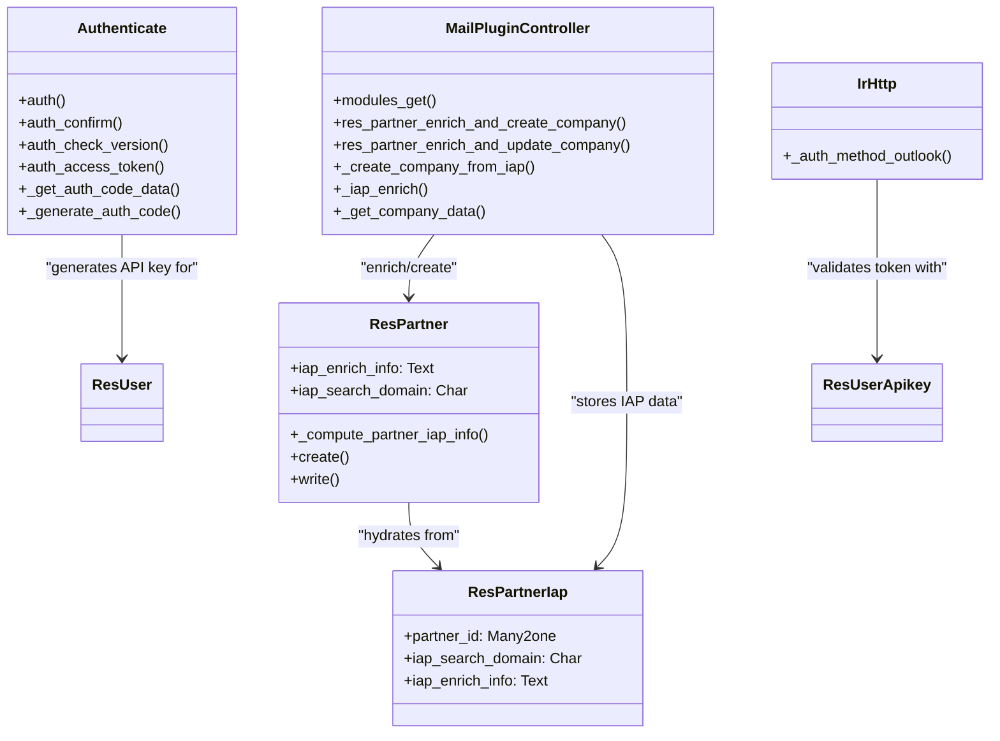

# C4 Code Level: Mail Plugin (mail_plugin)

<!--
  Auto-generated by the c4-code agent. One file per source directory.
  Refreshed on /banyan-c4 reruns whenever the directory's content hash changes.
  Do NOT hand-edit; edits will be overwritten on next refresh.
-->

## Generated By

- **Agent**: c4-code (Haiku)
- **Run ID**: banyan-c4-20260701-init
- **Generated**: 2026-07-01T00:00:00Z
- **Source Directory**: addons/mail_plugin (root level only)
- **Content Hash**: mail-plugin-root-init

## Overview

- **Name**: Mail Plugin (mail_plugin)
- **Description**: Gmail/Outlook sidebar integration for CRM lead creation and email logging from mail clients
- **Location**: addons/mail_plugin — 2 root-level Python files
- **Language**: Python 3 (Odoo 18.0)
- **Purpose**: Provides HTTP API endpoints and authentication for Gmail/Outlook plugins; enables IAP-based company enrichment and synchronization of email context into Odoo CRM

## Code Elements

### Root-Level Modules

- **`__init__.py`** — Package initialization importing models and controllers (`__init__.py:<line 4-5>`)
  - **Imports**: models, controllers submodules
  - **Purpose**: Module bootstrap for mail_plugin addon

- **`__manifest__.py`** — Addon metadata and dependencies (`__manifest__.py:<line 1-23>`)
  - **Key Fields**:
    - `name`: 'Mail Plugin'
    - `depends`: ['web', 'contacts', 'iap'] — core dependencies (Odoo web, CRM contacts, In-App Purchase)
    - `version`: '1.0'
    - `category`: 'Sales/CRM'
    - `sequence`: 5 (high priority)
    - `summary`: 'Allows integration with mail plugins'
    - `description`: "Integrate Odoo with your mailbox, get information about contacts directly inside your mailbox, log content of emails as internal notes"
    - `installable`: True
  - **Data files**: 3 XML manifest files (login view, IAP partner views, security/access rules)

## Internal Code Structure (by subdirectory)

### Models Layer

- **`models.IrHttp`** (inherits `ir.http`) — Authentication for Outlook/Gmail plugins
  - **Location**: `models/ir_http.py:<line 9-30>`
  - **Methods**:
    - `_auth_method_outlook()` (classmethod) — Outlook-specific auth method:
      1. Extract Bearer token from `Authorization` header
      2. Validate against `res.users.apikeys` with scope='odoo.plugin.outlook'
      3. Switch request context to API key user
      4. Apply user context (locale, company, etc.)
  - **Auth Flow**: HTTP Bearer token → API key lookup → user identity switch
  - **Dependencies**: odoo.http.request, res.users.apikeys, werkzeug.exceptions.BadRequest

- **`models.ResPartner`** (inherits `res.partner`) — CRM contact with IAP enrichment metadata
  - **Location**: `models/res_partner.py:<line 5-69>`
  - **Methods**:
    - `_compute_partner_iap_info()` — join with res.partner.iap to hydrate computed fields
    - `create(vals_list)` — auto-create res.partner.iap records for new partners with IAP data
    - `write(vals)` — sync iap_enrich_info/iap_search_domain to/from res.partner.iap child records
  - **Fields**:
    - `iap_enrich_info` (Text, computed): JSON-serialized IAP enrichment response (company data, phone, logo)
    - `iap_search_domain` (Char, computed): email domain used for IAP lookup
  - **Computed Field Logic**: hydrated from res.partner.iap for performance (denormalized, read-only on partner)
  - **Dependencies**: res.partner (base), res.partner.iap (child), iap

- **`models.ResPartnerIap`** — Technical model storing IAP enrichment responses
  - **Location**: `models/res_partner_iap.py:<line 7-28>`
  - **Purpose**: Separates heavy IAP data from res.partner; prevents re-enrichment of same company
  - **Fields**:
    - `partner_id` (Many2one, required, cascade): backref to res.partner
    - `iap_search_domain` (Char): email domain used for IAP enrichment (immutable reference)
    - `iap_enrich_info` (Text, readonly): JSON-serialized IAP response (company name, phone, logo URL, etc.)
  - **Constraint**: UNIQUE(partner_id) — one IAP record per partner
  - **Dependencies**: res.partner, iap

### Controllers Layer

- **`controllers.Authenticate`** — OAuth-like authentication for mail plugins
  - **Location**: `controllers/authenticate.py:<line 19-122>`
  - **Methods**:
    - `auth(values)` (GET /mail_plugin/auth, auth=user) — render auth consent form; validate internal user; show plugin name + requested scope
    - `auth_confirm(scope, friendlyname, redirect, info, do, **kw)` (POST /mail_plugin/auth/confirm, auth=user) — handle consent form submission:
      1. If do=1: generate temporary auth code (valid 3 min), redirect to plugin with code in URL params
      2. If do=0: deny (success=0), redirect to plugin without code
    - `auth_check_version()` (POST /mail_plugin/auth/check_version, auth=none, CORS) — return 1 (version check endpoint for older plugin compatibility)
    - `auth_access_token(auth_code, **kw)` (POST /mail_plugin/auth/access_token, auth=none, CORS) — exchange temporary auth code for persistent access token:
      1. Validate auth code signature (HMAC-SHA256 with odoo.tools.misc.hmac)
      2. Check 3-minute expiration
      3. Generate res.users.apikeys entry with 1-day TTL
      4. Return access_token to plugin
    - `_get_auth_code_data(auth_code)` — decode Base64-encoded auth code, verify HMAC signature, validate timestamp
    - `_generate_auth_code(scope, name)` — create signed Base64 auth code with scope, name, UID, timestamp; valid 3 minutes
  - **Auth Flow**:
    1. Plugin opens `/mail_plugin/auth?...` (requires Odoo login)
    2. User sees consent form, clicks "Allow"
    3. Form POSTs to `/mail_plugin/auth/confirm`, receives temporary code in URL
    4. Plugin calls `/mail_plugin/auth/access_token?auth_code=...` (CORS, no auth)
    5. Odoo returns persistent API key with odoo.plugin.outlook scope
    6. Plugin stores API key, uses Bearer token in future requests
  - **Security**: HMAC signature + timestamp validation, 3-minute code TTL, 1-day API key TTL
  - **Dependencies**: odoo.tools.misc.hmac, res.users.apikeys, werkzeug, base64, json, datetime, hmac

- **`controllers.MailPluginController`** — API endpoints for Gmail/Outlook integration
  - **Location**: `controllers/mail_plugin.py:<line 19-100+>`
  - **Methods**:
    - `modules_get()` (GET /mail_client_extension/modules/get, auth=outlook) — return ['contacts', 'crm'] (deprecated, legacy support)
    - `res_partner_enrich_and_create_company(partner_id)` (POST /mail_plugin/partner/enrich_and_create_company, auth=outlook) — user clicked "Create Company" on a contact:
      1. Lookup partner by ID
      2. Validate not already linked to a company
      3. Extract email domain
      4. Call IAP enrichment service (company data, phone, logo)
      5. Create new res.partner with company data
      6. Link contact to new company (write parent_id)
      7. Return company data + enrichment status
    - `res_partner_enrich_and_update_company(partner_id)` (POST /mail_plugin/partner/enrich_and_update_company, auth=outlook) — enrich existing company:
      1. Lookup partner by ID, validate is_company=True
      2. Extract email domain
      3. Call IAP enrichment
      4. Update phone if missing
      5. Update logo if missing
      6. Store full enrichment response as JSON
      7. Return updated company data
    - `_create_company_from_iap(normalized_email)` — create new company from IAP enrichment (name, phone, logo, etc.)
    - `_iap_enrich(domain)` — call IAP service for domain enrichment
    - `_get_company_data(company)` — serialize company record to response JSON
  - **Auth**: Outlook Bearer token (via _auth_method_outlook)
  - **CORS**: enabled for cross-origin requests from mail plugin sidebar
  - **Dependencies**: res.partner, res.partner.iap, iap_tools, requests, json, odoo.tools.email_domain_extract

## Dependencies

### Internal Dependencies

- **contacts** — base CRM contact/company model (res.partner)
- **iap** — In-App Purchase service framework (iap.account, iap_tools for enrichment API)
- **web** — Odoo web framework (HTTP routing, auth methods)

### External Dependencies

- **werkzeug** — HTTP handling (exceptions.Forbidden/BadRequest, werkzeug.exceptions, werkzeug.urls)
- **requests** — HTTP client for IAP service calls (company logo fetch)
- **odoo** — core Odoo framework (fields, models, api decorators, http routing, tools.misc.hmac, tools.email_domain_extract)
- **json** — JSON serialization for auth tokens and IAP responses
- **base64** — Base64 encoding for auth code signing
- **datetime, hmac** — timestamp/signature generation and validation
- **logging** — structured logging
- **markupsafe.Markup** — HTML escaping for UI rendering
- **odoo.addons.iap.tools.iap_tools** — IAP service client abstraction

## Relationships

## Notes for Higher-Level Synthesis

- **Boundary code**: Primary integration point between Gmail/Outlook sidebar plugins and Odoo backend; handles plugin authentication (3-stage OAuth-like flow), external API calls to IAP enrichment service, and HTTP/CORS routing
- **Belongs with**: CRM component — extends res.partner contact model; enriches company data via external IAP service; enables email-driven lead creation
- **Key business rules**: Company enrichment prevents duplicate lookups (stored in res.partner.iap); API key scoped to 'odoo.plugin.outlook'; phone/logo updates skipped if already populated on contact (user data preserved); 3-minute auth code TTL, 1-day API key TTL
- **External integrations**: IAP (In-App Purchase) enrichment service for company data lookup by email domain; Outlook/Gmail plugins consume REST API with Bearer token auth
- **Architecture pattern**: Deferred loading (ResPartnerIap separates heavy JSON from res.partner); stateless API (no session cookies, Bearer token auth); CORS-enabled for plugin sidebar cross-origin requests
