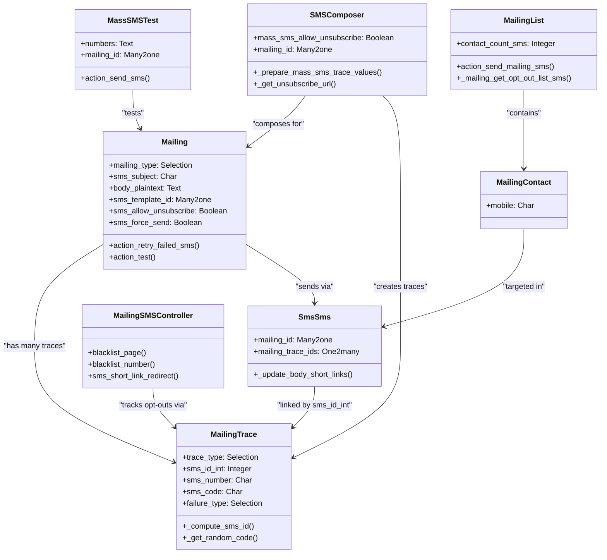

# C4 Code Level: SMS Marketing (mass_mailing_sms)

<!--
  Auto-generated by the c4-code agent. One file per source directory.
  Refreshed on /banyan-c4 reruns whenever the directory's content hash changes.
  Do NOT hand-edit; edits will be overwritten on next refresh.
-->

## Generated By

- **Agent**: c4-code (Haiku)
- **Run ID**: banyan-c4-20260701-init
- **Generated**: 2026-07-01T00:00:00Z
- **Source Directory**: addons/mass_mailing_sms (root level only)
- **Content Hash**: mass-mailing-sms-root-init

## Overview

- **Name**: SMS Marketing (mass_mailing_sms)
- **Description**: Design, send and track SMS marketing campaigns integrated with Odoo's mass mailing framework
- **Location**: addons/mass_mailing_sms — 2 root-level Python files
- **Language**: Python 3 (Odoo 18.0)
- **Purpose**: Extends mass_mailing module to support SMS as a communication channel; handles SMS campaign creation, contact list management, opt-out tracking, and SMS delivery statistics

## Code Elements

### Root-Level Modules

- **`__init__.py`** — Package initialization importing controllers, models, and wizards (`__init__.py:<line 4-6>`)
  - **Imports**: controllers, models, wizard submodules
  - **Purpose**: Module bootstrap for mass_mailing_sms addon

- **`__manifest__.py`** — Addon metadata and dependencies (`__manifest__.py:<line 1-46>`)
  - **Key Fields**:
    - `name`: 'SMS Marketing'
    - `depends`: ['portal', 'mass_mailing', 'sms'] — core dependencies
    - `version`: '1.1'
    - `category`: 'Marketing/Email Marketing'
    - `application`: True — installable as standalone app
  - **Data files**: 23 XML manifest files (views, security, reports, wizards, demo data)
  - **Assets**: web.assets_backend and web.assets_tests (static JS/CSS)

## Internal Code Structure (by subdirectory)

### Models Layer

- **`models.Mailing`** (inherits `mailing.mailing`) — SMS-specific mailing campaign extensions
  - **Location**: `models/mailing_mailing.py:<line 16-150+>`
  - **Methods**:
    - `default_get(fields)` — enforce keep_archives for SMS mailings
    - `_compute_medium_id()` — set SMS UTM medium when mailing_type='sms'
    - `_compute_body_plaintext()` — extract body from sms_template_id
    - `_compute_sms_has_iap_failure()` — detect SMS credit/account failures
    - `create(vals_list)` — map sms_subject → subject on creation
    - `action_retry_failed()` — retry failed SMS deliveries
    - `action_retry_failed_sms()` — delete failed traces and resend
    - `action_test()` — launch SMS test wizard (mailing.sms.test dialog)
    - `_action_view_traces_filtered(view_filter)` — SMS-specific trace views
    - `action_buy_sms_credits()` — redirect to IAP credit purchase
  - **Fields**:
    - `mailing_type` (Selection): added 'sms' choice
    - `sms_subject` (Char): alias for subject with SMS-specific label
    - `body_plaintext` (Text): SMS body, computed from sms_template_id
    - `sms_template_id` (Many2one): ref to sms.template
    - `sms_has_insufficient_credit` (Boolean): computed IAP failure flag
    - `sms_has_unregistered_account` (Boolean): computed IAP account flag
    - `sms_force_send` (Boolean): bypass queue, send immediately
    - `sms_allow_unsubscribe` (Boolean): include opt-out link in SMS
    - `ab_testing_sms_winner_selection` (Selection): A/B test winner metric (related to campaign)
    - `ab_testing_mailings_sms_count` (Integer): A/B test SMS count
  - **Dependencies**: link_tracker.models.link_tracker, utm.medium, mailing.trace, sms.sms

- **`models.MailingTrace`** (inherits `mailing.trace`) — SMS delivery statistics
  - **Location**: `models/mailing_trace.py:<line 10-100>`
  - **Constants**:
    - `CODE_SIZE = 3` — opt-out link code length
  - **Methods**:
    - `_compute_sms_id()` — map sms_id_int to sms.sms record (handles deleted SMS)
    - `create(values_list)` — auto-generate random opt-out code per SMS trace
    - `fields_get(allfields, attributes)` — update field selections for Twilio-specific error types
  - **Fields**:
    - `trace_type` (Selection): added 'sms' choice
    - `sms_id` (Many2one): computed ref to sms.sms (nullable, record may be deleted)
    - `sms_id_int` (Integer): SMS ID stored separately (allows deletion independence)
    - `sms_tracker_ids` (One2many): child SMS tracker records
    - `sms_number` (Char): recipient phone number
    - `sms_code` (Char): unique opt-out link code
    - `failure_type` (Selection): added 15 SMS-specific failure types (missing number, format, credit, country, registration, server, blacklist, duplicate, opt-out, expired, invalid destination, not allowed, not delivered, rejected, Twilio-specific)
  - **Dependencies**: mailing.trace, sms.sms, sms.tracker

- **`models.SmsSms`** (inherits `sms.sms`) — SMS message with mailing context
  - **Location**: `models/sms_sms.py:<line 10-34>`
  - **Methods**:
    - `_update_body_short_links()` — append SMS ID to shortened URLs for click tracking
  - **Fields**:
    - `mailing_id` (Many2one): backref to parent mailing campaign
    - `mailing_trace_ids` (One2many): statistics records (linked via sms_id_int, not FK)
  - **Dependencies**: sms.sms (base), link_tracker, mailing.trace

- **`models.MailingContact`** (inherits `mailing.contact`) — SMS recipient contact
  - **Location**: `models/mailing_contact.py:<line 7-12>`
  - **Fields**:
    - `mobile` (Char): phone number for SMS targeting
  - **Mixins**: mail.thread.phone
  - **Dependencies**: mailing.contact

- **`models.MailingList`** (inherits `mailing.list`) — SMS-capable distribution list
  - **Location**: `models/mailing_list.py:<line 7-80+>`
  - **Methods**:
    - `action_view_mailings()` — SMS-specific mailing list views (context: mailing_sms=True)
    - `action_view_contacts_sms()` — filter contacts with valid SMS numbers
    - `action_send_mailing_sms()` — launch SMS composer with default list
    - `_get_contact_statistics_fields()` — add contact_count_sms SQL aggregate
    - `_get_contact_statistics_joins()` — add phone_blacklist LEFT JOIN
    - `_mailing_get_opt_out_list_sms(mailing)` — compute opt-out contacts per mailing
  - **Fields**:
    - `contact_count_sms` (Integer): computed SMS recipient count
  - **Dependencies**: mailing.list, phone_blacklist, mailing.subscription, mailing.contact

- **`models.SmsTracker`** (reference) — SMS click/engagement tracking
  - **Location**: `models/sms_tracker.py` — tracks URL clicks in SMS
  - **Dependencies**: sms.tracker, mailing.trace

- **`models.ResUsers`** (reference) — SMS user preferences
  - **Location**: `models/res_users.py` — user SMS opt-out settings

- **`models.Utm`** (reference) — SMS UTM medium/campaign
  - **Location**: `models/utm.py` — SMS-specific UTM medium registration

### Controllers Layer

- **`controllers.MailingSMSController`** — HTTP endpoints for SMS opt-out and click tracking
  - **Location**: `controllers/main.py:<line 11-100+>`
  - **Methods**:
    - `_check_trace(mailing_id, trace_code)` — lookup trace by mailing + code; return error dict if invalid
    - `blacklist_page(mailing_id, trace_code)` — render SMS opt-out landing page (public, no auth)
    - `blacklist_number(mailing_id, trace_code)` — handle opt-out POST: validate number, update subscriptions/blacklist, log action
    - `sms_short_link_redirect(code, sms_id_int)` — redirect shortened URL to link_tracker, appending trace context
  - **Routes**:
    - `GET /sms/<mailing_id>/<trace_code>` — opt-out page
    - `GET /sms/<mailing_id>/unsubscribe/<trace_code>` — opt-out handler
    - `GET /r/<code>/s/<sms_id_int>` — short link redirect with SMS context
  - **Auth**: public (except trace validation is sudo)
  - **Dependencies**: mailing.mailing, mailing.trace, mailing.subscription, phone.blacklist, phone_validation, link_tracker

### Wizard Layer

- **`wizard.SMSComposer`** (inherits `sms.composer`) — SMS composition with mass mailing context
  - **Location**: `wizard/sms_composer.py:<line 9-80+>`
  - **Methods**:
    - `_get_unsubscribe_url(res_id, trace_code, number)` — build `/sms/<mailing_id>/<code>` URL
    - `_get_unsubscribe_info(url)` — format "STOP SMS: <url>" footer
    - `_prepare_mass_sms_trace_values(record, sms_values)` — create mailing.trace record with opt-out code
    - `_get_optout_record_ids(records, recipients_info)` — fetch opt-out contacts from mailing lists
    - `_get_done_record_ids(records, recipients_info)` — A/B test: get already-mailed records
    - `_prepare_body_values(records)` — apply link shortening/tracking to SMS body
    - `_prepare_mass_sms_values(records)` — override to add mailing-specific SMS values
  - **Fields**:
    - `mass_sms_allow_unsubscribe` (Boolean): include opt-out link (default True)
    - `mailing_id` (Many2one): parent SMS mailing campaign
    - `utm_campaign_id` (Many2one): UTM campaign for analytics
  - **Dependencies**: sms.composer, mailing.mailing, utm.campaign, mailing.trace, link_tracker, mail.render.mixin

- **`wizard.MassSMSTest`** — SMS test sender
  - **Location**: `wizard/mailing_sms_test.py:<line 10-71>`
  - **Methods**:
    - `_default_numbers()` — pre-populate with user's phone_sanitized
    - `action_send_sms()` — parse numbers, validate, render template, call SMS API, log results to mailing chatter
  - **Fields**:
    - `numbers` (Text): carriage-return-separated phone numbers
    - `mailing_id` (Many2one, required): parent mailing
  - **Dependencies**: sms.sms, sms API, mail.render.mixin, mailing.mailing

## Dependencies

### Internal Dependencies

- **mass_mailing** — base mailing campaign framework (mailing.mailing, mailing.trace, mailing.list, mailing.contact, mailing.subscription)
- **sms** — SMS sending infrastructure (sms.sms, sms.composer, sms API client)
- **link_tracker** — URL shortening and click tracking for SMS links
- **phone_validation** — phone number formatting/sanitization utilities
- **phone_blacklist** — phone number blacklist management
- **utm** — UTM medium/campaign tracking (utm.medium, utm.campaign)
- **portal** — required for website portal features (opt-out pages)

### External Dependencies

- **werkzeug** — HTTP request/routing (werkzeug.exceptions, werkzeug.urls)
- **odoo** — core Odoo framework (fields, models, api decorators, exceptions)
- **re** — regex for URL pattern matching (TEXT_URL_REGEX)
- **random, string** — random code generation for opt-out links
- **logging** — structured logging

## Relationships

## Notes for Higher-Level Synthesis

- **Belongs with**: mass_mailing component — direct extension of core mailing module with SMS as alternative channel alongside email
- **Boundary code**: MailingSMSController handles public-facing opt-out URLs and SMS webhook callbacks; integration point with external SMS API
- **Key business rules**: Opt-out management per contact list (subscription-based), IAP credit tracking, A/B testing support for SMS winner selection, click tracking via URL shortening
- **Integration pattern**: Inherits from 5 core mass_mailing models (Mailing, MailingTrace, MailingList, MailingContact) + extends sms.sms and sms.composer; phone validation and blacklist integration for SMS recipient filtering
