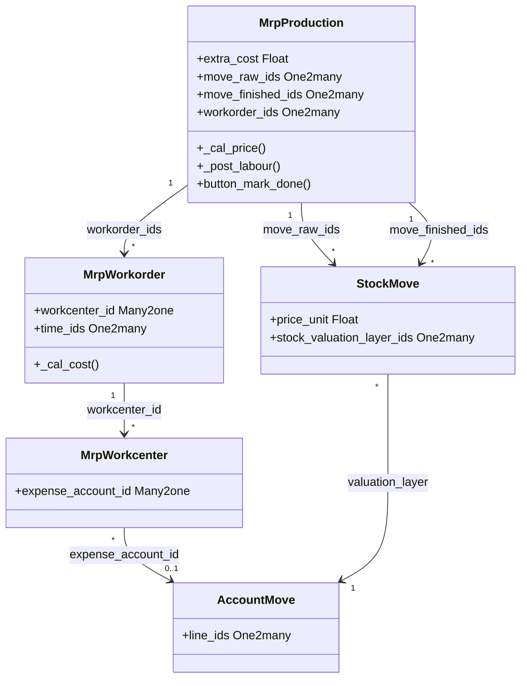

# C4 Code Level: Manufacturing Accounting

<!--
  Auto-generated by the c4-code agent. One file per source directory.
  Refreshed on /banyan-c4 reruns whenever the directory's content hash changes.
  Do NOT hand-edit; edits will be overwritten on next refresh.
-->

## Generated By

- **Agent**: c4-code (Haiku)
- **Run ID**: banyan-c4-20260701-init
- **Generated**: 2026-07-01T00:00:00Z
- **Source Directory**: addons/mrp_account
- **Content Hash**: 20260701-initial

## Overview

- **Name**: Manufacturing Accounting and Cost Integration
- **Description**: Bridges MRP and accounting modules; computes manufacturing costs, WIP valuation, and labor accounting entries
- **Location**: addons/mrp_account — 8 models, 1 wizard, 1 report
- **Language**: Python (Odoo 18.0 ORM)
- **Purpose**: Computes cost of goods manufactured (COGS), tracks work-in-progress (WIP) valuation, allocates labor costs, and generates accounting entries for manufacturing operations

## Code Elements

### Classes / Models

- **`MrpProduction`** — Inherits mrp.production; adds cost accounting
  - **Location**: `models/mrp_production.py:<10>`
  - **Key Methods**:
    - `_compute_show_valuation()` — True if any move_finished_ids is 'done'
    - `write(vals)` — Updates analytic refs in move_raw_ids and workorder_ids when name changes
    - `action_view_stock_valuation_layers()` — Opens stock_valuation_layer view filtered to this MO's layers
    - `_cal_price(consumed_moves)` — Core cost computation
      - Sums raw material costs from consumed_moves.stock_valuation_layer_ids
      - Adds work center costs via workorder._cal_cost()
      - Adds extra_cost per finished quantity
      - Allocates by-product cost share
      - Sets finished_move.price_unit for FIFO/average cost methods
    - `_get_backorder_mo_vals()` — Propagates extra_cost to backorder MO
    - `_post_labour()` — Creates account.move entries for labor costs
      - Skips if valuation != 'real_time'
      - Skips if labour already posted
      - Groups labor costs by account (workorder.workcenter_id.expense_account_id or product_accounts['expense'])
      - Creates journal entry with balancing WIP account
      - Links time_ids to account.move.line entries
    - `button_mark_done()` — Marks MO done and calls _post_labour() if needed
  - **Key Fields**:
    - `extra_cost` — Float (copy=False; manual cost adjustment per unit)
    - `show_valuation` — Boolean (computed; for UI display)
  - **Dependencies**: mrp, stock, stock_account, account

- **`MrpWorkorder`** — Inherits mrp.workorder; adds labor cost accounting
  - **Location**: `models/mrp_workorder.py:<1>`
  - **Key Methods**:
    - `_cal_cost()` — Computes work center labor cost
      - Sums duration costs from workorder.time_ids
      - Uses workcenter_id.costs_hour or standard hourly rate
      - Returns total labor cost in company currency
  - **Key Fields**:
    - `mo_analytic_account_line_ids` — One2many to account.analytic.line (labor tracking)
    - Time tracking for labor costing
  - **Dependencies**: mrp, account, stock_account

- **`MrpWorkcenter`** — Inherits mrp.workcenter; adds expense account
  - **Location**: `models/mrp_workcenter.py:<1>`
  - **Key Methods**: Expense account selection
  - **Key Fields**:
    - `expense_account_id` — Many2one to account.account (labor expense account)
  - **Dependencies**: mrp, account

- **`MrpRouting`** — Inherits mrp.routing; cost per operation
  - **Location**: `models/mrp_routing.py:<1>`
  - **Key Methods**: Routing cost computation
  - **Dependencies**: mrp

- **`Product`** (inherited) — Extends product.product with manufacturing cost
  - **Location**: `models/product.py:<1>`
  - **Key Methods**:
    - `_compute_standard_price()` — Computes standard cost from BOM (MRP cost engine)
    - Cost update via BOM changes
  - **Key Fields**:
    - `standard_price` — Float (related; computed from BOM)
  - **Dependencies**: product, mrp

- **`AccountMove`** (inherited) — Extends account.move
  - **Location**: `models/account_move.py:<1>`
  - **Key Methods**: Manufacturing journal entry creation
  - **Dependencies**: account, mrp

- **`StockMove`** (inherited) — Extends stock.move for MRP costing
  - **Location**: `models/stock_move.py:<1>`
  - **Key Methods**:
    - Cost allocation for raw material moves
    - By-product cost handling
  - **Dependencies**: stock, mrp

- **`AnalyticAccount`** (inherited) — Extends account.analytic.account
  - **Location**: `models/analytic_account.py:<1>`
  - **Key Methods**: MRP-specific analytic tracking
  - **Dependencies**: account, mrp

- **`MrpWipAccounting`** — Wizard for WIP accounting adjustments
  - **Location**: `wizard/mrp_wip_accounting.py:<1>`
  - **Key Methods**:
    - `action_create_wip_entries()` — Bulk-creates WIP adjustment entries for pending MOs
    - Handles cost variance and rounding
  - **Dependencies**: mrp, account, stock_account

### Functions / Methods (Module-level)

- `_cal_price(consumed_moves)` — MrpProduction method; computes finished good cost
  - **Description**: Aggregates raw material, labor, and by-product costs; sets price_unit on finished move
  - **Location**: `models/mrp_production.py:<40>`
  - **Visibility**: public (Odoo model hook for cost computation)
  - **Dependencies**: workorder._cal_cost, stock_valuation_layer, product.cost_method
  - **Return**: True on success

- `_post_labour()` — MrpProduction method; creates accounting entries for labor
  - **Description**: Groups labor costs by account; creates debit to expense, credit to WIP account
  - **Location**: `models/mrp_production.py:<72>`
  - **Visibility**: public (called after button_mark_done)
  - **Dependencies**: workorder._cal_cost, account.move, product_accounts (from stock_account)
  - **Side Effects**: Creates account.move entries; links time_ids to move lines

- `_cal_cost()` — MrpWorkorder method; computes labor cost
  - **Description**: Sums duration costs from time_ids; multiplies by workcenter hourly rate
  - **Location**: `models/mrp_workorder.py` (line varies)
  - **Visibility**: public
  - **Dependencies**: workcenter_id.costs_hour, time_ids.duration, company.currency_id
  - **Return Type**: Float (cost in company currency)

- `button_mark_done()` — MrpProduction method; finalizes MO and posts labor entries
  - **Description**: Calls parent button_mark_done, then triggers _post_labour if reservation state clear
  - **Location**: `models/mrp_production.py:<111>`
  - **Visibility**: public (action button)
  - **Dependencies**: parent MrpProduction.button_mark_done, _post_labour

### Constants / Configuration

- `product.cost_method` selection — `['standard', 'fifo', 'average']`
  - **Purpose**: Determines how cost is applied to finished move price_unit; only FIFO/average use _cal_price result (`models/mrp_production.py:<63>`)

- **WIP Account** (from product_accounts) — account.account for work-in-progress
  - **Purpose**: Credit account for labor and overhead allocation entries (`models/mrp_production.py:<93>`)

- **Expense Account** (from workcenter or product template) — account.account
  - **Purpose**: Debit account for labor cost entries (`models/mrp_production.py:<84>`)

## Dependencies

### Internal

- **mrp** — mrp.production, mrp.workorder, mrp.routing, mrp.workcenter; manufacturing BOM and operations
- **stock** — stock.move, stock.picking, stock.valuation.layer; raw/finished material movements
- **stock_account** — Stock valuation integration; cost flow accounting (FIFO/average)
- **account** — account.move, account.account, account.move.line; journal entries, chart of accounts
- **product** — product.product, product.template; cost method, standard price
- **analytic** — account.analytic.account, account.analytic.line; cost center tracking

### External

- **Odoo Framework** (18.0) — ORM models, fields, api decorators, @api.depends
- **Python stdlib** — ast.literal_eval, collections (defaultdict), logging
- **Odoo utilities** — float_round (currency rounding)

## Relationships

## Notes for Higher-Level Synthesis

- **Belongs with manufacturing domain** — MrpProduction and MrpWorkorder are the core; integrate closely with mrp.bom, mrp.routing for complete cost model
- **Cost computation flow: _cal_price → _post_labour → button_mark_done** — Linear dependency chain; any change to consumed_moves or workorder costs affects final price_unit and journal entries; validate via test_valuation_layers
- **Labor accounting is manual trigger** — _post_labour is NOT automatic; only called after button_mark_done; consider if real-time WIP posting is desired (requires hook changes)
- **WIP valuation is critical** — Use account_inventory_valuation to verify WIP balance matches stock.valuation_layer sum; any mismatch indicates cost flow error
- **Cost method coordination** — Only FIFO and average apply computed price_unit; standard cost skips _cal_price; ensure product.cost_method consistency across BOM
- **By-product cost allocation** — Cost share formula: (cost * by_product.cost_share%) / by_product_qty; verify by-product cost_share percentages sum to realistic totals
- **Extra cost is manual override** — extra_cost field allows per-unit adjustment; document via MO chatter to maintain cost audit trail
- **Analytic tracking** — move_raw_ids.analytic_account_line_ids and workorder.mo_analytic_account_line_ids provide cost center breakdown; coordinate with analytic reporting

