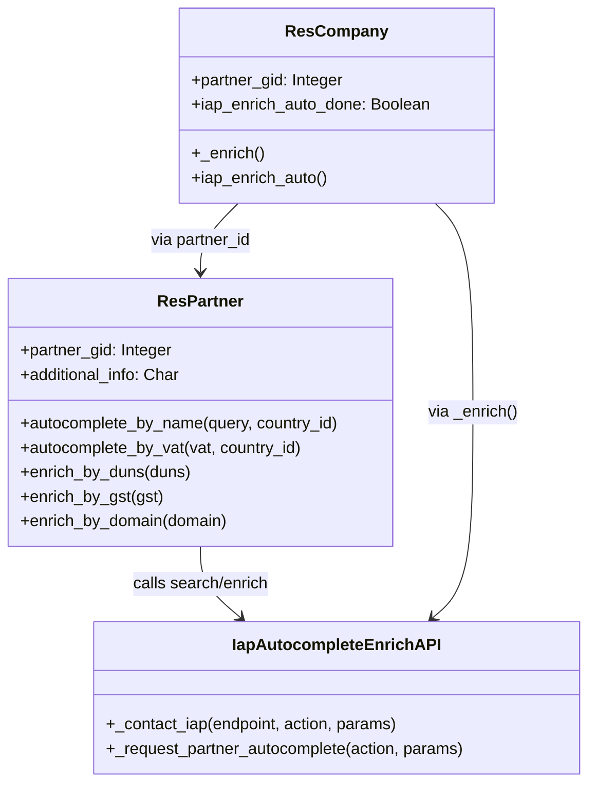

# C4 Code Level: addons/partner_autocomplete

<!--
  Auto-generated by the c4-code agent. One file per source directory.
  Refreshed on /banyan-c4 reruns whenever the directory's content hash changes.
  Do NOT hand-edit; edits will be overwritten on next refresh.
-->

## Generated By

- **Agent**: c4-code (Haiku)
- **Run ID**: banyan-c4-20260701-init
- **Generated**: 2026-07-01T00:00:00Z
- **Source Directory**: addons/partner_autocomplete
- **Content Hash**: 3b7f5a2e8c1d6a4f9e7b2c5d

## Overview

- **Name**: Partner Autocomplete via Dun & Bradstreet (DnB) for Odoo 18.0
- **Description**: IAP-powered company data enrichment; auto-fill partner/company fields (address, phone, website, logo, industry, language) from company name/VAT using DnB API via Clearbit
- **Location**: addons/partner_autocomplete — 12 files, ~400 lines
- **Language**: Python (Odoo ORM models, HTTP session enhancement)
- **Purpose**: CRM onboarding acceleration; reduce manual data entry for company creation/update workflows

## Code Elements

### Classes / Modules

- **`IapAutocompleteEnrichAPI`** — Abstract API client for partner autocomplete service
  - **Location**: `models/iap_autocomplete_api.py:13`
  - **Methods**:
    - `_contact_iap(local_endpoint, action, params, timeout=15) → JSON` — Low-level IAP JSON-RPC wrapper
      - Builds params with db_uuid, version, lang, account_token, company context
      - Routes to `base_url/local_endpoint/action` with iap_jsonrpc client
    - `_request_partner_autocomplete(action, params, timeout=15) → (results, error_code)` — Mid-level error handler
      - Catches ValidationError (test mode), ConnectionError, HTTPError, InsufficientCreditError, ValueError
      - Returns (False, error_string) on failure
  - **Inherits/Extends**: `models.AbstractModel`
  - **Dependencies**: 
    - Internal: `iap.account`, `ir.config_parameter`, company context
    - External: `odoo.addons.iap.tools.iap_tools` (JSON-RPC wrapper)

- **`ResPartner`** (extended) — Partner autocomplete and enrichment methods
  - **Location**: `models/res_partner.py:11`
  - **Key Methods**:
    - `_iap_replace_location_codes(iap_data) → dict` — Map country/state code → Odoo record IDs
    - `_iap_replace_industry_code(iap_data) → dict` — Map UNSPSC code → `res.partner.industry` reference
    - `_iap_replace_language_codes(iap_data) → dict` — Map language code → installed `res.lang` code
    - `_format_data_company(iap_data) → dict` — Orchestrate all replace methods
    - `autocomplete_by_name(query, query_country_id, timeout=15) → list[dict]` — Search DnB by company name
      - Returns formatted suggestion list with id, name, vat, address fields
    - `autocomplete_by_vat(vat, query_country_id, timeout=15) → list[dict]` — Search DnB by VAT
      - Fallback: if DnB fails, call VIES API directly for name + address
    - `enrich_by_duns(duns, timeout=15) → dict` — Full enrichment by DUNS number
    - `enrich_by_gst(gst, timeout=15) → dict` — Full enrichment by GST (India)
    - `enrich_by_domain(domain, timeout=15) → dict` — Full enrichment by email/website domain
    - `_process_enriched_response(response, error) → dict` — Extract data field, handle credit/API errors
    - `iap_partner_autocomplete_add_tags(unspsc_codes) → None` — [deprecated] Create activity tags from UNSPSC
  - **Inherits/Extends**: `res.partner`
  - **Deprecated Methods**: `autocomplete()`, `enrich_company()`, `read_by_vat()`, `check_gst_in()`
  - **Dependencies**: 
    - Internal: `iap.autocomplete.api`, `res.country`, `res.country.state`, `res.lang`, `res.partner.industry`
    - External: `stdnum.eu.vat.check_vies` (VIES fallback)

- **`ResCompany`** (extended) — Auto-enrich company on creation
  - **Location**: `models/res_company.py:16`
  - **Fields**: 
    - `partner_gid: Integer` — Related to partner.partner_gid; DnB global ID
    - `iap_enrich_auto_done: Boolean` — Flag to prevent re-enrichment
  - **Methods**:
    - `create(vals_list) → list` — Trigger `iap_enrich_auto()` after create (unless in test mode)
    - `_get_view(view_id, view_type='form', **options) → (arch, view)` — Patch form view: add `field_partner_autocomplete` widget to name/vat fields
    - `iap_enrich_auto() → bool` — Enrich company if not already done; guard with system user check and flag
    - `_enrich() → bool` — Call `enrich_by_domain()`; write returned fields to partner_id
    - `_enrich_extract_m2o_id(iap_data, m2o_fields) → dict` — Extract dict.id from formatted m2o fields
    - `_get_company_domain() → str | False` — Extract domain from email or website; filter mail providers; validate TLD
  - **Inherits/Extends**: `res.company`
  - **Dependencies**:
    - Internal: `res.partner`, `iap.autocomplete.api`
    - External: `odoo.tools.mail.email_domain_extract`, `url_domain_extract`, `iap_tools._MAIL_PROVIDERS`

- **`Http`** (extended) — Session info enhancement
  - **Location**: `models/ir_http.py:7`
  - **Methods**:
    - `session_info() → dict` — Add `iap_company_enrich` flag if user is admin and company not yet enriched
  - **Inherits/Extends**: `ir.http`
  - **Purpose**: Signal to frontend that enrichment widget should be shown

- **`ResPartnerAutocompleteSync`** (stub) — Deprecated sync queue
  - **Location**: `models/res_partner_autocomplete_sync.py:9`
  - **Status**: Deprecated since DnB migration (methods empty)
  - **Fields**: `partner_id`, `synched`
  - **Methods**: `start_sync()`, `add_to_queue()` — No-op

- **`ResConfigSettings`** (extended) — IAP credit check
  - **Location**: `models/res_config_settings.py:7`
  - **Fields**: `partner_autocomplete_insufficient_credit: Boolean` — Computed; shows credit status
  - **Methods**:
    - `_compute_partner_autocomplete_insufficient_credit() → None` — Check `iap.account.get_credits()` <= 0
    - `redirect_to_buy_autocomplete_credit() → dict` — Action; open IAP credit purchase URL
  - **Inherits/Extends**: `res.config.settings`
  - **Dependencies**: `iap.account`

### Functions / Methods

- [purpose unclear from signature] — Various mapping/formatting methods are instance methods on ResPartner; see above

### Constants / Configuration

- `_DEFAULT_ENDPOINT` (in IapAutocompleteEnrichAPI) — `'https://partner-autocomplete.odoo.com'`
- `COMPANY_AC_TIMEOUT` — 5 seconds timeout for auto-enrich on company creation (`models/res_company.py:13`)

## Dependencies

### Internal

- **`res.partner`** — Core partner model; enrichment target
- **`res.company`** — Company model; auto-enrich hook + enrichment target via partner_id
- **`res.country`, `res.country.state`, `res.lang`** — Location code mapping
- **`res.partner.industry`** — Industry classification from UNSPSC
- **`iap.account`, `ir.config_parameter`** — IAP service credential & endpoint config
- **`iap_mail` module** — Explicit dependency for email extraction utilities
- **`ir.http`** — Session enhancement
- **`ir.module.module`** — Check if product_unspsc is installed (for tag creation)

### External

- **Odoo IAP service** — JSON-RPC endpoint for Dun & Bradstreet data queries
  - Endpoints: `/api/dnb/1/search_by_name`, `search_by_vat`, `enrich_by_duns`, `enrich_by_gst`, `enrich_by_domain`
  - Metered: Credits consumed per enrichment query
- **`stdnum.eu.vat@1.x`** — VIES fallback when DnB VAT search fails
- **`odoo.tools.mail`** — Email/website domain extraction utilities
- **Odoo addons**: `iap_mail` (auto-installed dependency)

## Relationships

## Notes for Higher-Level Synthesis

- **Belongs with CRM/partner management** — Tight integration with partner/company models; improves lead/prospect data quality on intake
- **Boundary code: IAP service wrapper** — Translates DnB response format into Odoo fields; handles fallback to VIES; manages credit/auth
- **Optional/premium feature** — Requires active IAP account with partner_autocomplete credits; degrades gracefully if disabled/exhausted
- **Auto-enrichment hook** — Transparently enriches company on create; can be controlled via threading flag and done-flag to prevent loops
