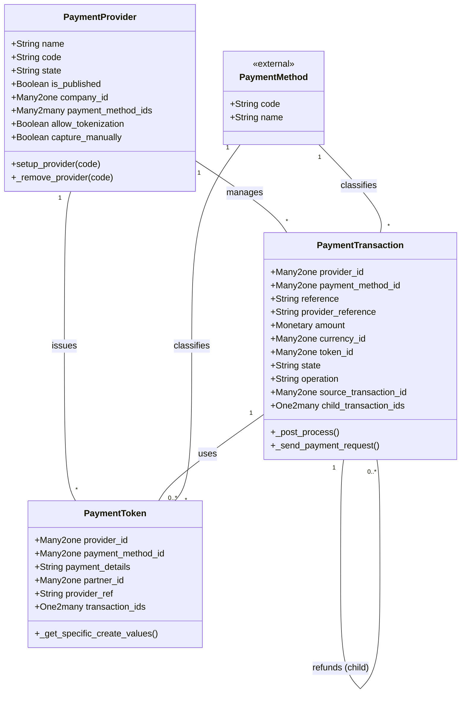

# C4 Code Level: Addons Payment

<!--
  Auto-generated by the c4-code agent. One file per source directory.
  Refreshed on /banyan-c4 reruns whenever the directory's content hash changes.
  Do NOT hand-edit; edits will be overwritten on next refresh.
-->

## Generated By

- **Agent**: c4-code (Haiku)
- **Run ID**: banyan-c4-20260701-init
- **Generated**: 2026-07-01T00:00:00Z
- **Source Directory**: addons/payment
- **Content Hash**: 7ca4b8f2d1e9a3c5b4f6e2d1c9a3b5f7

## Overview

- **Name**: Payment Engine
- **Description**: Odoo 18.0 Payment Providers framework for managing payment gateway configuration, transaction lifecycle, and card tokenization
- **Location**: addons/payment — 30 files (root level only), ~5,000 lines
- **Language**: Python
- **Purpose**: Core payment processing infrastructure supporting Stripe, PayPal, Adyen and other payment providers. Defines abstract provider interface, transaction state machine (draft→pending→authorized→done/cancel/error), and payment method tokenization

## Code Elements

### Functions / Methods

- `setup_provider(env, code) → None`
  - **Description**: Initialize a payment provider by code
  - **Location**: `__init__.py:9`
  - **Visibility**: public
  - **Dependencies**: payment.provider model

- `reset_payment_provider(env, code, **kwargs) → None`
  - **Description**: Remove a payment provider configuration and reset its state
  - **Location**: `__init__.py:13`
  - **Visibility**: public
  - **Dependencies**: payment.provider model

- `generate_access_token(*values) → str`
  - **Description**: Generate HMAC-based access token for request verification
  - **Location**: `utils.py:15`
  - **Visibility**: public
  - **Dependencies**: odoo.http.request, odoo.tools.misc.hmac

- `check_access_token(access_token, *values) → bool`
  - **Description**: Verify access token validity against provided values using constant-time comparison
  - **Location**: `utils.py:32`
  - **Visibility**: public
  - **Dependencies**: generate_access_token, odoo.tools.consteq

- `add_to_report(report, records, available=True, reason='') → None`
  - **Description**: Populate availability report with provider/payment method availability status and reasons
  - **Location**: `utils.py:49`
  - **Visibility**: public
  - **Dependencies**: payment.provider, payment.method models

- `singularize_reference_prefix(prefix='tx', separator='-', max_length=None) → str`
  - **Description**: Suffix prefix with current datetime to improve transaction reference uniqueness
  - **Location**: `utils.py:94`
  - **Visibility**: public
  - **Dependencies**: odoo.fields.Datetime

- `to_major_currency_units(minor_amount, currency, arbitrary_decimal_number=None) → int`
  - **Description**: Convert amount from minor units (cents) to major units (dollars) using ISO 4217 decimal specs
  - **Location**: `utils.py:124`
  - **Visibility**: public
  - **Dependencies**: CURRENCY_MINOR_UNITS constant, float_round

- `to_minor_currency_units(major_amount, currency, arbitrary_decimal_number=None) → int`
  - **Description**: Convert amount from major units (dollars) to minor units (cents) using ISO 4217 decimal specs
  - **Location**: `utils.py:146`
  - **Visibility**: public
  - **Dependencies**: CURRENCY_MINOR_UNITS constant, float_round

- `format_partner_address(address1="", address2="") → str`
  - **Description**: Combine two address parts into single-line formatted string
  - **Location**: `utils.py:174`
  - **Visibility**: public
  - **Dependencies**: None

- `split_partner_name(partner_name) → tuple`
  - **Description**: Parse full partner name into first name and last name tuple
  - **Location**: `utils.py:187`
  - **Visibility**: public
  - **Dependencies**: None

- `get_customer_ip_address() → str`
  - **Description**: Extract customer IP address from HTTP request context
  - **Location**: `utils.py:203`
  - **Visibility**: public
  - **Dependencies**: odoo.http.request

- `check_rights_on_recordset(recordset) → None`
  - **Description**: Verify user has write access to recordset before RPC operations
  - **Location**: `utils.py:207`
  - **Visibility**: public
  - **Dependencies**: None (delegation to recordset.check_access)

- `generate_idempotency_key(tx, scope=None) → str`
  - **Description**: Create SHA1 idempotency key from transaction reference + database UUID + scope to prevent duplicate API requests
  - **Location**: `utils.py:221`
  - **Visibility**: public
  - **Dependencies**: hashlib.sha1, ir.config_parameter

### Classes / Modules

- **`PaymentProvider`** — Payment gateway configuration and state management
  - **Location**: `models/payment_provider.py:14`
  - **Visibility**: public (Odoo model)
  - **Methods**: `_valid_field_parameter(field, name)`, `_setup_provider(code)`, `_remove_provider(code, **kwargs)`, computed/constraint methods
  - **Inherits**: `models.Model`
  - **Key Fields**: 
    - `name` (Char, required) — Provider display name
    - `code` (Selection, required) — Technical code (stripe, paypal, adyen, none)
    - `state` (Selection, required) — disabled/enabled/test mode
    - `is_published` (Boolean) — Visibility on website
    - `company_id` (Many2one to res.company) — Multi-company scoping
    - `payment_method_ids` (Many2many) — Supported payment methods
    - `allow_tokenization` (Boolean) — Enable saved payment methods
    - `capture_manually` (Boolean) — Manual vs immediate capture
    - `allow_express_checkout` (Boolean) — Google Pay / Apple Pay support
    - Form view references (redirect, inline, token, express checkout)
    - Availability constraints (countries, currencies, max amount)
    - Message templates (pre, pending, auth, done, cancel)
  - **Dependencies**: res.company, res.country, res.currency, payment.method, ir.ui.view (internal); none (external)

- **`PaymentTransaction`** — Transaction state machine and settlement lifecycle
  - **Location**: `models/payment_transaction.py:22`
  - **Visibility**: public (Odoo model)
  - **Methods**: `_compute_refunds_count()`, `_check_state_authorized_supported()` and others (state machine, post-processing)
  - **Inherits**: `models.Model`
  - **Key Fields**:
    - `provider_id` (Many2one to payment.provider, readonly, required) — Provider managing transaction
    - `company_id` (Many2one to res.company, stored, indexed) — Multi-company scoping
    - `payment_method_id` (Many2one to payment.method, readonly, required)
    - `reference` (Char, readonly, required, UNIQUE) — Internal tx ID
    - `provider_reference` (Char, readonly) — Provider-assigned tx ID
    - `amount` (Monetary, readonly, required)
    - `currency_id` (Many2one to res.currency, readonly, required)
    - `token_id` (Many2one to payment.token, readonly) — Saved card reference
    - `state` (Selection) — draft/pending/authorized/done/cancel/error (readonly, indexed)
    - `state_message` (Text, readonly) — Supplementary error/status detail
    - `last_state_change` (Datetime, readonly) — Audit trail
    - `operation` (Selection, indexed) — Classifies as online_redirect/direct/token/validation/offline/refund
    - `source_transaction_id` (Many2one to self) — Refund parent link
    - `child_transaction_ids` (One2many to self) — Refund children
    - `refunds_count` (Integer, computed)
    - `is_post_processed` (Boolean) — Settlement completion flag
    - `tokenize` (Boolean) — Request token creation on settlement
    - `landing_route` (Char) — Post-payment redirect URL
    - Partner fields (denormalized for audit): name, lang, email, address, zip, city, state, country, phone
  - **Constraints**: `_check_state_authorized_supported()` validates authorization support
  - **Dependencies**: payment.provider, payment.method, payment.token, res.partner, res.company, res.currency, res.country.state (internal); dateutil, psycopg2, markupsafe (external)

- **`PaymentToken`** — Saved payment method (card tokenization)
  - **Location**: `models/payment_token.py:9`
  - **Visibility**: public (Odoo model)
  - **Methods**: `create()`, `write()`, `_get_specific_create_values()`, `_handle_archiving()` (provider-specific overrides)
  - **Inherits**: `models.Model`
  - **Key Fields**:
    - `provider_id` (Many2one to payment.provider, required) — Card issuer gateway
    - `provider_code` (Char, related) — Cache of provider.code
    - `company_id` (Many2one to res.company, stored, indexed) — Multi-company scoping
    - `payment_method_id` (Many2one to payment.method, readonly, required)
    - `payment_method_code` (Char, related) — Cache of payment_method.code
    - `payment_details` (Char) — Display-safe portion (e.g., "•••• 4242")
    - `partner_id` (Many2one to res.partner, required) — Card owner
    - `provider_ref` (Char, required) — Vault reference at provider
    - `transaction_ids` (One2many to payment.transaction) — Usage audit trail
    - `active` (Boolean) — Soft delete flag
  - **Constraints**: Prevents unarchiving if payment method or provider is disabled
  - **Hooks**: `_get_specific_create_values()` extension point for provider-specific fields
  - **Dependencies**: payment.provider, payment.method, res.partner (internal); none (external)

### Constants / Configuration

- `CURRENCY_MINOR_UNITS` — ISO 4217 decimal specification map (currency code → minor unit count)
  - **Location**: `const.py:9`
  - **Purpose**: Standardizes currency conversions (e.g., USD=2, JPY=0, BHD=3)
  - **Type**: dict (180+ currency codes)

- `REPORT_REASONS_MAPPING` — Localized unavailability reasons
  - **Location**: `const.py:288`
  - **Purpose**: Human-friendly messages for why a provider/method unavailable (max amount, country, currency, tokenization support, etc.)
  - **Type**: dict (LazyTranslate values for i18n)

## Dependencies

### Internal

- `models.payment_method` — Classifies supported payment methods (card, bank_account, wallet)
- `models.payment_provider` — Gateway configuration (inherits to implement provider-specific behavior)
- `models.payment_transaction` — Transaction state and settlement (inherits for provider-specific lifecycle)
- `models.payment_token` — Saved payment method (inherits for vault-specific storage)
- `models.res_company` — Multi-company domain and company currency
- `models.res_country` — Geographic availability filtering
- `models.res_currency` — Currency availability filtering and decimal normalization
- `models.res_partner` — Customer contact info (denormalized in transactions)
- `models.ir_http` — HTTP/webhook request handling (likely provider-inherited)
- `controllers.portal` — Customer payment portal (invoice payment, payment method management)
- `controllers.post_processing` — Webhook reception and transaction state synchronization
- `wizards.payment_capture_wizard` — Manual capture UI for authorized transactions
- `wizards.payment_link_wizard` — Invoice payment link generation
- `wizards.payment_onboarding_wizard` — Provider setup assistant

### External

- `odoo.tools.translate::LazyTranslate` — Internationalization support for all localized strings
- `odoo.http::request` — HTTP context (IP, session, user)
- `odoo.tools::consteq, float_round, ustr, hmac` — Cryptographic and utility functions
- `dateutil::relativedelta` — Date arithmetic in transaction lifecycle
- `psycopg2` — Database error handling
- `markupsafe::Markup` — HTML sanitization in message fields

## Relationships

## Notes for Higher-Level Synthesis

- **Framework foundation** — This is the base payment infrastructure all payment provider modules extend. Abstract provider interface design means extensions (Stripe, PayPal, Adyen modules) inherit `PaymentProvider`, `PaymentTransaction`, and `PaymentToken` and override state machine, webhook handling, and capture logic.
- **Boundary code** — Controllers (portal.py, post_processing.py) are HTTP boundaries receiving external webhook notifications from gateways and customer form submissions. Marshaling payment data across provider APIs happens in provider-inherited methods.
- **Multi-tenancy and audit-first** — Deeply indexed on `company_id`, `state`, `reference` for fast RBAC domain queries and transaction tracing. Denormalized partner data in transactions ensures historical accuracy even if customer records change.
- **Idempotency concern** — `generate_idempotency_key()` and state-machine constraints indicate strong focus on payment safety (no double-charges, no invalid state transitions). Providers inherit to implement provider-specific idempotency and webhook signature verification.
