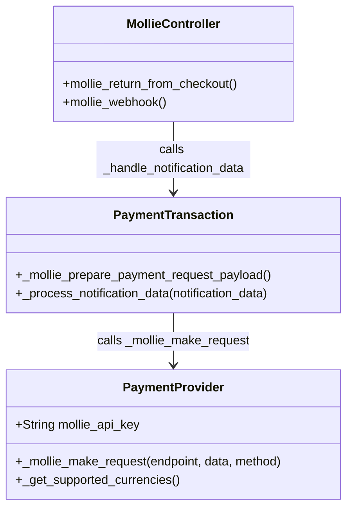

# C4 Code Level: Payment Mollie

<!--
  Auto-generated by the c4-code agent. One file per source directory.
  Refreshed on /banyan-c4 reruns whenever the directory's content hash changes.
  Do NOT hand-edit; edits will be overwritten on next refresh.
-->

## Generated By

- **Agent**: c4-code (Haiku)
- **Run ID**: banyan-c4-20260701-init
- **Generated**: 2026-07-01T00:00:00Z
- **Source Directory**: addons/payment_mollie
- **Content Hash**: c5b2a8d1f4e7a3c9e6b1d4f7a2c5e8b3

## Overview

- **Name**: Mollie Payment Provider
- **Description**: Mollie payment provider integration for Dutch/EU payment methods (iDEAL, Bancontact, credit cards). Extends payment.provider framework with Mollie API client and webhook handling
- **Location**: `addons/payment_mollie` — 2 model files, 1 controller, const file, tests
- **Language**: Python (Odoo ORM + HTTP)
- **Purpose**: Enable payment processing via Mollie API for European markets. Handles payment creation, status polling, and webhook notifications

## Code Elements

### Classes / Modules

- **`PaymentProvider`** (`models.Model`, inherits `payment.provider`) — Mollie provider configuration and API client
  - **Location**: `models/payment_provider.py:17`
  - **Fields**:
    - `code` (Selection) — Provider code identifier ('mollie')
    - `mollie_api_key` (Char) — Mollie API key (Bearer token); required and system-group only
  - **Methods**:
    - `_get_supported_currencies()` → recordset — Filter to Mollie's supported currency list (const.SUPPORTED_CURRENCIES)
    - `_mollie_make_request(endpoint, data, method)` → dict — HTTP client; constructs Mollie v2 API request with auth header, user-agent, and error handling
    - `_get_default_payment_method_codes()` → set — Return default enabled payment methods (card, visa, mastercard, amex, discover)
  - **Implements / Extends**: `payment.provider`
  - **Dependencies**: `requests` (HTTP), `werkzeug.urls` (URL joining), `odoo.service.common` (version info), `odoo.exceptions.ValidationError` (error wrapping)

- **`PaymentTransaction`** (`models.Model`, inherits `payment.transaction`) — Mollie payment flow and webhook processor
  - **Location**: `models/payment_transaction.py:18`
  - **Methods**:
    - `_get_specific_rendering_values(processing_values)` → dict — Create Mollie payment order and return checkout URL
    - `_mollie_prepare_payment_request_payload()` → dict — Build payment create request (amount, locale, methods, redirect/webhook URLs)
    - `_get_tx_from_notification_data(provider_code, notification_data)` → recordset — Match webhook/redirect notification to transaction by reference
    - `_process_notification_data(notification_data)` → None — Poll Mollie for payment status and update transaction state (pending/done/canceled/error)
  - **Implements / Extends**: `payment.transaction`
  - **Dependencies**: `payment.method` (payment method lookup), const.PAYMENT_METHODS_MAPPING, MollieController (URL constants)

- **`MollieController`** (`http.Controller`) — Webhook and return URL handlers
  - **Location**: `controllers/main.py:13`
  - **Routes**:
    - `POST /payment/mollie/webhook` (auth=public, csrf=False) — Webhook endpoint; processes Mollie notifications (payment status updates)
    - `GET/POST /payment/mollie/return` (auth=public, csrf=False, save_session=False) — Return URL after customer completes checkout; handles redirect with `ref` param
  - **Methods**:
    - `mollie_return_from_checkout(**data)` → redirect to /payment/status — Processes return and redirects user
    - `mollie_webhook(**data)` → empty str — Processes webhook, acknowledges with empty response
  - **Implements / Extends**: `http.Controller`
  - **Dependencies**: `payment.transaction` (sudo calls for notification handling)

### Constants / Configuration

- `SUPPORTED_LOCALES` — List of ISO 15897 locales (en_US, nl_NL, nl_BE, fr_FR, etc.) — `const.py:5`
- `SUPPORTED_CURRENCIES` — List of ISO 4217 currencies (EUR, GBP, AUD, etc.) — `const.py:17`
- `DEFAULT_PAYMENT_METHOD_CODES` — Payment methods to enable with Mollie provider — `const.py:51`
- `PAYMENT_METHODS_MAPPING` — Mapping of Odoo codes to Mollie codes (e.g., 'card' → 'creditcard', 'apple_pay' → 'applepay') — `const.py:62`

## Dependencies

### Internal

- `payment` module — Payment provider and transaction base models, payment method framework
- `payment_mollie.const` — Configuration constants (locales, currencies, method mappings)

### External

- `requests` — HTTP client for Mollie API calls
- `werkzeug.urls` — URL parsing/joining utilities
- **Mollie API** — v2 payment creation and status polling endpoints (https://api.mollie.com/v2/)

## Relationships

## Notes for Higher-Level Synthesis

- **Payment gateway integration**: Provider-specific payment processing; extends Odoo payment.provider framework
- **External boundary**: MollieController handles HTTP redirection and webhooks — entry/exit points for external payment flow
- **Webhook async processing**: Mollie sends notifications to webhook URL; controller processes and updates transaction state asynchronously
- Belongs with E-Commerce/Payment component
- Mollie API credentials and endpoint should be documented as external integrations at Container level
- Supports multi-currency and multi-payment-method; configuration and supported methods captured in const.py
