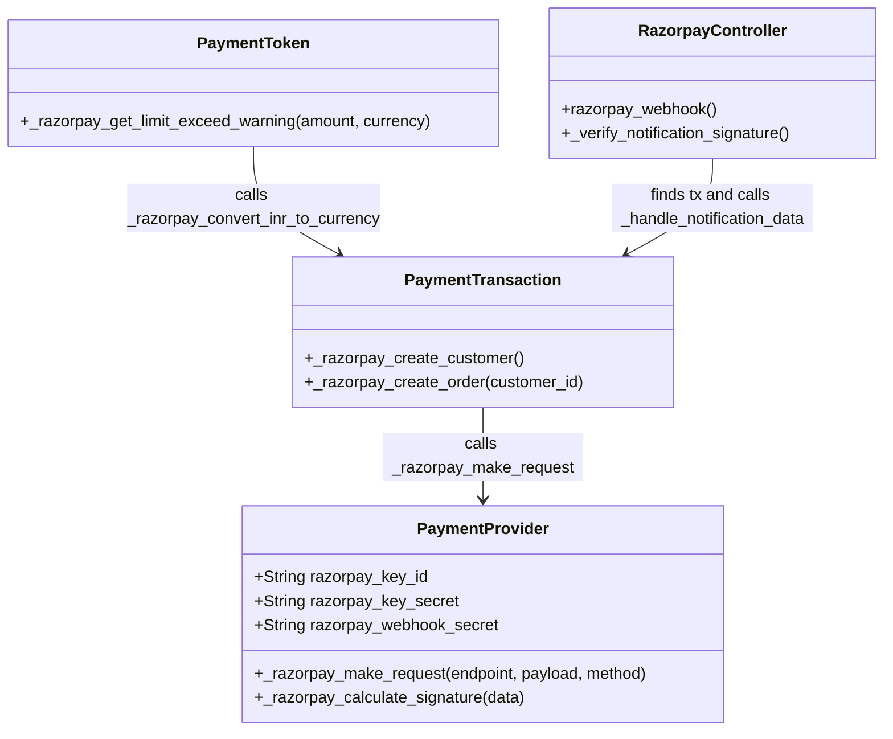

# C4 Code Level: Payment Razorpay

<!--
  Auto-generated by the c4-code agent. One file per source directory.
  Refreshed on /banyan-c4 reruns whenever the directory's content hash changes.
  Do NOT hand-edit; edits will be overwritten on next refresh.
-->

## Generated By

- **Agent**: c4-code (Haiku)
- **Run ID**: banyan-c4-20260701-init
- **Generated**: 2026-07-01T00:00:00Z
- **Source Directory**: addons/payment_razorpay
- **Content Hash**: e2d8f4a1c6b9e3f7d2a5c8e1b4f7a3c6

## Overview

- **Name**: Razorpay Payment Provider
- **Description**: Razorpay payment provider for Indian market. UPI, net banking, cards. Extends payment.provider with Razorpay Order API and webhook handling
- **Location**: `addons/payment_razorpay` — 3 model files, 1 controller, const file, tests
- **Language**: Python (Odoo ORM + HTTP)
- **Purpose**: Enable payment processing via Razorpay for India region. Manages customer/order creation, payment authorization, and token-based (eMandate) payments

## Code Elements

### Classes / Modules

- **`PaymentProvider`** (`models.Model`, inherits `payment.provider`) — Razorpay provider configuration and API client
  - **Location**: `models/payment_provider.py:19`
  - **Fields**:
    - `code` (Selection) — Provider code identifier ('razorpay')
    - `razorpay_key_id` (Char) — API key ID (public identifier); required
    - `razorpay_key_secret` (Char) — API key secret (for basic auth); required, system-group only
    - `razorpay_webhook_secret` (Char) — HMAC secret for webhook signature validation; required, system-group only
  - **Methods**:
    - `_compute_feature_support_fields()` — Enable manual capture, partial refund, and tokenization features
    - `_get_supported_currencies()` → recordset — Filter to Razorpay's wide currency list (const.SUPPORTED_CURRENCIES)
    - `_razorpay_make_request(endpoint, payload, method)` → dict — HTTP client with basic auth or Bearer token; v1 and v2 API support
    - `_razorpay_calculate_signature(data)` → str — HMAC-SHA256 signature for webhook validation
    - `_razorpay_get_public_token()` → None — Placeholder for OAuth (v1.8 only; TODO: remove in master)
    - `_razorpay_get_access_token()` → None — Placeholder for OAuth (v1.8 only; TODO: remove in master)
    - `_get_default_payment_method_codes()` → set — Default payment methods (card, netbanking, upi, visa, mastercard, amex, discover)
    - `_get_validation_amount()` → float — Validation test amount in INR (1.0)
  - **Implements / Extends**: `payment.provider`
  - **Dependencies**: `requests` (HTTP), `hashlib`/`hmac` (signature), `odoo.exceptions.ValidationError`

- **`PaymentTransaction`** (`models.Model`, inherits `payment.transaction`) — Razorpay payment flow and webhook processor
  - **Location**: `models/payment_transaction.py:21`
  - **Methods**:
    - `_get_specific_processing_values(processing_values)` → dict — Create Razorpay customer and order; return key_id, customer_id, order_id
    - `_razorpay_create_customer()` → dict — POST /customers; returns customer object with ID
    - `_razorpay_create_order(customer_id)` → dict — POST /orders; returns order object with ID
    - `_razorpay_prepare_order_payload(customer_id)` → dict — Build order create payload (amount, currency, customer, notes)
    - `_validate_phone_number(phone)` → str — Validate and format phone number; raises ValidationError if invalid or missing for tokenization
  - **Implements / Extends**: `payment.transaction`
  - **Dependencies**: `dateutil.relativedelta` (for mandate expiry?), `payment.utils`, const.MANDATE_MAX_AMOUNT

- **`PaymentToken`** (`models.Model`, inherits `payment.token`) — Razorpay token (eMandate) validation
  - **Location**: `models/payment_token.py:9`
  - **Methods**:
    - `_razorpay_get_limit_exceed_warning(amount, currency_id)` → str — Check if amount exceeds mandate max; return warning message or empty string
  - **Implements / Extends**: `payment.token`
  - **Dependencies**: const.MANDATE_MAX_AMOUNT (mapping of payment methods to INR limits), PaymentTransaction (for INR conversion)

- **`RazorpayController`** (`http.Controller`) — Webhook handler only (no return URL; payment happens in modal)
  - **Location**: `controllers/main.py:19`
  - **Routes**:
    - `POST /payment/razorpay/webhook` (auth=public, csrf=False) — Webhook endpoint; processes payment/refund notifications
  - **Methods**:
    - `razorpay_webhook()` → JSON response {} — Validate signature, extract event data, find transaction, call _handle_notification_data
    - `_verify_notification_signature(notification_data, received_signature, tx_sudo)` → None or raise Forbidden — Compare HMAC signatures
  - **Implements / Extends**: `http.Controller`
  - **Dependencies**: `hmac` (signature compare), `werkzeug.exceptions.Forbidden`

### Constants / Configuration

- `SUPPORTED_CURRENCIES` — List of ISO 4217 currencies (AED, AUD, INR, USD, etc.; 99 total) — `const.py:6`
- `DEFAULT_PAYMENT_METHOD_CODES` — Payment methods to enable (card, netbanking, upi, visa, mastercard, amex, discover) — `const.py:102`
- `FALLBACK_PAYMENT_METHOD_CODES` — Methods not recognized by orders API (wallets_india, paylater_india, emi_india) — `const.py:115`
- `PAYMENT_METHODS_MAPPING` — Mapping of Odoo codes to Razorpay codes (e.g., 'wallet' → 'wallets_india') — `const.py:122`
- `MANDATE_MAX_AMOUNT` — Payment method to INR limit mapping (card: 1,000,000; upi: 100,000) — `const.py:129`
- `PAYMENT_STATUS_MAPPING` — Razorpay payment statuses to transaction states — `const.py:136`
- `HANDLED_WEBHOOK_EVENTS` — List of webhook events processed (payment.authorized, payment.captured, payment.failed, refund.*) — `const.py:144`

## Dependencies

### Internal

- `payment` module — Payment provider, transaction, and token base models
- `payment_razorpay.const` — Configuration constants (currencies, methods, limits, status mappings)

### External

- `requests` — HTTP client for Razorpay API calls
- `hmac`, `hashlib` — Webhook signature validation
- `dateutil.relativedelta` — Date math (unused reference; may be for mandate expiry tracking)
- **Razorpay API** — v1 Orders, Customers, Refunds endpoints (https://api.razorpay.com/v1/); v2 for OAuth (TODO)

## Relationships

## Notes for Higher-Level Synthesis

- **Payment gateway integration**: Provider-specific payment processing; extends Odoo payment.provider framework
- **Customer/Order pattern**: Razorpay requires customer creation before order creation (stateful setup)
- **Webhook async processing**: Razorpay sends notifications to webhook URL; controller validates signature, finds transaction, and updates state asynchronously
- **Token support (eMandate)**: Supports saving payment tokens for recurring payments (mandates) with per-method amount limits
- **Region-specific**: Designed for Indian market (INR primary; UPI, netbanking, wallet methods)
- Belongs with E-Commerce/Payment component
- Razorpay API credentials, endpoint, and webhook secret should be documented as external integrations at Container level
- HANDLED_WEBHOOK_EVENTS shows two event types (payment.*, refund.*); refund processing not visible in shown code (likely in _process_notification_data override)
