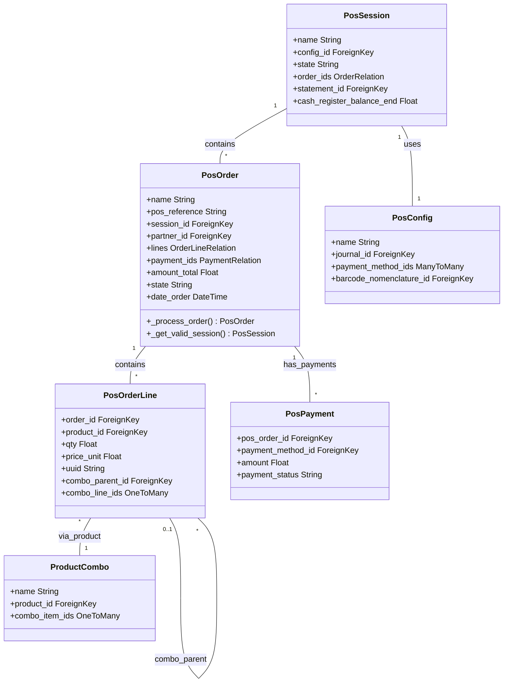

# C4 Code Level: addons/point_of_sale

<!--
  Auto-generated by the c4-code agent. One file per source directory.
  Refreshed on /banyan-c4 reruns whenever the directory's content hash changes.
  Do NOT hand-edit; edits will be overwritten on next refresh.
-->

## Generated By

- **Agent**: c4-code (Haiku)
- **Run ID**: banyan-c4-20260701-init
- **Generated**: 2026-07-01T00:00:00Z
- **Source Directory**: addons/point_of_sale
- **Content Hash**: 7a4c2b9f1e8d6c3a

## Overview

- **Name**: Point of Sale Module
- **Description**: Offline-capable browser-based POS system with OWL frontend, pos.order and pos.session management, payment terminals, fiscal printers, barcode scanning, and customer display support
- **Location**: `addons/point_of_sale` — 75 files, ~4100 lines
- **Language**: Python
- **Purpose**: Real-time point-of-sale operations with offline capability, order/session lifecycle management, multi-payment method support, inventory integration, and fiscal compliance reporting

## Code Elements

### Functions / Methods

- `uninstall_hook(env)` — Cleanup hook for POS module uninstallation
  - **Description**: Removes auto-generated POS picking sequences when module is uninstalled
  - **Location**: `addons/point_of_sale/__init__.py:10`
  - **Visibility**: public
  - **Dependencies**: ir.sequence

- `_get_valid_session(order) → pos.session` — Finds open session for orders from closed sessions
  - **Description**: When an order arrives for a closed session, attempts to locate an open session from the same POS config; logs warning and raises UserError if none found
  - **Location**: `addons/point_of_sale/models/pos_order.py:36`
  - **Visibility**: public
  - **Dependencies**: pos.session, UserError, _logger

- `_process_order(order, existing_order) → int` — Create or update POS order from dictionary
  - **Description**: Core order processing: validates session state, handles partner lookup, manages combo line relationships, processes payments and finalization
  - **Location**: `addons/point_of_sale/models/pos_order.py:67`
  - **Visibility**: public
  - **Dependencies**: pos.session, res.partner, pos.order.line, pos.payment

- `_compute_tracking_number() → str` — Computes unique tracking number for order
  - **Description**: Generates 3-digit tracking number from session ID and sequence number for receipt identification
  - **Location**: `addons/point_of_sale/models/pos_order.py:58`
  - **Visibility**: internal
  - **Dependencies**: sequence_number, session_id

- `_prepare_combo_line_uuids(order_vals) → dict` — Maps parent combo items to child line UUIDs
  - **Description**: Extracts combo line relationships from order lines before persistence; flattens combo_line_ids and combo_parent_id fields
  - **Location**: `addons/point_of_sale/models/pos_order.py:126`
  - **Visibility**: internal
  - **Dependencies**: order_vals['lines']

- `_link_combo_items(combo_child_uuids_by_parent_uuid)` — Links combo items post-creation
  - **Description**: After order is created, re-links combo parent-child relationships using stored UUIDs
  - **Location**: `addons/point_of_sale/models/pos_order.py:139`
  - **Visibility**: internal
  - **Dependencies**: pos.order.line, uuid field

- `_process_saved_order(draft) → pos.order` — Post-processing for saved orders
  - **Description**: Finalizes order state transitions and related operations based on draft status
  - **Location**: `addons/point_of_sale/models/pos_order.py:148`
  - **Visibility**: internal
  - **Dependencies**: pos.order state machine

### Classes / Modules

- **`PosOrder`** — Point of Sale order entity
  - **Location**: `addons/point_of_sale/models/pos_order.py:26`
  - **Methods**: `_get_valid_session()`, `_process_order()`, `_process_payment_lines()`, `_process_saved_order()`, `_load_pos_data_domain()`, `action_pos_order_invoice()`, and 25+ additional methods
  - **Inheritance**: portal.mixin, pos.bus.mixin, pos.load.mixin, mail.thread
  - **Key Fields**: name, pos_reference, session_id, partner_id, lines, payment_ids, amount_total, amount_paid, state (draft/paid/invoiced/cancel), date_order, tracking_number
  - **Dependencies**: pos.session, pos.order.line, pos.payment, res.partner, product.product, account.move, stock.picking

- **`PosSession`** — POS work session
  - **Location**: `addons/point_of_sale/models/pos_session.py:1`
  - **Purpose**: Represents a cashier/terminal work session with state machine (opening_control→in_progress→closing_control→closed); manages cash control and order batching
  - **Key Fields**: name, config_id, state, start_at, stop_at, cash_register_balance_start, cash_register_balance_end
  - **Dependencies**: pos.config, pos.order, account.bank.statement, cash flow

- **`PosConfig`** — POS terminal configuration
  - **Location**: `addons/point_of_sale/models/pos_config.py:1`
  - **Purpose**: Defines POS terminal settings: journal, payment methods, products, customers allowed, barcode patterns, fiscal printer config
  - **Key Fields**: name, journal_id, payment_method_ids, barcode_nomenclature_id, customer_display_type, iface_payment_terminal, company_id
  - **Dependencies**: account.journal, pos.payment.method, account.fiscal.position, ir.sequence, company/location config

- **`PosOrderLine`** — Line items in a POS order
  - **Location**: `addons/point_of_sale/models/pos_order.py:1` (inherited)
  - **Purpose**: Individual products, quantities, prices, discounts, taxes per order
  - **Key Fields**: order_id, product_id, qty, price_unit, discount, tax_ids, uuid, combo_parent_id, combo_line_ids
  - **Dependencies**: pos.order, product.product, account.tax

- **`PosPayment`** — Payment line for an order
  - **Location**: `addons/point_of_sale/models/pos_payment.py:1`
  - **Purpose**: Payment method, amount paid, payment terminal reference
  - **Key Fields**: pos_order_id, payment_method_id, amount, payment_status, transaction_id, pos_session_id
  - **Dependencies**: pos.order, pos.payment.method, account.bank.statement

- **`PosPaymentMethod`** — Available payment methods
  - **Location**: `addons/point_of_sale/models/pos_payment_method.py:1`
  - **Purpose**: Defines payment types (cash, card, check, bank transfer, digital wallets) with journal and terminal mapping
  - **Key Fields**: name, journal_id, payment_terminal, pos_configs, payment_terminal_device_id
  - **Dependencies**: account.journal, payment.terminal

- **`PosPrinter`** — Receipt/ticket printer configuration
  - **Location**: `addons/point_of_sale/models/pos_printer.py:1`
  - **Purpose**: Fiscal/thermal printer definitions per POS config with driver and IP address
  - **Key Fields**: name, pos_config_ids, printer_type, printer_ip, driver
  - **Dependencies**: pos.config

- **`PosCategory`** — Product category for POS
  - **Location**: `addons/point_of_sale/models/pos_category.py:1`
  - **Purpose**: Hierarchical product categories displayed in POS menu
  - **Dependencies**: product.category, hierarchy (parent_id/child_ids)

- **`ProductCombo`** — Product bundle/combo definition
  - **Location**: `addons/point_of_sale/models/product_combo.py:1`
  - **Purpose**: Pre-defined product bundles sold at POS (e.g., meal combo, bundle discount)
  - **Key Fields**: name, product_id, combo_item_ids, base_price, combo_price
  - **Dependencies**: product.product, product.combo.item

- **`ProductComboItem`** — Line in a product combo
  - **Location**: `addons/point_of_sale/models/product_combo_item.py:1`
  - **Purpose**: Child product in a combo with quantity
  - **Dependencies**: product.combo, product.product, quantity

### Constants / Configuration

- `PosOrder._name` = "pos.order" — ORM model name
- `PosOrder._order` = "date_order desc, name desc, id desc" — Default sort order (line 30)
- `PosOrder._mailing_enabled` = True — Enable email sending from orders

## Dependencies

### Internal

- `addons/stock_account` — Inventory accounting (COGS, stock moves)
- `addons/barcodes` — Barcode scanning engine and pattern matching
- `addons/barcodes_gs1_nomenclature` — GS1-standard barcode nomenclature
- `addons/web_editor` — WYSIWYG editor for POS UI customization
- `addons/digest` — Periodic summary emails (sales reports)
- `addons/phone_validation` — Phone number validation for customer records
- `addons/mail` — Email and messaging (mail.template for confirmations)
- `addons/account` — Accounting module (journals, moves, taxes, fiscal positions)
- `addons/stock` — Inventory management (picking, warehouse)
- `base` — Core Odoo (res.partner, res.company, ir.model, ir.sequence, account.journal)

### External

- `psycopg2` — PostgreSQL database adapter
- `pytz` — Timezone support for multi-location POS networks
- `markupsafe.Markup` — Safe HTML escaping for receipts
- `json` — Serialization of order/payment data
- `uuid` — Unique order identifiers for offline sync
- `itertools.groupby` — Grouping orders by session/date for reporting

## Relationships

## Notes for Higher-Level Synthesis

- **Core POS component**: This is the central Point of Sale module. Should logically group with pos_iot (hardware integration), pos_restaurant (restaurant-specific features), pos_iot_pay_terminal (payment processing), and inventory/sales modules.
- **State machine**: PosSession and PosOrder follow strict state transitions (opening→in_progress→closed; draft→paid→invoiced). Critical for idempotency and audit trails.
- **Offline-capable**: Order data can be queued and synced when offline; uuid field enables deduplication on reconnect. pos.load.mixin provides data loading mechanism.
- **Boundary code**: Controllers (customer_display.py, main.py) translate HTTP requests to POS operations; OWL frontend (JavaScript) runs in browser but syncs via controllers.
- **Payment integration**: pos_payment.py bridges multiple payment terminals (Ingenico, Verifone, Square, etc.) via payment_terminal model; pos_payment_method maps to account.journal for accounting.
- **Fiscal compliance**: pos_printer.py integrates with fiscal printers (required in EU/Latin America); pos_session provides cash control for regulation.
