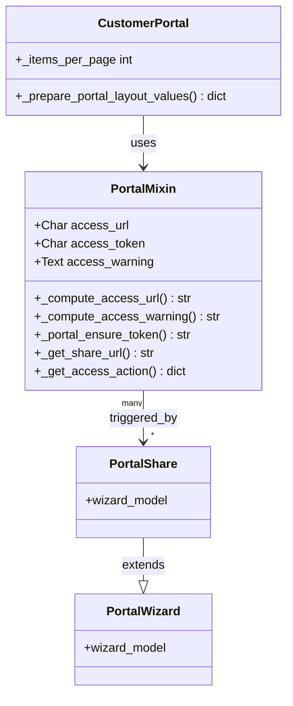

# C4 Code Level: Customer Portal (portal addon)

<!--
  Auto-generated by the c4-code agent. One file per source directory.
  Refreshed on /banyan-c4 reruns whenever the directory's content hash changes.
  Do NOT hand-edit; edits will be overwritten on next refresh.
-->

## Generated By

- **Agent**: c4-code (Haiku)
- **Run ID**: banyan-c4-20260701-init
- **Generated**: 2026-07-01T00:00:00Z
- **Source Directory**: addons/portal
- **Content Hash**: c4-code-addons-portal-init-20260701

## Overview

- **Name**: Customer Portal
- **Description**: Base controller and mixin for customer-facing portal pages with access control and document sharing
- **Location**: addons/portal — 27 Python files
- **Language**: Python (Odoo ORM models, HTTP controllers, utilities)
- **Purpose**: Infrastructure module providing portal authentication, access tokens, document sharing, and a base CustomerPortal controller. Business modules (sale, purchase, support) extend this to provide customer-visible pages for orders, invoices, and tickets.

## Code Elements

### Classes / Models

- **`PortalMixin`** — Abstract mixin enabling portal access for any model (sales orders, invoices, tickets, etc.)
  - **Location**: `models/portal_mixin.py:9`
  - **Methods**: 
    - `_compute_access_warning() → str` — [Override in subclass] Generate access warning message
    - `_compute_access_url() → str` — [Override in subclass] Compute portal URL path
    - `_portal_ensure_token() → str` — Generate/fetch UUID access_token if not set
    - `_get_share_url(redirect=False, signup_partner=False, pid=None, share_token=True) → str` — Build shareable URL with access parameters
    - `_get_access_action(access_uid=None, force_website=False) → dict` — Determine action (form view vs portal page) based on user type
    - `action_share() → dict` — Return "Share" action for portal_share wizard
    - `get_portal_url(suffix=None, report_type=None, download=None, query_string=None, anchor=None) → str` — Build portal URL with optional suffix, report type, and query params
  - **Key Fields**: 
    - `access_url` — Portal page URL (computed, override in subclass)
    - `access_token` — UUID security token for public sharing
    - `access_warning` — Message displayed on portal page (computed, can be overridden)
  - **Dependencies**: `res.users`, `res.partner`, `portal.share` (wizard), `auth_signup`
  - **Used By**: sale.order, account.move, purchase.order, hr.ticket, support.ticket, etc.

- **`CustomerPortal`** — HTTP controller for customer portal pages
  - **Location**: `controllers/portal.py:131`
  - **Methods**: 
    - `_prepare_portal_layout_values() → dict` — Prepare common template context (sales rep, address, payment method, etc.)
    - Various portal routes (e.g., `/my`, `/my/orders`, `/my/invoices`) — handled by subclasses in other modules
  - **Key Fields**: 
    - `_items_per_page` — Default pagination (80 items)
  - **Purpose**: Base controller; subclasses add routes for specific document types
  - **Dependencies**: `res.users`, `res.partner`, `ir.attachment`

### Functions / Methods (Top-Level)

- `pager(url, total, page=1, step=30, scope=5, url_args=None) → dict`
  - **Description**: Generate pagination metadata for template rendering
  - **Location**: `controllers/portal.py:17`
  - **Visibility**: public
  - **Parameters**: 
    - `url` — Base URL
    - `total` — Total item count
    - `page` — Current page (default 1)
    - `step` — Items per page (default 30)
    - `scope` — Number of page links to display (default 5)
    - `url_args` — Additional query parameters
  - **Returns**: Dict with keys: `page_count`, `offset`, `page`, `page_first`, `page_start`, `page_previous`, `page_next`, `page_end`, `page_last`, `pages`

- `get_records_pager(ids, current) → dict`
  - **Description**: Generate prev/next record navigation for detail pages
  - **Location**: `controllers/portal.py:85`
  - **Visibility**: public
  - **Returns**: Dict with `prev_record` and `next_record` URLs (with access_token if portal record)

- `_build_url_w_params(url_string, query_params, remove_duplicates=True) → str`
  - **Description**: Merge URL query parameters, optionally removing duplicates
  - **Location**: `controllers/portal.py:113`
  - **Visibility**: internal
  - **Parameters**: 
    - `url_string` — Full URL with existing query string
    - `query_params` — Dict of new/override parameters
    - `remove_duplicates` — If True, override duplicates; if False, preserve all
  - **Returns**: Rebuilt URL string

### Controllers / HTTP Routes

- **`CustomerPortal`** class in `controllers/portal.py`
  - **Base Route**: `/my` — Customer portal home page
  - **Methods extend to subclasses in sale, account, purchase, etc. modules**
  - **Typical Routes**: `/my/`, `/my/orders`, `/my/invoices`, `/my/account`
  - **Access Control**: `request.env.user.share` (portal user flag) or explicit token validation

### Models (HTTP/View Integration)

- **`ir.http`** — Extended to check portal access on routes
  - **Location**: `models/ir_http.py`
  - **Method**: `_dispatch()` — Validate access_token for portal routes before serving

- **`ir.qweb`** — Portal template rendering
  - **Location**: `models/ir_qweb.py`
  - **Purpose**: Make `pager()` and other utilities available in templates

- **`ir.ui.view`** — Portal view inheritance
  - **Location**: `models/ir_ui_view.py`
  - **Purpose**: Portal view extensions for document detail pages

- **`mail.message`** — Portal chatter integration
  - **Location**: `models/mail_message.py`
  - **Method**: Portal-safe message formatting

- **`mail.thread`** — Portal message/activity display
  - **Location**: `models/mail_thread.py`
  - **Purpose**: Constrain visible messages/activities for portal users

- **`res.partner`** — Portal user creation
  - **Location**: `models/res_partner.py`
  - **Method**: `_portal_ensure_token()` propagated from PortalMixin

- **`res.users`** — API key descriptions for portal users
  - **Location**: `models/res_users_apikeys_description.py`

### Wizards

- **`PortalShare`** — Wizard for sharing a record via email
  - **Location**: `wizard/portal_share.py`
  - **Purpose**: Generate share URL and send email to recipients

- **`PortalWizard`** — Wizard for bulk portal user creation
  - **Location**: `wizard/portal_wizard.py`

## Dependencies

### Internal

- `web` — Web framework, templates, backend assets
- `web_editor` — Editor tools for portal templates
- `http_routing` — HTTP routing infrastructure
- `mail` — Chatter, messages, activity tracking
- `auth_signup` — User signup/authentication for portal users

### External

- Werkzeug (`urls`, `url_parse`, `url_encode`) — URL manipulation
- Standard library (math, re) — URL building, string matching

## Relationships

## Notes for Higher-Level Synthesis

- **Infrastructure, Not Domain**: Portal is a foundation addon that provides mixin + controller scaffolding. It contains no business logic—each module (sale, purchase, account) extends PortalMixin and CustomerPortal to add its own pages.
- **Access Token Pattern**: Every portal-enabled record gets a UUID `access_token` that allows public viewing without login. Used for email-shared links and guest access.
- **Mixin Architecture**: `PortalMixin` is an `AbstractModel` that any model can inherit to gain portal capability. Subclasses override `_compute_access_url()` to set their own route and `_compute_access_warning()` for custom warnings.
- **Chatter Integration**: Portal users can comment on shared documents; messages are filtered to show only portal-safe content via `_message_compute_content_restricted_to` in `mail.thread`.
- **Pagination Utility**: The `pager()` function is a pure utility—not a method—for template rendering. Reusable across all portal pages.
- **Boundary Pattern**: Portal is HTTP-facing boundary code. Models in other addons delegate portal URL computation to PortalMixin; PortalMixin delegates to `CustomerPortal` controller.
- **Belongs with**: Sale (sale.order extends PortalMixin), Purchase (purchase.order), Accounting (account.move), HR (hr.ticket), Support (support.ticket) — any business model that needs customer-facing views.
