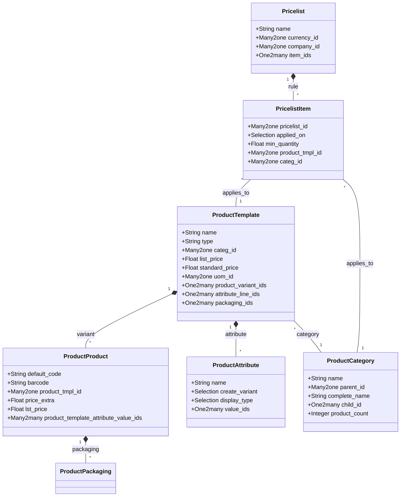

# C4 Code Level: Product (product addon)

<!--
  Auto-generated by the c4-code agent. One file per source directory.
  Refreshed on /banyan-c4 reruns whenever the directory's content hash changes.
  Do NOT hand-edit; edits will be overwritten on next refresh.
-->

## Generated By

- **Agent**: c4-code (Haiku)
- **Run ID**: banyan-c4-20260701-init
- **Generated**: 2026-07-01T00:00:00Z
- **Source Directory**: addons/product
- **Content Hash**: c4-code-addons-product-init-20260701

## Overview

- **Name**: Products & Pricelists
- **Description**: Core product management with variants, pricelists, packaging, and attributes
- **Location**: addons/product — 54 Python files
- **Language**: Python (Odoo ORM models, controllers, wizards)
- **Purpose**: Foundation module for managing product templates, product variants, categories, pricelists, and product attributes. Nearly every business module in Odoo depends on this for product data and pricing logic.

## Code Elements

### Classes / Models

- **`ProductTemplate`** — Template-level product definition with attributes, variants, pricing, and packaging
  - **Location**: `models/product_template.py:18`
  - **Methods**: `default_get()`, `_get_default_category_id()`, `_get_default_uom_id()`, `_read_group_categ_id()`, `_compute_product_variant_id()`, `_compute_standard_price()`, `_compute_weight()`, `_compute_volume()`
  - **Key Fields**: `name`, `type` (consu/service/combo), `categ_id`, `list_price`, `standard_price`, `uom_id`, `uom_po_id`, `product_variant_ids`, `attribute_line_ids`, `packaging_ids`, `seller_ids`
  - **Dependencies**: `mail.thread`, `mail.activity.mixin`, `image.mixin`, `uom.uom`, `product.category`, `product.packaging`, `product.supplierinfo`

- **`ProductProduct`** — Product variant (SKU) with variant-specific attributes and pricing
  - **Location**: `models/product_product.py:16`
  - **Methods**: `_compute_product_price_extra()`, `_compute_product_lst_price()`, `_set_product_lst_price()`, `_compute_product_code()`, `_set_template_field()`, `_compute_write_date()`
  - **Key Fields**: `default_code`, `barcode`, `product_tmpl_id`, `price_extra`, `lst_price`, `product_template_attribute_value_ids`, `combination_indices`, `standard_price`, `packaging_ids`
  - **Dependencies**: `product.template`, `product.packaging`, `product.document`

- **`ProductCategory`** — Hierarchical product categorization with complete name computation
  - **Location**: `models/product_category.py:8`
  - **Methods**: `_compute_complete_name()`, `_compute_product_count()`, `_check_category_recursion()`, `name_create()`, `_compute_display_name()`, `_unlink_except_default_category()`
  - **Key Fields**: `name`, `parent_id`, `complete_name`, `parent_path`, `child_id`, `product_count`, `product_properties_definition`
  - **Dependencies**: `mail.thread`
  - **Notes**: Hierarchical structure with parent_store enabled; deletion of default category and expense category is protected

- **`Pricelist`** — Pricelist definition with items and currency
  - **Location**: `models/product_pricelist.py:7`
  - **Methods**: `_compute_display_name()`, `write()`, `copy_data()`, `_get_products_price()`, `_get_product_price()`, `_get_product_price_rule()`, `_get_product_rule()`, `_compute_price_rule()`
  - **Key Fields**: `name`, `currency_id`, `company_id`, `country_group_ids`, `item_ids`, `active`, `sequence`
  - **Dependencies**: `mail.thread`, `mail.activity.mixin`, `product.pricelist.item`, `res.currency`, `res.country.group`

- **`PricelistItem`** — Individual pricelist rule with applicability and pricing logic
  - **Location**: `models/product_pricelist_item.py:8`
  - **Methods**: `_default_pricelist_id()`, `_compute_price()`, `_check_margin()`, `_check_price()`, `_check_currency_consistency()`
  - **Key Fields**: `pricelist_id`, `applied_on` (3_global/2_product_category/1_product/0_product_variant), `min_quantity`, `categ_id`, `product_tmpl_id`, `product_id`, `date_start`, `date_end`, `price`, `compute_price`, `base`, `pricelist_ids`
  - **Dependencies**: `product.pricelist`, `product.category`, `product.template`, `product.product`

- **`ProductAttribute`** — Product attribute definition with values and variant creation mode
  - **Location**: `models/product_attribute.py:7`
  - **Methods**: `_compute_number_related_products()`, `_compute_products()`
  - **Key Fields**: `name`, `create_variant` (always/dynamic/no_variant), `display_type` (radio/pills/select/color/multi), `value_ids`, `sequence`
  - **Dependencies**: `product.attribute.value`, `product.template.attribute.value`, `product.template.attribute.line`

- **`ProductPackaging`** — Packaging definition with UoM and quantities
  - **Location**: `models/product_packaging.py`
  - **Key Fields**: `product_id`, `product_tmpl_id`, `name`, `quantity`, `barcode`, `uom_id`
  - **Dependencies**: `product.product`, `product.template`, `uom.uom`

### Functions / Methods (Top-Level)

- `pager(url, total, page=1, step=30, scope=5, url_args=None) → dict`
  - **Description**: Generate pagination values for template rendering
  - **Location**: `controllers/portal.py:17`
  - **Visibility**: public
  - **Dependencies**: math, werkzeug.urls

- `_compute_price_rule(self, products, quantity, currency=None, uom=None, date=False, compute_price=True, **kwargs) → dict`
  - **Description**: Low-level pricelist computation for multiple products (mono pricelist, multi products)
  - **Location**: `models/product_pricelist.py:161`
  - **Visibility**: internal
  - **Returns**: `{product_id: (price, pricelist_rule)}`
  - **Dependencies**: `uom.uom`, `product.pricelist.item`, `res.currency`

### Constants / Configuration

- `PRICE_CONTEXT_KEYS` — List of context keys used in price computation: `['pricelist', 'quantity', 'uom', 'date']` (`models/product_template.py:15`)

## Dependencies

### Internal

- `uom` — Product unit of measure (UoM) category and conversion factors used by `product_template.uom_id` and `product_template.uom_po_id`
- `base` — Base Odoo models and utilities (res.company, res.partner, res.currency, res.country.group, decimal.precision)
- `mail` — Mail threading and activity tracking for product templates and pricelists

### External

- None declared at addon level; internal dependencies on Odoo framework only

## Relationships

## Notes for Higher-Level Synthesis

- **Core Foundation**: This addon is the base for nearly all business modules (sale, purchase, stock, manufacturing). Product, ProductTemplate, and ProductCategory are cross-cutting domain entities.
- **Pricelist Integration**: Pricelist and PricelistItem are tightly coupled; pricelist rules apply at multiple levels (global, category, template, variant). Price computation is stateless and can be called from any context.
- **Attribute System**: Product attributes enable variant creation with optional dynamic generation. Attribute lines and values are joinable tables for efficient querying.
- **UoM Dependency**: All quantity-based fields (list_price, standard_price, weight, volume) are tied to UoM. Conversions are delegated to the `uom` addon.
- **Belongs with**: Sale, Purchase, Stock, Manufacturing addons (all depend on product definitions and pricelist computation).
