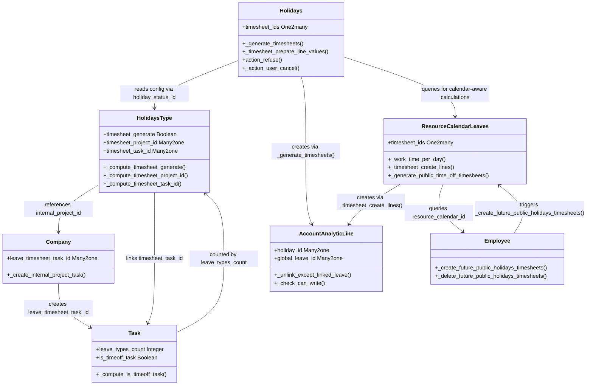

# C4 Code Level: Project Timesheet Holidays

<!--
  Auto-generated by the c4-code agent. One file per source directory.
  Refreshed on /banyan-c4 reruns whenever the directory's content hash changes.
  Do NOT hand-edit; edits will be overwritten on next refresh.
-->

## Generated By

- **Agent**: c4-code (Haiku)
- **Run ID**: banyan-c4-20260701-init
- **Generated**: 2026-07-01T08:47:00Z
- **Source Directory**: addons/project_timesheet_holidays
- **Content Hash**: 09f4c8e2b3a1d6f5e9c2a7b1d4f3e8a6

## Overview

- **Name**: Project Timesheet Holidays
- **Description**: Odoo 18.0 module that automatically generates timesheet entries when employees are on approved time off or during company-wide holidays
- **Location**: addons/project_timesheet_holidays — 7 model files, ~500 lines
- **Language**: Python (Odoo ORM/XML)
- **Purpose**: Bridges hr_timesheet and hr_holidays modules to synchronize time off with analytic timesheets; creates automatic timesheet entries for leave periods configured per company or per leave type

## Code Elements

### Classes / Models

- **`HolidaysType`** — Extends hr.leave.type with timesheet configuration
  - **Location**: `models/hr_holidays.py:10`
  - **Methods**: `_compute_timesheet_generate()`, `_compute_timesheet_project_id()`, `_compute_timesheet_task_id()`, `_check_timesheet_generate()`
  - **Extends**: `hr.leave.type` (Odoo base model)
  - **Key Fields**: `timesheet_generate` (Boolean, computed), `timesheet_project_id` (Many2one to project.project), `timesheet_task_id` (Many2one to project.task)
  - **Dependencies**: project.project, project.task, res.company

- **`Holidays`** — Extends hr.leave with timesheet generation logic
  - **Location**: `models/hr_holidays.py:55`
  - **Methods**: `_validate_leave_request()`, `_generate_timesheets()`, `_timesheet_prepare_line_values()`, `_check_missing_global_leave_timesheets()`, `action_refuse()`, `_action_user_cancel()`, `_force_cancel()`, `write()`
  - **Extends**: `hr.leave` (Odoo base model)
  - **Key Fields**: `timesheet_ids` (One2many to account.analytic.line)
  - **Dependencies**: account.analytic.line, resource.calendar.leaves, res.company

- **`AccountAnalyticLine`** — Extends account.analytic.line with leave/holiday tracking
  - **Location**: `models/account_analytic.py:9`
  - **Methods**: `_get_redirect_action()`, `_unlink_except_linked_leave()`, `_check_can_write()`, `_check_can_create()`, `_get_favorite_project_id_domain()`
  - **Extends**: `account.analytic.line` (Odoo base model)
  - **Key Fields**: `holiday_id` (Many2one to hr.leave), `global_leave_id` (Many2one to resource.calendar.leaves)
  - **Dependencies**: hr.leave, resource.calendar.leaves, project.task

- **`ResourceCalendarLeaves`** — Extends resource.calendar.leaves with public holiday timesheet generation
  - **Location**: `models/resource_calendar_leaves.py:10`
  - **Methods**: `_get_resource_calendars()`, `_work_time_per_day()`, `_timesheet_create_lines()`, `_timesheet_prepare_line_values()`, `_generate_timesheeets()`, `_generate_public_time_off_timesheets()`, `_get_overlapping_hr_leaves()`, `create()`, `write()`, `_regenerate_hr_leave_timesheets_on_gto_unlinked()`
  - **Extends**: `resource.calendar.leaves` (Odoo base model)
  - **Key Fields**: `timesheet_ids` (One2many to account.analytic.line)
  - **Dependencies**: hr.leave, account.analytic.line, hr.employee, resource.calendar

- **`Company`** — Extends res.company with leave timesheet task configuration
  - **Location**: `models/res_company.py:7`
  - **Methods**: `_create_internal_project_task()`
  - **Extends**: `res.company` (Odoo base model)
  - **Key Fields**: `leave_timesheet_task_id` (Many2one to project.task)
  - **Dependencies**: project.task, project.project

- **`ResConfigSettings`** — Extends res.config.settings with leave timesheet settings UI
  - **Location**: `models/res_config_settings.py:8`
  - **Methods**: `_onchange_timesheet_project_id()`, `_onchange_timesheet_task_id()`
  - **Extends**: `res.config.settings` (Odoo transient model)
  - **Key Fields**: `internal_project_id` (Many2one, related to company), `leave_timesheet_task_id` (Many2one, related to company)
  - **Dependencies**: res.company

- **`Employee`** — Extends hr.employee with public holiday timesheet synchronization
  - **Location**: `models/hr_employee.py:8`
  - **Methods**: `create()`, `write()`, `_delete_future_public_holidays_timesheets()`, `_create_future_public_holidays_timesheets()`
  - **Extends**: `hr.employee` (Odoo base model)
  - **Dependencies**: account.analytic.line, resource.calendar.leaves

- **`Task`** — Extends project.task with time-off task detection
  - **Location**: `models/project_task.py:6`
  - **Methods**: `_compute_leave_types_count()`, `_compute_is_timeoff_task()`, `_search_is_timeoff_task()`
  - **Extends**: `project.task` (Odoo base model)
  - **Key Fields**: `leave_types_count` (Integer, computed), `is_timeoff_task` (Boolean, computed)
  - **Dependencies**: hr.leave.type

### Key Functions

- `_generate_timesheets(ignored_resource_calendar_leaves=None)` — `Holidays`
  - **Description**: Main function that generates timesheet entries for validated time off; handles flexible hours, half-day leaves, and work calendar constraints
  - **Location**: `models/hr_holidays.py:64`
  - **Visibility**: internal
  - **Dependencies**: resource.calendar.leaves, account.analytic.line, pytz

- `_timesheet_prepare_line_values(index, work_hours_data, day_date, work_hours_count, project, task)` — `Holidays`
  - **Description**: Prepares a single timesheet line dictionary with project, task, hours, user, and holiday linkage
  - **Location**: `models/hr_holidays.py:124`
  - **Visibility**: internal
  - **Dependencies**: internal

- `_work_time_per_day(resource_calendars=False)` — `ResourceCalendarLeaves`
  - **Description**: Calculates work hours per day for global time off, respecting calendar attendance intervals and resource restrictions
  - **Location**: `models/resource_calendar_leaves.py:25`
  - **Visibility**: internal
  - **Dependencies**: resource.calendar, pytz.timezone

- `_timesheet_create_lines()` — `ResourceCalendarLeaves`
  - **Description**: Creates timesheet entries for all employees affected by global time off (public holidays), avoiding duplicates with individual leaves
  - **Location**: `models/resource_calendar_leaves.py:116`
  - **Visibility**: internal
  - **Dependencies**: hr.employee, hr.leave, account.analytic.line

- `_generate_public_time_off_timesheets(employees)` — `ResourceCalendarLeaves`
  - **Description**: Generates additional timesheet entries for employees when new public holidays are created or updated
  - **Location**: `models/resource_calendar_leaves.py:204`
  - **Visibility**: internal
  - **Dependencies**: account.analytic.line

- `_create_future_public_holidays_timesheets(employees)` — `Employee`
  - **Description**: Creates timesheet entries for future public holidays when a new employee is activated or calendar changes
  - **Location**: `models/hr_employee.py:60`
  - **Visibility**: internal
  - **Dependencies**: resource.calendar.leaves, account.analytic.line

### Constants / Configuration

None (configuration is stored as model fields, not hardcoded constants)

## Dependencies

### Internal (to other directories)

- `hr_timesheet` module — Provides account.analytic.line base model and timesheet framework
- `hr_holidays` module — Provides hr.leave, hr.leave.type, and leave validation logic
- `project` module — Provides project.project and project.task models for timesheet tracking
- `resource` module — Provides resource.calendar.leaves and resource.calendar for work hour calculations
- `base` module — Provides res.company, res.config.settings, hr.employee core models

### External (third-party)

- `pytz` — Timezone handling for calendar-aware work hour calculations (`models/hr_holidays.py:7`, `models/resource_calendar_leaves.py:5`)
- Odoo ORM (`api`, `fields`, `models`, `_` from odoo) — Core declarative model framework and field types
- Odoo exceptions (`ValidationError`, `UserError`, `RedirectWarning` from odoo.exceptions) — Standard error handling

## Relationships

## Notes for Higher-Level Synthesis

- **Component boundary**: This is a bridge module between two Odoo domains (HR/Leave and Project/Timesheet); consider grouping with either the Project Timesheet component or HR component depending on synthesis topology
- **Configuration-heavy**: Relies on company-level settings (`internal_project_id`, `leave_timesheet_task_id`) and per-leave-type settings for behavior; no business logic changes will work without proper config
- **Idempotent generation**: Timesheet generation is idempotent—old timesheets are unlinked before creating new ones, supporting regeneration when leave dates change or leaves are refused/cancelled
- **Global vs. individual leaves**: Handles two distinct flows—individual employee time off (via `Holidays` model) and company-wide public holidays (via `ResourceCalendarLeaves`)—with separate timesheet generation paths
- **Calendar-aware**: All work hour calculations use resource calendar and respect flexible hours, half-day leave, and work attendance patterns per employee; not a simple hour multiplier

