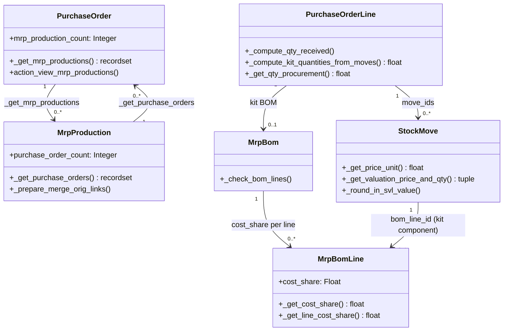

# C4 Code Level: Purchase-MRP Bridge

<!--
  Auto-generated by the c4-code agent. One file per source directory.
  Refreshed on /banyan-c4 reruns whenever the directory's content hash changes.
  Do NOT hand-edit; edits will be overwritten on next refresh.
-->

## Generated By

- **Agent**: c4-code (Haiku)
- **Run ID**: banyan-c4-20260701-init
- **Generated**: 2026-07-01T00:00:00Z
- **Source Directory**: addons/purchase_mrp
- **Content Hash**: 6a2f5c8d1b3e7g9h2i5j8k1l4m7n0o3p

## Overview

- **Name**: Purchase and MRP Management Bridge
- **Description**: Integrates purchase orders with manufacturing orders, enabling component replenishment from POs, cost allocation across kit BOMs, and MO-to-PO traceability.
- **Location**: addons/purchase_mrp — 9 files (5 models, 2 reports), 1800+ lines
- **Language**: Python (Odoo ORM)
- **Purpose**: Links purchase_stock and mrp modules to track procurement of components for manufacturing, handle kit purchases (phantom BOMs), cost allocation via cost_share %, and landed-cost integration.

## Code Elements

### Classes / Modules

- **`PurchaseOrder`** — Inherits from purchase.order; computes manufacturing orders supplied by this PO
  - **Location**: `models/purchase.py:10`
  - **Methods**: `_compute_mrp_production_count(...)`, `_get_mrp_productions(...)`, `action_view_mrp_productions()`
  - **Key Fields**: `mrp_production_count` (computed Integer)
  - **Dependencies**: odoo.api, odoo.fields, odoo.models, stock.move, mrp.production, procurement.group

- **`PurchaseOrderLine`** — Inherits from purchase.order.line; handles kit qty received, procurement, and stock moves
  - **Location**: `models/purchase.py:51`
  - **Methods**: `_compute_kit_quantities_from_moves(...)`, `_compute_qty_received(...)`, `_get_qty_procurement(...)`, `_get_move_dests_initial_demand(...)`, `_get_sale_order_line_product(...)`, `_prepare_stock_moves(...)`
  - **Key Behavior**: Detects kit BOMs and computes qty_received via component tracing; generates stock moves with bom_line_id tags; handles upstream document chain
  - **Dependencies**: odoo.api, odoo.models, mrp.bom, collections.defaultdict, odoo.tools.OrderedSet

- **`MrpProduction`** — Inherits from mrp.production; adds backlink to purchase orders
  - **Location**: `models/mrp_production.py:7`
  - **Methods**: `_compute_purchase_order_count(...)`, `action_view_purchase_orders(...)`, `_get_document_iterate_key(...)`, `_get_purchase_orders(...)`, `_prepare_merge_orig_links(...)`
  - **Key Fields**: `purchase_order_count` (computed Integer)
  - **Dependencies**: odoo.api, odoo.fields, odoo.models, stock.move, purchase.order.line

- **`MrpBom`** — Inherits from mrp.bom; validates and allocates component costs via cost_share %
  - **Location**: `models/mrp_bom.py:9`
  - **Methods**: `_check_bom_lines(...)`, `_round_last_line_done(...)`
  - **Implements**: @api.constrains on product_id, product_tmpl_id, bom_line_ids, byproduct_ids, operation_ids
  - **Key Behavior**: Enforces cost_share total = 100 per product variant; raises UserError on invalid cost allocation
  - **Dependencies**: odoo.api, odoo.models, odoo.exceptions.UserError, odoo.tools.float_is_zero

- **`MrpBomLine`** — Inherits from mrp.bom.line; adds cost_share field (% of kit purchase price per component)
  - **Location**: `models/mrp_bom.py:34`
  - **Methods**: `_get_cost_share(...)`, `_prepare_bom_done_values(...)`, `_prepare_line_done_values(...)`, `_get_line_cost_share(...)`
  - **Key Fields**: `cost_share` Float (%)
  - **Key Behavior**: Allocates kit purchase cost proportionally to components; defaults to equal share if unspecified
  - **Dependencies**: odoo.models, odoo.tools.float_is_zero

- **`StockMove`** — Inherits from stock.move; handles phantom move valuation and purchase line linkage
  - **Location**: `models/stock_move.py:11`
  - **Methods**: `_prepare_phantom_move_values(...)`, `_get_price_unit(...)`, `_get_valuation_price_and_qty(...)`, `_get_qty_received_without_self(...)`, `_round_in_svl_value(...)`
  - **Key Behavior**: For kit components, allocates PO price based on cost_share; applies to landed costs via stock valuation layer rounding
  - **Dependencies**: odoo.models, odoo.api, odoo.fields, purchase.line.id

- **`AccountMoveLine`** — Inherits from account.move.line; skips invoice corrections for kit components
  - **Location**: `models/account_move.py:7`
  - **Methods**: `_get_stock_valuation_layers(move)`
  - **Key Behavior**: Filters valuation layers to match invoice product only (avoids double-counting kit components)
  - **Dependencies**: odoo.models

### Functions / Methods (Key Signatures)

- `PurchaseOrderLine._compute_kit_quantities_from_moves(self, moves, kit_bom) → float`
  - **Description**: For kit BOMs, computes qty received from stock moves using component filtering
  - **Location**: `models/purchase.py:54`
  - **Visibility**: public
  - **Dependencies**: stock.move._compute_kit_quantities()

- `PurchaseOrderLine._compute_qty_received(self) → None`
  - **Description**: Overrides to detect kit BOMs and compute qty by components instead of qty match
  - **Location**: `models/purchase.py:67`
  - **Visibility**: public (inherited)
  - **Dependencies**: mrp.bom._bom_find(), stock.move.move_ids, collections.defaultdict

- `MrpBomLine._get_cost_share(self) → float`
  - **Description**: Returns cost_share % for this line; defaults to equal share across components
  - **Location**: `models/mrp_bom.py:42`
  - **Visibility**: public
  - **Dependencies**: odoo.tools.float_is_zero

- `StockMove._get_price_unit(self) → float or dict`
  - **Description**: For kit components, allocates purchase price based on cost_share, BOMs, and UOM conversions
  - **Location**: `models/stock_move.py:20`
  - **Visibility**: public (inherited override)
  - **Dependencies**: purchase.line.id, mrp.bom, currency conversion

- `StockMove._get_valuation_price_and_qty(self, related_aml, to_curr) → tuple`
  - **Description**: For kit products, recomputes valuation qty via component-level stock move tracing
  - **Location**: `models/stock_move.py:46`
  - **Visibility**: public (inherited override)
  - **Dependencies**: mrp.bom._bom_find(), stock.move._compute_kit_quantities()

- `MrpProduction._get_purchase_orders(self) → purchase.order recordset`
  - **Description**: Returns POs linked via procurement group or stock move chains
  - **Location**: `models/mrp_production.py:46`
  - **Visibility**: public
  - **Dependencies**: procurement.group, stock.move._rollup_move_origs()

### Constants / Configuration

- `__manifest__.py`
  - **name**: 'Purchase and MRP Management'
  - **depends**: ['mrp', 'purchase_stock']
  - **auto_install**: True
  - **Location**: `__manifest__.py:5-35`

## Dependencies

### Internal

- `mrp.bom` + `mrp.bom.line` — Kit (phantom) BOMs; cost_share allocation per component; methods: `_bom_find()`, `explode()`, `_check_bom_lines()`
- `mrp.production` — Manufacturing orders; linked via procurement_group and stock moves
- `purchase.order` + `purchase.order.line` — Purchase orders and lines; qty_received computed from kit moves
- `stock.move` + `stock.move.line` — Stock moves from PO receipt; tagged with bom_line_id for kit components; price unit allocated by cost_share
- `stock.valuation.layer` — Cost tracking for landed costs; rounding applied per kit line
- `procurement.group` — Grouping moves and MOs; chains orders via stock.move links
- `product.product` — Products; UOM conversions across purchase → BOM → stock layers
- `account.move.line` — Invoice lines; valuation layer filtering by product

### External

- `odoo.api` (core) — decorators (@api.depends, @api.model, @api.constrains)
- `odoo.fields` (core) — Integer, Float, Many2one, Many2many
- `odoo.models` (core) — Model base class
- `odoo.exceptions.UserError` (core) — Validation errors
- `odoo.tools` (core) — float_is_zero, float_round, OrderedSet, Command
- `collections.defaultdict` (Python stdlib) — Cost allocation grouping

## Relationships

## Notes for Higher-Level Synthesis

- **Belongs with** `purchase_stock` and `mrp` components — bridge module adding computed fields and cost-allocation logic
- **Cost integration point**: purchase_mrp implements landed-cost distribution across kit components via cost_share % and stock valuation layer rounding
- **Data flow**: PO → StockMove (with bom_line_id tags) → StockValuationLayer (cost allocated per cost_share) → AccountMove (invoice lines)
- **Kit handling**: Detects phantom BOMs and computes qty_received at component level; qty quantities tied to BOM explosion, not raw move counts
