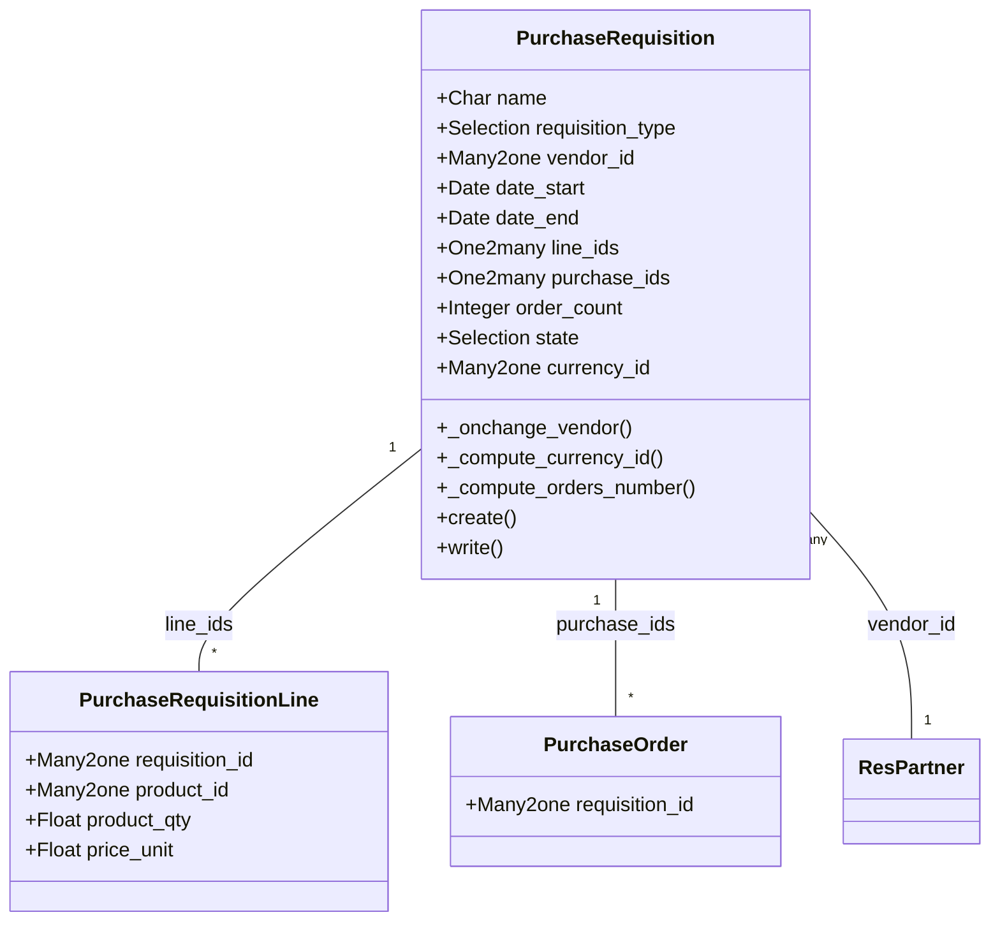

# C4 Code Level: purchase_requisition

<!--
  Auto-generated by the c4-code agent. One file per source directory.
  Refreshed on /banyan-c4 reruns whenever the directory's content hash changes.
  Do NOT hand-edit; edits will be overwritten on next refresh.
-->

## Generated By

- **Agent**: c4-code (Haiku)
- **Run ID**: banyan-c4-20260701-init
- **Generated**: 2026-07-01T00:00:00Z
- **Source Directory**: addons/purchase_requisition
- **Content Hash**: purchase_requisition-root-20260701

## Overview

- **Name**: Purchase Agreements
- **Description**: Manages purchase agreements including blanket orders (predetermined pricing from vendors) and calls for tenders (competitive bidding process)
- **Location**: addons/purchase_requisition — 2 root files (plus 4 model files, 2 test files, 2 wizard files)
- **Language**: Python (Odoo 18.0)
- **Purpose**: Enables procurement teams to establish volume-based purchasing commitments with vendors and run competitive tender processes for optimal supplier selection

## Code Elements

### Root-Level Code

#### Module Initialization
- `__init__.py` — Imports models and wizard submodules
  - **Location**: `addons/purchase_requisition/__init__.py:3–4`
  - **Visibility**: internal
  - **Purpose**: Registers models and wizard workflows for ORM/action discovery

#### Manifest Declaration
- `__manifest__.py` — Module metadata and UI/asset registration
  - **Location**: `addons/purchase_requisition/__manifest__.py:1–38`
  - **Visibility**: internal
  - **Key Fields**:
    - `name`: 'Purchase Agreements'
    - `version`: '0.1'
    - `depends`: ['purchase']
    - `category`: 'Inventory/Purchase'
    - `license`: 'LGPL-3'
    - `assets`: Web backend JS/SCSS/XML assets for purchase agreement forms

### Primary ORM Models (via submodule)

**Note**: The following models are imported via `models/__init__.py` and define the public interface:

- **`PurchaseRequisition`** — Main entity for purchase agreements
  - **Location**: `addons/purchase_requisition/models/purchase_requisition.py:8`
  - **Purpose**: Represents blanket orders or purchase templates; coordinates vendor commitments and purchase order generation
  - **Key Methods**:
    - `_onchange_vendor()` — Warns if duplicate blanket order exists for same vendor
    - `_compute_currency_id()` — Derives currency from vendor or company default
    - `_compute_orders_number()` — Counts linked purchase orders
    - `_check_dates()` — Validates date_start ≤ date_end
    - `create(vals_list)` — Generates sequence-based naming per requisition_type
    - `write(vals)` — Handles type/company changes
  - **Key Fields**:
    - `name` (Char) — Agreement identifier (generated from sequence)
    - `requisition_type` (Selection: blanket_order | purchase_template)
    - `vendor_id` (Many2one res.partner) — Primary supplier
    - `date_start`, `date_end` (Date) — Agreement validity period
    - `line_ids` (One2many) — Products and pricing terms
    - `purchase_ids` (One2many) — Generated purchase orders
    - `order_count` (computed Integer) — Number of POs created
    - `state` (Selection: draft → confirmed → done / cancel)
    - `currency_id` (Many2one) — Vendor or company currency

- **`PurchaseRequisitionLine`** — Line items within agreements
  - **Location**: `addons/purchase_requisition/models/purchase_requisition.py` (nested relationship)
  - **Purpose**: Defines products, quantities, and pricing for a requisition

- **`Purchase` (extended)** — Enhanced with agreement linking
  - **Location**: `addons/purchase_requisition/models/purchase.py`
  - **Purpose**: Links purchase orders back to requisitions; enables PO creation from agreement line items

- **`Product` (extended)** — Extended with agreement fields
  - **Location**: `addons/purchase_requisition/models/product.py`
  - **Purpose**: Stores product-level procurement preferences for agreements

- **`ResConfigSettings` (extended)** — System-wide procurement settings
  - **Location**: `addons/purchase_requisition/models/res_config_settings.py`
  - **Purpose**: UI for configuring default agreement behaviors

### Wizard Actions (via submodule)

**Note**: The following wizards are imported via `wizard/__init__.py` and handle user workflows:

- **`PurchaseRequisitionAlternativeWarning`** — Duplicate detection dialog
  - **Location**: `addons/purchase_requisition/wizard/purchase_requisition_alternative_warning.py`
  - **Purpose**: Prompts user when creating a blanket order for a vendor with existing active agreements

- **`PurchaseRequisitionCreateAlternative`** — Alternative PO creation
  - **Location**: `addons/purchase_requisition/wizard/purchase_requisition_create_alternative.py`
  - **Purpose**: Allows selection of alternative vendors/lines when creating POs from a template

### Constants

- `requisition_type` Selections
  - **Location**: `addons/purchase_requisition/models/purchase_requisition.py:21–23`
  - **Values**:
    - `'blanket_order'` — Standing offer with fixed pricing from single vendor
    - `'purchase_template'` — Template for competitive bidding (call for tender)

- `state` Workflow States
  - **Location**: `addons/purchase_requisition/models/purchase_requisition.py:34–40`
  - **Values**:
    - `'draft'` — Initial state; editable
    - `'confirmed'` — Locked; POs can be created
    - `'done'` — Closed; no further PO creation
    - `'cancel'` — Cancelled; archived

## Dependencies

### Internal (Odoo Core)

- **`purchase`** — Base purchase order module; defines purchase.order and purchase.order.line models
- **`mail.thread`, `mail.activity.mixin`** — Messaging and workflow tracking (inherited)

### External

- **Odoo 18.0 core** — ORM framework (models, fields, API decorators)
- **odoo.exceptions.UserError, ValidationError** — Error handling
- **collections.defaultdict** — Python standard library for grouping logic
- **Web Assets** (JS/SCSS) — Frontend form enhancements (registered in manifest)

## Relationships

## Notes for Higher-Level Synthesis

- **Component Cohesion**: Extends `purchase` (core procurement). Paired with `purchase_stock` and other purchase variants (`purchase_mrp`, `purchase_repair`). Part of the **Procurement & Supplier Management** logical component.
- **Boundary Code**: Public interface is the PurchaseRequisition model and wizard actions. No HTTP handlers; entirely ORM-driven forms/reports. Wizards handle user interactions (duplicate warnings, alternative vendor selection).
- **Key Business Logic**: Agreement validation (duplicate detection, date constraints), currency derivation, and PO generation from line items. State machine ensures agreements cannot be modified post-confirmation.
