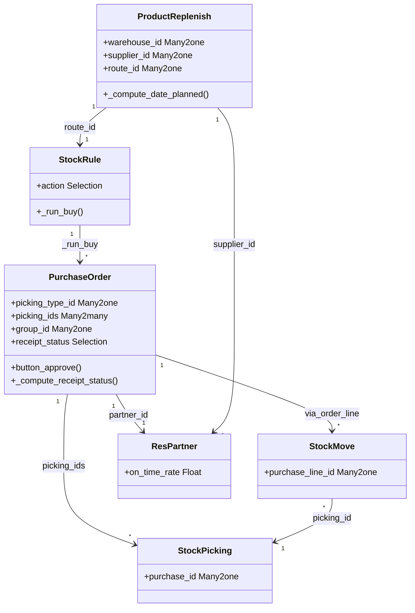

# C4 Code Level: Purchase Stock Bridge

<!--
  Auto-generated by the c4-code agent. One file per source directory.
  Refreshed on /banyan-c4 reruns whenever the directory's content hash changes.
  Do NOT hand-edit; edits will be overwritten on next refresh.
-->

## Generated By

- **Agent**: c4-code (Haiku)
- **Run ID**: banyan-c4-20260701-init
- **Generated**: 2026-07-01T00:00:00Z
- **Source Directory**: addons/purchase_stock
- **Content Hash**: 20260701-initial

## Overview

- **Name**: Purchase and Warehouse Management Bridge
- **Description**: Connects purchase orders to stock receipts and returns; manages vendor lead times, receipt tracking, and purchase forecasting
- **Location**: addons/purchase_stock — 10 models, 2 wizards, 3 reports
- **Language**: Python (Odoo 18.0 ORM)
- **Purpose**: Links purchase orders to stock.picking (receipt orders), manages vendor lead times, receipt status, replenishment rules, and supplier performance tracking

## Code Elements

### Classes / Models

- **`PurchaseOrder`** — Inherits purchase.order; manages receipts, vendor delays, and replenishment
  - **Location**: `models/purchase_order.py:<12>`
  - **Key Methods**:
    - `_default_picking_type()` — Returns default incoming picking type for company
    - `_compute_picking_ids()` — Derives from order_line.move_ids.picking_id
    - `_compute_incoming_picking_count()` — Counts receipt pickings
    - `_compute_effective_date()` — Arrival date of first receipt (first done picking)
    - `_compute_is_shipped()` — True if all pickings done or cancelled
    - `_compute_receipt_status()` — Tracks receipt state: pending, partial, full (stored)
    - `_compute_dest_address_id()` — Clears for non-customer drop-ship locations
    - `_onchange_company_id()` — Updates picking_type_id on company change
    - `write(vals)` — Logs quantity decreases in order_line changes
    - `action_add_from_catalog()` — Overrides to use purchase-specific kanban view
    - `button_approve(force=False)` — Creates stock.picking on approval
  - **Key Fields**:
    - `incoterm_location` — Char
    - `incoming_picking_count` — Integer (computed)
    - `picking_ids` — Many2many to stock.picking (computed, stored)
    - `picking_type_id` — Many2one to stock.picking.type (required, default=_default_picking_type)
    - `dest_address_id` — Many2one to res.partner (computed, stored, readonly=False)
    - `group_id` — Many2one to procurement.group
    - `is_shipped` — Boolean (computed)
    - `effective_date` — Datetime (computed, stored)
    - `on_time_rate` — Float (related to partner_id)
    - `receipt_status` — Selection: pending, partial, full (computed, stored)
  - **Dependencies**: purchase, stock, account

- **`PurchaseOrderLine`** (inherited) — Links to stock moves and replenishment
  - **Location**: `models/purchase_order_line.py` (contains move creation logic)
  - **Key Methods**:
    - Move creation and state tracking
  - **Dependencies**: purchase, stock

- **`StockRule`** — Extends stock.rule with purchase ('buy') action
  - **Location**: `models/stock_rule.py:<14>`
  - **Key Methods**:
    - `_get_message_dict()` — Adds 'buy' action message
    - `_compute_picking_type_code_domain()` — Sets picking_type_code_domain='incoming' for 'buy' action
    - `_onchange_action()` — Clears location_src_id on 'buy' action
    - `_run_buy(procurements)` — Core method; creates POs from procurements
      - Selects supplier via _select_seller or supplier_info
      - Groups procurements by PO domain (buyer, company, location)
      - Creates/updates POs for each domain group
      - Sets supplier, propagate_cancel in procurement.values
  - **Key Fields**:
    - `action` — Selection extended with ('buy', 'Buy')
  - **Dependencies**: purchase, stock, procurement

- **`StockMove`** (inherited) — Extends stock.move
  - **Location**: `models/stock_move.py`
  - **Key Methods**: Purchase-specific move handling
  - **Dependencies**: stock, purchase

- **`StockMoveLine`** (inherited) — Extends stock.move.line
  - **Location**: `models/stock_move.py`
  - **Dependencies**: stock

- **`StockReplenishMixin`** — Mixin for replenishment computation
  - **Location**: `models/stock_replenish_mixin.py:<1>`
  - **Key Methods**:
    - Replenishment quantity and timing logic
  - **Dependencies**: stock

- **`Product`** (inherited) — Extends product.product
  - **Location**: `models/product.py`
  - **Key Methods**: Seller/supplier selection logic
  - **Dependencies**: product, stock

- **`ResPartner`** (inherited) — Extends res.partner with vendor tracking
  - **Location**: `models/res_partner.py:<1>`
  - **Key Methods**: Vendor delay tracking
  - **Dependencies**: res_partner, purchase

- **`StockValuationLayer`** (inherited) — Extends stock_account.stock.valuation.layer
  - **Location**: `models/stock_valuation_layer.py:<1>`
  - **Key Methods**: Purchase cost valuation
  - **Dependencies**: stock_account, purchase

- **`ProductReplenish`** — Wizard for manual replenishment
  - **Location**: `wizard/product_replenish.py:<8>`
  - **Key Methods**:
    - `default_get(fields)` — Populates warehouse_id, route_id, supplier_id from orderpoint
    - `_onchange_supplier_id()` — Updates supplier based on route visibility
    - `_compute_date_planned()` — Computes planned date via _get_date_planned for 'buy' routes
    - `_prepare_run_values()` — Adds supplierinfo_id to procurement values
    - `action_stock_replenishment_info()` — Opens replenishment info dialog
    - `_get_record_to_notify(date)` — Returns purchase.order.line record
    - `_get_replenishment_order_notification_link(order_line)` — Formats PO link
    - `_get_date_planned(route_id, **kwargs)` — Computes delivery date via supplier lead time
  - **Key Fields**:
    - `warehouse_id` — Many2one to stock.warehouse
    - `route_id` — Many2one to stock.route
    - `supplier_id` — Many2one to res.partner (seller)
    - `date_planned` — Datetime (computed)
  - **Dependencies**: stock, purchase

- **`StockReplenishmentInfo`** — Wizard for replenishment info display
  - **Location**: `wizard/stock_replenishment_info.py:<1>`
  - **Key Methods**: Replenishment forecast and MO/PO history
  - **Dependencies**: stock, purchase, mrp

### Functions / Methods (Module-level)

- `_run_buy(procurements)` — StockRule method; creates purchase orders from stock procurements
  - **Description**: Selects suppliers, groups procurements by PO domain, creates/updates POs
  - **Location**: `models/stock_rule.py:<48>`
  - **Visibility**: public (model method)
  - **Dependencies**: product._select_seller, purchase.order, procurement

- `_get_date_planned(route_id, **kwargs)` — ProductReplenish method; computes delivery date
  - **Description**: Adds lead time from supplier/route to compute expected delivery
  - **Location**: `wizard/product_replenish.py:<77>`
  - **Visibility**: public
  - **Dependencies**: stock.rule, res.partner.supplier

### Constants / Configuration

- `receipt_status` field options — `('pending', 'partial', 'full')`
  - **Purpose**: Tracks receipt progress at PO level (`addons/purchase_stock/models/purchase_order.py:<32>`)

- `StockRule.action` extended selection — `('buy', 'Buy')`
  - **Purpose**: Identifies rules that trigger purchase order creation (`addons/purchase_stock/models/stock_rule.py:<17>`)

## Dependencies

### Internal

- **purchase** — Base purchase.order, purchase.order.line models; order state and approval workflow
- **stock** — stock.picking, stock.move, stock.rule, procurement.group, stock.warehouse, stock.orderpoint
- **stock_account** — Valuation layer integration; receipt cost accounting
- **account** — account.move for purchase invoicing
- **product** — product.product, product.template; supplier selection
- **res.partner** — Vendor/supplier management; lead time tracking
- **mrp** — (optional) Manufacturing replenishment forecasts

### External

- **Odoo Framework** (18.0) — ORM models, fields, api decorators, @api.depends, @api.model
- **Python stdlib** — logging, datetime, dateutil.relativedelta, collections (defaultdict)
- **Odoo utilities** — float_compare, groupby, ProcurementException

## Relationships

## Notes for Higher-Level Synthesis

- **Belongs with purchase_* components** — This is the glue layer between purchase and stock domains; create a logical component for "Purchase-Stock Bridge" including procurement.group, stock.rule (buy action), and picking linkage
- **StockRule._run_buy is critical** — Core procurement execution; all supplier selection, PO grouping, and creation logic concentrated here; coordinate with procurement engine
- **Vendor performance tracking** — partner_id.on_time_rate drives supplier selection and lead time computation; integrate with vendor delay reports
- **Receipt status mirrors delivery_status in sale_stock** — Same pattern: pending → partial → full; coordinate with forecasting and scheduling
- **Replenishment wizard is user-facing interface** — ProductReplenish bridges automated and manual replenishment; conversions and date computation are sensitive to lead time changes
- **Lead time propagation** — route_id → supplier lead time → date_planned is the critical path for MRP forecasting; any change to supplier field invalidates forecasts

