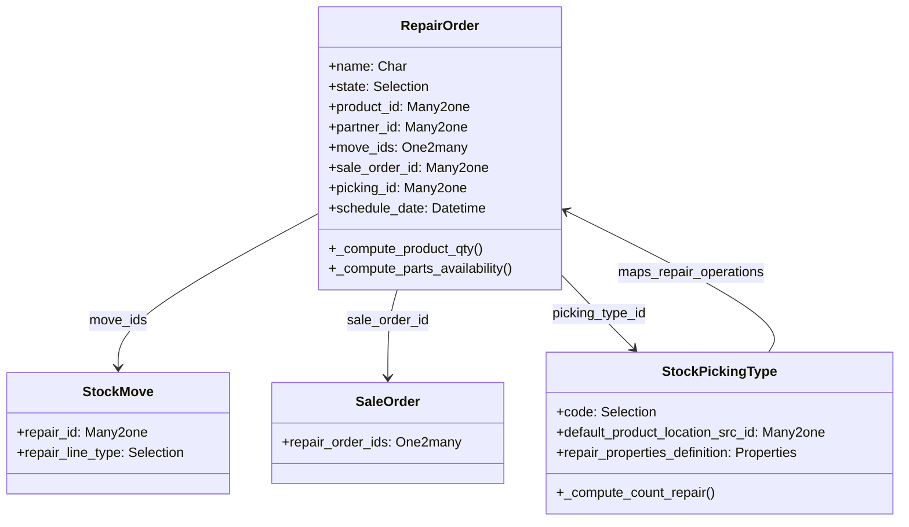

# C4 Code Level: addons/repair

<!--
  Auto-generated by the c4-code agent. One file per source directory.
  Refreshed on /banyan-c4 reruns whenever the directory's content hash changes.
  Do NOT hand-edit; edits will be overwritten on next refresh.
-->

## Generated By

- **Agent**: c4-code (Haiku)
- **Run ID**: banyan-c4-20260701-init
- **Generated**: 2026-07-01T00:00:00Z
- **Source Directory**: addons/repair
- **Content Hash**: hash-repair-addon-root-only

## Overview

- **Name**: Repair Orders Module
- **Description**: Manages after-sales product repair orders with parts tracking, labor, and invoicing
- **Location**: addons/repair — 21 root-level files (7 models, 1 wizard, 1 report, 3 tests)
- **Language**: Python 3.10+
- **Purpose**: Provides repair.order entity to track product repairs, manage replacement parts, track warranty claims, and integrate stock/material movements with sales invoicing

## Code Elements

### Classes / Models

- **`Repair`** — Core repair order model for after-sales service
  - **Location**: `models/repair.py:<line 20>`
  - **Model Name**: `repair.order`
  - **Methods**: `_default_picking_type_id()`, `_compute_product_qty()`, `_compute_partner_id()`, `_compute_picking_product_ids()`, `_compute_allowed_lot_ids()`, `compute_product_uom()`, `compute_lot_id()`, `_compute_picking_type_id()`, `_compute_location_id()`, `_compute_product_location_src_id()`, `_compute_product_location_dest_id()`, `_compute_recycle_location_id()`, `_compute_parts_availability()`
  - **Key Fields**: 
    - `name` (Char) — Repair reference number
    - `state` (Selection) — Status [draft, confirmed, under_repair, done, cancel]
    - `product_id` (Many2one → product.product) — Product to be repaired
    - `product_qty` (Float) — Quantity of product to repair
    - `partner_id` (Many2one → res.partner) — Customer
    - `move_ids` (One2many → stock.move) — Replacement parts used
    - `sale_order_id` (Many2one → sale.order) — Linked sales order
    - `picking_id` (Many2one → stock.picking) — Linked return order
    - `under_warranty` (Boolean) — Warranty status flag
    - `schedule_date` (Datetime) — Scheduled repair date
    - `repair_properties` (Properties) — Custom properties per operation type
    - Location fields: `location_id`, `product_location_src_id`, `product_location_dest_id`, `parts_location_id`, `recycle_location_id`
  - **Inherits**: `mail.thread`, `mail.activity.mixin`, `product.catalog.mixin`
  - **Dependencies**: stock (picking types, locations, moves), sale_management (sale orders), res.partner, stock.lot

- **`StockMove`** — Extension to stock.move for repair tracking
  - **Location**: `models/stock_move.py`
  - **Methods**: Repair-specific move handling and constraints
  - **Inherits**: Extends `stock.move`
  - **Dependencies**: repair.order

- **`StockMoveLine`** — Extension to stock.move.line for repair parts traceability
  - **Location**: `models/stock_move_line.py`
  - **Inherits**: Extends `stock.move.line`
  - **Dependencies**: repair.order, stock.move

- **`StockPickingType`** — Repair operation type configuration
  - **Location**: `models/stock_picking.py:<line 11>`
  - **Methods**: `_compute_count_repair()`, repair operations counting
  - **Fields Added**:
    - `code` — Selection adds 'repair_operation' type
    - `count_repair_*` — Computed repair counts by state
    - `default_product_location_src_id`, `default_product_location_dest_id` — Location mappings
    - `default_remove_location_dest_id`, `default_recycle_location_dest_id` — Parts location mappings
    - `repair_properties_definition` — Custom property schema
  - **Inherits**: Extends `stock.picking.type`
  - **Dependencies**: repair.order

- **`StockPicking`** — Return order integration with repair
  - **Location**: `models/stock_picking.py`
  - **Inherits**: Extends `stock.picking`
  - **Dependencies**: repair.order

- **`StockLot`** — Serial/lot handling for repairs
  - **Location**: `models/stock_lot.py`
  - **Inherits**: Extends `stock.lot`
  - **Dependencies**: repair.order

- **`Product`** — Product repair tracking
  - **Location**: `models/product.py`
  - **Inherits**: Extends `product.product`, `product.template`
  - **Dependencies**: repair.order

- **`SaleOrder`** — Sales order to repair order linking
  - **Location**: `models/sale_order.py`
  - **Inherits**: Extends `sale.order`, `sale.order.line`
  - **Dependencies**: repair.order, stock

- **`StockWarehouse`** — Warehouse repair operation initialization
  - **Location**: `models/stock_warehouse.py`
  - **Methods**: `_create_or_update_sequences_and_picking_types()`
  - **Inherits**: Extends `stock.warehouse`
  - **Dependencies**: repair.order, stock.picking.type

- **`StockTraceability`** — Repair traceability reporting
  - **Location**: `models/stock_traceability.py`
  - **Inherits**: Extends traceability models
  - **Dependencies**: repair.order, stock

- **`StockWarnInsufficientQty`** — Wizard for insufficient parts warning
  - **Location**: `wizard/stock_warn_insufficient_qty.py`
  - **Methods**: Warn user when parts availability is insufficient
  - **Dependencies**: repair.order, stock.move

### Functions / Methods (Root Init Hook)

- `_create_warehouse_data(env)`
  - **Description**: Post-install hook to create default repair picking types on all warehouses not yet configured
  - **Location**: `__init__.py:<line 10>`
  - **Visibility**: internal (module hook)
  - **Dependencies**: stock.warehouse, stock.picking.type

### Report Models

- **`StockForecastedReport`** — Forecasted availability report for repair parts
  - **Location**: `report/stock_forecasted.py`
  - **Purpose**: Display future stock availability for parts used in repairs
  - **Dependencies**: repair.order, stock.move, stock.forecast

## Dependencies

### Internal

- `stock` — Core inventory management; provides picking types, moves, locations, lots
  - Repair orders create stock moves for parts consumption
  - Integrates with warehouse picking type configuration
  - Tracks product location source/dest for repair workflow

- `sale_management` — Sales order integration
  - Repair orders can be created from sales returns/warranty claims
  - Repair costs invoiced via sale order flow

- `mail` (via mail.thread, mail.activity.mixin) — Notifications and activity tracking
  - Repair order state changes trigger notifications
  - Activity logging for repair progress

### External

- `odoo.exceptions` (UserError, ValidationError) — Standard error handling
- `odoo.api` (decorators: @api.depends, @api.model) — ORM API decorators
- `odoo.fields` — Field type definitions
- `odoo.osv.expression` — Domain/filter expression building
- `odoo.tools` (float_compare, float_is_zero, clean_context, format_date, groupby) — Utility functions

## Relationships

## Notes for Higher-Level Synthesis

- **Boundary code**: Repair module integrates multiple stock operations — return picking management, parts consumption, and finished goods movement. Acts as a bridge between sales (orders, warranties) and inventory (stock moves, locations, traceability).
- **Component grouping**: Belongs with stock/inventory component — shares strong coupling with stock.picking.type, stock.move, and location management. Could also be considered part of sales-adjacent features (warranty, RMA workflow).
- **Database consistency**: Parts availability computation (`_compute_parts_availability`) is performance-sensitive; relies on prefetching and domain queries across large move sets. Watch for N+1 issues in custom extensions.
