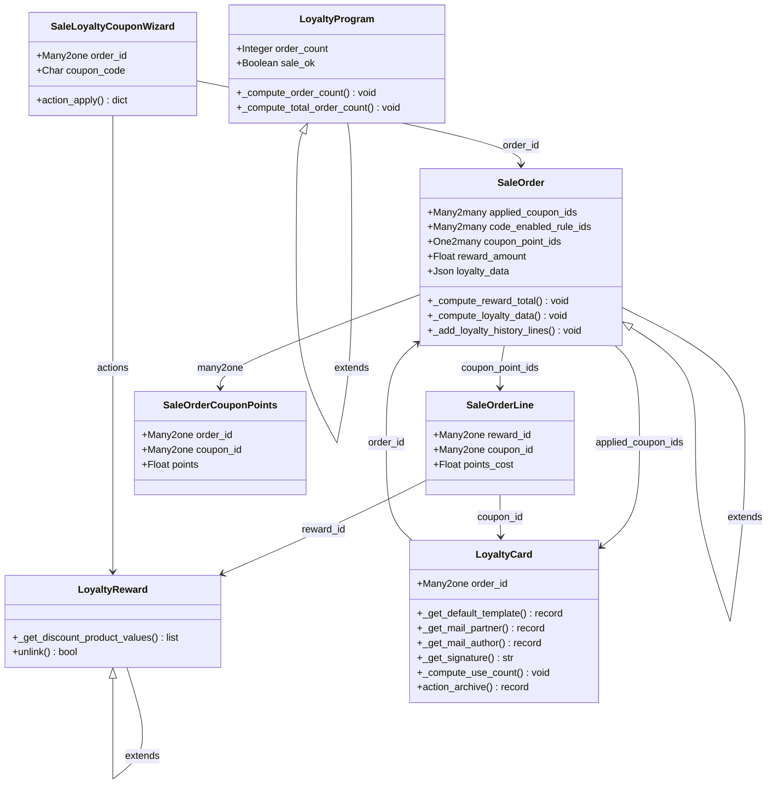

# C4 Code Level: Sale Loyalty

<!--
  Auto-generated by the c4-code agent. One file per source directory.
  Refreshed on /banyan-c4 reruns whenever the directory's content hash changes.
  Do NOT hand-edit; edits will be overwritten on next refresh.
-->

## Generated By

- **Agent**: c4-code (Haiku)
- **Run ID**: banyan-c4-20260701-init
- **Generated**: 2026-07-01T08:46:16Z
- **Source Directory**: addons/sale_loyalty
- **Content Hash**: sha256:e8f0c1d4a2b5c9e7f3a1b8c6d4e2f0a9

## Overview

- **Name**: Sale Loyalty
- **Description**: Extends Odoo loyalty program framework with sales-specific rewards, discounts, and coupon management
- **Location**: addons/sale_loyalty — 28 files (core: 11 models + wizards, tests: 13)
- **Language**: Python 3.x (Odoo ORM)
- **Purpose**: Bridges loyalty.program domain into sales orders; manages loyalty points, coupon codes, rewards application, and gift card integration for POS/eCommerce

## Code Elements

### Classes / Modules

- **`LoyaltyProgram`** — Extends loyalty.program with sales-specific order tracking
  - **Location**: `models/loyalty_program.py:7`
  - **Methods**: `_compute_order_count()`, `_compute_total_order_count()`
  - **Implements / Extends**: `loyalty.program`
  - **Dependencies**: `sale.order.line`, `sale.order` (indirect)

- **`LoyaltyReward`** — Extends loyalty.reward with discount product configuration for sales
  - **Location**: `models/loyalty_reward.py:7`
  - **Methods**: `_get_discount_product_values()`, `unlink()`
  - **Implements / Extends**: `loyalty.reward`
  - **Dependencies**: `sale.order.line`

- **`SaleOrder`** — Extends sale.order with coupon/reward application and tracking
  - **Location**: `models/sale_order.py:20`
  - **Fields**: `applied_coupon_ids`, `code_enabled_rule_ids`, `coupon_point_ids`, `reward_amount`, `loyalty_data`
  - **Methods**: `_compute_reward_total()`, `_compute_loyalty_data()`, `_add_loyalty_history_lines()`, `_try_apply_code()` (inherited)
  - **Implements / Extends**: `sale.order`
  - **Dependencies**: `loyalty.card`, `loyalty.history`, `sale.order.line`, `sale.order.coupon.points`, `loyalty.reward`

- **`LoyaltyCard`** — Extends loyalty.card with sales order reference
  - **Location**: `models/loyalty_card.py:7`
  - **Fields**: `order_id` (Many2one to sale.order)
  - **Methods**: `_get_default_template()`, `_get_mail_partner()`, `_get_mail_author()`, `_get_signature()`, `_compute_use_count()`, `_has_source_order()`, `action_archive()`
  - **Implements / Extends**: `loyalty.card`
  - **Dependencies**: `sale.order`, `sale.order.coupon.points`, `loyalty.mail` templates

- **`SaleLoyaltyCouponWizard`** — Transient wizard for applying coupon codes to sales orders
  - **Location**: `wizard/sale_loyalty_coupon_wizard.py:7`
  - **Fields**: `order_id` (Many2one), `coupon_code` (Char, required)
  - **Methods**: `action_apply()`
  - **Implements / Extends**: `TransientModel`
  - **Dependencies**: `sale.order`, `loyalty.reward`, `ir.actions.actions`

- **`SaleOrderLine`** — Extends sale.order.line with reward/coupon tracking
  - **Location**: `models/sale_order_line.py` (referenced, partial)
  - **Fields**: `reward_id`, `coupon_id`, `points_cost`
  - **Implements / Extends**: `sale.order.line`
  - **Dependencies**: `loyalty.reward`, `loyalty.card`

- **`SaleOrderCouponPoints`** — Tracks loyalty points issued per order/coupon
  - **Location**: `models/sale_order_coupon_points.py`
  - **Fields**: `order_id` (Many2one), `coupon_id` (Many2one), `points` (Float)
  - **Implements / Extends**: Standalone model
  - **Dependencies**: `sale.order`, `loyalty.card`

### Functions / Methods (Key Signatures)

- `_compute_order_count() → None`
  - **Description**: Calculates count of orders that used rewards from this loyalty program
  - **Location**: `models/loyalty_program.py:13`
  - **Visibility**: internal (computed field callback)
  - **Dependencies**: `sale.order.line._read_group`, `loyalty.reward`

- `_compute_reward_total() → None`
  - **Description**: Aggregates total discount/free-product value in an order
  - **Location**: `models/sale_order.py:35`
  - **Visibility**: internal (computed field callback)
  - **Dependencies**: `sale.order.line`

- `_compute_loyalty_data() → None`
  - **Description**: Computes points issued/used per coupon for confirmed orders
  - **Location**: `models/sale_order.py:48`
  - **Visibility**: internal
  - **Dependencies**: `loyalty.history._read_group`, `sale.order.coupon.points`, `loyalty.card`

- `_add_loyalty_history_lines() → None`
  - **Description**: Creates loyalty.history records for issued/redeemed points
  - **Location**: `models/sale_order.py:81`
  - **Visibility**: internal
  - **Dependencies**: `loyalty.history`, `sale.order.line`

- `action_apply() → dict`
  - **Description**: Applies coupon code to order and returns reward wizard action
  - **Location**: `wizard/sale_loyalty_coupon_wizard.py:15`
  - **Visibility**: public (wizard action)
  - **Dependencies**: `sale.order._try_apply_code()`, `loyalty.reward`, `ir.actions.actions`

- `unlink() → bool`
  - **Description**: Archives reward if in-use by orders, else deletes; prevents data loss
  - **Location**: `models/loyalty_reward.py:20`
  - **Visibility**: public (ORM override)
  - **Dependencies**: `sale.order.line.search_count`

- `_get_discount_product_values() → list[dict]`
  - **Description**: Configures discount product attributes (no tax, order-based invoicing)
  - **Location**: `models/loyalty_reward.py:10`
  - **Visibility**: internal (inheritance hook)
  - **Dependencies**: `super()._get_discount_product_values()`

### Constants / Configuration

- `_generate_random_reward_code() → str`
  - **Purpose**: Generates random 32-bit integer string for gift card codes
  - **Location**: `models/sale_order.py:16`

## Dependencies

### Internal

- **`loyalty` addon** — Base loyalty program/reward/card models (inherited/extended)
- **`sale` addon** — Sale order, order line, partner models
- **`account_move_line` addon** — Invoice line tracking for refunds/adjustments (referenced in models)
- **`loyalty.rule` / `loyalty.history`** — Coupon points ledger and rule enforcement

### External

- **`pytz`** — Timezone handling for historical date operations
- **`random`** — Gift card code generation
- **`collections.defaultdict`** — Point aggregation in order processing
- **`functools.partial`** — Functional programming utilities
- **`itertools`** — Iterator composition (grouping order lines by coupon)

## Relationships

## Notes for Higher-Level Synthesis

- **Belongs with**: `loyalty` component (base framework extended here) and `sale` component (order-level integration); these should synthesize as a single feature component `sale-loyalty-programs`
- **Boundary layer**: `SaleLoyaltyCouponWizard` and `SaleOrder._try_apply_code()` are user-facing entry points for coupon redemption
- **Shared models**: `loyalty.card` and `loyalty.reward` are shared with `pos_loyalty` bridge; coordinate when refactoring reward logic
- **Not pure utility**: Domain-bearing loyalty-point and coupon-redemption logic; should be part of Sales feature cluster
