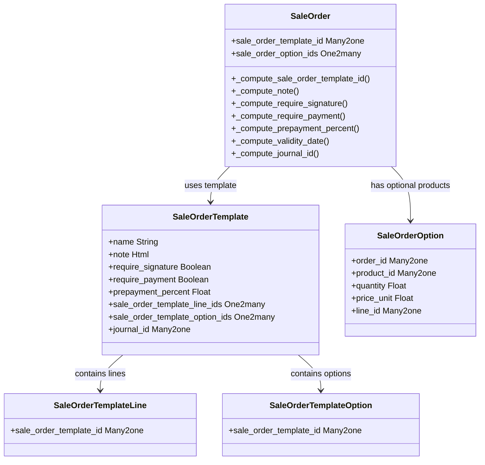

# C4 Code Level: addons/sale_management

<!--
  Auto-generated by the c4-code agent. One file per source directory.
  Refreshed on /banyan-c4 reruns whenever the directory's content hash changes.
  Do NOT hand-edit; edits will be overwritten on next refresh.
-->

## Generated By

- **Agent**: c4-code (Haiku)
- **Run ID**: banyan-c4-20260701-init
- **Generated**: 2026-07-01T00:00:00Z
- **Source Directory**: addons/sale_management
- **Content Hash**: pending

## Overview

- **Name**: Sales Management Extension
- **Description**: Extends base sale module with quotation templates, optional products, down payments, and sales team management
- **Location**: addons/sale_management — 19 files, 870 lines (models only)
- **Language**: Python (Odoo ORM models)
- **Purpose**: Provides enhanced sales order workflow capabilities including reusable quotation templates, optional product lines, prepayment options, and digest reporting

## Code Elements

### Classes / Models

- **`SaleOrder`** — Extends base sale order with template-based defaults and optional product handling
  - **Location**: `models/sale_order.py:11`
  - **Key Fields**: `sale_order_template_id` (M2O), `sale_order_option_ids` (O2M)
  - **Methods**: `_compute_sale_order_template_id()`, `_compute_note()`, `_compute_require_signature()`, `_compute_require_payment()`, `_compute_prepayment_percent()`, `_compute_validity_date()`, `_compute_journal_id()`, `_check_optional_product_company_id()`, `_onchange_company_id()`
  - **Implements / Extends**: inherits `sale.order`
  - **Dependencies**: sale (base module), sale_order.template, sale_order.option

- **`SaleOrderTemplate`** — Quotation template model for standardizing sales orders
  - **Location**: `models/sale_order_template.py:7`
  - **Key Fields**: `name` (Char), `note` (Html), `require_signature` (Bool), `require_payment` (Bool), `prepayment_percent` (Float), `number_of_days` (Int), `journal_id` (M2O)
  - **Key Relations**: `sale_order_template_line_ids` (O2M), `sale_order_template_option_ids` (O2M)
  - **Methods**: `_compute_require_signature()`, `_compute_require_payment()`, `_compute_prepayment_percent()`
  - **Purpose**: Allows sales teams to define reusable quotation templates with standard terms, payment requirements, and product lines

- **`SaleOrderOption`** — Optional product lines within a sale order
  - **Location**: `models/sale_order_option.py:7`
  - **Key Fields**: `order_id` (M2O), `product_id` (M2O), `quantity` (Float), `uom_id` (M2O), `price_unit` (Float), `line_id` (M2O), `sequence` (Int)
  - **Methods**: `_compute_name()`, `_compute_uom_id()`, `_compute_price_unit()`, `_product_id_domain()`
  - **Purpose**: Defines optional products that customers can add to their order; allows flexible upselling

- **`SaleOrderLine`** — Extends base sale order line with down payment support
  - **Location**: `models/sale_order_line.py:7`
  - **Methods**: Handles down payment lines, deposit reconciliation
  - **Dependencies**: account.move (invoicing), sale (base)

- **`SaleOrderTemplate​Line`** — Lines within a quotation template
  - **Location**: `models/sale_order_template_line.py:7`
  - **Key Fields**: Links products, quantities, and prices to templates

- **`SaleOrderTemplateOption`** — Optional products within a template
  - **Location**: `models/sale_order_template_option.py:7`
  - **Purpose**: Template-level optional product definitions that apply when a template is used

- **`ResCompany`** — Company-level sales management configuration
  - **Location**: `models/res_company.py:7`
  - **Fields**: `sale_order_template_id`, sales team targets, prepayment settings
  - **Purpose**: Store company default quotation templates and payment policies

- **`ResConfigSettings`** — Sales management admin settings
  - **Location**: `models/res_config_settings.py:7`
  - **Purpose**: Configuration UI for sales team management and down payment settings

- **`Digest`** — Sales manager dashboard reporting
  - **Location**: `models/digest.py:8`
  - **Purpose**: Sends periodic digest emails with sales metrics (quotations, monthly turnover)

### Functions / Methods

- `pre_init_hook(env)` — Adds `sale_order_template_id` column to sale_order table before module install
  - **Location**: `__init__.py:9`
  - **Visibility**: public
  - **Purpose**: Database schema migration for new field

- `post_init_hook(env)` — Activates sale module menu items after install
  - **Location**: `__init__.py:22`
  - **Visibility**: public
  - **Purpose**: Menu activation workflow

- `uninstall_hook(env)` — Deactivates sale module menu on module removal
  - **Location**: `__init__.py:14`
  - **Visibility**: public
  - **Purpose**: Cleanup on uninstall

### Constants / Configuration

- Module manifest: `__manifest__.py` defines `depends=['sale', 'digest']`, category, reporting assets
- Security rules in `security/sale_management_security.xml`
- XML data files: templates, digest configuration, menus

## Dependencies

### Internal

- **sale** (base Odoo module) — Provides SaleOrder, SaleOrderLine base models that sale_management extends
- **digest** (Odoo module) — Email digests for sales reporting
- **account** (Odoo module) — Journal and invoicing context for prepayment features

### External

- **Odoo ORM** — `odoo.models`, `odoo.api`, `odoo.fields`, `odoo.exceptions`
- **Odoo tools** — SQL migration helpers, HTML validation (`odoo.tools.sql.column_exists`, `odoo.tools.is_html_empty`)

## Relationships

## Notes for Higher-Level Synthesis

- **Belongs with Sales component**: Directly extends the base `sale.order` and `sale.order.line` models; all functionality is sales-order-specific
- **Boundary code**: Includes portal controllers (`controllers/portal.py`) for customer-facing quotation template and optional product handling
- **Customer portal integration**: Controllers handle web portal access to templates and order modifications; integrates with web/ecommerce channels
- **Down payment integration**: Bridges to `account.move` and `account.journal` for prepayment and deposit invoicing workflows
- **Not a standalone component**: Cannot function independently; requires base `sale` module and should be synthesized as a sub-component of the larger Sales domain
