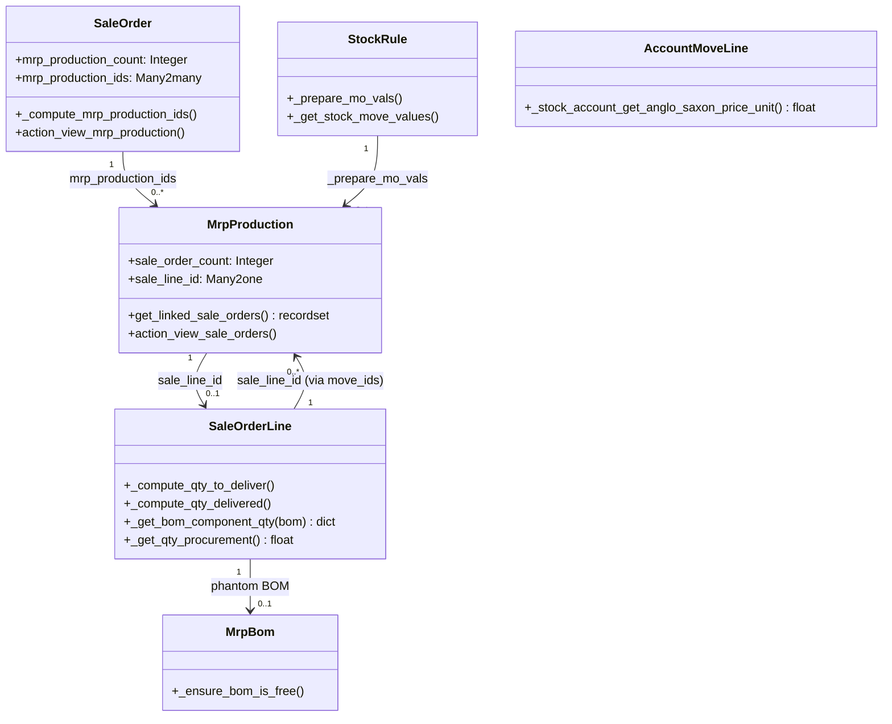

# C4 Code Level: Sale-MRP Bridge

<!--
  Auto-generated by the c4-code agent. One file per source directory.
  Refreshed on /banyan-c4 reruns whenever the directory's content hash changes.
  Do NOT hand-edit; edits will be overwritten on next refresh.
-->

## Generated By

- **Agent**: c4-code (Haiku)
- **Run ID**: banyan-c4-20260701-init
- **Generated**: 2026-07-01T00:00:00Z
- **Source Directory**: addons/sale_mrp
- **Content Hash**: 8c3f2d5e9a1b4c6e7f8g9h0i1j2k3l4m

## Overview

- **Name**: Sale and MRP Management Bridge
- **Description**: Integrates sales orders with manufacturing orders, enabling kit explosion on sales lines and production-to-sale order traceability.
- **Location**: addons/sale_mrp — 9 model files, 2500+ lines
- **Language**: Python (Odoo ORM)
- **Purpose**: Bridges sale_stock and mrp modules to track production orders generated from sales orders, handle kit BOMs (phantom BOMs) on sale order lines, and coordinate delivery vs. manufacturing fulfillment.

## Code Elements

### Classes / Modules

- **`SaleOrder`** — Inherits from sale.order; computes and displays manufacturing orders linked to sales order
  - **Location**: `models/sale_order.py:8`
  - **Methods**: `_compute_mrp_production_ids(...)`, `action_view_mrp_production()`
  - **Key Fields**: `mrp_production_count` (computed), `mrp_production_ids` (computed Many2many)
  - **Dependencies**: odoo.api, odoo.fields, odoo.models, defaultdict, procurement.group, mrp.production

- **`SaleOrderLine`** — Inherits from sale.order.line; handles kit quantities, BOMs, and delivery computation
  - **Location**: `models/sale_order_line.py:8`
  - **Methods**: `_compute_qty_to_deliver(...)`, `_compute_qty_delivered(...)`, `compute_uom_qty(...)`, `_get_bom_component_qty(...)`, `_get_incoming_outgoing_moves_filter(...)`, `_get_qty_procurement(...)`
  - **Key Behavior**: Hides inventory widget for phantom BOMs (kits); computes delivery qty by component tracing through kit BOMs; handles dropship and refund scenarios
  - **Dependencies**: odoo.api, odoo.models, odoo.tools.float_compare, mrp.bom, stock.move, product

- **`MrpProduction`** — Inherits from mrp.production; adds backlink to originating sales order
  - **Location**: `models/mrp_production.py:7`
  - **Methods**: `_compute_sale_order_count(...)`, `get_linked_sale_orders(...)`, `action_view_sale_orders(...)`, `action_confirm(...)`, `_post_run_manufacture(...)`
  - **Key Fields**: `sale_order_count` (computed), `sale_line_id` (Many2one to sale.order.line)
  - **Dependencies**: odoo.api, odoo.fields, odoo.models, procurement.group

- **`StockRule`** — Inherits from stock.rule; propagates sale_line_id and kit BOMs to generated stock moves
  - **Location**: `models/stock_rule.py:4`
  - **Methods**: `_prepare_mo_vals(...)`, `_get_stock_move_values(...)`
  - **Key Behavior**: Preserves sale_line_id in MO creation; tags stock moves with bom_line_id for kit component tracking
  - **Dependencies**: odoo.models

- **`MrpBom`** — Inherits from mrp.bom; prevents deletion/modification of phantom BOMs on active sales
  - **Location**: `models/mrp_bom.py:8`
  - **Methods**: `toggle_active(...)`, `write(...)`, `unlink(...)`, `_ensure_bom_is_free(...)`
  - **Key Behavior**: Raises UserError if phantom BOM is modified while active sales orders reference it
  - **Dependencies**: odoo.models, odoo.exceptions.UserError, sale.order.line

- **`StockMoveLine`** — Inherits from stock.move.line; computes sale price for kit components
  - **Location**: `models/stock_move_line.py:6`
  - **Methods**: `_compute_sale_price()`
  - **Key Behavior**: For moves tagged with phantom BOM line, uses component list price × qty
  - **Dependencies**: odoo.models

- **`AccountMoveLine`** — Inherits from account.move.line; handles Anglo-Saxon costing for kit BOMs
  - **Location**: `models/account_move.py:6`
  - **Methods**: `_stock_account_get_anglo_saxon_price_unit()`
  - **Key Behavior**: For invoiced kits, reconstructs component costs from stock valuation layers and cost shares; handles refunds and qty reconciliation
  - **Dependencies**: odoo.models

### Functions / Methods (Key Signatures)

- `SaleOrderLine._compute_qty_to_deliver(self) → None`
  - **Description**: Computes visibility of inventory widget; hides it for phantom BOMs (kits)
  - **Location**: `models/sale_order_line.py:11`
  - **Visibility**: public (inherited compute method)
  - **Dependencies**: mrp.bom._bom_find(), product.get_components()

- `SaleOrderLine._get_bom_component_qty(self, bom) → dict`
  - **Description**: Explodes kit BOM and returns flat dict of {product_id: {'qty': float, 'uom': int}}
  - **Location**: `models/sale_order_line.py:96`
  - **Visibility**: public
  - **Dependencies**: bom.explode(), UOM conversion

- `SaleOrderLine._get_qty_procurement(self, previous_product_uom_qty=False) → float`
  - **Description**: For kit products, returns remaining kit qty to procure based on delivery status
  - **Location**: `models/sale_order_line.py:153`
  - **Visibility**: public
  - **Dependencies**: mrp.bom._bom_find(), stock.move._compute_kit_quantities()

- `MrpProduction.get_linked_sale_orders(self) → sale.order recordset`
  - **Description**: Returns all sales orders linked to this MO (via procurement group, sale_line_id, or parent MOs)
  - **Location**: `models/mrp_production.py:21`
  - **Visibility**: public
  - **Dependencies**: procurement.group, sale.order

- `MrpBom._ensure_bom_is_free(self) → None or raises UserError`
  - **Description**: Raises UserError if phantom BOM is on active, undelivered sales order lines
  - **Location**: `models/mrp_bom.py:24`
  - **Visibility**: private (constraint helper)
  - **Dependencies**: sale.order.line search

- `AccountMoveLine._stock_account_get_anglo_saxon_price_unit(self) → float`
  - **Description**: Computes average-cost unit price for invoiced kit; includes component cost allocation
  - **Location**: `models/account_move.py:9`
  - **Visibility**: public (inherited override)
  - **Dependencies**: mrp.bom.explode(), product._compute_average_price(), cost share calculation

### Constants / Configuration

- `__manifest__.py`
  - **name**: 'Sales and MRP Management'
  - **depends**: ['mrp', 'sale_stock']
  - **auto_install**: True (installs whenever mrp and sale_stock are both present)
  - **Location**: `__manifest__.py:5-26`

## Dependencies

### Internal

- `mrp.bom` — Kit (phantom) bill of materials; methods: `_bom_find()`, `explode()`
- `mrp.production` — Manufacturing orders; linked via sale_line_id and procurement_group
- `sale.order` + `sale.order.line` — Sales orders and lines; tracks manufacturing fulfillment
- `stock.move` + `stock.move.line` — Stock moves generated by production/delivery; tagged with bom_line_id for kit tracking
- `stock.rule` — Procurement rules; propagates sale_line_id and BOM info to generated MOs
- `procurement.group` — Grouping mechanism for moves and MOs; carries sale_id
- `account.move.line` — Invoice lines; computes cost allocation for kit components
- `product.product` — Products; list_price used for sale price calc; UOM conversions

### External

- `odoo.api` (core) — decorators (@api.depends, @api.model, @api.constrains)
- `odoo.fields` (core) — Integer, Many2one, Many2many field types
- `odoo.models` (core) — Model base class
- `odoo.tools.float_compare` (core) — Precision-aware float comparison
- `odoo.exceptions.UserError` (core) — User-facing error

## Relationships

## Notes for Higher-Level Synthesis

- **Belongs with** `sale_stock` and `mrp` components — this is a bridge module that adds computed fields and methods to both; no standalone domain logic
- **Boundary layer**: Translates between sales order lines (customer fulfillment) and manufacturing orders (production planning); kit explosion is the key responsibility
- **Data integrity constraint**: phantom BOMs cannot be modified if they are active on undelivered sales orders (enforced in MrpBom._ensure_bom_is_free)
- **Stateful computation**: qty_delivered for kits requires full component tracing through BOMs and stock moves; complex multi-step calculation in SaleOrderLine
