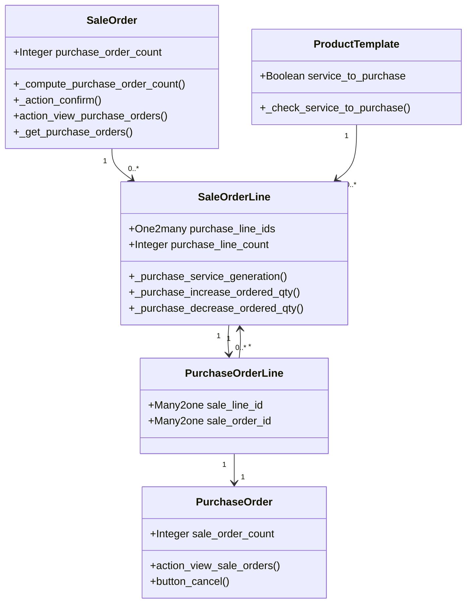

# C4 Code Level: Sale-Purchase Bridge (addons/sale_purchase)

<!--
  Auto-generated by the c4-code agent. One file per source directory.
  Refreshed on /banyan-c4 reruns whenever the directory's content hash changes.
  Do NOT hand-edit; edits will be overwritten on next refresh.
-->

## Generated By

- **Agent**: c4-code (Haiku)
- **Run ID**: banyan-c4-20260701-init
- **Generated**: 2026-07-01T00:00:00Z
- **Source Directory**: addons/sale_purchase
- **Content Hash**: d4b8c8f2a3e1c5d9b4f2e8a6c1d5e7f9

## Overview

- **Name**: Sale-Purchase Bridge
- **Description**: Enables service outsourcing by automatically generating purchase orders from sales orders for services marked as "subcontract service"
- **Location**: addons/sale_purchase — 7 Python files, ~600 lines
- **Language**: Python (Odoo ORM)
- **Purpose**: Links sales orders to purchase orders for outsourced services, managing the full order lifecycle including cancellation, quantity adjustments, and cross-module activities

## Code Elements

### Classes / Modules

#### **SaleOrder** (models/sale_order.py:7)
- **Purpose**: Extends Odoo's sale.order to track and manage generated purchase orders
- **Methods**:
  - `_compute_purchase_order_count()` — Counts total purchase orders generated from this sale order (line 16)
  - `_action_confirm()` — Confirms SO and triggers purchase service generation (line 20)
  - `_action_cancel()` — Cancels SO and schedules activities on linked purchase orders (line 26)
  - `action_view_purchase_orders()` — Returns action to view related purchase orders (line 34)
  - `_get_purchase_orders()` — Retrieves all POs linked via order lines (line 54)
  - `_activity_cancel_on_purchase()` — Schedules cancellation activities on related POs (line 57)
- **Fields**: `purchase_order_count` (computed, read-only)
- **Dependencies**: sale.order (parent), purchase.order, purchase.order.line, sale.order.line

#### **SaleOrderLine** (models/sale_order_line.py:12)
- **Purpose**: Extends sale.order.line to manage purchase line generation and quantity synchronization
- **Methods**:
  - `_compute_purchase_count()` — Computes count of generated purchase lines (line 19)
  - `_onchange_service_product_uom_qty()` — Warns when decreasing service quantity on confirmed SO (line 25)
  - `create()` — Creates purchase lines upon SO line creation if SO is confirmed and not expense (line 42)
  - `write()` — Synchronizes purchase line quantities on SO line updates (line 51)
  - `_purchase_decrease_ordered_qty()` — Handles quantity decrease and schedules activities (line 75)
  - `_purchase_increase_ordered_qty()` — Handles quantity increase, updates or creates new PO lines (line 99)
  - `_purchase_get_date_order()` — Calculates PO date from SO commitment date minus supplier delay (line 114)
  - `_purchase_service_get_company()` — Returns company for purchase order creation (line 119)
  - `_purchase_service_prepare_order_values()` — Builds PO header values from SO line (line 122)
  - `_purchase_service_get_price_unit_and_taxes()` — Extracts supplier price and applicable taxes (line 143)
  - `_purchase_service_get_product_name()` — Builds product display name with description (line 159)
  - `_purchase_service_prepare_line_values()` — Builds PO line values from SO line (line 174)
  - `_purchase_service_match_supplier()` — Selects supplier for the product (line 220)
  - `_purchase_service_match_purchase_order()` — Finds draft PO for same supplier (line 227)
  - `_create_purchase_order()` — Creates new purchase order record (line 234)
  - `_match_or_create_purchase_order()` — Reuses or creates PO as needed (line 238)
  - `_retrieve_purchase_partner()` — Hook for custom purchase partner override (line 244)
- **Fields**: `purchase_line_ids` (One2many, read-only), `purchase_line_count` (computed)
- **Dependencies**: sale.order.line (parent), purchase.order, purchase.order.line, product.supplierinfo

#### **PurchaseOrder** (models/purchase_order.py:7)
- **Purpose**: Extends purchase.order to track source sale orders and handle cancellation feedback
- **Methods**:
  - `_compute_sale_order_count()` — Counts unique source sale orders (line 16)
  - `action_view_sale_orders()` — Returns action to view source sale orders (line 20)
  - `button_cancel()` — Cancels PO and schedules activities on source SOs (line 40)
  - `_get_sale_orders()` — Retrieves all source SOs via order line references (line 45)
  - `_activity_cancel_on_sale()` — Schedules cancellation activities on source SOs (line 48)
- **Fields**: `sale_order_count` (computed, read-only)
- **Dependencies**: purchase.order (parent), sale.order, sale.order.line

#### **PurchaseOrderLine** (models/purchase_order.py:70)
- **Purpose**: Extends purchase.order.line to link back to sale orders
- **Fields**:
  - `sale_order_id` — Many2one (related, stored) pointing to source sale order (line 73)
  - `sale_line_id` — Many2one (indexed) linking to originating sale line (line 74)
- **Dependencies**: purchase.order.line (parent), sale.order.line, sale.order

#### **ProductTemplate** (models/product_template.py:8)
- **Purpose**: Extends product.template to enable/disable automatic PO generation for services
- **Methods**:
  - `_check_service_to_purchase()` — Validates that service products have at least one vendor (line 15)
  - `create()` — Validates vendor setup on creation (line 23)
  - `_check_vendor_for_service_to_purchase()` — Enforces vendor requirement (line 30)
  - `_onchange_service_to_purchase()` — Disables flag for non-services or expense items (line 34)
- **Fields**: `service_to_purchase` (Boolean, company-dependent, copy=False)
- **Dependencies**: product.template (parent), product.supplierinfo

#### **SaleOrderCancel** (wizards/sale_order_cancel.py:4)
- **Purpose**: Transient wizard extending cancel flow to alert users of related purchase orders
- **Methods**:
  - `_compute_display_purchase_orders_alert()` — Shows alert if POs exist (line 14)
- **Fields**: `display_purchase_orders_alert` (computed Boolean)
- **Dependencies**: sale.order.cancel (parent), sale.order

### Functions (High-Level Workflow)

- `_purchase_service_generation()` — [Inherited from sale.order.line; creates initial POs on SO confirmation] (line 23 call)
- Procurement flow: SO confirmation → `_purchase_service_generation()` → match/create PO → create PO lines

## Dependencies

### Internal (Cross-Module)

- `sale` — Sale order, sale order line models (parent models)
- `purchase` — Purchase order, purchase order line models (parent models)
- `stock` — Indirectly via procurement (stock.rule, stock.picking.type referenced in sales.dropshipping bridge)
- `product` — Product template, product.supplierinfo (vendor data)
- `account` — Fiscal position, taxes, currency conversion
- `analytic` — Analytic distributions on lines

### External

- `python-dateutil` — `relativedelta` for date calculations (line 4: from dateutil.relativedelta)
- Odoo base libraries — `api`, `fields`, `models`, `_`, `UserError`, `ValidationError`, `float_compare`, `get_lang` (standard ORM)

## Relationships

## Notes for Higher-Level Synthesis

- **Belongs with purchase_stock and sale_purchase_project** — Forms the core buy-route flow for services and outsourced components
- **Boundary code: Service-to-Purchase Bridge** — Mediates between sales order confirmation and purchase order creation; critical junction point for order routing decisions
- **Key pattern: Bi-directional Activities** — When SO or PO cancels, activities are scheduled on the counterparty (not automatic cascade); requires user acknowledgment
- **Quantity synchronization is complex** — Tracks whether PO line state is draft/sent/to-approve (updatable) vs purchase/done/cancel (requires new PO); edge cases around kits and quantity changes
- **No circular dependencies** — Clean dependency flow: sales → purchase, no back-reference except via order_line.sale_line_id
