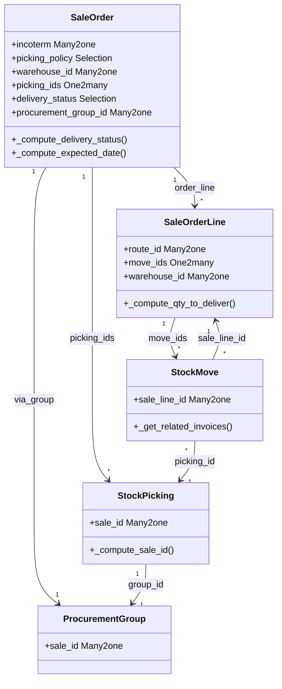

# C4 Code Level: Sale Stock Bridge

<!--
  Auto-generated by the c4-code agent. One file per source directory.
  Refreshed on /banyan-c4 reruns whenever the directory's content hash changes.
  Do NOT hand-edit; edits will be overwritten on next refresh.
-->

## Generated By

- **Agent**: c4-code (Haiku)
- **Run ID**: banyan-c4-20260701-init
- **Generated**: 2026-07-01T00:00:00Z
- **Source Directory**: addons/sale_stock
- **Content Hash**: 20260701-initial

## Overview

- **Name**: Sales and Warehouse Management Bridge
- **Description**: Connects sale orders to stock movements and delivery management; bridges sales and warehouse operations
- **Location**: addons/sale_stock — 7 models, 3 controllers, 1 report, 3 wizards
- **Language**: Python (Odoo 18.0 ORM)
- **Purpose**: Links sales orders to stock.picking (delivery orders), manages procurement groups, delivery scheduling, and invoicing control based on stock movements

## Code Elements

### Classes / Models

- **`SaleOrder`** — Inherits sale.order; manages incoterms, warehouse assignment, picking policy, delivery status tracking
  - **Location**: `models/sale_order.py:<14>`
  - **Key Methods**:
    - `_init_column(column_name)` — Ensures default warehouse_id assignment at column initialization
    - `_compute_effective_date()` — Computes first delivery completion date from stock.picking records
    - `_compute_delivery_status()` — Tracks delivery state: pending, started, partial, full
    - `_compute_expected_date()` — Overrides base to apply picking_policy (direct vs. consolidated)
    - `_select_expected_date(expected_dates)` — Selects min or max delivery date per policy
    - `_check_warehouse()` — Validates warehouse is set for storable products
    - `write(values)` — Updates picking partner and commitment_date propagation to stock moves
  - **Key Fields**:
    - `incoterm` — Many2one to account.incoterms
    - `picking_policy` — Selection: 'direct' (ASAP) or 'one' (when all ready)
    - `warehouse_id` — Many2one to stock.warehouse (computed, stored)
    - `picking_ids` — One2many to stock.picking (via procurement.group.sale_id)
    - `delivery_count` — Integer (computed from picking_ids)
    - `delivery_status` — Selection: pending, started, partial, full (computed, stored)
    - `procurement_group_id` — Many2one to procurement.group (linkage)
  - **Dependencies**: sale (base), stock, account.incoterms

- **`SaleOrderLine`** — Inherits sale.order.line; adds stock movement tracking and MTO logic
  - **Location**: `models/sale_order_line.py:<13>`
  - **Key Methods**:
    - `_compute_warehouse_id()` — Derives warehouse from SO or route rules; prefers SO warehouse
    - `_compute_qty_to_deliver()` — Determines if inventory widget should display
    - `_compute_qty_at_date()` — Forecasts product availability at delivery date; uses commitment_date or computed lead time
  - **Key Fields**:
    - `qty_delivered_method` — Selection extended with 'stock_move' (delivery tracking method)
    - `route_id` — Many2one to stock.route (sale-selectable routes only)
    - `move_ids` — One2many to stock.move
    - `warehouse_id` — Many2one to stock.warehouse (computed, stored)
    - `qty_to_deliver` — Float (computed)
    - `forecast_expected_date` — Datetime (computed from stock move forecasts)
    - `customer_lead` — Float (computed, stored, readonly=False)
  - **Dependencies**: sale, stock, stock.route

- **`StockMove`** (inherited) — Extends stock.move with sale order line linkage
  - **Location**: `models/stock.py:<15>`
  - **Key Methods**:
    - `_prepare_merge_moves_distinct_fields()` — Adds sale_line_id to merge-prevention distinct fields
    - `_prepare_procurement_values()` — Propagates analytic_distribution from sale line
    - `_get_related_invoices()` — Returns customer invoices linked to move
    - `_get_source_document()` — Returns sale order as source doc
    - `_get_sale_order_lines()` — Returns all possible SO lines for one move (including rollup)
    - `_assign_picking_post_process(new=False)` — Posts message link to SO on new picking
    - `_get_all_related_sm(product)` — Includes moves with same sale_line_id.product_id
    - `write(vals)` — Clears sale_line_id if product changes
  - **Key Fields**:
    - `sale_line_id` — Many2one to sale.order.line (indexed btree_not_null)
  - **Dependencies**: sale, stock

- **`StockMoveLine`** (inherited) — Extends stock.move.line
  - **Location**: `models/stock.py:<74>`
  - **Key Methods**:
    - `_should_show_lot_in_invoice()` — Returns True if customer/transit location or inter-company move
  - **Dependencies**: stock

- **`ProcurementGroup`** (inherited) — Extends procurement.group with sale order linkage
  - **Location**: `models/stock.py:<81>`
  - **Key Fields**:
    - `sale_id` — Many2one to sale.order (direct reference)
  - **Dependencies**: stock.procurement

- **`StockRoute`** (inherited) — Extends stock.route
  - **Location**: `models/stock.py:<10>`
  - **Key Fields**:
    - `sale_selectable` — Boolean (default False) — controls whether route appears on SO lines
  - **Dependencies**: stock

- **`StockRule`** (inherited) — Extends stock.rule with sale-specific merge prevention
  - **Location**: `models/stock.py:<87>`
  - **Key Methods**:
    - `_get_custom_move_fields()` — Adds sale_line_id, partner_id, sequence, to_refund to move creation
  - **Dependencies**: stock

- **`StockPicking`** (inherited) — Extends stock.picking with sale order linkage
  - **Location**: `models/stock.py:<96>`
  - **Key Methods**:
    - `_compute_sale_id()` — Derives from group_id.sale_id
    - `_set_sale_id()` — Inverse; creates/updates procurement group with sale_id
    - `_auto_init()` — Migrates sale_id column on first use
    - `_action_done()` — Creates new SO lines for moves without existing SO line (for return tracking)
  - **Key Fields**:
    - `sale_id` — Many2one to sale.order (computed, inverse=_set_sale_id, stored, indexed)
  - **Dependencies**: sale, stock.picking

- **`SaleStockPortal`** — Portal controller for customer delivery slip access
  - **Location**: `controllers/portal.py:<11>`
  - **Key Methods**:
    - `_stock_picking_check_access(picking_id, access_token=None)` — Validates customer access via token or ACL
    - `portal_my_picking_report(picking_id, access_token=None)` — Renders delivery slip PDF via access token
    - `portal_my_picking_return_report(picking_id, access_token=None)` — Renders return label PDF
  - **Dependencies**: sale, stock, mail

### Functions / Methods (Module-level)

- `_init_column()` — SaleOrder model method for warehouse default initialization
  - **Description**: Handles warehouse_id column init without accessing ir.model.fields (not yet created)
  - **Location**: `models/sale_order.py:<51>`
  - **Visibility**: public (Odoo model hook)
  - **Dependencies**: stock.warehouse, postgres (SQL execute)

- `rate_shipment()` — (inherited, delivery context) — Rates shipping for SO
  - **Description**: Not directly in sale_stock but used by delivery integration
  - **Visibility**: public
  - **Dependencies**: delivery

### Constants / Configuration

- `picking_policy` field options — `('direct', 'As soon as possible')`, `('one', 'When all products are ready')`
  - **Purpose**: Controls whether delivery awaits all items or ships partial (`addons/sale_stock/models/sale_order.py:<21>`)

- `delivery_status` field options — `('pending', 'started', 'partial', 'full')`
  - **Purpose**: Tracks delivery progress at SO level (`addons/sale_stock/models/sale_order.py:<33>`)

## Dependencies

### Internal

- **sale** — Base sale.order and sale.order.line models; order state transitions
- **stock** — stock.picking, stock.move, stock.warehouse, stock.route, stock.rule, procurement.group
- **stock_account** — Valuation layer integration; cost of goods accounting
- **account** — account.incoterms; invoice linking
- **mail** — Message posting to pickings; activity scheduling

### External

- **Odoo Framework** (18.0) — ORM models, fields, api decorators, @api.depends, @api.constrains
- **Python stdlib** — json, logging, datetime
- **Odoo utilities** — float_compare, expression AND, consteq (token validation)

## Relationships

## Notes for Higher-Level Synthesis

- **Belongs with sale_stock_* components** — This is the glue layer between sale and stock domains; create a logical component for "Sales-Stock Bridge" that includes sale order, procurement group, and picking linkage
- **Boundary code: sales-to-fulfillment** — Controllers (portal.py) handle HTTP-to-domain translation for customer shipment access; consider as API boundary
- **Procurement is central** — procurement.group is the key entity linking sales to stock; all replenishment decisions flow through this
- **Delivery scheduling depends on picking_policy** — min vs. max lead time selection is critical for demand forecasting; keep close to delivery/scheduling logic
- **Valuation integration** — Stock moves inherit analytic_distribution from SO lines; coordinate with stock_account for cost flow accuracy

