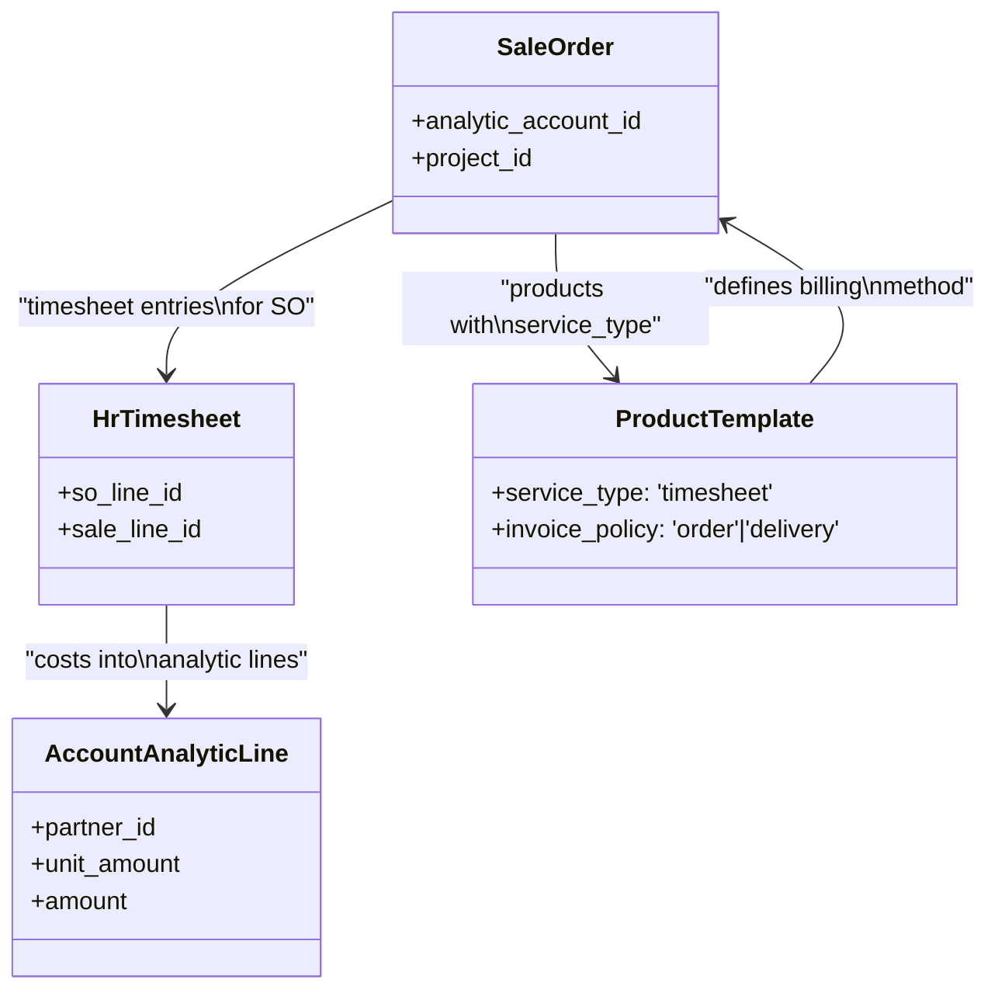

# C4 Code Level: Sale Timesheet (`addons/sale_timesheet`)

<!--
  Auto-generated by the c4-code agent. One file per source directory.
  Refreshed on /banyan-c4 reruns whenever the directory's content hash changes.
  Do NOT hand-edit; edits will be overwritten on next refresh.
-->

## Generated By

- **Agent**: c4-code (Haiku)
- **Run ID**: banyan-c4-20260701-init
- **Generated**: 2026-07-01T00:00:00Z
- **Source Directory**: `addons/sale_timesheet`
- **Content Hash**: `f6fe0272e46a5704e2970989ea700e81e01b89832dff6a0d1870bf0025685584`

## Overview

- **Name**: Sales Timesheet
- **Description**: Bridge between sales orders and timesheets, enabling billing of service work via timesheet-based invoicing (milestone, percent-complete, or prepaid hours).
- **Location**: `addons/sale_timesheet` — 2 files, ~26 lines
- **Language**: Python (Odoo module)
- **Purpose**: Integrates timesheet tracking with sales order fulfillment, allowing service products to be invoiced based on recorded time rather than fixed quantities. Creates analytic accounts per sales order for cost tracking.

## Code Elements

### Module Initialization

**`__init__.py`** — Module setup and lifecycle hooks

- **Imports** (`__init__.py:<4-6>`):
  - `controllers` — HTTP request handlers (sales order portal views, timesheet entry forms)
  - `models` — Domain models (product.template, account.analytic.line, sale.order extensions)
  - `wizard` — Multi-step dialogs (project invoice creation, advance billing)
  - `report` — Reporting views (timesheet analysis, project reports)

- **Hook: `uninstall_hook(env)` (`__init__.py:<9-13>`)**
  - **Purpose**: Restore default access rules when module is uninstalled; resets analytic line access domain to unrestricted
  - **Visibility**: Internal (called by Odoo framework on uninstall)
  - **Dependencies**: `account.account_analytic_line_rule_*` records (Odoo built-in security)

- **Hook: `_sale_timesheet_post_init(env)` (`__init__.py:<15-25>`)**
  - **Purpose**: Post-installation data migration; converts existing service products to timesheet-based billing
  - **Visibility**: Internal (called by Odoo framework at module activation)
  - **Logic**: 
    - Searches for service products with specific tracking and invoicing policies
    - Filters for manual service_type (non-automated projects)
    - Updates each product's `service_type` to `'timesheet'`
    - Calls `_compute_service_policy()` to recalculate billing behavior
  - **Dependencies**: `product.template` ORM, billing policy computation

### Manifest Configuration

**Module Name**: `Sales Timesheet` (`__manifest__.py:<5>`)

- **Category**: Hidden (internal integration module)
- **Summary**: Sell based on timesheets
- **Version**: Auto-managed (part of Odoo core)
- **Dependencies** (`__manifest__.py:<16>`):
  - `sale_project` — Sales + project integration (sales orders linked to projects)
  - `hr_timesheet` — Timesheet tracking (employee time entry)
- **Key Features**:
  - Auto-installs when both sale_project and hr_timesheet are active
  - Portal frontend (`sale_timesheet_portal.scss`) for customer visibility
  - JavaScript components for timesheet display in backend/portal
  - E2E tour tests for Hoot-DOM testing framework
  - Unit tests for billing logic

- **Data Files** (lines 17–35):
  - `data/sale_service_data.xml` — Product templates for service types
  - `security/ir.model.access.csv`, `security/sale_timesheet_security.xml` — Access control rules
  - `views/*.xml` — UI modifications to invoice, SO, product, task, timesheet, config, project
  - `report/timesheets_analysis_views.xml`, `report/project_report_view.xml` — Analytics views
  - `wizard/*.xml` — Invoice creation and advance billing dialogs

## Dependencies

### Internal (to Odoo modules)

- **`sale_project`** (`__manifest__.py:<16>`) — Sales orders with project linkage; provides SO-to-project mapping
- **`hr_timesheet`** (`__manifest__.py:<16>`) — Timesheet entry and time tracking; core source of billable hours
- **`account`** (implicit via uninstall_hook) — Analytic line access rules and invoice generation
- **`product`** (implicit) — Service product types, service_tracking and invoice_policy fields

### External

- No third-party Python dependencies declared; uses only Odoo built-in ORM and framework

## Relationships

## Architecture Notes

- **Bridge Module**: Sits at the intersection of three subsystems:
  1. **Sales** — Order fulfillment
  2. **Timesheet** — Time entry
  3. **Accounting** — Invoicing and cost tracking
- **Post-Init Migration**: The `_sale_timesheet_post_init` hook is a key integration point — it ensures legacy service products are converted to timesheet-based billing on first activation.
- **Analytic Accounts**: Creates one analytic account per sales order (implicit in `models` and `wizard` — not visible at root level) to track costs per customer/project.
- **Uninstall Safety**: The `uninstall_hook` is critical for clean removal — it restores default access rules to prevent orphaned security restrictions.

## Notes for Higher-Level Synthesis

- **Core Integration Module**: Belongs with the **Sales component** (sale, sale_project) and **HR/Timesheet component** (hr_timesheet). Forms a three-way bridge.
- **Billing Logic Concentration**: The actual billing computation (timesheet → invoice items) is in `models` and `wizard` subdirectories. Root-level hooks are integration scaffolding.
- **Data Migration Pattern**: The post-init hook is an example of Odoo module initialization best practices — use for one-time conversions, not runtime logic.
- **Security Boundary**: Manages access to analytic lines at the uninstall point; worth reviewing for RBAC patterns.
