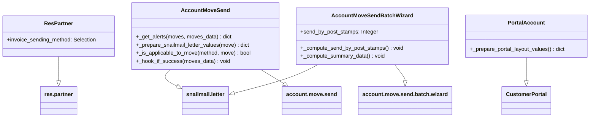

# C4 Code Level: addons/snailmail_account

<!--
  Auto-generated by the c4-code agent. One file per source directory.
  Refreshed on /banyan-c4 reruns whenever the directory's content hash changes.
  Do NOT hand-edit; edits will be overwritten on next refresh.
-->

## Generated By

- **Agent**: c4-code (Haiku)
- **Run ID**: banyan-c4-20260701-init
- **Generated**: 2026-07-01T00:00:00Z
- **Source Directory**: addons/snailmail_account
- **Content Hash**: 3b9e4d2a8c1f6h7j9k5l2m8n0o4p6q3r

## Overview

- **Name**: Snail Mail - Account
- **Description**: Integrates snailmail (physical postal delivery service) with account_move_send, allowing invoices and credit notes to be dispatched as printed physical mail via IAP snailmail service
- **Location**: addons/snailmail_account — 7 files, ~110 lines
- **Language**: Python
- **Purpose**: Extends the unified invoice/credit note sending wizard (account.move.send) to support postal delivery as an alternative or complementary channel to email, EDI, and PDF download

## Code Elements

### Functions / Methods

- `_get_alerts(moves, moves_data) → dict`
  - **Description**: Extends account_move_send to surface warning/danger alerts when invoices are selected for snailmail but partners lack valid postal addresses
  - **Location**: `models/account_move_send.py:10`
  - **Visibility**: public (inheritance hook)
  - **Dependencies**: super()._get_alerts(), snailmail.letter._is_valid_address(), moves_data dict keying

- `_prepare_snailmail_letter_values(move) → dict`
  - **Description**: Prepares default letter creation payload for snailmail service: partner_id, model/res_id references, company, report template for PDF rendering
  - **Location**: `models/account_move_send.py:32`
  - **Visibility**: public (model method)
  - **Dependencies**: env['ir.actions.report']._get_report('account.account_invoices'), move object

- `_is_applicable_to_move(method, move, **move_data) → bool`
  - **Description**: Extends account_move_send to validate snailmail applicability: returns true iff partner has valid address for postal delivery
  - **Location**: `models/account_move_send.py:44`
  - **Visibility**: public (inheritance hook)
  - **Dependencies**: snailmail.letter._is_valid_address(), super()._is_applicable_to_move()

- `_hook_if_success(moves_data) → None`
  - **Description**: Extends account_move_send to create snailmail.letter records after successful move dispatch, triggering async printing/mailing workflow
  - **Location**: `models/account_move_send.py:51`
  - **Visibility**: public (inheritance hook)
  - **Dependencies**: snailmail.letter.create(), _prepare_snailmail_letter_values(), _is_applicable_to_move(), snailmail.letter._snailmail_print()

- `_prepare_portal_layout_values() → dict`
  - **Description**: Extends portal.controllers to add snailmail option to invoice_sending_methods dropdown in customer portal
  - **Location**: `controllers/portal.py:7`
  - **Visibility**: public (inheritance hook)
  - **Dependencies**: super()._prepare_portal_layout_values()

- `_compute_send_by_post_stamps(self) → None`
  - **Description**: Computes the count of valid postal addresses from moves in the batch send wizard
  - **Location**: `wizard/account_move_send_batch_wizard.py:9`
  - **Visibility**: public (computed field callback)
  - **Dependencies**: snailmail.letter._is_valid_address(), move_ids

- `_compute_summary_data(self) → None`
  - **Description**: Extends account_move_send.batch.wizard to append stamp count to snailmail summary row
  - **Location**: `wizard/account_move_send_batch_wizard.py:16`
  - **Visibility**: public (inheritance hook)
  - **Dependencies**: super()._compute_summary_data(), summary_data dict

### Classes / Modules

- **`AccountMoveSend`** — AbstractModel extending account.move.send with snailmail integration
  - **Location**: `models/account_move_send.py:4`
  - **Methods**: `_get_alerts()`, `_prepare_snailmail_letter_values()`, `_is_applicable_to_move()`, `_hook_if_success()`
  - **Implements / Extends**: account.move.send (AbstractModel)
  - **Dependencies**: odoo.api, odoo.models, odoo._, env['snailmail.letter'], env['ir.actions.report']

- **`ResPartner`** — Model extending res.partner with invoice sending method selection
  - **Location**: `models/res_partner.py:4`
  - **Methods**: (field definition only)
  - **Implements / Extends**: res.partner
  - **Dependencies**: odoo.fields, odoo.models

- **`PortalAccount`** — Controller extending portal.CustomerPortal with snailmail option
  - **Location**: `controllers/portal.py:5`
  - **Methods**: `_prepare_portal_layout_values()`
  - **Implements / Extends**: portal.controllers.portal.CustomerPortal
  - **Dependencies**: odoo._, odoo.addons.portal.controllers.portal.CustomerPortal

- **`AccountMoveSendBatchWizard`** — TransientModel extending account.move.send.batch.wizard with stamp cost display
  - **Location**: `wizard/account_move_send_batch_wizard.py:4`
  - **Methods**: `_compute_send_by_post_stamps()`, `_compute_summary_data()`
  - **Implements / Extends**: account.move.send.batch.wizard (TransientModel)
  - **Dependencies**: odoo.fields, odoo.models, odoo._, env['snailmail.letter']

### Constants / Configuration

- `invoice_sending_method` Selection field — adds 'snailmail' choice ('by Post') to res.partner model (`models/res_partner.py:7`)

## Dependencies

### Internal

- `account` module — account.move.send, account.move.send.batch.wizard, account.move model references
- `snailmail` module — snailmail.letter model for letter creation and validation (IAP service backend)
- `portal` module — customer portal controller hierarchy

### External

- `odoo` (core framework) — api, fields, models, _() translations, decorators
- `odoo.addons.portal` — CustomerPortal base controller

## Relationships

## Notes for Higher-Level Synthesis

- **Domain integration**: Belongs in the Accounting / Invoice Sending component. Tightly coupled to account_move_send (the orchestrator) and snailmail (the service provider).
- **Boundary code**: Controllers and wizards are presentation/UX boundaries translating domain events (move send) to snailmail API calls. _hook_if_success is the critical handoff point.
- **Validation dependency**: Relies on snailmail.letter._is_valid_address() for all applicability checks. Partner address data quality issues surface as alerts and prevent dispatch—design anticipates incomplete data.
- **Multi-module integration**: Minimal internal logic—primarily glue code between account_move_send and snailmail.letter. No local business rules.
