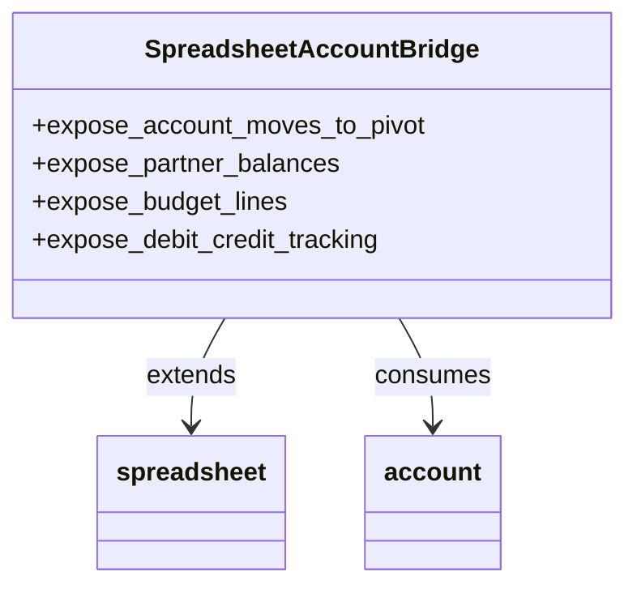

# C4 Code Level: Spreadsheet Accounting Formulas

<!--
  Auto-generated by the c4-code agent. One file per source directory.
  Refreshed on /banyan-c4 reruns whenever the directory's content hash changes.
  Do NOT hand-edit; edits will be overwritten on next refresh.
-->

## Generated By

- **Agent**: c4-code (Haiku)
- **Run ID**: banyan-c4-20260701-init
- **Generated**: 2026-07-01T00:00:00Z
- **Source Directory**: addons/spreadsheet_account
- **Content Hash**: d41d8cd98f00b204e9800998ecf8427e

## Overview

- **Name**: Spreadsheet Accounting Formulas
- **Description**: Integrates Odoo accounting module with the spreadsheet addon to expose financial data as live pivot tables and formulas
- **Location**: addons/spreadsheet_account — 2 root files
- **Language**: Python (Odoo 18.0)
- **Purpose**: Extends the spreadsheet addon with accounting-specific pivot tables (account moves, budget lines, partner balances, debit/credit tracking) enabling financial analysis and reporting directly in spreadsheets

## Code Elements

### Modules

- **`__init__.py`** — Package initialization; imports models subpackage
  - **Location**: `__init__.py:1`
  - **Purpose**: Makes the package importable and loads model definitions
  
- **`__manifest__.py`** — Addon metadata, dependencies, and asset declarations
  - **Location**: `__manifest__.py:1-25`
  - **Purpose**: Odoo module manifest declaring addon name, version, dependencies (spreadsheet, account), asset bundles for spreadsheet formulas and unit tests

## Dependencies

### Internal

- `models` (subpackage) — Defines account pivot table formulas and financial data sources
- `spreadsheet` (addon) — Base spreadsheet addon this module extends
- `account` (addon) — Odoo accounting module providing account moves, balances, and fiscal year data

### External

- Odoo 18.0 framework (embedded)
- Spreadsheet.js (loaded via asset bundle in __manifest__.py)

## Relationships

This module is a bridge between the accounting domain and the spreadsheet pivot/formula system. It does not define business logic directly; instead, it exposes account data structures to spreadsheet queries.

## Notes for Higher-Level Synthesis

- **Boundary code**: Translates accounting model schema into spreadsheet-consumable data sources (pivot table backend)
- **Minimal root-level code**: All functional logic in `models/` subpackage; root files are integration glue only
- **Belongs with the Accounting + Spreadsheet component**: Shared ownership with both domain areas
