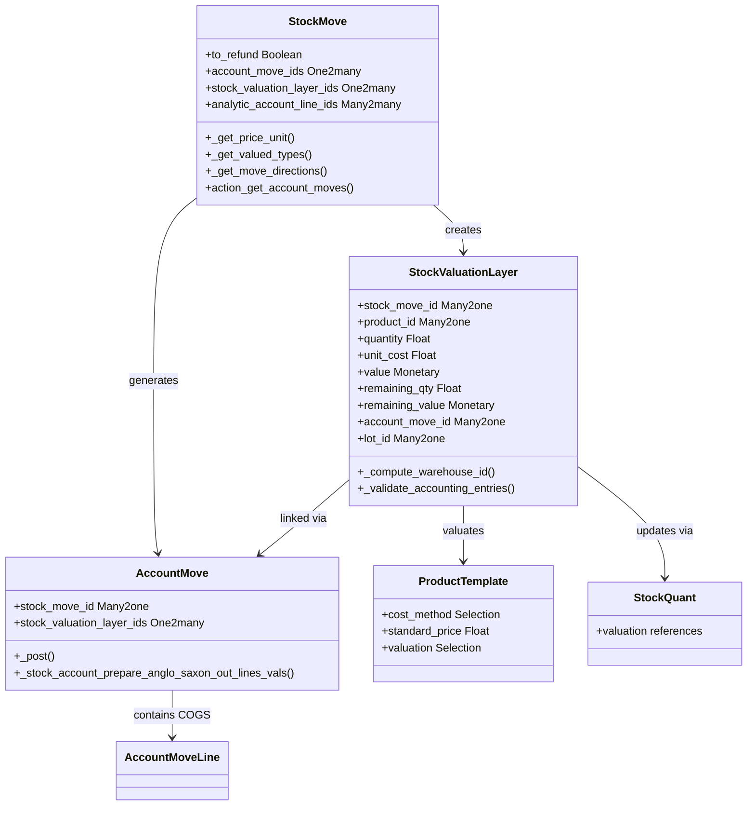

# C4 Code Level: addons/stock_account

<!--
  Auto-generated by the c4-code agent. One file per source directory.
  Refreshed on /banyan-c4 reruns whenever the directory's content hash changes.
  Do NOT hand-edit; edits will be overwritten on next refresh.
-->

## Generated By

- **Agent**: c4-code (Haiku)
- **Run ID**: banyan-c4-20260701-init
- **Generated**: 2026-07-01T00:00:00Z
- **Source Directory**: addons/stock_account
- **Content Hash**: pending

## Overview

- **Name**: WMS Accounting (Stock Valuation & Integration)
- **Description**: Bridges stock and account modules; implements inventory valuation (standard/AVCO/FIFO), stock valuation layers, and automatic journal entry generation for stock moves
- **Location**: addons/stock_account — 34 files, 3232 lines (models + wizards + reports)
- **Language**: Python (Odoo ORM models, wizards, reports)
- **Purpose**: Core valuation bridge enabling real-time or periodic inventory cost accounting; supports multiple costing methods and integrates warehouse logistics with general ledger

## Code Elements

### Classes / Models

- **`StockMove`** — Extends base stock.move with accounting valuation layer
  - **Location**: `models/stock_move.py:14`
  - **Key Fields**: `to_refund` (Bool), `account_move_ids` (O2M), `stock_valuation_layer_ids` (O2M), `analytic_account_line_ids` (M2M)
  - **Key Methods**: `_get_price_unit()` (returns unit cost for valuation; handles lot-based pricing), `_get_valued_types()` (returns valued move types: in/out/dropshipped), `_get_move_directions()` (computes inbound/outbound stock direction), `_action_cancel()` (cleans up analytic entries), `action_get_account_moves()` (links to journal entries)
  - **Purpose**: Every stock movement generates accounting entries via valuation layers; this model tracks the link

- **`StockValuationLayer`** — Audit trail of stock valuation changes
  - **Location**: `models/stock_valuation_layer.py:13`
  - **Key Fields**: `stock_move_id` (M2O), `product_id` (M2O), `quantity` (Float), `unit_cost` (Float), `value` (Monetary), `remaining_qty`, `remaining_value`, `account_move_id` (M2O), `lot_id` (M2O)
  - **Key Methods**: `init()` (creates performance indexes), `_compute_warehouse_id()`, `_search_warehouse_id()`, `_validate_accounting_entries()`, `_candidate_sort_key()` (FIFO/AVCO ordering), `_get_related_product()`
  - **Purpose**: Immutable record of every inventory valuation change; supports per-lot tracking and multi-costing-method audit trails

- **`AccountMove`** — Extends account journal entry with stock reference
  - **Location**: `models/account_move.py:7`
  - **Key Fields**: `stock_move_id` (M2O), `stock_valuation_layer_ids` (O2M)
  - **Key Methods**: `_compute_show_reset_to_draft_button()` (locks entry if valuation layer links exist), `_get_lines_onchange_currency()` (filters COGS lines), `copy_data()` (excludes COGS on copy), `_post()` (creates anglo-saxon COGS lines), `button_draft()` (unlinks COGS on revert), `_stock_account_prepare_anglo_saxon_out_lines_vals()` (builds COGS reversals), `_stock_account_anglo_saxon_reconcile_valuation()` (reconciles COGS)
  - **Purpose**: Stock moves generate accounting entries; this tracks bidirectional relationship and applies anglo-saxon accounting rules

- **`AccountMoveLine`** — Extends account line with COGS handling
  - **Location**: `models/account_move.py:255`
  - **Key Methods**: COGS line creation and reconciliation logic
  - **Purpose**: Individual journal lines for COGS adjustments

- **`ProductTemplate` / `ProductProduct`** — Extends product with valuation config
  - **Location**: `models/product.py:12` (template), `models/product.py:137` (product)
  - **Key Fields**: `cost_method` (Selection: standard/fifo/avco), `standard_price` (Float), `property_cost_method` (property field per company), `valuation` (Selection: manual/automatic)
  - **Key Methods**: Compute standard price, retrieve costing method per company, validate cost method changes
  - **Purpose**: Products define their valuation strategy globally (manual backflush vs. automatic); cost_method drives valuation layer creation

- **`StockMoveLine`** — Extends base move line with valuation layer generation
  - **Location**: `models/stock_move_line.py:9`
  - **Key Methods**: Hooks into stock picking workflow to trigger valuation layer creation on move completion
  - **Purpose**: Lower-level detail lines that feed into move-level valuation

- **`StockQuant`** — Extends quantity tracking with valuation references
  - **Location**: `models/stock_quant.py:10`
  - **Key Methods**: Quantity-on-hand updates that trigger valuation layer adjustments
  - **Purpose**: Real-time inventory quantity changes trigger corresponding valuation adjustments

- **`StockLot`** — Extends lot tracking with per-lot valuation
  - **Location**: `models/stock_lot.py:10`
  - **Key Fields**: Links to valuation layers for lot-specific costing (FiFo/AVCO by lot)
  - **Purpose**: Lot-based inventory traceability with per-lot cost tracking

- **`StockLocation`** — Extends warehouse locations with account mapping
  - **Location**: `models/stock_location.py:7`
  - **Key Fields**: Account mappings for inter-warehouse transfers and valuation accounts
  - **Purpose**: Locations define which GL accounts receive stock move entries

- **`StockPicking`** — Extends picking workflow with accounting hooks
  - **Location**: `models/stock_picking.py:9`
  - **Key Methods**: Pre/post-completion hooks for journal entry generation
  - **Purpose**: Picking completion triggers accounting entry creation

- **`ResCompany`** — Company-level stock accounting config
  - **Location**: `models/res_company.py:4`
  - **Key Fields**: Stock valuation accounts, property fields for cost methods and valuation strategy
  - **Purpose**: Per-company valuation method, GL account mapping, and policy configuration

- **`ResConfigSettings`** — Admin UI for stock accounting
  - **Location**: `models/res_config_settings.py:7`
  - **Purpose**: Configuration panel for enabling automatic valuation, selecting costing methods

- **`AccountChartTemplate`** — Extends chart of accounts with stock account setup
  - **Location**: `models/account_chart_template.py:8`, `models/template_generic_coa.py:5`
  - **Key Methods**: COA initialization for stock accounts (inventory, COGS, valuation)
  - **Purpose**: On CoA installation, creates standard inventory and COGS accounts

- **`AccountAnalyticPlan` / `AccountAnalyticAccount`** — Analytic dimension support for cost allocation
  - **Location**: `models/analytic_account.py:8` (plan), `models/analytic_account.py:33` (account)
  - **Purpose**: Cost allocation to projects/departments via analytic accounts attached to stock entries

### Wizards

- **`StockRequestCount`** — Wizard for requesting physical inventory counts
  - **Location**: `wizard/stock_request_count.py`
  - **Purpose**: Triggers inventory counting workflow

- **`StockQuantityHistory`** — Wizard for historical inventory quantity lookups
  - **Location**: `wizard/stock_quantity_history.py`
  - **Purpose**: Query inventory at past dates using valuation layer history

- **`StockValuationLayerRevaluation`** — Wizard for manual revaluation
  - **Location**: `wizard/stock_valuation_layer_revaluation.py`
  - **Purpose**: Allows accountants to adjust valuation layers (price corrections, write-offs) and regenerate entries

- **`StockPickingReturn`** — Wizard for return/reversal workflow
  - **Location**: `wizard/stock_picking_return.py`
  - **Purpose**: Handles return picking creation and associated valuation reversal

### Reports

- **`StockForecastedReport`** — Forecasted inventory valuation report
  - **Location**: `report/stock_forecasted.py`
  - **Purpose**: Projections of inventory value over time

## Dependencies

### Internal

- **stock** (Odoo module) — Base StockMove, StockLocation, StockQuant, StockPicking models
- **account** (Odoo module) — JournalEntry, JournalLine, ChartTemplate base models
- **product** (Odoo module) — Product and ProductCategory base models
- **purchase** (implied) — Inbound receipt costing
- **sale** (implied via anglo-saxon accounting) — COGS handling on outbound sales

### External

- **Odoo ORM** — `odoo.models`, `odoo.api`, `odoo.fields`, `odoo.exceptions`, `odoo.tools`
- **Odoo tools** — `float_compare`, `float_is_zero`, `float_round`, `OrderedSet`, `groupby`
- **Python stdlib** — `collections.defaultdict`, `itertools`, logging

## Relationships

## Notes for Higher-Level Synthesis

- **Core financial bridge**: This is the binding component between warehouse operations (stock module) and accounting (account module). Every inventory movement flows through this code to produce GL entries.
- **Not a standalone component**: Must be paired with both `stock` and `account` modules; auto-installs when both are present (`auto_install: True`).
- **Critical for reporting**: Stock valuation layers are the audit trail for inventory value; used by financial statements, balance sheet, and cost of goods sold analysis.
- **Multiple costing methods**: Supports standard cost, FIFO, AVCO; method selection is per-product and can vary within same company across products. Complex order-dependent calculations for FIFO/AVCO.
- **Anglo-saxon accounting**: Implements deferred COGS (cost recorded at sale time, not at receipt); critical for accrual accounting but absent in cash-basis systems.
- **Lot/serial tracking**: Supports per-lot valuation for traceability; adds database index complexity for performance on large lot-heavy inventories.
- **Wizard ecosystem**: Heavy reliance on wizards for manual corrections (revaluations), historical lookups, and return workflows; these are operational tools, not core engine.
- **Integration points**: Connects to purchase orders (inbound costing), sales orders (COGS via anglo-saxon), and analytic accounting (cost allocation).
