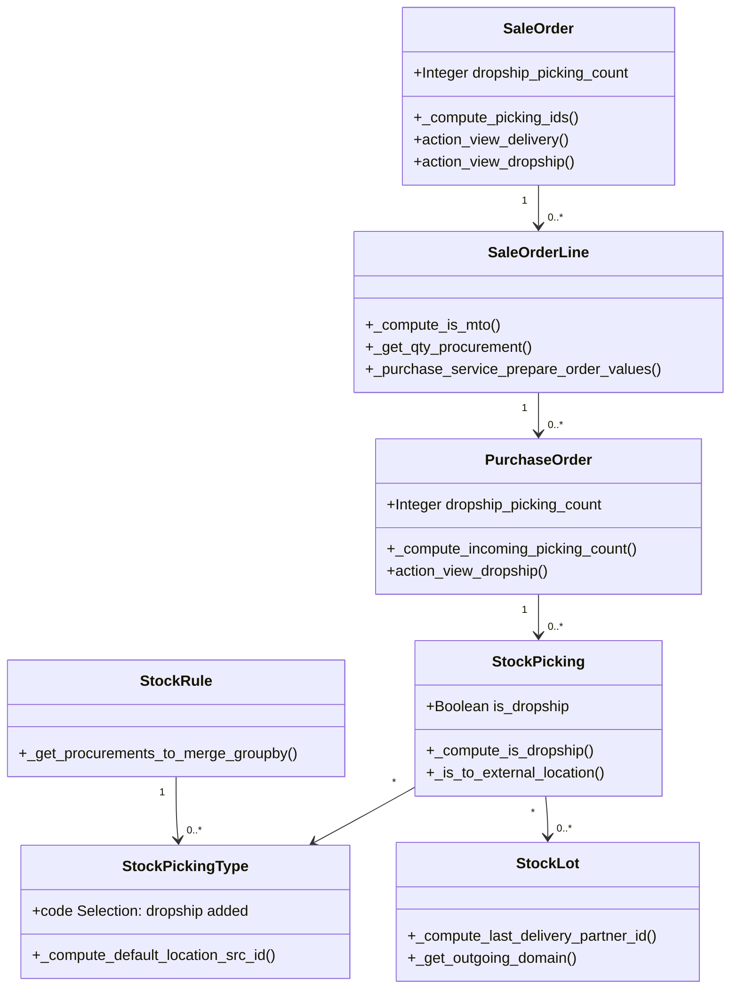

# C4 Code Level: Drop Shipping (addons/stock_dropshipping)

<!--
  Auto-generated by the c4-code agent. One file per source directory.
  Refreshed on /banyan-c4 reruns whenever the directory's content hash changes.
  Do NOT hand-edit; edits will be overwritten on next refresh.
-->

## Generated By

- **Agent**: c4-code (Haiku)
- **Run ID**: banyan-c4-20260701-init
- **Generated**: 2026-07-01T00:00:00Z
- **Source Directory**: addons/stock_dropshipping
- **Content Hash**: a7c2e5f1b9d3a8c6e2f4b7d1a5c9e3f7

## Overview

- **Name**: Drop Shipping
- **Description**: Extends sale_purchase_stock to enable vendor-direct delivery: SO creates PO, vendor ships to customer without warehouse intermediate step
- **Location**: addons/stock_dropshipping — 8 Python files, ~400 lines
- **Language**: Python (Odoo ORM)
- **Purpose**: Configures drop-shipping procurement route, tracks dropship pickings separately from standard deliveries, handles supplier-to-customer transfers

## Code Elements

### Classes / Modules

#### **SaleOrder** (models/sale.py:7)
- **Purpose**: Extends sale.order to separate dropship pickings from standard warehouse deliveries
- **Methods**:
  - `_compute_picking_ids()` — Splits pickings into dropship vs warehouse; adjusts delivery_count (line 13)
  - `action_view_delivery()` — Filters to show only non-dropship pickings (line 20)
  - `action_view_dropship()` — Filters to show only dropship pickings (line 23)
- **Fields**: `dropship_picking_count` (computed)
- **Dependencies**: sale.order (parent), stock.picking

#### **SaleOrderLine** (models/sale.py:27)
- **Purpose**: Extends sale.order.line with drop-ship MTO detection and PO configuration
- **Methods**:
  - `_compute_is_mto()` — Detects if product has drop-ship route (supplier→customer direct) (line 30)
  - `_get_qty_procurement()` — For drop-ship items, sums PO line quantities instead of warehouse stock (line 42)
  - `_compute_product_updatable()` — Prevents product change if drop-ship PO lines exist (line 55)
  - `_purchase_service_prepare_order_values()` — Adds drop-ship picking type and destination address to PO (line 62)
- **Fields**: Inherits from parent; uses computed flags
- **Dependencies**: sale.order.line (parent), purchase.order.line, stock.picking.type, stock.location

#### **PurchaseOrder** (models/purchase.py:7)
- **Purpose**: Extends purchase.order to track drop-ship deliveries separately
- **Methods**:
  - `_compute_incoming_picking_count()` — Separates dropship pickings from standard receiving (line 13)
  - `action_view_picking()` — Shows non-dropship inbound pickings (line 20)
  - `action_view_dropship()` — Shows dropship outbound pickings to customers (line 23)
  - `_prepare_group_vals()` — Links PO to originating sale order if unique (line 26)
- **Fields**: `dropship_picking_count` (computed)
- **Dependencies**: purchase.order (parent), stock.picking, sale.order

#### **StockRule** (models/stock.py:8)
- **Purpose**: Extends stock.rule to prevent grouping PO lines from different sale orders
- **Methods**:
  - `_get_procurements_to_merge_groupby()` — Uses sale_line_id as merge key to preserve SO-line traceability (line 12)
- **Dependencies**: stock.rule (parent)

#### **ProcurementGroup** (models/stock.py:18)
- **Purpose**: Extends procurement.group to filter rules by company when sale_line_id present
- **Methods**:
  - `_get_rule_domain()` — Adds company filter to rule selection when processing sale-linked procurements (line 22)
- **Dependencies**: procurement.group (parent), stock.rule

#### **StockPicking** (models/stock.py:28)
- **Purpose**: Extends stock.picking to identify and handle drop-ship transfers
- **Methods**:
  - `_compute_is_dropship()` — Detects dropship transfers: source=supplier (or non-company transit), dest=customer (or non-company transit) (line 34)
  - `_is_to_external_location()` — Classifies dropship pickings as external (like sales) (line 40)
- **Fields**: `is_dropship` (computed Boolean)
- **Dependencies**: stock.picking (parent), stock.location

#### **StockPickingType** (models/stock.py:44)
- **Purpose**: Extends stock.picking.type to define drop-ship operation type
- **Methods**:
  - `_compute_default_location_src_id()` — Sets drop-ship source to supplier location (line 50)
  - `_compute_default_location_dest_id()` — Sets drop-ship destination to customer location (line 56)
  - `_compute_warehouse_id()` — Drop-ship type has no warehouse (line 62)
  - `_compute_show_picking_type()` — Ensures drop-ship type is visible in UI (line 69)
- **Fields**: `code` selection extended with 'dropship' (line 47)
- **Dependencies**: stock.picking.type (parent), stock.location, stock.warehouse

#### **StockLot** (models/stock.py:77)
- **Purpose**: Extends stock.lot to attribute drop-shipped items to end customer, not supplier
- **Methods**:
  - `_compute_last_delivery_partner_id()` — For dropship deliveries, sets last_delivery_partner to sale customer (line 80)
  - `_get_outgoing_domain()` — Includes supplier→customer transfers in outgoing lots (line 88)
- **Dependencies**: stock.lot (parent), stock.picking, sale.order

#### **StockMove** (models/stock.py:96)
- **Purpose**: Extends stock.move for drop-ship layer candidate selection
- **Methods**:
  - `_get_layer_candidates()` — [Stub: inherits parent; likely customizes FIFO/LIFO for drop-ship costing] (line 99)
- **Dependencies**: stock.move (parent), stock.valuation.layer

#### **ProductProduct** (models/product.py:6)
- **Purpose**: Extends product.product to provide drop-ship-specific descriptions
- **Methods**:
  - `_get_description()` — Returns `description_pickingout` for dropship picking types (line 9)
- **Dependencies**: product.product (parent), stock.picking.type

#### **ProductReplenishMixin** (models/stock_replenish_mixin.py:7)
- **Purpose**: Abstract mixin extending stock.replenish.mixin to exclude drop-ship route from replenishment
- **Methods**:
  - `_get_allowed_route_domain()` — Filters out drop-ship route from manual replenishment options (line 10)
- **Dependencies**: stock.replenish.mixin (parent), stock.route

#### **StockLotReport** (report/stock_lot_customer.py:6)
- **Purpose**: Report model extending stock.lot.report for drop-ship-aware lot tracking
- **Methods**:
  - `_join_on_picking_type_and_partner()` — Custom SQL JOIN: for dropship, partner=SO customer; otherwise warehouse partner (line 9)
  - `_outgoing_operation_types()` — Includes 'dropship' in outgoing operation type filter (line 22)
- **Dependencies**: stock.lot.report (parent), stock.picking.type, sale.order, res.partner

### Functions

- `uninstall_hook()` — [Referenced in manifest; likely reverts drop-ship picking types to inactive] (manifest line 33)

## Dependencies

### Internal (Cross-Module)

- `sale_purchase_stock` — Direct parent; brings together sale_purchase + stock_account flows
- `sale` — SaleOrder, SaleOrderLine, sale_order model (for drop-ship SO detection)
- `purchase` — PurchaseOrder model (for PO-to-SO linking)
- `stock` — StockRule, ProcurementGroup, StockPicking, StockPickingType, StockLot, StockMove, StockLocation, StockWarehouse, stock.route
- `account` — Stock valuation and costing (indirectly via stock.move layer candidates)
- `product` — Product filtering, supplier info

### External

- Python standard library — No explicit external dependencies; uses Odoo ORM (api, models, fields, expression)
- `osv.expression` — AND/OR domain manipulation (line 5)

## Relationships

## Notes for Higher-Level Synthesis

- **Depends on sale_purchase_stock** — Cannot function alone; requires sale_purchase integration first, then stock layers on top
- **Route-based configuration** — Drop-ship is a procurement route (stock.route); products marked with this route trigger direct vendor→customer flow
- **Boundary code: Multi-location routing** — StockPickingType defines operational boundaries; location usage checks (supplier/customer) are primary logic
- **Report extensions critical** — StockLotReport SQL join is business-critical: customer attribution for drop-ship lots depends on this custom logic
- **Lot traceability complex** — Last delivery partner must be SO customer for dropship, warehouse partner for standard; affects customer-visible lot history
- **No circular dependencies** — Clean flow: SO → PO (via sale_purchase) → StockPicking (via stock_dropshipping route); reverse links via sale_line_id only
- **Replenishment exclusion** — Drop-ship route explicitly excluded from manual replenishment (ProductReplenishMixin), ensuring only procurement rules can trigger POs
