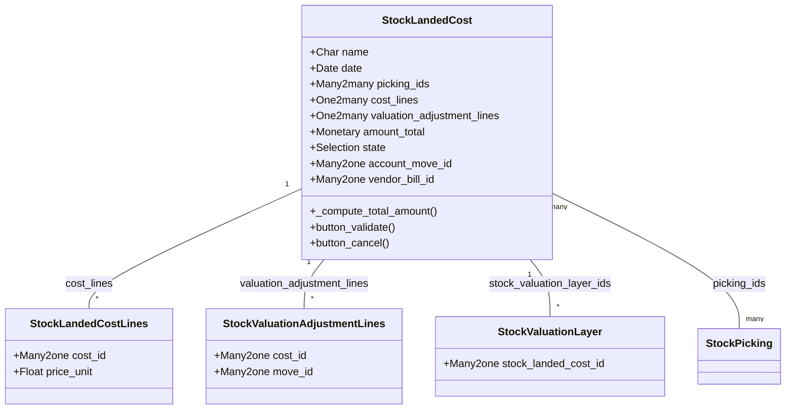

# C4 Code Level: stock_landed_costs

<!--
  Auto-generated by the c4-code agent. One file per source directory.
  Refreshed on /banyan-c4 reruns whenever the directory's content hash changes.
  Do NOT hand-edit; edits will be overwritten on next refresh.
-->

## Generated By

- **Agent**: c4-code (Haiku)
- **Run ID**: banyan-c4-20260701-init
- **Generated**: 2026-07-01T00:00:00Z
- **Source Directory**: addons/stock_landed_costs
- **Content Hash**: stock_landed_costs-root-20260701

## Overview

- **Name**: WMS Landed Costs
- **Description**: Manages additional costs on incoming shipments (freight, customs, insurance) and distributes them across stock moves for accurate cost tracking
- **Location**: addons/stock_landed_costs — 2 root files (plus 8 model files, 7 test files)
- **Language**: Python (Odoo 18.0)
- **Purpose**: Tracks and distributes landed costs (additional expenses on pickings) to product cost using configurable split methods (equal, quantity, weight, volume, or current cost-based)

## Code Elements

### Root-Level Code

#### Module Initialization
- `__init__.py` — Imports models submodule
  - **Location**: `addons/stock_landed_costs/__init__.py:4`
  - **Visibility**: internal
  - **Purpose**: Registers the models module for ORM discovery

#### Manifest Declaration
- `__manifest__.py` — Module metadata and configuration
  - **Location**: `addons/stock_landed_costs/__manifest__.py:1–28`
  - **Visibility**: internal
  - **Key Fields**:
    - `name`: 'WMS Landed Costs'
    - `version`: '1.1'
    - `depends`: ['stock_account', 'purchase_stock']
    - `category`: 'Inventory/Inventory'
    - `license`: 'LGPL-3'

### Primary ORM Models (via submodule)

**Note**: The following models are imported via `models/__init__.py` and define the public interface:

- **`StockLandedCost`** — Main entity for landed cost records
  - **Location**: `addons/stock_landed_costs/models/stock_landed_cost.py:20`
  - **Purpose**: Represents a landed cost allocation event; links cost lines to stock pickings and distributes costs via split methods
  - **Key Methods**:
    - `_compute_total_amount()` — Aggregates cost_lines into amount_total
    - `create(vals_list)` — Generates sequence-based naming
    - `button_cancel()` — State transition to 'cancel'
    - `button_validate()` — Applies costs to stock valuation
  - **Key Fields**:
    - `picking_ids` (Many2many) — Stock pickings receiving cost allocation
    - `cost_lines` (One2many) — Individual cost line items
    - `valuation_adjustment_lines` (One2many) — Post-calculation adjustments
    - `state` (Selection: draft → done → cancel)
    - `amount_total` (computed Monetary) — Sum of all cost_lines.price_unit

- **`StockValuationLayer`** — Valuation impact records
  - **Location**: `addons/stock_landed_costs/models/stock_valuation_layer.py`
  - **Purpose**: Records the cost adjustments applied to inventory movements
  - **Relationship**: One-to-many from StockLandedCost

- **`StockMove` (extended)** — Extended to track landed cost impacts
  - **Location**: `addons/stock_landed_costs/models/stock_move.py`
  - **Purpose**: Integrates landed costs into stock movement valuation

- **`AccountMove` (extended)** — Journal entries for cost recognition
  - **Location**: `addons/stock_landed_costs/models/account_move.py`
  - **Purpose**: Creates/links accounting entries for cost allocation

- **`Product` (extended)** — Enhanced with cost tracking
  - **Location**: `addons/stock_landed_costs/models/product.py`
  - **Purpose**: Adds fields for landed cost configuration per product category

- **`ResCompany` (extended)** — Company-level configuration
  - **Location**: `addons/stock_landed_costs/models/res_company.py`
  - **Purpose**: Stores default journal for cost allocation (lc_journal_id)

- **`ResConfigSettings` (extended)** — System-wide settings
  - **Location**: `addons/stock_landed_costs/models/res_config_settings.py`
  - **Purpose**: UI for configuring landed cost defaults

### Constants (Module-Level)

- `SPLIT_METHOD` — Cost allocation strategies
  - **Location**: `addons/stock_landed_costs/models/stock_landed_cost.py:11–17`
  - **Values**:
    - `'equal'` — Divide equally among all items
    - `'by_quantity'` — Weight by item count
    - `'by_current_cost_price'` — Weight by current cost basis
    - `'by_weight'` — Weight by product weight
    - `'by_volume'` — Weight by product volume

## Dependencies

### Internal (Odoo Core)

- **`stock_account`** — Base integration between stock and accounting
- **`purchase_stock`** — Link between purchase orders and stock moves
- **`mail.thread`, `mail.activity.mixin`** — Messaging and activity tracking (inherited)

### External

- **Odoo 18.0 core** — ORM framework (models, fields, API decorators)
- **odoo.exceptions.UserError, ValidationError** — Error handling
- **odoo.tools.float_utils** — Precision utilities for cost calculations
- **collections.defaultdict** — Python standard library for grouping

## Relationships

## Notes for Higher-Level Synthesis

- **Component Cohesion**: This module extends `stock_account` (core inventory valuation) + `purchase_stock` (procurement). Part of the **Warehouse Operations & Costing** logical component.
- **Boundary Code**: Public interface is the StockLandedCost model; integrates via inherited models (AccountMove, StockMove, Product). No HTTP/RPC handlers at root level — driven entirely by ORM forms/actions.
- **Key Business Logic**: Cost distribution algorithms (split methods) are encapsulated in computed/stored fields and button actions. Not a standalone utility; tightly coupled to inventory GL impacts.
