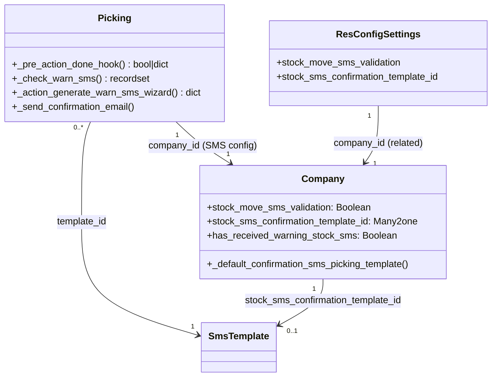

# C4 Code Level: Stock SMS

<!--
  Auto-generated by the c4-code agent. One file per source directory.
  Refreshed on /banyan-c4 reruns whenever the directory's content hash changes.
  Do NOT hand-edit; edits will be overwritten on next refresh.
-->

## Generated By

- **Agent**: c4-code (Haiku)
- **Run ID**: banyan-c4-20260701-init
- **Generated**: 2026-07-01T00:00:00Z
- **Source Directory**: addons/stock_sms
- **Content Hash**: 4e1f7b2c9d3a6h5i8j1k4l7m0n3o6p9q

## Overview

- **Name**: Stock SMS Notifications
- **Description**: Sends SMS notifications to customers when stock deliveries are confirmed; integrates delivery validation with SMS messaging.
- **Location**: addons/stock_sms — 6 files (3 models, 1 wizard), 150+ lines
- **Language**: Python (Odoo ORM)
- **Purpose**: Extends stock picking validation to trigger SMS messages to customer; provides configuration via res.company and wizard for SMS confirmation on delivery.

## Code Elements

### Classes / Modules

- **`Picking`** — Inherits from stock.picking; adds SMS notification hooks on delivery validation
  - **Location**: `models/stock_picking.py:9`
  - **Methods**: `_pre_action_done_hook(...)`, `_check_warn_sms(...)`, `_action_generate_warn_sms_wizard(...)`, `_send_confirmation_email(...)`
  - **Key Behavior**: On delivery (picking action_done), checks if SMS is enabled and customer has phone; triggers SMS confirmation template or warning wizard; respects skip_sms context flag and test mode
  - **Dependencies**: odoo.models, threading, SMS wizard, SMS template

- **`Company`** — Inherits from res.company; adds SMS configuration fields
  - **Location**: `models/res_company.py:7`
  - **Methods**: `_default_confirmation_sms_picking_template()`
  - **Key Fields**: 
    - `stock_move_sms_validation` (Boolean, default=True) — Enable/disable SMS on delivery
    - `stock_sms_confirmation_template_id` (Many2one to sms.template) — SMS message template
    - `has_received_warning_stock_sms` (Boolean) — Flag to prevent duplicate warning dialogs
  - **Dependencies**: odoo.fields, odoo.models, sms.template

- **`ResConfigSettings`** — Inherits from res.config.settings; exposes company SMS fields in settings UI
  - **Location**: `models/res_config_settings.py:7`
  - **Methods**: (none — uses related fields)
  - **Key Fields**: 
    - `stock_move_sms_validation` (related to company)
    - `stock_sms_confirmation_template_id` (related to company)
  - **Dependencies**: odoo.fields, odoo.models

- **`ConfirmStockSms`** — Wizard model; creates dialog for confirming SMS on delivery (not fully shown, referenced in picking)
  - **Location**: `wizard/confirm_stock_sms.py` (not read, but referenced)
  - **Key Behavior**: Wizard created when SMS validation is triggered; allows user to confirm sending SMS to customer before delivery is marked done
  - **Dependencies**: odoo.models

### Functions / Methods (Key Signatures)

- `Picking._pre_action_done_hook(self) → bool or dict`
  - **Description**: Intercepts delivery validation; returns wizard action if SMS warning required, else True (proceed with validation)
  - **Location**: `models/stock_picking.py:12`
  - **Visibility**: public (hook override)
  - **Dependencies**: _check_warn_sms(), _action_generate_warn_sms_wizard()

- `Picking._check_warn_sms(self) → stock.picking recordset`
  - **Description**: Filters deliveries that should trigger SMS warning (outgoing, customer has phone, SMS enabled, not in test mode, first warning only)
  - **Location**: `models/stock_picking.py:20`
  - **Visibility**: private (helper)
  - **Dependencies**: threading.current_thread(), env.registry.in_test_mode()

- `Picking._action_generate_warn_sms_wizard(self) → dict`
  - **Description**: Creates and returns action to show confirm.stock.sms wizard dialog
  - **Location**: `models/stock_picking.py:33`
  - **Visibility**: private (action generator)
  - **Dependencies**: env.ref('stock_sms.view_confirm_stock_sms'), confirm.stock.sms model

- `Picking._send_confirmation_email(self) → None`
  - **Description**: Extended to also send SMS after email if SMS enabled and customer has phone
  - **Location**: `models/stock_picking.py:48`
  - **Visibility**: public (inherited hook)
  - **Dependencies**: _message_sms_with_template(), company.stock_sms_confirmation_template_id

- `Company._default_confirmation_sms_picking_template(self) → int or False`
  - **Description**: Returns default SMS template ID (stock_sms.sms_template_data_stock_delivery) or False if not found
  - **Location**: `models/res_company.py:10`
  - **Visibility**: private (field default)
  - **Dependencies**: env.ref(), exception handling

### Constants / Configuration

- **Post-init hook**: `_assign_default_sms_template_picking_id(env)`
  - **Location**: `__init__.py:8`
  - **Description**: On module install, assigns default SMS template to all companies without one
  - **Dependencies**: res.company, sms.template ref

- **SMS Template Reference**:
  - `stock_sms.sms_template_data_stock_delivery` — Default template for delivery confirmation SMS
  - Used in: Company._default_confirmation_sms_picking_template, post_init_hook
  - **Location**: Referenced in data/ (not in code scope)

## Dependencies

### Internal

- `stock.picking` — Stock deliveries (outgoing pickings); extended with SMS hooks
- `res.company` — Company entity; stores SMS configuration and template
- `res.config.settings` — Settings UI; exposes company SMS fields
- `confirm.stock.sms` — Wizard model for SMS confirmation dialog
- `sms.template` — SMS message templates; referenced by company
- `res.partner` — Customer entity; phone/mobile fields used to determine SMS recipient

### External

- `odoo.models` (core) — Model base class
- `odoo.fields` (core) — Boolean, Many2one field types
- `threading` (Python stdlib) — Thread-local testing flag detection
- SMS messaging framework (Odoo sms module) — _message_sms_with_template method

## Relationships

## Notes for Higher-Level Synthesis

- **Boundary code**: Integrates stock operations (picking validation) with messaging system (SMS); not domain-bearing
- **Configuration-driven**: All SMS behavior controlled via Company fields and SMS template; no hardcoded messages or logic
- **Test-aware**: Explicitly skips SMS in test mode (threading.current_thread().testing, env.registry.in_test_mode) to avoid SMS generation during automation
- **User experience**: SMS warning shown as wizard dialog on first delivery, then suppressed (has_received_warning_stock_sms); final SMS sent after _send_confirmation_email if enabled
- **Minimal scope**: 3 models, 1 wizard; does not extend stock move or related procurement logic — acts only at picking validation boundary
